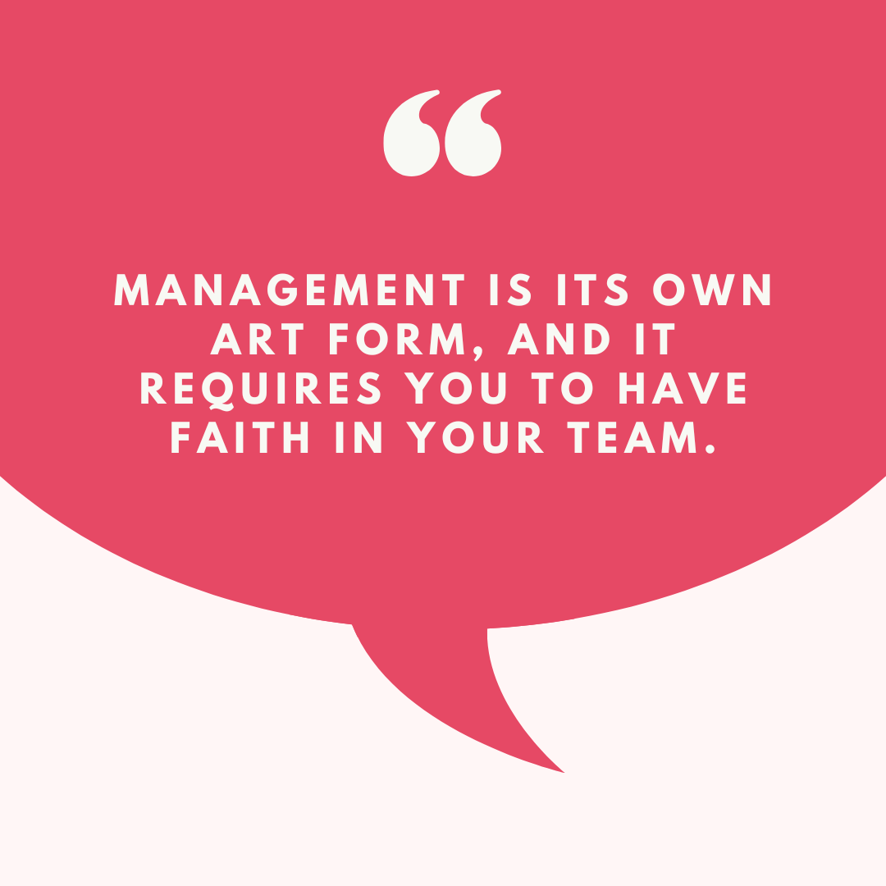

# Management: A Skill Not a Step 

*A guide to making the transition to manager*

Photo by [Sylvain Mauroux](https://unsplash.com/@alpifree?utm_source=unsplash&utm_medium=referral&utm_content=creditCopyText) on [Unsplash](https://unsplash.com/photos/WI8phMvAEMI?utm_source=unsplash&utm_medium=referral&utm_content=creditCopyText)

Imagine you are among the world’s best salespeople, so skilled at your trade that you are highly sought after. You exceed your sales target quarter after quarter, and you bring in more sales than the next three people combined. You have a unique and special connection to your clients, and you can effectively translate your product to map to their needs.

[Share](https://debliu.substack.com/p/management-a-skill-not-a-step-transitioning?utm_source=substack&utm_medium=email&utm_content=share&action=share)

Then, one day, you are asked to stop what you are doing and become a district sales manager. Now you manage a team of salespeople, and your job is to help them become successful. You fail—miserably. Slowly you begin to realize that what makes a great salesperson is different from what makes a great manager. You have just run into the Peter Principle at work ([see study here](https://www.chicagobooth.edu/review/best-salespeople-dont-make-best-managers)).

One thing we do wrong in many companies is transitioning people into management roles. We take the 10x coder, the best salesperson, the brightest PM, or the strongest marketer, and we tell them, “**You are so great at your job that now we want you to do this entirely different job, one that you may or may not even have the skills for. And we won’t teach you how to do it. We figure you will be great at it because you have the skills to do this other thing we value.**” Do you see the problem here?

In many companies, the path to promotion and greater responsibility only comes through managing others. While some places have senior individual contributors, organizations still reward those on the management path with greater opportunities, compensation, and scope. They are overtly encouraging those who are the most skilled to take on teams, manage large groups, and ultimately become organizational leaders. No wonder so many people aspire to become managers!

The problem, of course, comes when you're asked to take on those responsibilities without understanding the ways management differs from what you were doing before. This transition can be an extremely bumpy road, so today I'll be walking you through how to take the reins and learn to manage effectively.

## **Know why you want to manage**

As I mentioned earlier, at many companies, management is a prerequisite for growth. We couple success with a skill that is unseen and untaught, and we then tell everyone they should aspire to this path. We tie promotions, compensation, and recognition to it. Suddenly, this elusive "manager" status becomes the brass ring for everyone, even when it shouldn't be.

There are many reasons to become a manager, but not all of them are created equal. I have been asked many times by people on my teams about the manager conversion process. My usual response is to ask them why, exactly, they aspire to become managers. Their reasons fall roughly into these categories:

* “Management is the natural next step for my career.”
* “My area of responsibility is too large for one person alone, and I want to grow a team.”
* “I want to teach others the skills I have learned.”

All of these can certainly be valid reasons, but what is the reason *behind* the reason? We tie too much of our career growth to management, so we view it as a natural next step, but this is where things get dicey.

Believe it or not, managing is cited as the first “broken rung” in the career ladder, according to McKinsey and LeanIn.org. Their research has found that for every 100 men promoted into management, only 86 women are ([ref](https://www.mckinsey.com/featured-insights/diversity-and-inclusion/women-in-the-workplace#:~:text=For%20every%20100%20men%20who%20are%20promoted%20from%20entry%2Dlevel%20roles%20to%20manager%20positions%2C%20only%2087%20women%20are%20promoted%2C%20and%20only%2082%20women%20of%20color%20are%20promoted)).

Management is cited as a critical step up the ladder—and in most workplaces, it is. But if that is the case, then each person who wants to become a manager should have a clear idea of why they want it, beyond it just being a natural next step. Many don't realize that management is not so much a promotion, per se, as it is a different set of responsibilities. Rather than just managing your work, you are now accountable for facilitating the success of others. You are going from a player on the field to a coach. You may be the best player on the team, but if you don’t know how to teach others to play well, the whole team will suffer.

If you view the transition to management as just another promotion, you're setting yourself up for failure. The first step to making the leap to is to understand this, as well as your reasons for wanting to manage in the first place. Be honest with yourself, or you will be in for a rude awakening.

## **Know what your skill is**

Coach K did not play basketball better than most of his team. Instead, he was a legendary coach because of his ability to tap into what made them tick. He wasn't there to tell them that he was superior to them or that he had better skills. Instead, he was there to show them how to be the best versions of themselves, and how the team could work together to be the strongest it could possibly be.

This idea of being the conductor of the symphony, rather than the star soloist, was something I struggled with early in my career when I first became a manager. ([I wrote more about this here](https://debliu.substack.com/p/wisdom-from-mentors-that-i-still)—check out Lesson #4 for more background.) I learned the hard way that the skills that make you a great individual contributor PM do not always make you a great manager. I struggled to lead through others, preferring to do things on my own rather than delegating and keeping others on track. I knew the ropes, and I could get things done efficiently, so it was tempting to take the wheel without entrusting those tasks to my team.

My manager, Dave Li, told me that while in the short term, this could work, and I could get things done more efficiently because I had been doing them for so long, eventually, I would need to learn to scale. Leading through others meant making investments in their growth, and not just focusing on efficiency. Over time, I internalized this, and I watched as my reports scaled and their impact multiplied.

It took me way too long to learn this lesson as a new manager. As you're preparing to take on a team, remember that your job is not to do the work for them; it's to help them grow and succeed.

## **Know what success looks like**

Managing is about getting the best out of others. It's not about you. Your success is directly connected to your team's success. Their wins and their losses both reflect on you and your strength as a leader. You could be a brilliant strategist or a strong executor, but if you don’t know how to teach others, you fail as a manager.

I remember coaching a certain manager on my team. She had gone from an individual contributor to manager with ease. During the transition, she improved the team’s Pulse scores and hired strong people. She did such a good job, another team asked if she could help manage their team, too. She hesitated, and I couldn’t figure out why. She stalled and stalled until I finally asked her outright why she was balking. She told me she was hesitating because she didn’t know how to do the work of this new team. I was confused as to why that was an issue, since she already managed over a dozen people at this point, and she no longer did the day-to-day work. She replied, “If I can’t do the jobs of the people on this new team, how can I coach them?”

That was when it clicked. I realized that because she had grown up on our team, she had already learned how to do everyone’s job, so she didn't have a problem managing in our area. But when faced with a team with an unfamiliar product, she felt she couldn't manage them, because she didn’t know how to do their jobs. I replied, “[Our CEO] isn’t a better finance person than [our CFO], and he isn’t a better lawyer than our [General Counsel]. You don’t have to be able to do someone’s job better than them to help them succeed.”

Management is its own art form, and it requires you to have faith in your team. I always told those on my teams that I could provide three things—resources, influence, and context—to help them make decisions, but that ultimately, they should be the ones to decide what they needed to do on a day-to-day basis. I would explain, “You spend 100 percent of your time thinking about this product, so you know best what your roadmap should be.” I saw my role as a manager as one of enablement and clearing the path, not of dictating or deciding unless that was necessary.

Success as a manager is not about being able to do every job or tell everyone exactly what to do. As you grow in management, you will start managing those whose roles and expertise are completely different from yours. That is a natural part of growth, and it is something you have to get comfortable with.

## **Becoming a manager**

I have written previously about what I learned from my managers—[the best ones](https://debliu.substack.com/p/what-ive-learned-from-my-best-managers) and [the worst ones](https://debliu.substack.com/p/what-ive-learned-from-my-worst-managers). Those learnings have been formative in how I think about management. But the first step to managing *well* is to start managing in the first place.

If you aspire to the management path, there are a few basic steps you can take to get started on your journey:

* **Make your goal known.** So many people who want to become managers just assume it will happen on its own. But it takes time to create a team and a path for you to convert. The best place to start is by signaling to your own manager that this is something you aspire to. Ask them what skills you will need, and what they want you to demonstrate to help you get there.
* **Start with mentoring.** Many companies have entry-level programs such as summer internships, rotational roles, or new grad programs. These are excellent places to start learning how to lead others. It gives you a chance to teach your skills to someone who is just starting out, and it lets you get a sense of what it is like to manage without taking on the full set of responsibilities.
* **Learn the skills.** A lot of companies have management classes that they make available to everyone. If your company offers similar training, take advantage of it. This is a chance to learn the language and skills expectations of the role before the opportunity even arises.
* **Set a path.** [I've written before](https://debliu.substack.com/p/how-to-get-promoted) about the importance of collaborating with your manager to advance in your career. This transition is no different. Sit down with your manager and work with them to find a path to where you want to be. (Note that your organizational design often dictates whether this path exists.) Typically, this takes at least a couple of halves, so plan ahead. Consider taking on a junior teammate as your mentee, even if you both report to the same manager. You will get a chance to learn the ropes, and they will benefit from having someone to come to with questions whose time isn't divided among 8 to 12 other people.

It's easy to fall into the trap of thinking management opportunities will just fall into your lap when you're ready. As with any other promotion, the transition to management takes active planning and self-advocacy. Enlist others to help you, and make your aspiration known. This is the key to getting your foot in the door.

## **…and a final lesson for companies**

During its time of tremendous growth, Facebook did three things that are unusual for most companies. These written and unwritten rules came and went with the times, but the goal was to ensure that those who wanted to become managers were actively wanting the management skill set, instead of just a faster path up the ladder. These guidelines included:

* **Make the path to promotion clearer on the IC path.** Promotions from the non-director IC levels were more clear than on the manager levels because it was the path the person was already on. Moving to manager meant a new course, a different bar, and promotions based on scope, team size, and span of control. To prevent people from moving to management to get the “easier path”, many senior ICs were proactively told that they would get promoted faster on the IC path given it was the trajectory they were on.
* **Ask for specific milestones before making someone a manager.** This was particularly true in Engineering, where managers were expected to take a set of classes, and a manager packet had to be created. On the Product side, future managers were encouraged to be mentors to Rotational Product Managers, and even become RPM managers for a period, before a conversion could happen. This gave them a chance to do their “day job” while also learning management skills.
* **Allow people to move back and forth between IC and management roles without penalty.** Many times, if someone strong becomes a manager and hates it, they leave the company. This policy was set to allow people to move back to IC roles from management if they chose. I knew several leaders who switched back and forth over the years as their interests evolved, and this was a great way to retain strong ICs who may not have been the right fit for management.

These guidelines were unique in that they gave flexibility to those who transitioned into management while also ensuring they had strong foundational skills beforehand. By providing concrete, actionable criteria and a clear path forward, Facebook showed that the path to the management track doesn't always have to be a black box. The result was more managers who were all on the same page—and more ICs who were comfortable taking the plunge.

---

Management is often seen as just a continuation of your career path, but it is more than just a promotion; it is a skill. Before transitioning to management, take the time to understand if this is a growth area for you, and don’t feel like it has to be your next step. Some of the best product leaders and engineers I have ever worked with were extremely senior ICs, and they were highly regarded and sought after.

That said, in many companies, growth comes from managing and scaling a team, even if you still do some of the work yourself. The big takeaway? Think hard about what you want for your career—not just what you feel like you "should" want—and ask yourself how this transition can help get you there.

Perspectives is a reader-supported publication. To receive new posts and support my work, consider becoming a free or paid subscriber.

[Leave a comment](https://debliu.substack.com/p/management-a-skill-not-a-step-transitioning/comments)