# The Sorcerer’s Apprentice: Applied AI for Data 

*How AI can transform how you look at data and how data looks to you*

**Note from Deb:** From time to time, I bring in guests to write about topics I want to learn about. This month, I invited [Edmund Helmer](https://www.linkedin.com/in/edmund-helmer-2909238/), a brilliant data scientist I worked with back at Meta, to share his take on AI’s impact on how you look at data. He shares both practical and more advanced uses of Gen AI as you work with data. I tested several of the “easy” ideas myself and found new ways of working thanks to his insights.

**Applied AI has two stories:** It’s useful when used well, and it’s dangerous when used carelessly. AI in analytics is the same. Like Mickey Mouse in “The Sorcerer’s Apprentice,” it can be both a powerful magician and a flooder of basements.

So, how do you harness the magic while avoiding the mess? The answer: by knowing just the right spells. My rules for inclusion in the grimoire are:

1. Will hallucinations be detected quickly? For example: Code that won’t compile if wrong, data queries that can be hand-checked quickly.
2. Is the task similar to a summary or translation of either 1) your input, or 2) something on the web?

If the answer to both these questions is yes, then large language models are already a powerful tool. Let’s take a look at some of the ways you can apply them.

## **What works: Tools you can use today**

I currently recommend these three domains for both laypeople and experts to bring AI into data work.

1. Converting text to data and performing other natural language tasks
2. Using ChatGPT+ as a coding/stats assistant
3. Auto-documenting your datasets/code

### **1. [Easy] Natural language tasks**

With all the hype around LLMs, sometimes people forget one of their original core functions: classic language processing! It used to be messy and complicated to take a body of text and convert it into usable, actionable data. Now, it’s incredibly easy. Here are a few examples:

#### **User feedback summaries**

LLMs are phenomenal at text summarization, so take advantage of [Google’s NotebookLM](http://notebooklm.google.com). This tool lets you input large amounts of open-ended text and talk to it—it’s quite adept at getting initial looks at user data.

As an example (below), I’ve imported reviews of a game ([Dave the Diver](https://store.steampowered.com/app/1868140/DAVE_THE_DIVER/)) and asked for a summary of what people are saying about the art. It’s worth noting that there’s still a hallucination risk, so Google has wisely provided a UI that includes clickable “citations.” As long as you check those, this makes it a fantastic tool for quickly summarizing raw text documents of any kind—especially ones that include user feedback.

[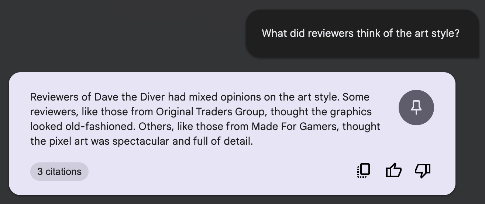](https://substackcdn.com/image/fetch/$s_!csEr!,f_auto,q_auto:good,fl_progressive:steep/https%3A%2F%2Fsubstack-post-media.s3.amazonaws.com%2Fpublic%2Fimages%2F3d9d820d-bff0-44e1-8237-953dcbf1a851_1314x554.png)

#### **Sentiment analysis**

Sentiment analysis—marking comments as positive or negative—used to require a fair bit of programming. But last year, researchers at Princeton and New York University [proved](https://osf.io/preprints/psyarxiv/sekf5) that LLM-based sentiment analysis was comparable to (and sometimes better than) prior methods, and they were kind enough to [host the code](https://osf.io/9f5yz). Take a look at the main function here—it’s barely a dozen lines of code—and then at the results on the right. Sentiment analysis is now shamefully easy.

[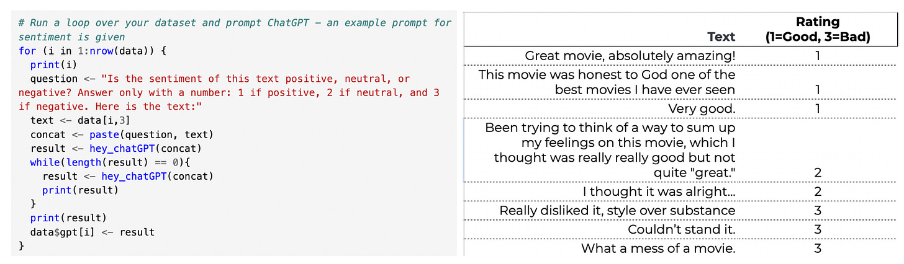](https://substackcdn.com/image/fetch/$s_!ieVd!,f_auto,q_auto:good,fl_progressive:steep/https%3A%2F%2Fsubstack-post-media.s3.amazonaws.com%2Fpublic%2Fimages%2F2b99ae8f-d350-4925-af29-0ce5aa7e78e2_2426x710.png)

When might this be useful? If you need to understand the general sentiments in large amounts of written text—reviews, comments, or free-form feedback about anything—you can simply plug it into a GPT-4 (or GPT-3.5) API call. You’ll receive summaries of sentiment. Here’s a sample of sentiment coding from a [Reddit thread on the movie “Oppenheimer."](https://old.reddit.com/r/movies/comments/155ag1m/official_discussion_oppenheimer_spoilers/)

Whether you have an early-stage product or a scaled one, these tools can be very useful in your work. Used correctly, they can allow you to:

1. **Find contact center themes:** You can use LLMs to parse raw user feedback data from your call center. Have the system search for themes for you, or ask it directly how often login problems, site slowness, or accessibility issues appeared.
2. **Understand open-ended survey results:** You can also leverage LLMs to summarize feedback from open-ended surveys from tools such as Qualtrics, Medallia, or Glint. While you can also read them yourself, AI can help you find hotspots quickly.
3. **Find bugs from customer reports:** Consider having LLMs help you identify bugs from high-volume user reports. A lot of companies have someone manually review them, but machines can outdo humans when it comes to quickly going over large bodies of data and flagging issues that are spiking.

### **2. [Moderate] Using ChatGPT+ for coding and stats**

SQL, statistics, and code assistance are fantastic uses of ChatGPT (and soon, Gemini)—as long as they’re used in situations where hallucinations get caught. Whether you're an initiate or you’re already a wizard with data, LLMs can guide you. Note: Some technical SQL/code ahead!

#### **SQL**

If you’re new to data, then asking ChatGPT for simple queries is a phenomenal way to get started. This works with SQL, Python… even Excel! The keys are to 1) provide context (such as column names, example rows, and/or your ultimate goal), and 2) ensure there’s a path to double-check the answers.

Here’s an example of what this can look like:

> "I have a snowflake dataset called box\_office, with columns title, distributor, date, and total gross. Can you help me write a query that will get total gross by distributor?"

[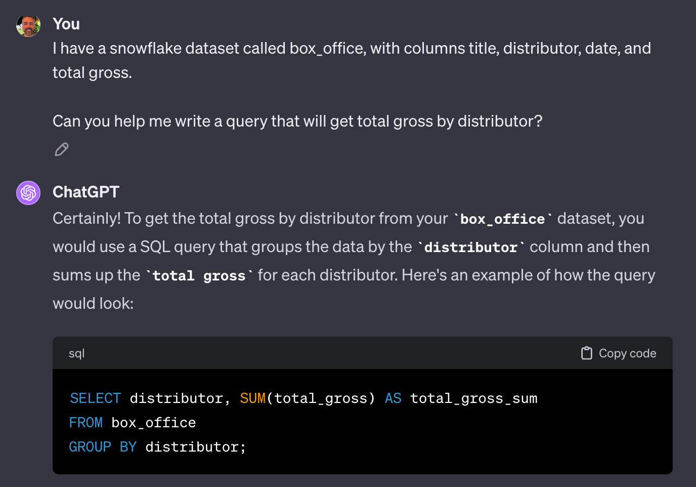](https://substackcdn.com/image/fetch/$s_!nIMp!,f_auto,q_auto:good,fl_progressive:steep/https%3A%2F%2Fsubstack-post-media.s3.amazonaws.com%2Fpublic%2Fimages%2F01fffa0b-e823-414a-be1f-0e589a4ca46a_1376x962.png)

If you’re a database expert, then ChatGPT is still your friend, because there are always those few queries that are tricky to remember. Here’s one common example: concurrency.

> "If I have a snowflake dataset with start\_time, end\_time, and user\_id, how can I calculate concurrent users by minute?"

[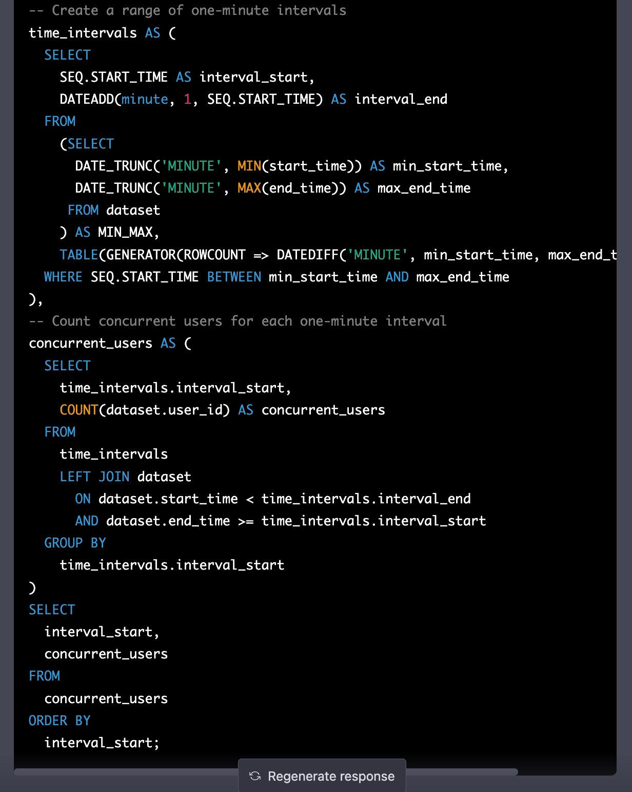](https://substackcdn.com/image/fetch/$s_!ZYWn!,f_auto,q_auto:good,fl_progressive:steep/https%3A%2F%2Fsubstack-post-media.s3.amazonaws.com%2Fpublic%2Fimages%2F58c1a8ae-93b3-403c-a519-2e245a777a0f_1232x1542.png)

Writing a SQL query to use timestamps to understand how many people were active at any given time is a real pain - entire SQL variants have been written to solve it! But ChatGPT+ writes out this function to solve it!

#### **Coding translation and visualization tools**

I grew up in my career learning R, and Python has always been something I’ve tried to avoid for stats and modeling. But thanks to GPT-4, I feel quite comfortable using Python now. Why? I started coding things in R, asked ChatGPT to translate, and learned.

Here’s a small example of trying out different  color palettes —first in R, and then translated to Python:

> *"*Can you generate a continuous color palette in R inspired by fall colors, and then make a ggplot to demonstrate it with a fractal pattern?*"*

[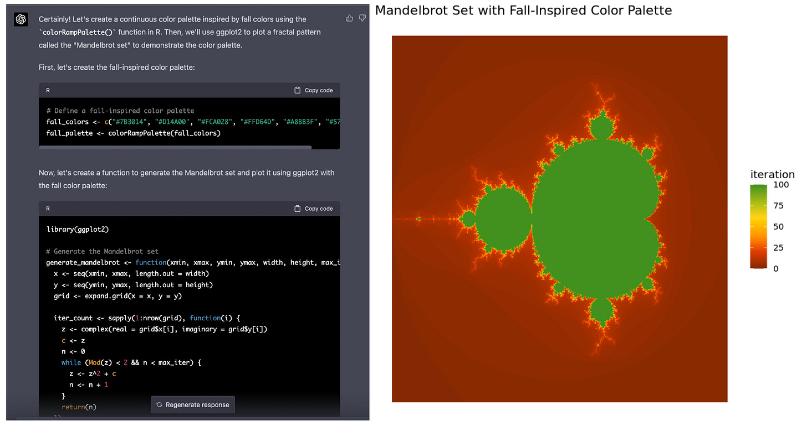](https://substackcdn.com/image/fetch/$s_!dVzk!,f_auto,q_auto:good,fl_progressive:steep/https%3A%2F%2Fsubstack-post-media.s3.amazonaws.com%2Fpublic%2Fimages%2F254552a9-ba0e-41cb-b71d-6985053f4159_2346x1240.png)

> *"*Can you make that same plot in Python, and have it be as similar as possible?*"*

[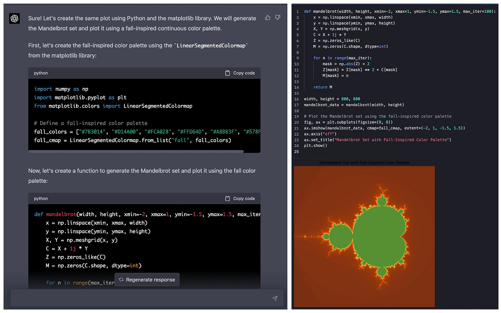](https://substackcdn.com/image/fetch/$s_!AS59!,f_auto,q_auto:good,fl_progressive:steep/https%3A%2F%2Fsubstack-post-media.s3.amazonaws.com%2Fpublic%2Fimages%2Fb2247cf6-e2bf-4ac8-8a3c-e68869ef2f6b_1956x1224.png)

As you can see on the right of each image - ChatGPT has nailed it making the code transfer between R and Python to get the plots to look the same!

#### **Cheating on an interview (kidding!)**

Obviously, don’t actually cheat… But, if you are an interviewer, I recommend taking your analytics interview questions, and seeing how ChatGPT performs against them. Tweak the questions to make sure they’re AI-proof - and it may be worth considering whether AI-answerable questions are really what we want to test for anymore. As an interviewee, you can ask ChatGPT to give you a mock analytics interview. After you write out your answers, ask it to assess your answers and get insights to things you missed.

[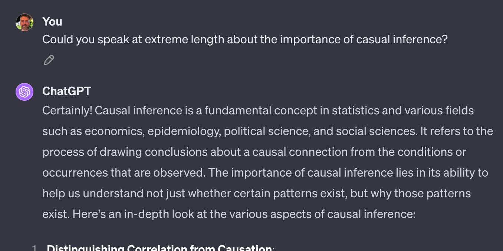](https://substackcdn.com/image/fetch/$s_!G-0w!,f_auto,q_auto:good,fl_progressive:steep/https%3A%2F%2Fsubstack-post-media.s3.amazonaws.com%2Fpublic%2Fimages%2F7db62f8b-b657-4e64-8fec-5473300211c4_1356x678.png)

### **3. [Bonus] Documentation**

Finally, when it comes to AI-for-data, I believe documentation may be the sleeper hit. For example, below is a cell in the notebook tool [Hex](https://hex.tech/), which has a one-click, AI-powered “explain” button. The left is the original, the right is the auto-annotation, and it really is magic. If I were new to R, the comments here would make it significantly faster to read. In this case, the system even identifies the algorithm in use!

[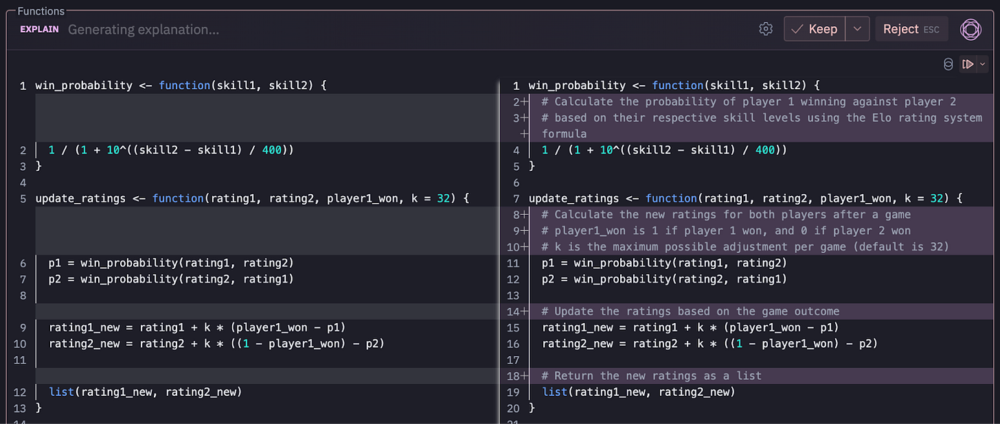](https://substackcdn.com/image/fetch/$s_!5Wjm!,f_auto,q_auto:good,fl_progressive:steep/https%3A%2F%2Fsubstack-post-media.s3.amazonaws.com%2Fpublic%2Fimages%2Fdea4cdff-9a8a-4a8e-a10b-0d51bb2c7de3_1600x679.png)

Why does documentation matter for AI in data specifically? Firstly, analytics is often a Swiss Army job; we have to switch between many codebases and systems. LLM documentation allows us to easily traverse between them. Secondly, documentation itself is the interface for further LLM usage. Many AI systems now ask for English documentation within—or adjacent to—codebases to function well, so it may be fruitful to get ahead of the curve.

### **The future is not quite here yet: automated analytics gaps and opportunities**

[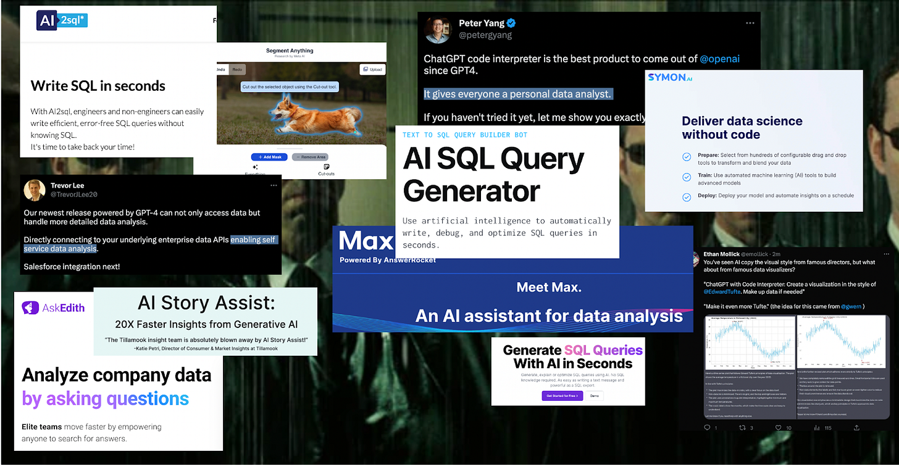](https://substackcdn.com/image/fetch/$s_!1gr9!,f_auto,q_auto:good,fl_progressive:steep/https%3A%2F%2Fsubstack-post-media.s3.amazonaws.com%2Fpublic%2Fimages%2Fcf301a5a-0938-44c5-a85b-b18aa1e02ac4_1600x827.png)

There’s a lot of hype around automating analytics. I love the idea of it (even if it’s also a bit scary, for those of us with analytics jobs). And there definitely is potential! However, the current hype has also outran the current capabilities. Overall, analytics work is mostly making sure data questions align with business questions; making sure insights are communicated well; and the blood sweat and tears work of making sure that the data logged and aggregated represents reality. AI applications are not solving *those* issues yet, and in many cases can make them worse.

#### **Text-to-SQL**

It’s a rare week when I don’t see a new startup promising to “automate analytics” with a “Text-to-SQL” product. Let’s examine that idea: text-to-SQL would allow non-analysts to pull data themselves, and it would speed up analyst work itself, right? I don’t think so. Here’s why.

*The Perceived Analytics Workflow*

[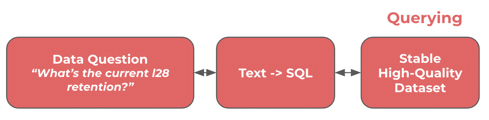](https://substackcdn.com/image/fetch/$s_!29Gm!,f_auto,q_auto:good,fl_progressive:steep/https%3A%2F%2Fsubstack-post-media.s3.amazonaws.com%2Fpublic%2Fimages%2F6f199dd0-9028-4aa3-8b22-e6d72bf09204_1342x332.png)

The above illustrates that framework, which is *somewhat* complete—on *rare* occasions. However, these situations—in which someone knows the exact right data to pull, and there exists a perfect database to pull it from—are the dramatic minority.

Instead, I think it’s useful to zoom out to a bigger analytics workflow. Here, it becomes clearer that believing we’ve automated analytics while only solving text-to-SQL feels a bit like selling a robotic chef who can only cut pickles.

*Analytics Workflow: Zoomed Out*

[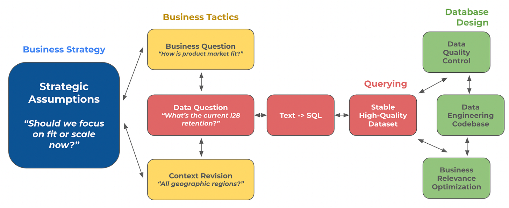](https://substackcdn.com/image/fetch/$s_!qBmP!,f_auto,q_auto:good,fl_progressive:steep/https%3A%2F%2Fsubstack-post-media.s3.amazonaws.com%2Fpublic%2Fimages%2F5562d386-6f75-42a9-90ad-4fb8e3365be9_1600x654.png)

That said, these bots *do* have some potential soon, because:

1. Multiple large organizations are already developing internal bots to help analysts find the right dataset and query the right metrics. This will be possible with fine-tuning and some of the more advanced retrieval mechanisms.
2. Right now, the red boxes above are the only area covered by AI. However, it seems likely we’ll see encroachment on at least some of the other areas.

#### **Data-to-insights**

Some folks are also trying to use AI for direct insight generation. OpenAI themselves even have an “Advanced Data Analysis” plugin for ChatGPT. Does this work? Eh… a bit. There are three problems:

1. LLM hallucinations are particularly dangerous in this case. A hallucinated SQL query will usually just fail; a hallucinated insight may go undetected forever.
2. LLMs currently excel with close supervision. If you give them data but don’t tell them *how* to analyze, they’re going to flounder. Currently, you still need to tell them what kind of analysis you’re looking for.
3. Similar to text-to-SQL, analytics problems are rarely a case of, “Here’s the perfect dataset and a concrete question.” They’re usually muddy affairs involving business, people, and murky hypotheses.

But again, this is likely going to improve in ways we can’t predict, and I suspect we’re going to see somewhat advanced abilities here within the next year or two.

## **Overflowing with data: the real risk of AI analytics**

So what is the risk, exactly, of AI in analytics? If you ask the average data scientist, they all seem to answer, “Hallucination.” Which is not wrong. LLMs do just *make things up*, and with enough confidence to be scary. But that’s also not what keeps me up at night. What keeps me up at night is a future world in which AI makes all data easily available (and accurate!) to anyone in a company—but for some reason decisions seem even less data-informed than ever.

*Another example of ChatGPT nailing translation work, here’s its take on a particularly relevant part of the original Sorcerer’s Apprentice*

[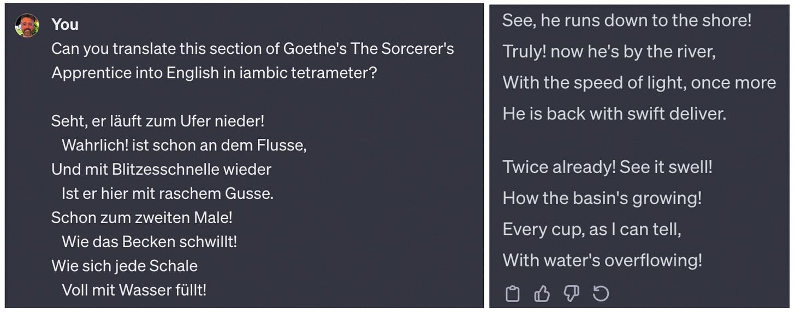](https://substackcdn.com/image/fetch/$s_!5j3x!,f_auto,q_auto:good,fl_progressive:steep/https%3A%2F%2Fsubstack-post-media.s3.amazonaws.com%2Fpublic%2Fimages%2F531a9547-596e-497b-8239-c056e56d0e9c_2362x930.png)

I started my career, very briefly, in journalism. I had hoped for a time when the internet would bring costless facts and endless truth to the world, making journalism an ever-more-valued part of a now completely truth-oriented society. That didn’t exactly work out. I think I now understand why, and I suspect this exact pattern is about to play out with data in many organizations.

What is that pattern? Simply put: ***People think data work is about finding the right answer, but it’s actually about finding the right question.*** If you build a machine that only gives answers, the beating heart of analytics will break. You will have an organization in which every side of every question produces mountains of numbers and endless charts, but with no one to separate the wheat from the correlation (to mix metaphors). Can ChatGPT eventually do that, too? Maybe. But until ChatGPT sits in the org chart, the incentives for truth-seeking may not emerge.

So how do you, as either the master or the apprentice, ensure your use of AI-powered data isn’t a monkey’s paw of half-magic, half-curse? I think it’s difficult, but it’s also simple: Keep your options open to new AI tech. Let your people experiment. Commit to the shiniest, newest stuff slowly, and don’t settle on one tool or process for too long. And as you observe AI changing the way data gets leveraged in your company, re-invest in the [first principles of data](https://commoncog.com/becoming-data-driven-first-principles/) within the business.

[Subscribe now](https://debliu.substack.com/subscribe?)

---

**More About Edmund:** Based in Seattle, [Edmund Helmer](https://www.linkedin.com/in/edmund-helmer-2909238/) is the Director of Analytics at Mountaintop Studios. He has over a decade of experience in analytics, artificial intelligence, and applied natural language processing.

[Leave a comment](https://debliu.substack.com/p/the-sorcerers-apprentice-applied/comments)