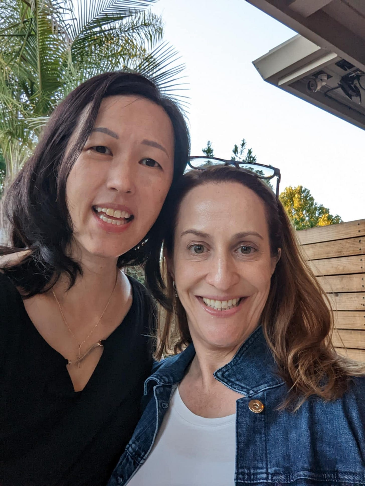

# Drawing the Cancer Card 

*How a gift requested by a friend changed my life *

It started with a birthday gift request, and that was what changed everything. My friend Mauria was turning 50, and when I asked her what she wanted for her birthday, her response surprised me: "I want you to get a mammogram. That's the only gift I want."

At 47, I had been postponing this screening. I didn't fit the typical risk profile - I exercised daily, ate healthily, avoided alcohol, and had never smoked. But I had made Mauria a promise, so I scheduled the appointment around her birthday. The first mammogram was largely uneventful, requiring just a routine ultrasound follow-up.

A year later, when Mauria checked in again, I scheduled my second mammogram. What should have been another routine screening turned into a moment that divided my life into "before" and "after." The technician left the room and returned with instructions to see the doctor immediately. I remember mostly thinking about rescheduling my meetings, still caught up in the mundane concerns of the day. It wasn’t until later that things changed.

[Subscribe now](https://debliu.substack.com/subscribe?)

As I sat in a dimly lit office minutes later, the doctor's grim expression told me everything I needed to know before she even spoke. The word "suspicious" echoed throughout her explanation, followed by the phrase "immediate biopsy." That same morning, my uncle passed away. As I sat in that dark room wondering if I had cancer, memories of him flooded back: his small stature but towering opinions, his teasing me about my height when I was young. Life has a way of layering grief upon grief.

Modern medicine is both miraculous and maddening—miraculous in its ability to detect the tiniest abnormalities, maddening in the waiting and uncertainty that follow. That waiting period between the biopsy and getting the results felt like I was existing in a state of suspended animation. Both my parents had died of cancer, my father succumbed quickly to stage IV lung cancer, and my mother fought uterine cancer that spread to her lungs for eight years before we lost her last year. Their stories weighed heavily on my mind as I waited for the news.

When I was little, about six years old, my grandfather passed away while on vacation in Australia, far from his native Hong Kong. We didn't find out for a while, and in my child's mind, I developed a peculiar theory of hope. I remember wondering if he had passed, but I prayed really hard and didn't know about it yet, was it possible that God would restore him? It was a child's magical thinking, but even now, facing my own health crisis, I recognized that same wishful thinking. The truth was, like Schrödinger's cat, either I had cancer or I didn't. Just because I didn't know the truth didn't mean it wasn’t true. You can't pray after the fact to change the reality.

## **Waiting and Wondering**

Mauria, who had faced her own breast cancer diagnosis at my age just 18 months earlier, offered wisdom that resonated deeply. She described each medical visit after the test as drawing a card. Each card signifies something: whether you have cancer, what type of cancer it is, its survivability, how aggressive the cells are, how much they have spread. These cards are dealt to you one by one. You can't anticipate future cards; you can only focus on what's in your hand right now. Sometimes you draw good cards, sometimes bad, but you can't think about the next draw until it happens. You only get to choose how you play the hand you’re dealt.

The waiting room experience stays with me: women huddled in identical hospital gowns, avoiding eye contact, each of us wondering what card we would draw next. After the biopsy, I couldn't even seek comfort in my usual coping mechanisms. No workouts, no hot showers. I slept, processing the weight of uncertainty.

[Share](https://debliu.substack.com/p/drawing-the-cancer-card?utm_source=substack&utm_medium=email&utm_content=share&action=share)

## **Understanding Cancer**

I find myself thinking back to when my dad had just passed from cancer. Around that time, I read *[The Emperor of All Maladies](https://amzn.to/3Cc50xD)* by Siddhartha Mukherjee, which opened my eyes to cancer's nature and how it co-evolved alongside humanity. The author defined cancer as a "genetic disease caused by abnormal cell growth," but this simplification doesn't capture its complexity. The ancients named it "cancer" after the crab-like tendrils of cells they observed spreading through the body, but we now know that cancer is not a single enemy, but over 200 different and distinct diseases.

Cancer is remarkably prevalent in our society. In 2024, approximately 2 million Americans received a new cancer diagnosis, with 600,000 losing their lives to the disease. Over 40% of Americans will face a cancer diagnosis in their lifetime, and nearly 20 million Americans currently live with or have survived cancer. These aren't just statistics—they signify lives interrupted, families affected, and years of life cut short.

For breast cancer specifically, the numbers are sobering. One in eight women will develop breast cancer in her lifetime. Regular screening through mammography has revolutionized detection, and treatments have progressively improved. As a result, death rates have dropped by 43% from 1989 to 2020. Yet many women still postpone their mammograms, as I did.

Breast cancer screening guidelines have also shifted over time, creating confusion. [In 2009, the United States Preventive Services Task Force (USPSTF) moved their recommendation from age 40 to 50 for mammograms, while other organizations kept theirs at 40](https://pmc.ncbi.nlm.nih.gov/articles/PMC5694381/). Then, in 2016, the American Cancer Society moved their recommendation to 45 from the standard 50. No wonder women are confused. What is clear, however, is that women are increasingly getting breast cancer at a younger age. [In the year 2000, the prevalence of breast cancer was 64 cases per 100,000 for women under 50.](https://medicine.washu.edu/news/breast-cancer-rates-increasing-among-younger-women/) That figure slowly increased to 66 by 2016, then suddenly jumped to 74 by 2019. No one is sure why this happened or what is driving the increase. I happen to know half a dozen women who were diagnosed with breast cancer before age 50. No one wants to be a part of such a grim sorority of women.

[Leave a comment](https://debliu.substack.com/p/drawing-the-cancer-card/comments)

## **Being Handed the Cancer Card**

When the call finally came, the nurse confirmed what I had been preparing myself to hear: It was cancer—specifically DCIS (Ductal Carcinoma In Situ). The sword had fallen, dividing my life between “before” and “after.” As of now, women have a 13% chance of drawing the card of being diagnosed with breast cancer. It's sobering to think about the 300,000 women who receive similar calls each year.

Fortunately, caught early, DCIS has a 10-year survival rate of over 98%. A friend said to me, "If you are going to get cancer, this is the one to get." I am blessed to have caught mine early, and the prognosis is good thus far. More testing will confirm that it has not spread and that it is treatable with surgery and radiation.

Looking back, I'm grateful for Mauria's unconventional birthday request. Early detection makes all the difference. My father's cancer was caught so late that his five-year survival rate was less than 5%. Cancer can be a silent killer. Many cancers have few to no apparent symptoms, and all too often are caught when treatment can only prolong life, not eliminate the disease.

To anyone reading this, don't wait for a friend to ask you to get a mammogram (or other important screening tests) as their birthday gift. Make the appointment today. Early detection isn't just about finding cancer; it's about finding it when you have the most options, the best odds, and the strongest chance for recovery.

[Share Perspectives](https://debliu.substack.com/?utm_source=substack&utm_medium=email&utm_content=share&action=share)

**And to Mauria:** Thank you for the gift that may have saved my life. Sometimes the best presents don't come wrapped in paper, but in the wisdom of someone who has been there and is paying it forward.