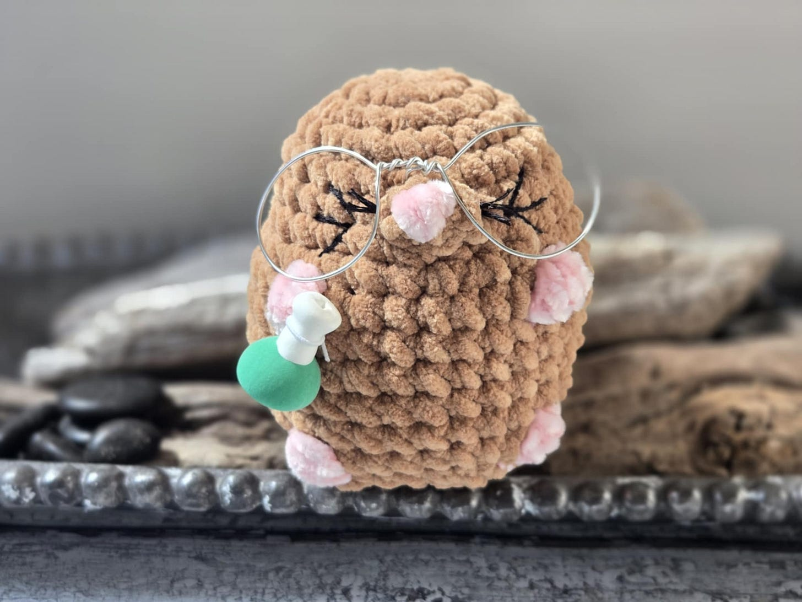
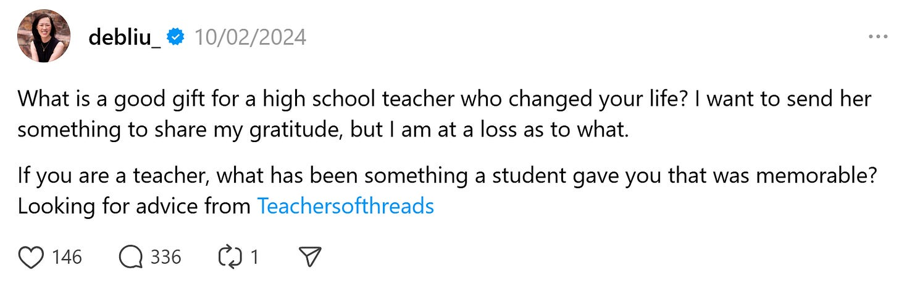
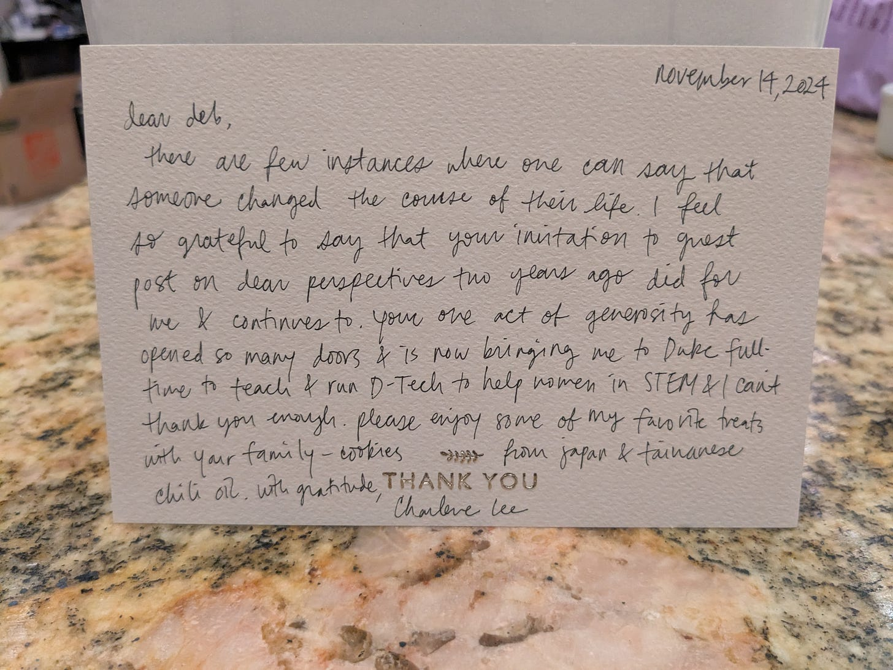

# The Gift of Gratitude 

*On thanking the people who have changed your life*

A mole (Avogadro constant)) for Mrs Ashburn my niece made

When I was six, my parents moved us from Queens, New York to a small town in South Carolina. They heard the schools were better in the next town over, so a couple years later, we moved again, to the city of Hanahan. Because we didn’t move there until I was in the second grade, I spent years being considered the “new kid,” surrounded by classmates whose parents—and sometimes even grandparents—had all gone to the same school.

If you’ve ever watched Friday Night Lights, you already have an idea of what life was like in Hanahan. But that wasn’t the reality for me. I didn’t fit in. My family was “foreign.” We spoke a different language, ate strange food, and generally stuck out like sore thumbs in that small southern town. I met many more lovely people than hurtful ones, but I still grew up always conscious of being seen as the “other.” We were frequently told to go back to where we came from and constantly asked questions like, “What are you?”

My saving grace was the teachers at my school. They made an incredible difference in my life because they believed that an awkward girl with braces and terrible fashion sense could be someone someday. One, in particular, Mrs. Ashburn, was a special source of guidance, support, and encouragement. Over the years, we kept in touch, and she even asked me if I had kept a copy of her college recommendation letter. (After my dad passed away, my mom abruptly moved out of their house, so a lot of my childhood things were lost. I even wrote to Duke asking if they could find the original five-page copy, but they said the records were too old to have on file.)

[Share](https://debliu.substack.com/p/the-gift-of-gratitude?utm_source=substack&utm_medium=email&utm_content=share&action=share)

Mrs. Ashburn’s faith in me never wavered, and I would not be where I am today without her support. In her honor, I asked the teachers of Threads what they would want as a gift from a former student. Their overwhelming response wasn’t mugs or souvenirs, but a heartfelt letter.

That settled it. I had my niece make a special gift for one of my teachers, and for Mrs. Ashburn, I wrote a “recommendation letter”—just as she had done for me when I applied to college all those years ago.

Other people’s kindnesses often go overlooked, but a heartfelt expression of gratitude can sometimes be the best gift you can give. That’s why, with Thanksgiving behind us and the holidays fast approaching, I encourage you to consider how you can do the same for the people who made a difference in your life—in ways small or big.

[Subscribe now](https://debliu.substack.com/subscribe?)

## **Expressing gratitude**

So often, we think we have to make gratitude into some kind of big, elaborate event, but that’s not the case. The best way to show someone your appreciation is usually just that: to simply say thank you. Yet so often we forget to give people this basic courtesy.

At the start of Chapter 9 of my book, *[Take Back Your Power](https://amzn.to/3FmjU0v)*, I wrote about how I was accepted to Stanford for grad school while David and I were in pre-marriage counseling at our Atlanta church. I excitedly told our pastor and his wife the news during one of our sessions, and what he said devastated me. He told me that David should be the one to have the lead career and that I didn’t need a graduate degree to stay at home with the kids. David encouraged me to speak to the senior pastor of the church. Pastor Lu encouraged me to pursue a higher education and a vocation of my own. He married us, and a week later, we moved to California.

Until I published my book, I had not looked Pastor Lu up since. As it turned out, he had spent a couple of decades out in San Jose before moving back to Atlanta. I reached out to tell him how much his words meant to us and our relationship, and for the holidays, I am sending him a copy of the book and a letter expressing our gratitude.

Pastor Lu had such a profound impact on our lives, but I never stopped to thank him. I often share what his words meant to me at a vulnerable time in my life and faith. Yet I never even thought to look him up for all those years, and I missed the opportunity to thank him in person. A simple word of thanks might have meant the world to him years ago, and while I’m grateful for the opportunity now, I wish I had taken the time to show my appreciation earlier.

## **Paying it forward**

Beyond expressing our gratitude through our words, we can also show it through our actions. Paying it forward means taking the lessons you’ve learned from those who have changed your life and passing them along to others. Just as you harvested from the bounty that others planted, you can plant those seeds for others to harvest in the future.

I once got a message from a product manager named Charlene Lee requesting to chat with me. I took her call in the TSA line at the airport on a particularly hectic day, unsure where the conversation would lead. Eventually, Charlene decided to write a guest post for my newsletter about [the ten lessons she learned as a new Google employee](https://debliu.substack.com/p/ten-things-i-wish-i-learned-before). In the four years I’ve been publishing this newsletter, it remains one of the most popular posts on my Substack.

Recently, Charlene came to a Women In Product party I was hosting at my house. She handed me a gift and a handwritten thank you note talking about how I had set her on the path to becoming [Director of the DTech program at my alma mater, Duke University](https://dtech.duke.edu/). DTech is close to my heart; I still remember being one of only five women in a physics class of 70. It was intimidating and overwhelming for me at the time, and I am so glad that students today have that community. I gave Charlene guidance at an important moment in her career, and nothing makes me happier than seeing her helping the next generation of students in STEM.

Taking the time to thank those who have helped you—and making the most of their help by paying it forward—is one of the best ways to share your gratitude. Here’s an easy way to do this in the new year:

1. **Pick one person a month to thank.** We spend a lot of time thinking about the people who have changed our lives, but how often do we go back and tell them? This year, I challenge you to pick someone each month who has had a positive impact on you—big or small—and reach out to them.
2. **Tell them how you feel.** The words you use don’t have to be fancy or profound. A simple, “I am writing to tell you how you changed my life,” or, “I really want to thank you for your help with….”, followed by a short explanation, is sufficient. Hearing this can make someone’s entire day—take it from me!
3. **Make plans to pay it forward.** When you thank someone for their help or support, be sure to express how you plan to pay it forward. Seeing that their actions are having a tangible positive impact—not just directly on you, but indirectly on others—is inspiring and validating.

We each have a list of people who had a positive impact on our lives: former teachers, mentors, managers, and friends who said the right thing or reached out at the right time. Taking the time to follow up with them can close the loop and inspire more positive actions—and what better time to start than as the year comes to a close?

[Leave a comment](https://debliu.substack.com/p/the-gift-of-gratitude/comments)

---

As you spend the holidays with friends and family, you’ll probably be thinking a lot about the gratitude you feel for those you’re close to. But I encourage you to also think beyond the obvious. Remember the people who were pivot points, those who changed the way you looked at the world or lived your life. Go back and thank them for their kindness and the faith they had in you. Then pass it on.

[Subscribe now](https://debliu.substack.com/subscribe?)