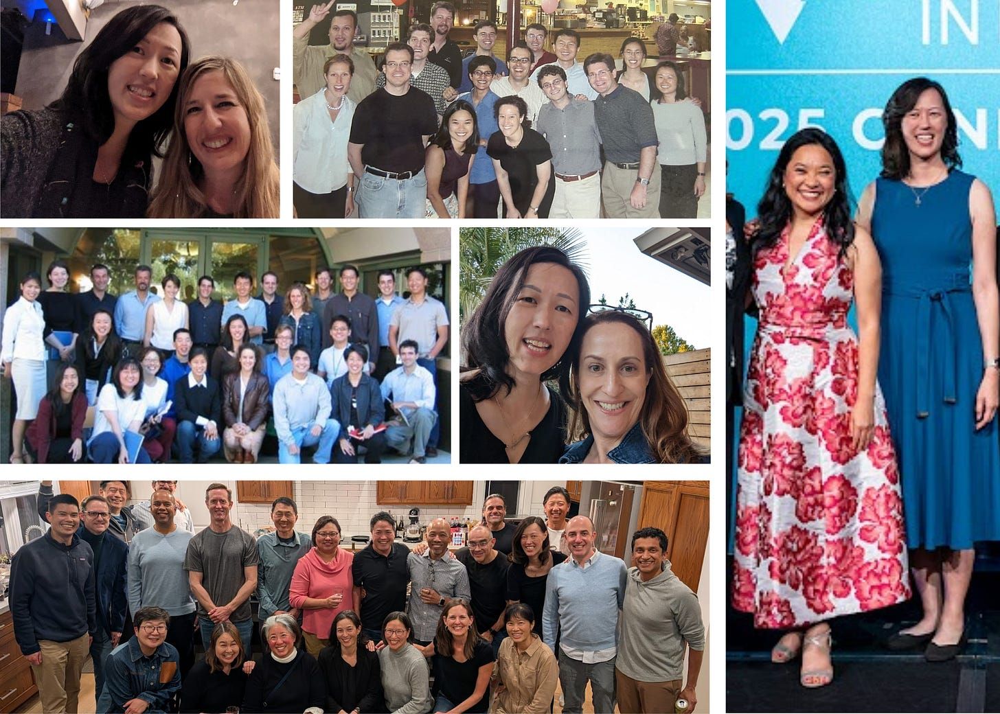
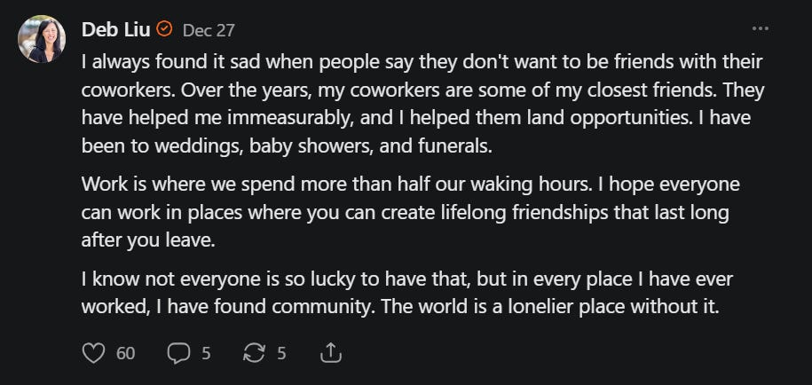
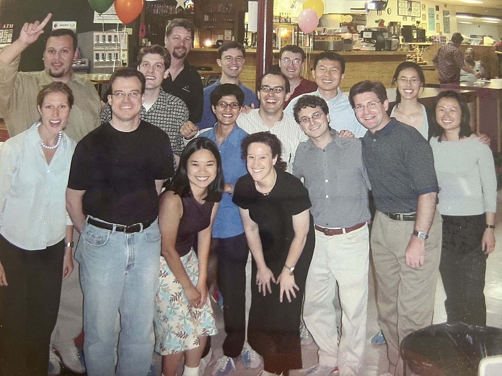
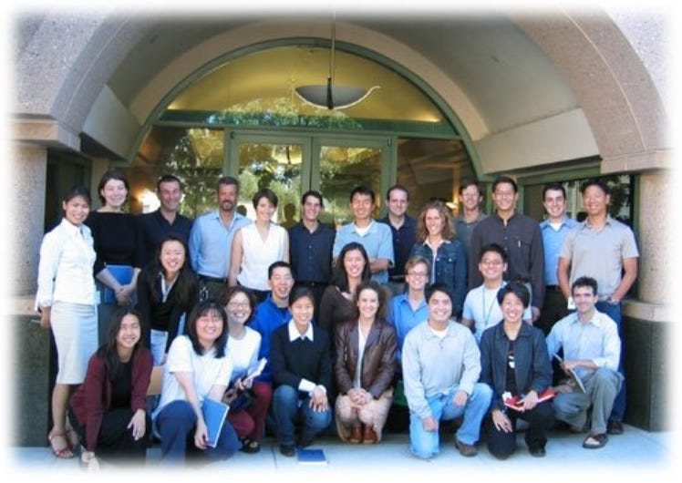
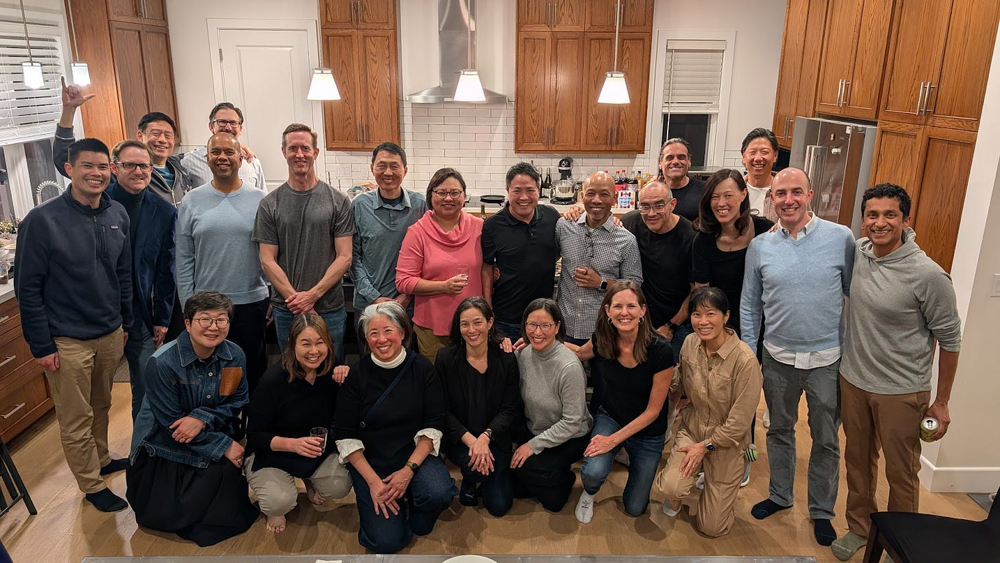

# Make Friends at Work

*Why you should ditch the “I’m not here to make friends” mentality*

It has always made me sad to hear people say they don’t want to be friends with their coworkers. Some of my closest friends began as coworkers. And while “I’m here to do a job, not make friends,” sounds like the kind of traditional wisdom that creates a successful career, workplaces can be filled with abundant opportunities for the kind of community our lonely world desperately needs.

## **The Workplace as Community**

Our local neighborhoods used to be our communities. There were civic organizations, churches, neighborhood groups, and shared rituals. As many of these spaces have faded, people are increasingly meeting people where they work.

I belong to a church community. I participate in [Lean In groups](https://www.linkedin.com/posts/deborahliu_furthertogetherincircles-activity-7415461165507497984-m2N8?utm_source=share&utm_medium=member_desktop&rcm=ACoAACbxh5EBki2fbZQEMWHkrSAq_vWyxxlr8XI). Those matter. But I also continue to find deep meaning in the coworkers who became friends along the way.

I write about this in my book, not as a career strategy, but as a life philosophy.

In my book, I talk about four types of allies: your manager, your mentor, your sponsor, and your team and circle. Mentors and sponsors are relatively well understood, and I have written extensively about both. I have also written about your circle, the people closest to you who help you make sense of the world.

What I have not written nearly enough about is your team.

Your team is the group of people you work with day to day to accomplish something together. They are the people you spend as much time with as your family, sometimes more. And yet I often hear people say, “I go to work. I’m not here to make friends.”

But that is where so many friendships begin. Some of my closest friends are people I worked with years ago. They are people I traversed a stretch of life with. Maybe only for a few years. But the impact was lasting.

The same is true of many friendships from my early days at PayPal. We started our careers together. We helped each other land jobs, navigate hard managers, recover from setbacks, and say yes to new opportunities. In some cases, we have worked together more than once.

That is a precious thing.

As we think about what we are trying to do with our lives, we should not forget how important this team is. These are the people laboring beside you every day to create something for the world, whatever that thing is.

They are your co-conspirators. Your partners. Your teammates.

At Ancestry, we used to say that you play for the name on the front of the jersey, not the back. When you are part of a team, you are part of something bigger than yourself. You show up differently when you believe that.

You will spend more than half your life at work. The people you meet and the experiences you share there matter. You each hold part of the other’s experience.

[Subscribe now](https://debliu.substack.com/subscribe?)

## **We Are All Connected**

I live where I live because a former coworker, [Robyn](https://debliu.substack.com/p/activation-energy-the-hidden-superpower), told me I had to buy the house a few houses down from hers. I discovered cancer early [because of Mauria](https://debliu.substack.com/p/drawing-the-cancer-card?r=3k88l), someone I worked with and met at PayPal. I worked at Facebook because my former engineering partner, Guy, reached out and championed my candidacy.

I have written before about my friend [Ha Nguyen](https://www.linkedin.com/in/hanguyen-spero/). She was on the eBay side, and I was on the PayPal side during the eBay-PayPal integration in 2002. We have been friends, on and off, for more than twenty years. She introduced me to my cofounder. She is the Vice Chair of Women in Product. She supports me in a thousand small and big ways. She knows how to get into my house and can borrow anything at any time. In fact, I think she is working upstairs in my living room right now. She has shown up every single time I asked.

The PayPal-eBay teams circa 2002.

I have helped former coworkers find jobs, advised their startups, helped introduce them to investors, and hire others. I have recommended them for boards, invested in their funds, and had them speak at my conferences.

They have helped me immeasurably, and I have helped them in return. I have been to their weddings and baby showers. I have sat beside them at funerals. We have celebrated promotions, launches, and acquisitions. We have also carried each other through illness, loss, and moments of deep uncertainty.

The richness of these relationships cannot be underestimated. Work does not just have to be a place you punch in and out of. It can be a place to discover meaningful relationships, build belonging, and create true community.

[Share](https://debliu.substack.com/p/make-friends-at-work?utm_source=substack&utm_medium=email&utm_content=share&action=share)

## **The Importance of the Lynchpin**

[Many years ago, my friend Alan started convening a group of us who had worked together in the early 2000s](https://debliu.substack.com/p/the-importance-of-linchpins-and-why). It was a magical moment in time, roughly from 2000 to 2004. We went on to navigate life in Silicon Valley together. In this photo, there are two of my managers, several of my direct reports, and people who now work for and with each other again. We have continued to live life together well after we are no longer actively working together.

Our group in 2003.

Recently, we attended the funeral of a friend who is missing from that picture. We had worked together nearly two decades ago, but he always made it a point to connect whenever possible. A lot of the people who came to celebrate his life were those he worked with and turned into friends over the years. They were his colleagues whose lives he had touched. They were teams he built. They were people who sat near his cube that stayed in his life.

He turned coworkers into friends. Every one of us in that room was better for it.

His smile had always been a reason for us to gather. Standing there, I decided that I did not want the next time we came together to be another funeral.

So, this week, I hosted two dozen former coworkers and friends from PayPal at my house for dinner.

The same group, 23 years later.

Several people told me they had not seen each other in fifteen years. And yet, when they walked through the door, it felt easy. Like picking up a conversation that had simply been paused.

It was deeply gratifying to bring together a group of people who cared about each other, who had built something meaningful together, and who are still connected all these years later.

## **How to Make Friends at Work**

That brings me to a question I get surprisingly often: how do you actually make friends at work?

I read once that friendship is not transactional, but rather reciprocal. I liked that statement.

**Be generous without keeping score**Share information freely. Make introductions. Offer help. Advocate for people in rooms they are not in. Most work friendships grow over time. They begin with trust and blossom with nurturing.

**Invest in the in-between moments**Coffee, lunch, walking meetings, a quick check-in after a hard meeting. Friendship is built in the spaces between the formal moments, not just in meetings or deliverables. Those small, repeated interactions are where people move from role to relationship.

**Let yourself be human**You do not need to overshare, but you do need to be real. Mention your kids, your parents, your hobbies, or what is weighing on you. When you allow others to see you as a whole person, you give them permission to do the same. Vulnerability is often the invitation that turns a coworker into a friend.

**Tend the relationship beyond the job**This is where many connections fade. Send the note after someone leaves. Celebrate the new role. Make the introduction. Check in a year later. Life is long, and the world is small. The relationships that last are the ones someone chooses to keep tending.

And finally: **Be the person who convenes.** Every group needs an Alan, someone who can be the reason to get together.

[Leave a comment](https://debliu.substack.com/p/make-friends-at-work/comments)

---

Community does not happen by accident. Someone has to send the invite, host the dinner, organize the reunion, or say, “We should get together.” That someone can be you.

Make friends at work.

You may not realize it in the moment, but years from now, when you look around a room filled with people who once built something alongside you, you will be grateful you did.