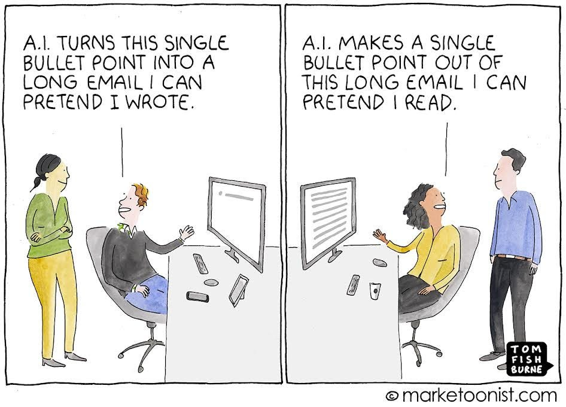
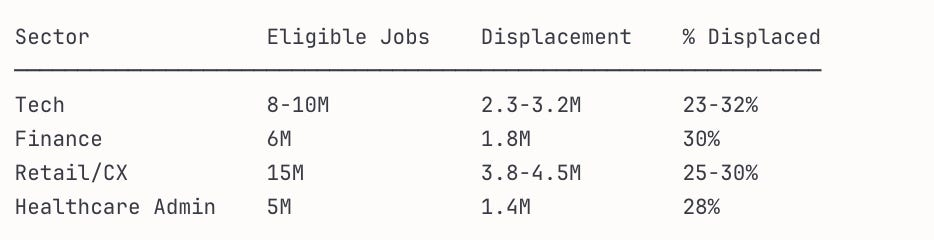
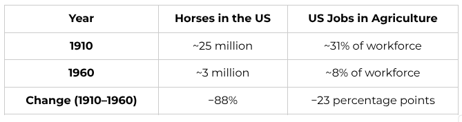
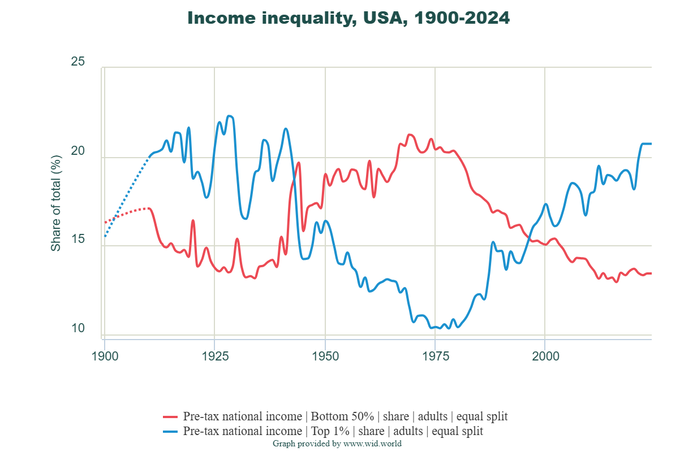
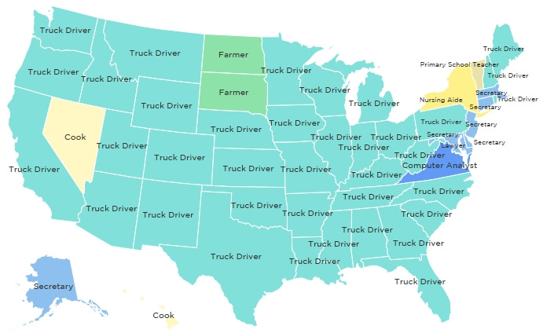
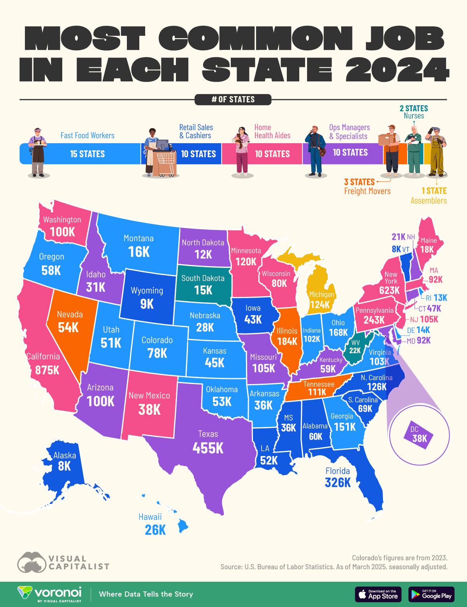

# When the Ladders Disappear

*AI's labor force reckoning and the quiet fallout*

Image courtesy of Tom Fishburne.

I grew up in South Carolina in the 1980s and early 1990s, during the great hollowing out of the state. I remember the feeling of living in a state in decline, something which was evident all around us.

Manufacturing was leaving the state. Textile mills shut down in favor of imports. Factories that had anchored entire communities for generations went dark. I traveled across the state for speech and debate tournaments, and I remember driving through towns where the largest building sat empty in the center, a hollow shell behind chain-linked fences. The work left, and with it the vitality of the town itself.

In South Carolina, manufacturing jobs dried up. One in four South Carolinian industrial workers specialized in textiles, yet textile and apparel-related jobs dropped from 120,000 in 1994 to 49,000 (a loss of over 50%). By 2004, 75% of textile jobs were erased due to factory closures, outsourced manufacturing processes, and roles made redundant by new technology left workers flapping in the wind ([source](https://www.greenvillebusinessmag.com/stories/scs-journey-to-advanced-manufacturing,3904)). The jobs that did replace them were less stable and paid less. They also lacked advancement opportunities that fueled the middle-class growth of the state.

We did not call it displacement then. We did not talk about structural shifts or labor transitions. We just saw it happen before our eyes. We watched families move away, schools shrink, and main streets emptied.

In 1996, the government closed the doors to the Charleston Naval Shipyard, where my dad worked for over a decade. He was reassigned in 1993, the year before my high school graduation. Many of his colleagues took buyouts, but my dad was close enough to retirement that he accepted whatever assignment they offered. We moved across the state to a small town in Georgia. A few years later, that site had massive layoffs, and my dad was reassigned again, this time to a more remote posting at a base in Oklahoma.

Job displacement is not theoretical. It is a physical manifestation of the changes in our economy. It uproots families and reshapes communities. It lingers long after the economic models say things have adjusted.

I think about my time growing up in SC when people talk about AI automation today. Technology is incredible in so many ways. I have devoted my career to the field because of the positive impact it has on the world. But there are tradeoffs. Just like you can’t chase a metric blindly without guardrails, you also can’t rush headlong into the AI era without understanding the true impact it can have. There will be a lot of societal benefits, for sure. People who lacked access to education, health information, or insights will now be able to unlock it. But each technology leap forward (including globalization of supply chains) is concentrated with shareholders, while the consequences are borne elsewhere.

What follows are six observations about what is actually happening now.

[Subscribe now](https://debliu.substack.com/subscribe?)

### **Work is Going to Change Due to AI Productivity Gains**

[In 2024, McKinsey’s report “A New Future of Work](https://www.mckinsey.com/~/media/mckinsey/locations/europe%20and%20middle%20east/deutschland/news/presse/2024/2024%20-%2005%20-%2023%20mgi%20genai%20future%20of%20work/mgi%20report_a-new-future-of-work-the-race-to-deploy-ai.pdf)” estimates that 30 percent of current office work hours could be automated by 2030. That is a significant improvement in productivity, but also the loss of entry-level jobs where training happens.

This will be applied unevenly. In some sectors, this will reduce the need for incremental hiring, while in others, the result will be full job displacement. Companies will have a choice between taking the cost savings to the bottom line and reinvesting in incremental growth. The jury is out on where these productivity gains will manifest: the top line or the bottom line?

In 2025, global tech companies eliminated roughly 150,000 to 170,000 roles, according to [Layoffs.fyi](https://layoffs.fyi/), marking another year of significant contraction across the sector. Several major firms publicly linked portions of those cuts to AI-driven efficiency gains. That is just one sector in one year. Forecasts from firms such as McKinsey suggest that the displacement risk is significant, impacting from 25% to 30% of jobs in key industries.

(Data: [U.S. Bureau of Labor Statistics 1](https://www.bls.gov/oes/), [2](https://www.bls.gov/emp/tables/employment-by-major-industry-sector.htm))

This all makes sense. A large bank laid off most of the team that summarized the news from global markets for the US team. Why have a full team staffed when AI can automate 80% of the job with human oversight? AI is transformative, but in small and quiet ways. This will continue over time.

### **The Move from the Agrarian Society to an Industrial One is Analogous**

The move from agrarian communities to an industrial one is illustrative of what happens in times of major change. We move from horses to cars, manual labor to tractors, and small farms to large corporate farms.

(Data: [Census Bureau](https://www.census.gov/library/publications/1975/compendia/hist_stats_colonial-1970.html), [USDA](https://www.ers.usda.gov/data-products/livestock-meat-domestic-data/), [Gilder Lehrman Institute](https://www.gilderlehrman.org/history-resources/teacher-resources/statistics-trends-american-farming))

We don’t try to keep employing horses or encourage young people to become farmers. Instead, we adapted, and society shifted around the displacement. We found new areas to invest our human ingenuity, and society advanced. [We now produce way more food than we ever thought possible, and even go on to waste about 40% of it](https://www.usda.gov/about-food/food-safety/food-loss-and-waste?utm_source=chatgpt.com).

While some communities lost, the US as a whole thrived. The US population tripled, and nominal GDP grew roughly 20x. Horses were no longer economically viable, and [farming is less than 2% of the workforce](https://www.ers.usda.gov/data-products/chart-gallery/chart-detail?chartId=58282) today.

Like the manufacturing loss of the 80s and 90s, the first half of the 20th century [forced us to change the way we work](https://open.substack.com/pub/lexireese/p/we-are-the-horses-now-part-1-of-2?r=2lkd2n&utm_medium=ios&shareImageVariant=overlay).

The coordination layer in modern organizations faces a similar dynamic. Not because humans cannot coordinate, but because AI systems offer a lower cost structure at acceptable or perceived acceptable quality. These decisions are driven by economic optimization, not by careful consideration of what capabilities are being lost.

[Share](https://debliu.substack.com/p/when-the-ladders-disappear?utm_source=substack&utm_medium=email&utm_content=share&action=share)

### **Income Distribution Changed Along with the Workforce**

Manufacturing automation from 1980 to 2010 provides a useful history lesson. U.S. manufacturing employment peaked at about 19.5 million jobs in 1979 and fell to roughly 11.5 million by 2010, dropping from roughly one-quarter of total employment to under 9 percent, even as the GDP doubled. But the benefits of this growth were not evenly distributed, as we saw a dramatic gap open between worker productivity and worker pay. Today, worker productivity is at a historical high (90.2%), yet workers’ hourly pay has only increased by 33% since the gap first appeared in 1979. ([Source](https://www.epi.org/productivity-pay-gap/).)

The economy grew. Labor’s share of the growth shrank. In the late 1970s, the bottom 90 percent of earners captured roughly 60-65% of total income growth, and the top 1 percent captured about 10 percent. Today, [the top 1 percent](https://ourworldindata.org/income-inequality) captures about 20 percent of national income, yet the bottom 90 percent captures only 40-45%. Simply put, Americans are producing more than ever, yet their share of the pie is getting smaller.

[Income Inequality in the US](https://wid.world/share/#0/countrytimeseries/sptinc_p0p50_992_j;sptinc_p99p100_992_j/US/2015/eu/k/p/yearly/s/false/9.753/25/curve/false/1899/2024)

In an AI world, it is possible that workers will capture 30% of the gains, and infrastructure owners could capture 70%.

### **Impact Will Be Uneven and Uncertain**

If entry-level employees disappear, what does that mean for leadership development? No one shows up to a law firm as a third-year associate or at a consumer company as a marketing expert. Someone has to do the training. In many apprenticeship fields such as tech, law, banking, and consulting, it is unclear what will happen when that changes.

I am a techno-optimist. I believe that we will unlock new ways of doing things and thus create more productivity, which will result in the growth of GDP. But we need to fix the way we employ human capital, and the transition will be hard.

(Data: [SoCalGIS](https://socalgis.org/2015/02/24/the-most-common-job-in-every-state/))

In 2014, truck driving was the most common job in the majority of US states, but times have changed. Today, fast food and retail workers are the top jobs in 25 states.

(Data: [Voronoi](https://www.voronoiapp.com/economy/-Mapped-Every-States-Most-Common-Job-in-2024-5469))

These jobs are less stable, more temporary, and have less opportunity for growth.

Without a ladder where workers can get on the first rung, what does that mean for the future of innovation and technology?

[Leave a comment](https://debliu.substack.com/p/when-the-ladders-disappear/comments)

### **Changing the Social Contract**

A company I know was able to replace 80% of a key analytics and modeling team with an AI tool they built in-house. The reality was that the AI output exceeded the quality of that from the team, and there were no other roles in the company that suited their skillset. They made sure to place each of these employees in new roles outside the company and helped them with the transition.   
  
I mentioned the story to another tech leader, and he said, “Perhaps a better way would be to pay those whose intellectual capital was used to create the models a licensing fee for their contribution.” I am not sure how workable that is, but universal basic income or some way to allow families to have a stake in the productivity gains is vital as we go through this transition.

There is no easy answer. We have been through multiple work revolutions and come out the other side a stronger economy, but do we come out with stronger communities and societies? That is the key question we all need to wrestle with.

---

*This article was co-authored by [Lexi Reese](https://www.linkedin.com/in/lexireese/), who is the founder of [Lanai](https://www.withlanai.com/) and former COO at Gusto (ex-Google). She is a leading expert on AI governance and regulation, Council on Foreign Relations member, and former Harvard Business School Fellow. Check out Lexi’s Substack [here](https://lexireese.substack.com/).*

Special thanks to [Tom Fishburne](https://marketoonist.com/) for allowing us to use his illustration for the cover photo of this article!