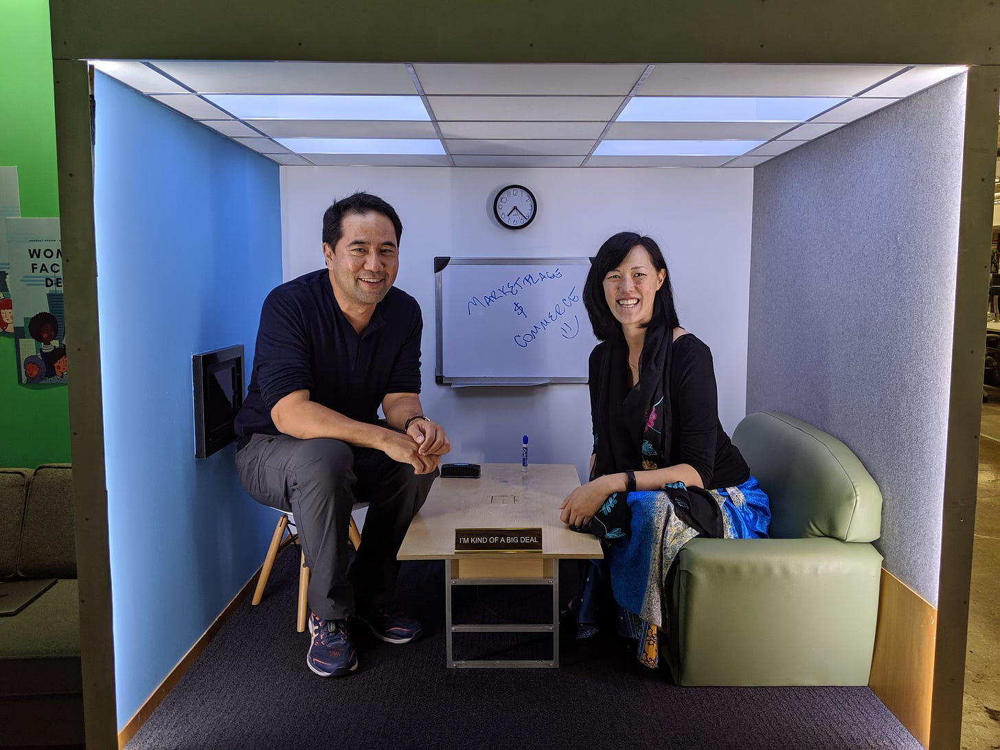

# Blossoming in New Soil

*How You Can Change Your Circumstances to Change You for the Better*

Last fall my friend and engineering partner at Facebook Yuji Higaki left the company to join Niantic as their new SVP of Engineering. Yuji and I have worked closely together since 2012, first as Product Manager and Engineering partners, and then in 2014, I became his manager.

Yuji had many professional strengths, like coaching his reports, building teams, and setting up the operational cadence, but some blindspots held him back. We worked together on things like speaking up, influencing more broadly, and setting a more visible direction. For years we concentrated on developing these areas. While he made strides during that time, Yuji fundamentally remained a quiet, behind-the-scenes leader.

When he approached me about taking a role outside the company I was sad that we were no longer going to work together, but I was supportive of him spreading his wings. He had been feeling stagnant, and I knew he was not learning as much as he used to. What happened next was nothing short of amazing.

A few weeks into his new job Yuji called to give me an update. He proudly shared that he was one of the most vocal people in the room. He went on to talk about how he was setting direction and being a more visible and assertive leader.

Within months he had not only worked on all the things I had coached him on over the past six years but he changed them completely. It was so wonderful to see him blossom, yet part of it was also very humbling. I thought a lot about why the time we spent together did not unlock this new side of him. Was there a key to his metamorphosis that I neglected?

### Personal Transformation Through a Catalyst

After hearing about Yuji's success in his new role we discussed what catalyzed these changes and we attributed it to three things.

* **Renegotiation** - In any great partnership or team, each person plays a role. Yuji and I complemented each other well throughout our years of working together. I focused on influence, strategy, and communication, and he focused on execution. When he entered a new leadership team, he had a chance to renegotiate his position on that team. The people around him had different strengths and gaps. This gave him a chance to become a different person to fit into the dynamic of his new team. He was able to find ways to stretch himself and add value.
* **Reinvention** - Yuji was at Facebook for nearly a decade, so much of who he was and what he did was defined already by everyone who worked with him and knew him. Trying out new ways of doing things felt risky or out of character. Being in a new place he was able to exercise new skills without judgment. This gave him a chance to push himself out of his comfort zone and evolve.
* **Reinvigoration** - Someone told me once, “You know it’s time to leave a job when you are doing more than you are learning.” Because Yuji had been in a similar role for many years, his work had become routine. While he continued to execute and deliver, we both knew that the freshness was gone. The energy he has now when he talks about his new role consistently reminds me that the decision to go was the right one for him.

In retrospect, I think there was more we could have done while we worked together to find ways to unlock him. If I had been more aggressive in renegotiating our roles, working with him to find space to reinvent himself, or helping him to reinvigorate his energy in the current role, we could have found a way to help him gain these skills while still on the team. I regret not having been more proactive in finding ways to change the way we worked together to help him grow in place.

You don't need to leave your job or company to find a way to blossom. The first step to evolving is recognizing when you are in a rut and seeking a transformation. Assess what kind of state you are in and find creative ways to renegotiate, reinvent, and reinvigorate yourself. Shaking up your routine will give new life to your work and may be the boost you need to grow your career.

[Share](https://debliu.substack.com/p/blossoming-in-new-soil?utm_source=substack&utm_medium=email&utm_content=share&action=share)

[Subscribe now](https://debliu.substack.com/subscribe?)