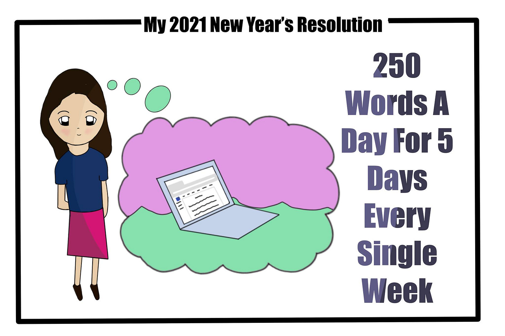

# Resolve to Progress

*How to Change Your Life Through New Year’s Resolutions*

Each year for the past 18 years, I have set New Year’s resolutions on January 1st. Half of the adults in the US set New Year’s resolutions every year. However, only one in ten ends up sticking to their resolutions, even though 74% of those asked in the prior year were sure they would be able to achieve them ([ref](https://www.finder.com/new-years-resolution-statistics)).

I view each new year as a milestone in what I want to achieve. Over time I have fully integrated some of my New Year’s resolutions into my life while letting go of others. Any resolution I keep for more than two years turns into a habit, and I can remove it from the list in favor of something new. As a result of these resolutions, I no longer drink soda (16 years), floss daily (13 years), work out every night (8 years), reduced my sugar intake (4 years), practice intermittent fasting (3 years), and write regularly (2 years).

Bethany’s (age 11) resolution for 2021

Since 2015, I’ve posted my resolutions on Facebook. Every January 1st, I evaluate how I’ve done on the past year’s goals and set goals for the following year. This allows me to reflect on what progress I have been able to make and what I hope to change. What's been fascinating rereading these reflections is how much I have changed my life, one resolution at a time.

### Turning Resolutions Into Habits

The best way to make a change in your life is to turn it into a routine that is so ingrained you never think twice about it. By making it harder for yourself to \*not\* do something than to do something you have achieved making something a new habit. If you told me ten years ago that I would work out every day, I would never have believed you. I hated working out my entire life. I would start a new routine, hate it, and give up. I tried everything, but it never stuck.

Then I gave birth to the youngest of my three children, Danielle in 2011. She was a surprise and a blessing, and while I was pregnant, my father was battling stage IV cancer. We were also in the middle of renovating our house, a project we had started well before the pregnancy. I now had a four-year-old, a two-year-old, and a colicky newborn as we lived out of suitcases in a two-bedroom apartment.

Unfortunately, Danielle had terrible colic and cried two to three hours each night. This forced my husband to bounce her on an exercise ball to calm her to sleep. While she began sleeping through the night at around two months, the routine to get her down took hours. Finally, we figured out that rocking her before placing her in her crib and sitting with her in the dark would allow peace in our home.

When my youngest was a few months old and we finally moved back into our house, I came up with a plan. We bought an elliptical a decade before. I used it on and off, mostly to lose the baby weight from my other pregnancies, but never really took to it. I moved little Danielle to our king-sized bed and put her to sleep to the sound of me working out on the exercise machine with only the bathroom light to illuminate the room. The white noise was like kryptonite to her. My husband would then pick her up and move her to her crib for the night.

When Danielle learned to talk she would drowsily walk up to me at night and grab my hand to guide me into our bedroom and say, “Mommy, I’m tired. It's time for you to go work out so I can go to sleep.” I had no choice but to comply and work out to lull her to sleep.

Danielle eventually learned to go to bed on her own, but by that point I couldn’t imagine missing a workout. No matter the day or the time, even when I am sick, it feels wrong not to exercise at night. I have even returned from holiday parties late at night and worked out before bed, just to feel like I didn’t leave something unfinished. As a result, I have worked out nearly every day for the past eight years.

### Making Resolutions Work for You

Life is about habits that you pick up, even when you're not looking to. It's the choices you make every day that set the cow paths and cut the grooves in the road of your life. While we often worry about bad habits, leveraging the same routines that help create them can also yield good habits. Five years ago I decided to write more, without any clear plans. Four years ago I decided to try writing just a little bit every day. Three years ago I updated that goal to 500 words per day. In 2020 I completed two novels and half of a non-fiction book that I have been working on for the past couple of years. I get asked a lot about how I find the time, but we make time for the things that we care about. Anyone can find 30 minutes somewhere, and it is really about prioritization and focusing on what you want to ingrain in your life.

Decide what you want more of in your life, whether it's spending more time with family or working out every day. Permit yourself to do a bit more of it each day. Set a goal, but if you miss a day or two, allow yourself to keep going. Focus on making space for your new habit and maintaining consistency, rather than achieving something. Slowly allow it to become second nature. You won't even know it's become a part of your life until not doing it becomes uncomfortable and unthinkable.

### Steps Towards Sustainable Resolutions

* **Pick something achievable.** Sometimes we set goals so unattainable it feels hopeless from the start. Instead, select something you want to do that you know is possible to achieve.
* **Make a public declaration of accountability.** Start with a public announcement of what you want to achieve, and make sure you have friends who hold you accountable. Since I started posting my resolutions in 2015, multiple friends have joined me so now I feel obligated to continue this tradition.
* **Redefine success and failure.** By February, most people have failed to achieve their goals. Instead of having a fixed goal where you are either on track or off track, focus on doing more of something or less of something. That way you don’t reach a point where you feel like you’ve failed and you’re waiting until next year to try again. Rather, work on doing a bit of your resolution each day, and define success as making something a bigger part of your life.
* **Make space in your life.** Once you write out your resolution, decide how you are going to achieve it. If your goal is to work out every day, plan out when and how you will do it. If your goal is to write, set aside time each day, even for fifteen minutes, and write something. The practice of doing is the best way to turn resolve into habits.

Resolutions are powerful tools, but they can also be discouraging if not planned well. Focus on making 2021 a year where your resolutions work for you.

[Share](https://debliu.substack.com/p/resolve-to-progress?utm_source=substack&utm_medium=email&utm_content=share&action=share)

[Subscribe now](https://debliu.substack.com/subscribe?)