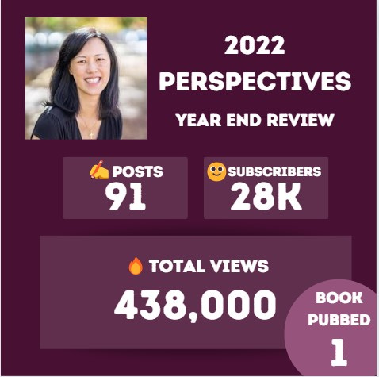

# 2022 A Year In Review For Perspectives

*2022 - what a year*

Last year, on January 1st, I shared [my New Year’s resolutions for 2022.](https://debliu.substack.com/p/2022-new-years-resolutions) Today, I’d like to reflect on what the past year has brought for my writing ventures, including this Substack, and share some thoughts for 2023.

I started this blog at the start of 2021, and it’s hard to believe that it has already been going strong for two years. To celebrate, here are a few fun stats from 2022:

I began this newsletter on a whim. I had been publishing internally at my previous company for some time, and as I was exploring the possibility of leaving, I realized nothing was stopping me from sharing what I wrote more broadly. This was originally going to be a one-year project since I wasn’t sure I had much to write about. Now, two years in, Perspectives is still going strong, and I have at least a dozen half-finished articles in the works at any given time. (In the meantime, [I’ve also published a book](https://debliu.substack.com/p/today-is-launch-day).)

In the past year, the number of Perspectives subscribers has grown sixfold, and I’ve nearly doubled my posting schedule. To make the publishing process more sustainable in 2023, I’m going to focus on finding more ways to scale. I have been testing out guest posts from people I admire (special thanks to [Charlene](https://debliu.substack.com/p/ten-things-i-wish-i-learned-before) for being a guinea pig!), as well as insights from people I have learned from (a big thanks to [Christine](https://debliu.substack.com/p/2022-year-end-reflection) for helping us close out our year!). I also plan to create more useful guides on topics that require research. The first of these will come out later this week, so stay tuned.

Thank you all so much for your comments, feedback, and support over the past year. I wouldn’t have been able to do this without my sister, Caroline, who runs this newsletter, and [Izzy](https://www.thebornstoryteller.com/), my editor, who helps me write with confidence and fixes my mistakes.

As 2023 kicks off, here are a few highlights from last year, in case you missed any of the top articles of 2022.

---

### Top 5 Most Shared Articles:

1. **[Avoiding the Pitfalls of Taking A New Role](https://debliu.substack.com/p/avoiding-the-pitfalls-of-taking-on)**
2. **[Ten Things Getting in the Way of Your Execution](https://debliu.substack.com/p/ten-things-getting-in-the-way-of)**
3. **[What They Don’t Tell You about Maternity Leave](https://debliu.substack.com/p/the-truth-about-maternity-leave)**
4. **[The Bias No One Talks About](https://debliu.substack.com/p/the-bias-no-one-talks-about)**
5. **[How to Negotiate Almost Anything](https://debliu.substack.com/p/how-to-negotiate-almost-anything)**

---

### Top 5 Most Liked Articles:

1. **[Ten Things I Wish I Learned Before I Started My Career](https://debliu.substack.com/p/ten-things-i-wish-i-learned-before)**
2. **[What They Don’t Tell You about Maternity Leave](https://debliu.substack.com/p/the-truth-about-maternity-leave)**
3. **[Ten Things Getting in the Way of Your Execution](https://debliu.substack.com/p/ten-things-getting-in-the-way-of)**
4. **[What I’ve Learned from My Best Managers](https://debliu.substack.com/p/what-ive-learned-from-my-best-managers)**
5. **[The Bias No One Talks About](https://debliu.substack.com/p/the-bias-no-one-talks-about)**

---

### Top 5 Most Viewed Articles:

1. **[Avoiding the Pitfalls of Taking on a New Role](https://debliu.substack.com/p/avoiding-the-pitfalls-of-taking-on)**
2. **[Writing Your Personal Mission Statement](https://debliu.substack.com/p/writing-your-personal-mission-statement)**
3. **[Ten Things Getting in the Way of Your Execution](https://debliu.substack.com/p/ten-things-getting-in-the-way-of)**
4. **[Ten Things I Wish I Learned Before I Started My Career](https://debliu.substack.com/p/ten-things-i-wish-i-learned-before)**
5. **[What They Don’t Tell You about Maternity Leave](https://debliu.substack.com/p/the-truth-about-maternity-leave)**

---

### Top 5 Most Liked Paid Posts:

1. **[Career Myths That Need to End in 2023](https://debliu.substack.com/p/career-myths-that-need-to-end-in)**
2. **[What I’ve Learned from My Worst Managers](https://debliu.substack.com/p/what-ive-learned-from-my-worst-managers)**
3. **[What They Don't Tell You about Calibrations and Ratings](https://debliu.substack.com/p/what-they-dont-tell-you-about-calibrations)**
4. **[Writing Your Personal Mission Statement](https://debliu.substack.com/p/writing-your-personal-mission-statement)**
5. **[The Top 5 Mistakes Leaders and Managers Make](https://debliu.substack.com/p/the-top-5-mistakes-leaders-and-managers)**

---

### Top 5 Most Viewed Paid Posts:

1. **[Career Myths That Need to End in 2023](https://debliu.substack.com/p/career-myths-that-need-to-end-in)**
2. **[Writing Your Personal Mission Statement](https://debliu.substack.com/p/writing-your-personal-mission-statement)**
3. **[What They Don't Tell You about Calibrations and Ratings](https://debliu.substack.com/p/what-they-dont-tell-you-about-calibrations)**
4. **[Sharpen the Questions: Individuals](https://debliu.substack.com/p/sharpen-the-questions-individuals)**
5. **[Work Edition: 10 Ways to Save 10 Hours a Month](https://debliu.substack.com/p/work-edition-10-ways-to-save-10-hours)**

---

I don’t usually like to play favorites, but my favorite post from 2022 was **[How to Negotiate Almost Anything](https://debliu.substack.com/p/how-to-negotiate-almost-anything).** Confession time: I consider myself terrible at negotiating, but I’ve spent the past year helping others negotiate their offers. I’m thrilled to have been able to help them advocate for themselves and get what they want.

---

As we put 2022 behind us and look ahead to 2023, I want to extend a sincere thank you to all of you who subscribe to and read this newsletter. This publishing journey has been full of twists and turns, and it has taken me to unexpected places, but your continued support and encouragement is one of the most meaningful parts of this experience. Knowing that this newsletter has given you food for thought (and sometimes even helped you!) means more than words can say.

Here’s to a 2023 full of more Perspectives!

Is there a topic I didn’t cover in 2022 that you would like me to write more about this year? Let me know in the comments!

PS: So I have always avoided using emojis in my writing. My sister said it is time to lean into the new age. **So should I occasionally include an 👍🧠🐶?** I am still resisting. Let me know your thoughts in the comments.

[Leave a comment](https://debliu.substack.com/p/2022-a-year-in-review-for-perspectives/comments)