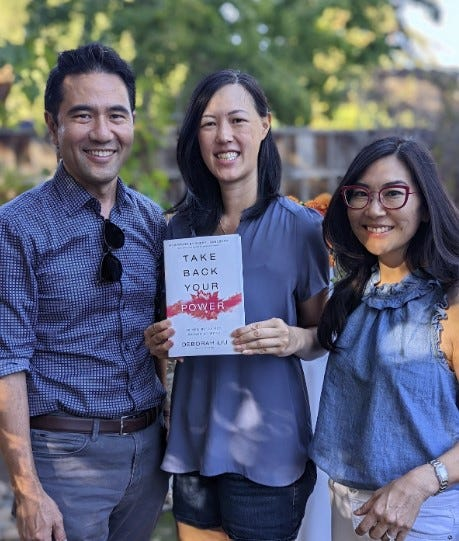

# Blossoming in New Soil - A Different Perspective 

*How Changing Jobs Changed My Outlook*

---

**Deb’s Note:** I wrote the post [Blossoming in New Soil](https://debliu.substack.com/p/blossoming-in-new-soil) in January 2021 when I first started the newsletter.  I was about to change jobs, and I looked to [Yuji](https://www.linkedin.com/in/yujihigaki/) for an example of someone who was able to hit the “reset” button and grow in his work transition. As his former colleague and manager, I was a little hurt that I was never able to help him break through, but as his friend, seeing him blossom was such a joy. I wish I could bottle that up and share it with everyone. Yuji is celebrating his 3 year anniversary at Niantic this month, so I asked him to write his post-mortem on this experience and what we can all learn about growth and evolution.

[Share](https://debliu.substack.com/p/blossoming-in-new-soil-a-different?utm_source=substack&utm_medium=email&utm_content=share&action=share)

---

To this day, I still remember the feeling of dread that consumed me when my manager, Deb, asked me to speak up at least once per meeting. For me, presenting during meetings was only slightly less anxiety-provoking than getting thrown on stage with a karaoke mic. My heart would sometimes race, and I’d find myself short of breath just thinking about it—let alone doing it.

That being said, Deb's request seemed reasonable. Many of my colleagues often dominated the conversation during meetings, so I only needed to speak up once and then let them take over. I had many ideas that I wanted to share, but for some reason, I couldn’t bring myself to interject. I would sit there thinking that the next pause in the conversation would be my chance, but each time, I would let the moment pass, and someone else would jump in. This created a negative feedback loop: each time I failed to insert my point of view, it made the next time harder.

I consider Deb to be one of the greatest managers and developers of talent that I’ve ever worked with, and we share a good laugh whenever we reflect on [how quickly I changed when I started my new role at Niantic](https://debliu.substack.com/p/blossoming-in-new-soil).  I think she takes it personally that I didn’t change while I worked for her, so she asked me to share a [post-mortem](https://debliu.substack.com/p/leveraging-post-mortems-to-understand) now that I’m three years into leading engineering at Niantic.

Fast forward to today, and I don’t even have to think about whether I’ve spoken up during a meeting or not. Engaging and contributing now feels as natural as a conversation at the dinner table.

Looking back, what is most surprising to me is that the change happened almost overnight. This goes against the way most change works: you build new habits over time through repetition and incremental improvements. James Clear’s book, *Atomic Habits*, helped me form many new patterns in my life, including better eating and sleeping practices. But this method of incremental change didn’t work to change how I showed up for meetings at Facebook.

## Changing the environment

When I think back to those meetings at Facebook where I kept all my great ideas in my head, a few things stand out. Firstly, I felt stuck, and my environment didn’t help. Sitting in the same seat in the same meeting room, surrounded by the same people, triggered a Pavlovian response for me—and that response was silence.

Secondly, despite this challenge, I was pretty happy at work. I liked the people I worked with. I felt like we were making a big impact, and I was still growing in many other dimensions. I just didn’t feel a sense of urgency to get out of my comfort zone.

Changing up the environment was the single biggest factor in my evolution, as it simultaneously shook me out of my comfort zone and allowed me to reframe my situation. I changed my commute, my office environment, and the people I saw each day all at once, and this had a profound effect on the way I think.

Now, I don't believe you need to leave your company to accomplish this kind of change. It can be possible to achieve similar results by simply changing teams or projects. Even if you’re not in the position to change roles, you can still tell people you work with that you’re trying to do a mental reset. Think about what factors you do have control over, and then ask yourself: what would you do if this was your first day?

Don’t underestimate the effect your current environment has on the way you think. Now more than ever, you have the power to alter that environment to get the outcome you want.

## Rising to the occasion

I was slow to address these areas of growth at Facebook because I was already successful in my job. It was easier to operate the way I had always operated and score a 90/100, rather than to stretch for a 100/100 and risk failure or embarrassment. But when I started my new role, I felt like I was starting from 0/100 again, and I knew I needed to do more to make sure I succeeded. This desire to rise to the occasion was a huge motivator for me.

One moment I remember very clearly was during an executive meeting, when my manager, John Hanke, our CEO, asked me to weigh in on our company's Covid response strategy. I had a lot of thoughts on the topic, but I felt that familiar flash of uncertainty: “I’m an engineering leader, but am I qualified to talk about this?” However, I also realized I didn’t have a choice; the spotlight was on me.

That was a key moment for me, as I realized I could make meaningful contributions to any conversation—not just ones that were squarely in my domain. Never mind that this was now one of my job responsibilities, not just a nice-to-have growth area. I also realized that all of my peers were basically in the same boat: not experts in every topic, but able to bring their unique perspectives and expertise into a broad range of discussions.

This experience was relatively new to me; most of the time I had not been put on the spot like that, and in retrospect, I wish I had asked to be challenged like this more. [If you are not getting called on enough, ask to be called on](https://debliu.substack.com/p/the-bias-no-one-talks-about). Your perspective is important, and your voice deserves to be heard.

## Using Zoom meetings to practice

One unexpected way I was able to contribute more during meetings was by taking advantage of Zoom. I started my new job right before the Covid pandemic, and when we shifted to working from home, I realized I could leverage Zoom to my advantage. When we switched to Zoom meetings, I would write down my ideas in a window next to the VC window. These notes helped me organize my thoughts and gave me confidence that I wouldn’t forget them at the moment.

I carry this strategy over to in-person meetings now, keeping a small notebook and pen next to me for quick notes. (If you’re worried that it might look weird to be taking notes and looking at them while you’re talking: it’s not. It’s standard practice for people on the debate stage, and it looks very natural in meetings.)

Another thing that Zoom has taught me is that it’s ok to raise your hand. I started out by using the “raise hand” feature, and I have been physically raising my hand in meetings more now, too. Doing this will prevent you from getting preempted by someone who jumps in at the slightest pause in the conversation.

## Creating time to be intentional

Two other tactics helped me learn to put myself out there.

Firstly, I created more time in my schedule to be intentional. Having this time to read and think has been very helpful for getting my thoughts together and collecting myself. [One-on-ones are super valuable](https://debliu.substack.com/p/having-effective-one-on-one-meetings), but they are also very expensive in terms of time. In order to get the most out of them, I take advantage of the extra time before important meetings to prepare.

For those moments when anxiety strikes, I’ve also adopted a second strategy: a [breathing technique](https://scopeblog.stanford.edu/2020/10/07/how-stress-affects-your-brain-and-how-to-reverse-it/) called a “physiological sigh” that helps lower the heart rate and clear the mind.  This technique is grounded in science, as it triggers an autonomic nervous system response that slows down your heartbeat. For any of you whose heart rate spikes when anxiety kicks in, this is a useful tool to get back in control quickly.

## Taking action

In retrospect, I was always the one holding myself back from speaking up. It took a major change of environment to spur me into action, but once I pushed the boulder over the edge, everything became easier. Deb is right when she calls me a “different person” now; I feel like I have a different career ceiling. If I could go back in time and give one piece of advice to myself, it would be this: “I know it feels impossible to change, but if you give it a shot and just speak up during the meeting, nobody is going to judge you. It will get easier each time you do it.”

Sounds like a challenge that was once given to me by a certain manager, doesn’t it?

Perspectives is a reader-supported publication. To receive new posts and support my work, consider becoming a free or paid subscriber.