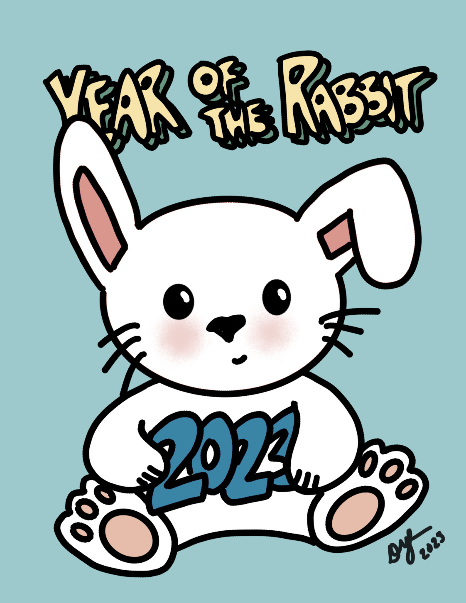
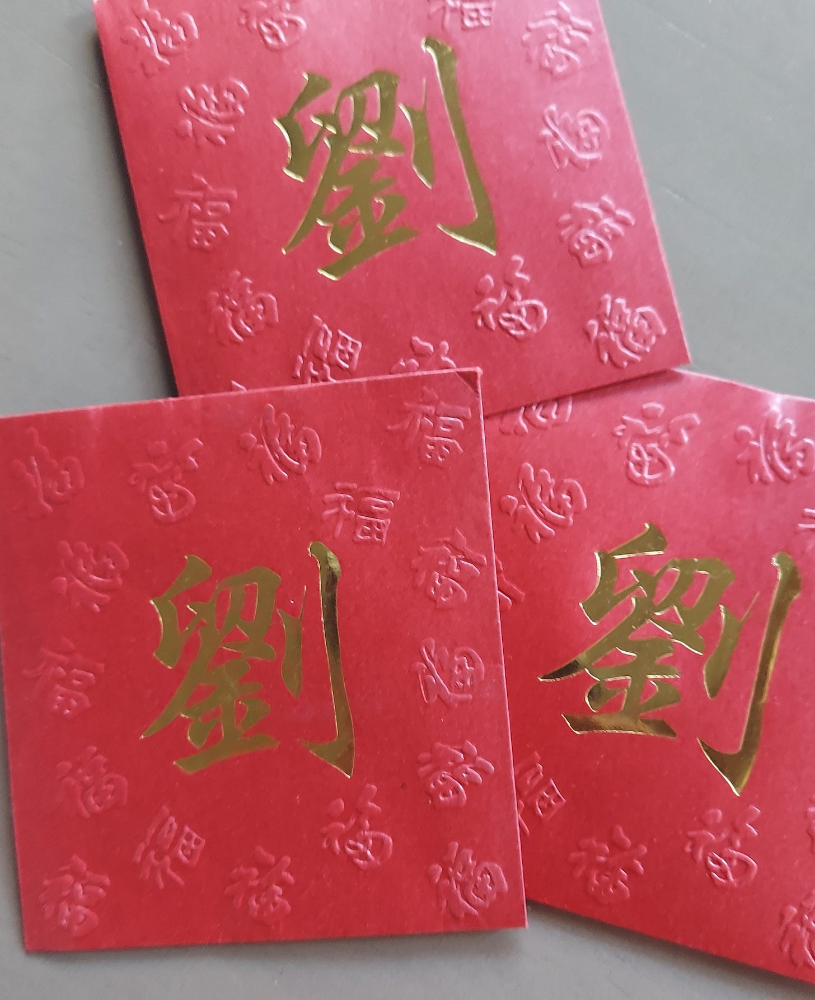

# Culture, Connection, and Keeping Traditions Alive

*How connecting with our past can help shape our future*

Celebrating the Year of the Rabbit

[Share](https://debliu.substack.com/p/culture-connection-and-keeping-traditions?utm_source=substack&utm_medium=email&utm_content=share&action=share)

[I grew up in a small town in the South, where there were very few—if any—people who looked like me](https://debliu.substack.com/p/hate-has-no-home-here). There were no Chinese grocery stores nearby, and we had very limited access to all the things that my kids take for granted today living here in California. My parents would have to drive six hours to Atlanta just to pick up food and ingredients from their homeland to make our Lunar New Year celebrations special. Through it all, they held fast to all the traditions they had grown up with because they understood the importance of staying connected to our roots. They taught us everything we needed to know about celebrating the New Year despite being a place where few did.

Even though our culture seemed very distant and alien to us while we were growing up, I now look back on these celebrations with great fondness. As was customary, we got red envelopes, had to wear all-new clothes, and could never wash our hair on New Year's. We would spend the week before the holiday cleaning the house, and we ate all the traditional foods: a [certain vegetable](https://en.wikipedia.org/wiki/Fat_choy) that looked like hair (it is strange but yummy), signifying long life; dumplings for riches; and shrimp for the sound of laughter.

lai see (or red envelopes with our last name)

In honor of the Lunar New Year, today I’ve decided to do something a little different and reflect on the power of traditions within families: how they can teach us, make us who we are, and encourage us to pass down our heritage.

### **Traditions As a Part of Life**

My parents didn’t understand the concept of Santa Claus. They knew that American kids got gifts from this character called Santa, so they did the same for us—except they would buy the presents while we were present. They would wrap them in the same wrapping paper that they used for their own gifts and then sign them in the exact same handwriting. My sister and I played along because this tradition meant extra gifts, but we knew the truth from the start.

As a result, once Caroline and I had kids of our own, we decided that we were not going to play Santa Claus with our kids because we didn’t want them to feel like we told them something untrue. Instead, we told our kids from the beginning that Santa was a concept other kids would celebrate and learn about, and that they should never reveal the secret that Santa wasn't real. We explained that he represented the spirit of Christmas, a physical manifestation of what generosity and kindness could be. I remember watching my son and his cousin Noah playing when they were four. They were talking about how Santa wasn't real, but how they could never tell their friends, or we would be really upset. I’m still relieved that we made it past the Santa phase without anyone coming to me shouting that I destroyed their children's Christmas… but I was worried for several years there.

As with many families, we have adopted our own traditions born out of our heritage, environment, and unique combination of experiences. Every Christmas, we do a family gift, as well as (usually) a family trip that we all plan together. We then do the craziest secret Santa we can come up with, where everyone gets one gift from one person, and then we have all the fun we want together.

So many of our cultural lessons are embedded in what we teach and what we carry forward. The kids' grandparents still give them red envelopes every lunar New Year, and I still take the money and put it in their bank accounts. We then make a special meal and celebrate together. It’s incredible to see the experiences our children are having through this holiday season and to reflect on how those experiences have evolved with time.

### **Carrying On Traditions**

These traditions within families are special—and extremely important. The things we pass on to our children carry years of memories, relationships, and culture with them.

[I previously published an article on food, and how recipes are a reflection of our history](https://debliu.substack.com/p/memories-through-food-how-taste-passes). I have made it a point to try to capture and document recipes from my mother-in-law. Over the years, I've asked her to write down all of my husband's favorite foods so I can learn to make them myself. I've already learned to make the most of the things my mother makes, so I'm adding this new batch of dishes to our rotation.

I hope our kids carry forward our own food-related traditions, such as Make Your Own Sushi Night or Dim Sum Lunch. We make it a point to connect over shared traditions especially learning about the culture of food. And I want to document that for them.

### **Capturing Your Traditions**

One of the reasons it's so important to me to carry these traditions forward is that, with no one to pass them on, they will eventually die out.

Recently, my kids interviewed their grandmothers for a project. They asked them about their story of coming to America and starting a new life, and how they felt leaving everything they knew behind to build something from nothing. Interestingly, both of their grandmothers were so grateful to have had the opportunity to live the lives they did here in America. [They both came to the U.S. during the ‘60s](https://debliu.substack.com/p/lessons-from-my-parents) when things were just opening up for Asian American immigrants after the long-held Chinese Exclusion Act, which kept the numbers of Asian immigrants artificially low. Today, the kids’ grandmothers are both retired and in their 80s, and I hope the traditions they brought with them will last for many years to come.

It's easy to forget or take for granted so many aspects of our heritage. They always seem to be so permanent, and yet they are so ephemeral at the same time. This is why I love working at Ancestry: it helps us capture those memories and remind ourselves of where we all came from. We, as a family, are documenting these memories together on the platform to keep them alive for the next generation.

### **On This Lunar New Year**

My dad would have turned 84 today. He was born in the Year of the Rabbit, which means this would have been his year. It’s been over ten years since we lost him.

Though we grew up practically in the middle of nowhere, our parents made it a point to connect us with our culture and our heritage, whether we liked it or not. They made sure we ate traditional foods, that we spoke the language, and that we called our family in Asia on every important occasion. International calls back then cost over a dollar a minute (at a time when gas was something like $1.00 a gallon). My dad even kept a timer to ensure we called at the top of the minute so that we could maximize the amount of time we had on the phone. Every Christmas, he would make the 16-hour drive from our house to New York so that we could celebrate with our relatives there. He and our mom saved for years and years so we could take trips back to Asia, and we spent many a happy summer in the heat of Hong Kong ensuring that we never forgot where we came from.

These memories will always be with me, because these gestures were how my dad showed his love, like every Chinese father worth his salt. He rarely said “I love you”; rather, he demonstrated it through his actions every single day. He never let us forget that we were part of a larger tapestry of history and culture. And he wanted us to pass that on to our children.

Every year around this time, we both celebrate both my father’s birthday and the lunar New Year. These dates have always been intertwined within our family, and so, on this day, I’m proud to carry on the traditions that he passed along to us. As I pass them down to my kids, I hope that one day they will pass them along to the next generation.

---

As we get caught up in the present, it can be easy to forget our history. But what we don’t realize is that our history makes us who we are. These traditions led us to where we are today, and the ones we preserve—old or new—will take us where we’re going.

This Lunar New Year, I encourage you to reflect on your history and consider what parts of it you want to capture and carry on. What traditions did your parents pass down to you?

**What memories are you making with your children that you hope they will carry on?**

[Subscribe now](https://debliu.substack.com/subscribe?)