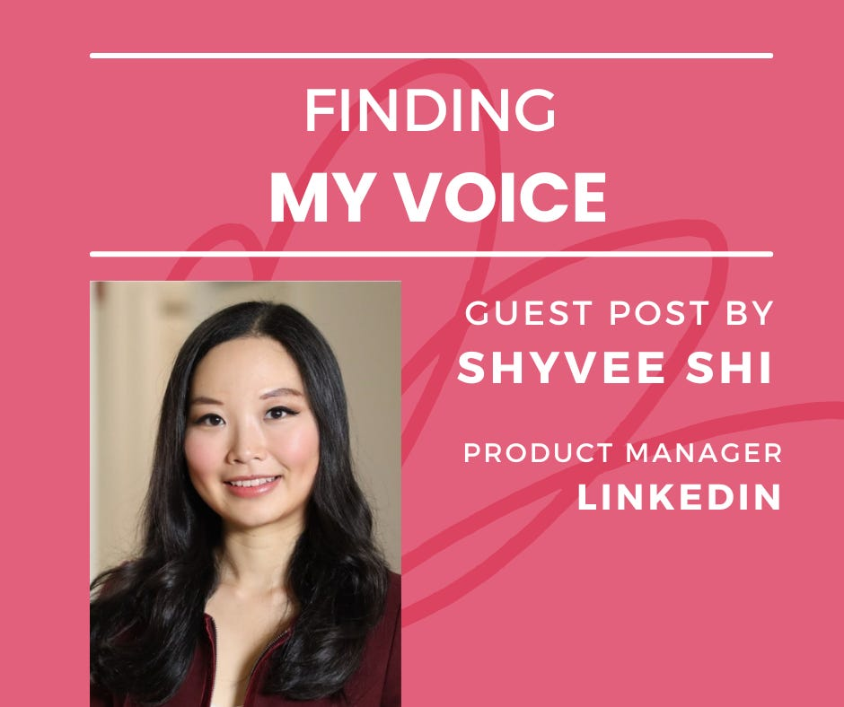
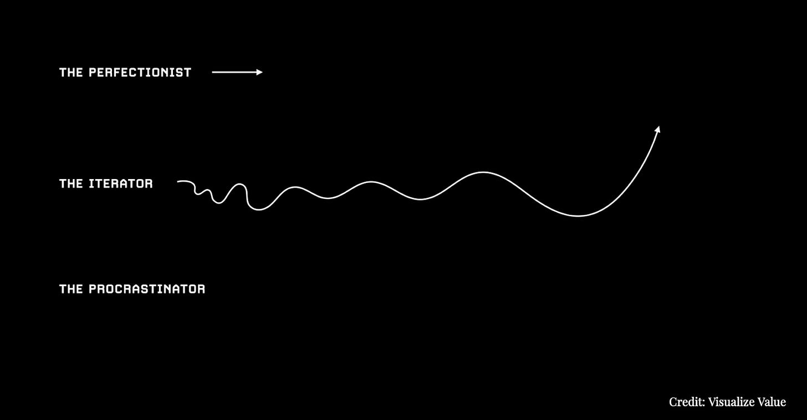
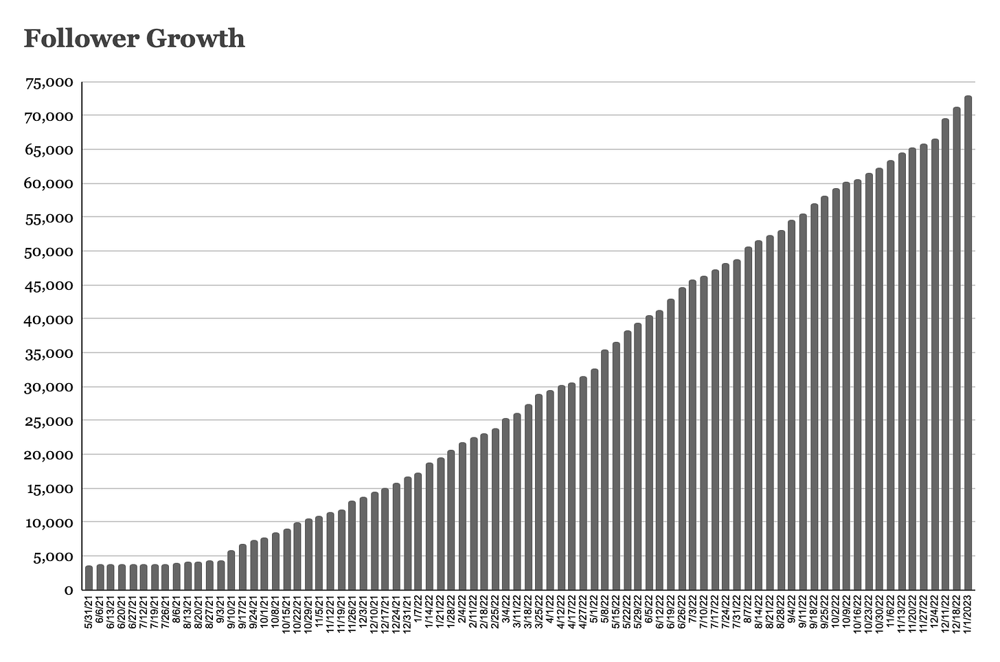

# Finding My Voice: from Newbie to 20M Views in 18 Months 

*Guest post from Shyvee on her journey*

A note from Deb: For this post, I asked Shyvee to share her journey of finding her voice. We don’t all need tens of thousands of followers, but we all have something to say. Shyvee didn’t allow her fears to hold her back, and I admire her courage and desire to iterate and learn. Her lessons aren’t just useful for becoming an influencer. For everything you do, finding your authentic voice—and a path to sharing it—is vital.

---

***[Shyvee Shi](https://www.linkedin.com/in/shyveeshi/) is a Product Manager at LinkedIn, host of the “[Product Management Learning Series](https://www.linkedin.com/newsletters/6930736280242704384/),” and a top Product influencer. In the past 18 months, she has built an engaged global following of 73K+ and her content has had over 20M views. In this guest article, Shyvee shares her journey, and the top lessons she learned while finding her passion, community, and voice.***

I was raised in a very traditional Chinese family. Both of my parents grew up in China, and I spent the majority of my childhood there. From an early age, I witnessed how hard my parents worked. They taught me to put my head down and do what needed to be done. “The nail that sticks out gets hammered down” was how they always put it, instructing me not to stand out and to be modest at all times, a value cherished in Confucian culture. For a long time, this kept me grounded. By working hard, I became the first in my family to study in the U.S. on a full scholarship during high school, attend top universities, and work at prestigious firms.

[Subscribe now](https://debliu.substack.com/subscribe?)

Unfortunately, as I entered the workforce, some of those cultural values no longer served me. I often found myself battling between my Chinese heritage and what it takes to excel in Corporate America. I learned the hard way that if I wanted to have a more purposeful and powerful career, I needed to speak up and find my voice.

# **The Motivation to Start Posting Online**

Since I started my career, I have quietly helped others, usually mentoring and supporting young women who need advice or help in their careers. Over the years, I’ve worked with hundreds of individuals in one-on-ones and small-group settings. These included Stella, my former analyst, who decided to leave Hong Kong and pursue a master’s degree at Harvard Kennedy School. She now works at the IMF, living her dream of working in international development. Another person I coached, Amy, was a mid-career pivoter and the first in her family to graduate college. She wanted to become a Product Manager, and even though she received over 100 rejections, she landed her first PM job.

These experiences touched me deeply, but I never thought about scaling my advice. I was reluctant to share it more widely or post about it on social media because it felt unnatural and self-promotional. For years, I quietly continued my work without publishing anything.

In early 2020, I transitioned into product management and learned about the concept of a “growth loop”: a feature of a business that yields compounding value rather than one-off gains. I was looking for similar force multipliers to accelerate my career and create the leverage I needed to mentor people at scale.

After many hours spent studying content creators, I forced myself to step out of my comfort zone in June of 2021. Instead of silently lurking on LinkedIn—mostly during times when I was secretly looking for a job—I took the plunge by sharing my experiences online.

# **My Content Creation Journey**

Like many, I found the thought of putting myself out there and committing to a regular writing schedule nerve-wracking. I wasn’t sure I would have the courage or discipline to do it. My inner critic, the war zone in my head, was screaming at me non-stop.

Luckily, by this point in my career, I had developed a toolkit to deal with [imposter syndrome](https://debliu.substack.com/p/overcoming-imposter-syndrome). While it is not something you can get over, it’s a moment in time that you can learn to get through. Imposter syndrome happens most intensely when you are learning something new and challenging yourself. I’ve become familiar with the negative narrative it sings in my head when I enter a new space, and I’ve learned to embrace it and keep growing.

The other mental trick I used to weaken my imposter syndrome was adopting an iterator mindset. I stopped letting the rollercoaster of worrying about what to post when to post, and how many people would like my posts to run over me. Instead, I decided to focus on experimenting and learning fast. I kept reminding myself not to be a perfectionist or a procrastinator, but an iterator. I love this image from [Visualize Value](https://twitter.com/visualizevalue), which illustrates the difference between the three:

In the summer of 2021, I started my first **30-day posting challenge**. I vowed to post one insight a day for 30 days to gauge what topics would resonate. Success for me was learning whether I could sustainably post. I focused on quick creation, and on posting topics that interested me—not on being perfect.

I wish I could say it was an overnight success, but it wasn’t. I initially did not gain a lot of traction in follower growth and engagement, but I did make three high-quality connections, and I built a habit of writing regularly. I kept going and started my second 30-day posting challenge by collaborating with a fellow Product Manager ([Melody Liu](https://www.linkedin.com/in/liumelody/) from Coursera). Together, we focused on one important topic—mastering personal productivity—and shared one tip a day. By the end of the 30-day challenge (and after publishing over 50 posts), I had my first somewhat “viral” post, with over 300K impressions. I gained 500 followers and secured four speaker engagements, as well as a proposal to create a course for LinkedIn Learning. At this point, I knew I was ready to take on bigger challenges.

On September 7, 2021, I [announced publicly](https://www.linkedin.com/posts/shyveeshi_productmanagement-jobsearch-career-activity-6841026043890012160-jVuM?utm_source=share&utm_medium=member_desktop) that I would share my own journey and learnings from my transition to product management. The announcement post helped me gain over 1.5K followers overnight (on a 4K-follower baseline), and I knew immediately that I had achieved content-audience fit (similarly to a product achieving product-market fit). I doubled down on writing good content and delivering on my promise. In six months, I had increased my followers tenfold. This is the growth loop in action.

I’m currently on my fourth iteration, expanding my topics from getting the job to leveling up as a PM, along with general career advice. I’m also experimenting with new formats (online courses, live events, and newsletters), and am actively seeking opportunities to connect and partner with thought leaders and practitioners via my [Product Management Learning Series](https://www.linkedin.com/newsletters/6930736280242704384/) and [other projects](https://app.criya.co/p/a3e47aa2-51a4-4cf6-b04b-dac0bca733fa). (Check out this [2022 year in review](https://www.linkedin.com/posts/shyveeshi_gratitude-foreverthankful-productmanagement-activity-7014624897641418752-rczb?utm_source=share&utm_medium=member_desktop) for more.)

Over the course of this content creation journey, I was surprised and delighted by the amount of interest, new connections, and opportunities I gained by taking the risk and showing up. I was also grateful that I was able to re-accelerate my career growth after making a mid-career pivot (a move that, to many, might have seemed like a step backward forgoing a promotion to people management and starting a new career as an individual contributor). Through this journey, I was able to reinvent myself, and find my passion, my community, and, most importantly, my voice.

I still face posting anxiety, struggle with what to post, and feel frustrated when I don’t see progress or traction. However, despite the ups and downs, I genuinely believe I would not be where I am today if not for taking small, consistent steps to put myself out there and activate the opportunities that came next.

# **The Top Lessons I Learned**

As I reflect on the past 1.5 years of posting on LinkedIn, here are the top five lessons this experience has taught me:

1. **Progress over perfection.** Suspend your disbelief and your desire to be perfect. Even today, I find myself hesitant to put things out in public—including this article—and I still don’t understand how the algorithm works (despite working at LinkedIn). But you don’t need to have everything figured out at the beginning. You don’t learn, then start; you start, then learn. Done is better than perfect.

2. **You don’t need to have a lot of experience to start sharing content,** **and you don’t need to become an influencer to make an impact.** I’m not a famous product influencer, but that was never my goal. I started small by sharing my personal growth journey and what I learned from transitioning to Product Management as a mid-career pivoter. This journey was near and dear to my heart, so I thought that by sharing my learnings publicly, I could inspire others.

The act of putting pen to paper helped codify my thinking and created an avenue for me to explore new ideas and perspectives. Along the way, I also forged many valuable friendships with a global community of product builders. Publishing helped bring attention to my work, on LinkedIn and beyond, and helped me establish myself as an expert in the field. More people started to recognize my work and ask me for advice. As a result, I found myself becoming a better PM and leader by actively learning and practicing what I preached. This became a positive feedback loop in my life and career.

3. **Consistency is the key to playing the long game.** At the beginning, like many of you, I was worried about how to differentiate myself with so many people already posting similar content online. This need to push for differentiation tends to create a mental block that keeps you from starting. I’m grateful for the sage advice I got from fellow PM creator [Diego Granados](https://www.linkedin.com/in/ACoAAATmticBr1_T0SqRa0ZaaQTmiKzoI2J4wP8): “In the long term, it’s less about publishing differentiated content. It’s about showing up consistently.”

4. **Leverage the power of mimicry and experimentation.** Similarly to how Product Managers often study their competitive market and similar products,I frequently study other popular creators’ content and seek inspiration from them. Great artists are inspired by others’ work, build on it, and give credit back.

I like to treat every post as an opportunity to learn and experiment. Timing? L length? The first opening hook? Format? Topic? Visuals? These are all elements for testing and iterating.

5. **Embrace an identity-based success metric.** We often get fanatic about follower growth, and the reactions and comments we get for each post. However, I really appreciate this wise advice I got from fellow creator [Daliana Liu](https://www.linkedin.com/in/ACoAAAdgUjgBHVMQZ6CRnI5ieEomnHTAE8BYJqY): “It’s not always about the follower count. Think about what kind of creator you want to become.”

When I feel lost or anxious about posting online, I also like to remind myself of this quote from Benjamin Franklin: “What I am to be, I am now becoming.” In those moments of doubt, I always return to the impact I can create by sharing my work with others.

Thank you for allowing me to share my journey and learnings with you. My hope for your 2023 is that you will make space in your life for something you want to foster and create.

Big accomplishments take time. Just over 18 months ago, I could not have imagined how much I would achieve on this journey, but I took the first step and did a little bit every day. Set a goal for the things you love, and make a point to pursue them in 2023. The best time to plant a tree was 20 years ago; the second-best time is today. So start now.

I look forward to seeing what you will accomplish in the new year!

[Share Perspectives](https://debliu.substack.com/?utm_source=substack&utm_medium=email&utm_content=share&action=share)