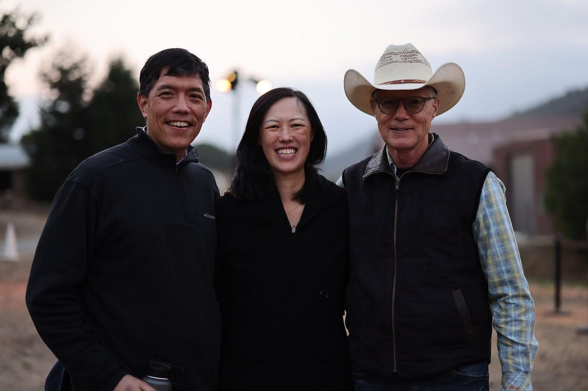
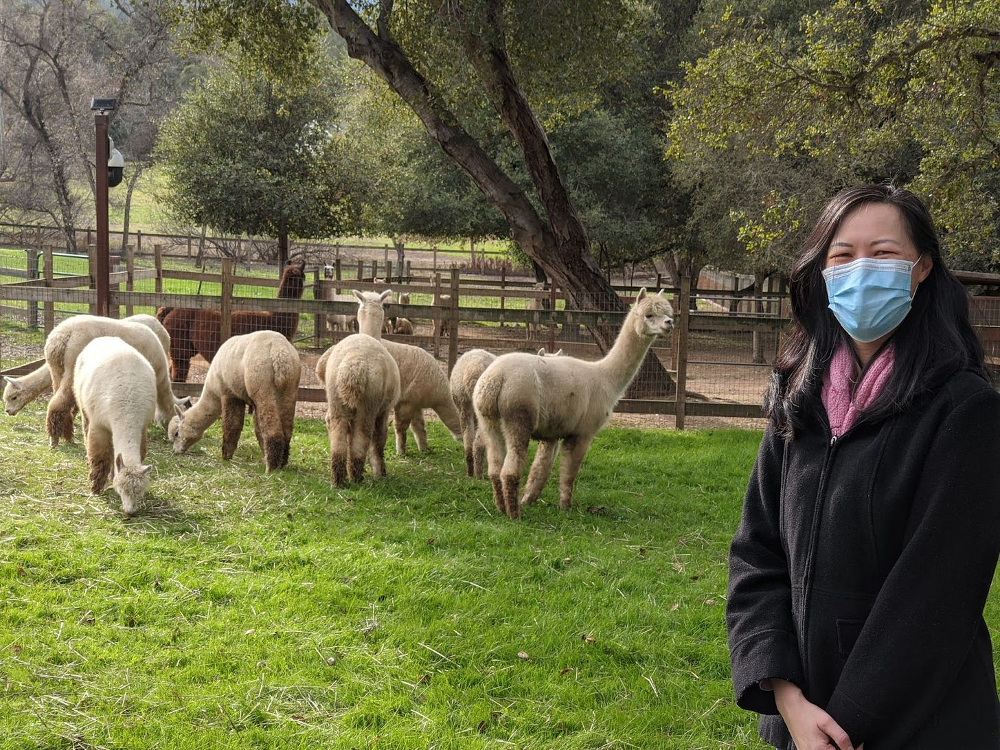

# How Mentors Can Change Your Trajectory

*Finding the support your need from someone who cares *

The other day, I was selling something on Facebook Marketplace when someone reached out about coming by to pick it up. We got to talking, and I realized he had started working at Facebook (I mean, Meta) around the same time I had left. He asked me for some career advice as an IC5 ML engineer, and I told him he needed to focus on amplifying his work—and finding a mentor. We talked about it more, and later that day, I connected him with a Director of Engineering in his space to help him navigate the path to IC6. He later joked that he came by to get some headphones, but he left with much more. While I could not help him, a great mentor could.

Mentorship can change your life. No matter your role or company, finding the right mentor can be truly invaluable to your career. So, in honor of January 17, which is International Mentor Day, I want to share some advice, tips, and other things to think about as you are looking for a mentor.

David and I visit Scott; photo taken by *[Yi Ng](https://www.linkedin.com/in/yister/)*

### **Mentors, our guides**

The word “mentor” originates in Homer’s ***The Odyssey***. In the story, there is a character named Mentor, who Odysseus puts in place to guide his wife, Penelope, and his son, Telemachus during the two decades he spent at the Trojan War and on his subsequent journey home. Unfortunately, the man he put in charge was weak, so Athena took the form of Mentor and supported Telemachus in seeking out his father and returning with him to secure the kingdom ([ref](https://www.growthmentor.com/blog/origin-of-word-mentor/)). Though Odysseus placed the trust in the wrong person at the start, the mentor we all aspire to is Athena who gives wise counsel and support.

[Subscribe now](https://debliu.substack.com/subscribe?)

At work, a mentor is someone who serves as a guide, gives advice, and changes your trajectory for the better. That said, mentors often don’t have as much “skin in the game”, but that is what gives them more objectivity and insight. They help you see your problems from a new vantage point and identify new paths forward without the pull of protecting their reputation or status.

The key to finding the right mentor is to look at your current circumstances and reflect on what it is that you need to do to get to where you want to be. Unlike [a sponsor, who's there to open doors](https://debliu.substack.com/p/how-to-find-a-sponsor), a mentor is there to give you insight. Their role is to open your eyes to your blind spots and to help you make decisions on your own.

I’ve written a lot [about sponsors](https://debliu.substack.com/p/how-to-find-a-sponsor), but I’ve talked less about mentors. We really underestimate their value in our society. I have had such incredible mentors over the years—Scott Cook, for example. I joined his Intuit board back in 2017, but I know that even now if I need advice, I can give him a call at any moment. I took him up on this during the Covid pandemic. He was the last person I had a meal with before the shutdowns, back when I was exploring a public company CEO position and seeking his advice. A year later, another opportunity came up, and once again, I called him at the height of the lockdown. He graciously invited me to his beautiful home, and we walked the grounds together as he shared his wisdom. (I even got a chance to meet his llamas).

Photo courtesy of Scott Cook and his friendly llamas

I have had many such mentors throughout my life, and I have never forgotten them. A mentor can be your peer, your manager, or someone further away in the organization. Many people seek out mentors who are at least one or two levels above you to get perspective from someone who has advanced more in their career. No matter who they are, however, a mentor is someone who looks at the world differently than you, and who is willing to give you a fresh perspective on your situation.

### **Finding the right fit**

Mentorship is important because it shows you the potential for who you can become. A mentor is often in a position that you already aspire to, and you're seeking the opportunity to see how their journey can reflect your own.

Needless to say, one of the most frequent questions I have been asked is, “How can I find a mentor?” This is often a difficult task. I often think of the book *[Are You My Mother?](https://amzn.to/3CR4nXi)* about a duckling who goes up to different animals asking them to be its mother, as the way most people find mentors. I find that this method is largely ineffective. I myself have mentored many people assigned through various programs, but in my experience, the best mentors are the ones who have something—or someone—in common with their mentees or seek each other out for a purpose.

From the book Are You My Mother

For example, take the engineer from the beginning of this article, who aspired to make it to IC6. I knew I would not make a great mentor for him personally, because I don't actually know what it takes to be an excellent machine learning engineer at Meta. What he needed was someone who had actually been on the front lines, and who understood the process in detail. The same goes for you. The best way to find a good fit is to ask for a recommendation from someone who knows you and/or the space you are trying to find a mentor in. That connection will open the door to better mentors for your situation.

About six months ago, a former PM who was on my team reached out to me looking for mentorship. He had seen a number of people depart who had been his mentor, and he felt a bit unmoored without support. I said, “I think I know the perfect person who can help you.” I reached out to a friend, who was a Vice-President of a different function within the same organization, and someone I had worked closely with. I asked them if they would be willing to mentor the PM, and he graciously said, “Yes”. Recently, the PM shared how much the relationship meant to him, and how important it was that someone took the time to give him the coaching and insight that I no longer could.

Often, mentorship requires somebody more senior, who has the experience that can be echoed in yours, and who really cares about your success. Someone outside your organization is also a possibility, but only if that person understands the challenges you’re going through. Otherwise, someone within your sphere is best.

### **Connecting with a mentor**

If you’re still not sure how to find someone to mentor you, here are a few ways to get started on your search:

1. **Sign up for a mentoring circle.** Peer mentors can give you a level of visibility that you wouldn’t get from others. These mentors tend to talk about similar issues in their organizations, so they can be a useful sounding board if you need advice. They also hold out a clear mirror to you as you work through your blind spots.

2. **Sign up for a formal mentoring program.** Many organizations offer formal mentoring programs, often through ERGs or other groups, that will pair you with a more experienced colleague. While these relationships may not develop as organically as other mentorships, they can still be an important stepping stone to growth. See if your company provides mentoring opportunities.

3. **Ask your manager who might be a good fit for you.** Your manager may not be able to mentor you themselves, but they likely know you well enough to know what you need in a mentor. The great thing about this is that it can actually give you access to people who would never have otherwise been on your radar. This can unlock brand-new insights and ways of looking at your work, opening up opportunities that you can’t even imagine.

4. **Find somebody whom you admire and ask them.** A lot of people don't take cold calls, but a few do. Start by building a relationship with them, and then ask if they would be willing to support you as a mentor. Many of my own mentors are people I long admired and who I seek regular advice from organically, and our relationship evolved over time.

### **The power of being a great mentee**

I’ve written a lot so far about what it means to seek out a mentor, but I’ve written less about what it means to be a mentee. Something important that people tend to forget is that this is a two-way relationship. That means it’s your responsibility to be deserving of a mentor. If you don’t make the most of the relationship, then you aren’t giving your mentor a reason to help you.

A good mentee is somebody who shows up prepared to have the conversation. They're also somebody who engages, listens, takes notes, and follows up. I have mentored many people over the years, and the most gratifying mentoring relationships I have ever had are the ones where people come back and say, “My life changed because of something you said.” This is an incredibly powerful motivator for me—one that often causes me to go from a mentor to a sponsor.

Another important aspect of being a great mentee is remembering to show your gratitude. That means expressing your appreciation and reaching out to acknowledge your mentors when you hit new milestones because of their advice. This not only shows them that their advice is valuable, but it encourages them to continue that relationship and help you reach even greater heights.

### **The power of being a great mentor**

Lastly, one of the best things you can do as a mentee is to pay it forward. I continue to mentor people because I myself had such incredible mentors in my career: people who taught me the ropes and opened my eyes to new opportunities. All of this was so impactful, and I make it a point to pay it forward wherever possible. Consider making mentoring someone else part of your life, whether that means taking on a summer intern or supporting someone who's new to your organization. There’s nothing like being able to shape someone’s journey the same way your journey has been shaped by others.

People don’t often think about the benefits of mentoring, but it’s actually one of the most useful learning experiences you can have in the workplace. Becoming a great mentor enables you to become a better mentee because it allows you to see what it’s like when the shoe is on the other foot. You start to notice all the gaps that you yourself have as a mentee and pick up on some of the challenges that you yourself have missed.

---

Mentorship is one of the most fulfilling relationships you can develop in your career, whether as a mentor or a mentee. Not only does it open doors, but it provides learning and growth opportunities for both parties and allows them to mutually benefit.

Now that you've moved further in your career, I encourage you to take on this challenge: consider how to find a mentor this year, make a commitment, and really focus on that engagement. The power to form this relationship is in your hands; all you have to do is ask.

**Happy International Mentoring Day!**

[Share](https://debliu.substack.com/p/how-mentors-can-change-your-trajectory?utm_source=substack&utm_medium=email&utm_content=share&action=share)