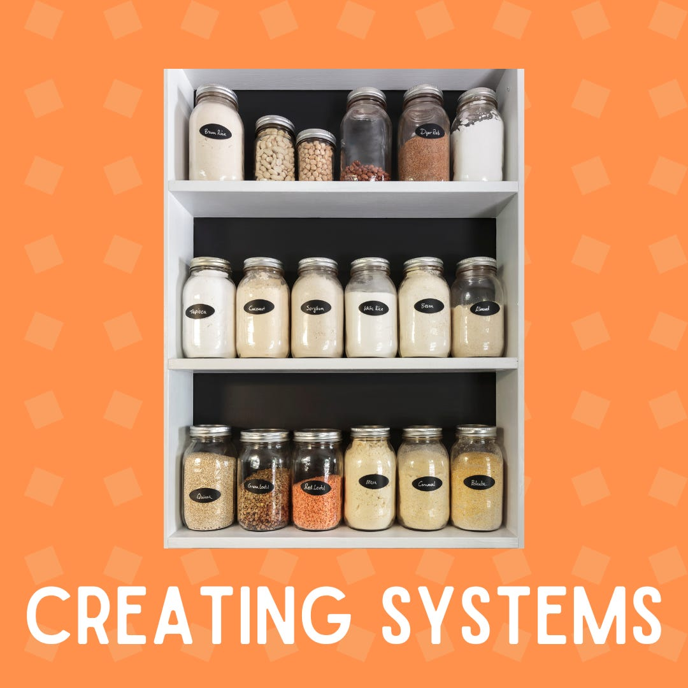
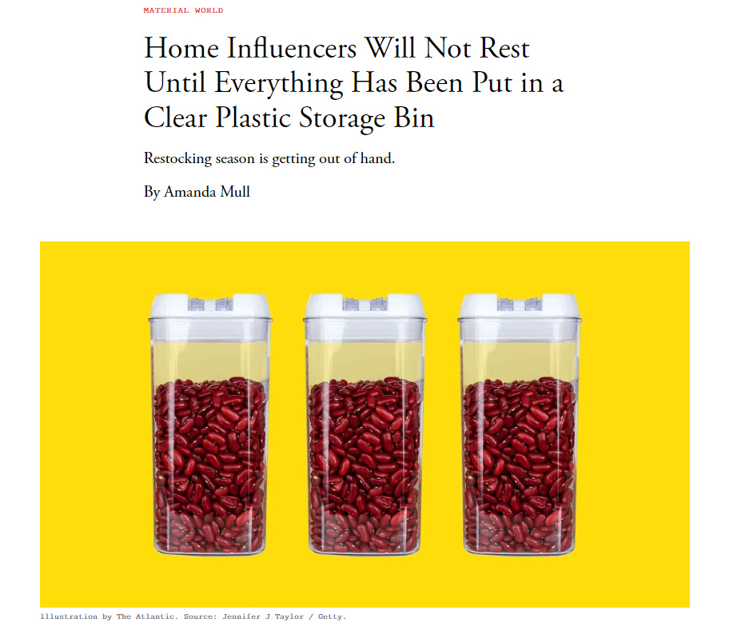

# Creating Systems to Scale and Simplify

*How systems can bring structure to chaos*

I am often asked how I’m able to work full time, raise three kids, and publish a newsletter, all without getting burnt out. My secret? Systems.

There’s a common saying that you make space in your life for the things you care about. My way of making space is by setting up processes, which allow me to turn one-off things into sustainable routines.

For years, my pantry was a mess. I had no idea what was in there, and we would constantly end up buying things that we already had because we couldn’t find anything. We ended up getting pantry moths, so I had to put everything into sealed bins to stop the infestation. For the holidays, I bought 30 containers and started organizing something I had been ignoring for years.

As it turned out, I had more than 20 cans of coconut milk, 24 cans of corn, and 15 packs of the same Banh Hoi Vietnamese noodles. I calculated that we had roughly enough food to survive several years in any zombie apocalypse. I ended up giving away several large crates of food to the local food pantry, and anything open got distributed to my local Buy Nothing group.

[Atlantic article](https://www.theatlantic.com/technology/archive/2024/01/restocking-videos-tiktok-plastic-storage-bins/677041/)

As painful as that process was, I now know exactly how much I have of everything. That means no more random purchases of things we don’t need, no more rummaging, and no more wasting time trying to figure out if I even have the thing I’m looking for. That’s just one small example of the beauty of systems. Now think of what else you could use them for.

[Subscribe now](https://debliu.substack.com/subscribe?)

## **Systems at work**

When I used to work at Meta, we would send out and post something we called HPMs: Highlights, Progress, Me. They were a chance for you to talk about what your team was doing. I found them to be a huge pain to compile, so I was a holdout for years. I knew I was giving up an opportunity to influence, get support, and show progress for the team, but I didn’t love having to do hours and hours of work just to get one email out. I knew I had to find a way to make it sustainable. Eventually, our TPM pointed out that I didn’t have to do it all alone, and instead created a crowd-sourced version that allowed every PM and Engineering Manager to add one or two bullets a week. I then had our head of Analytics create an easy way to summarize our metrics, so I wasn’t always hunting from dashboard to dashboard. My only job was to do a sweep at the end and send it out.

Most weeks, there was little to no reaction, but other weeks, peers across the company responded by offering help or asking questions about how we could partner up. By creating a sustainable system, we changed something that was a chore into something that had a huge return. ([Kevin Lee has a great template for this that you can use if you're interested.](https://kevinleeme.notion.site/Weekly-HPM-Highlights-Progress-Me-Template-Public-a2ae684c12c04f3ab1faa7d862e9e114))

## **Systems at home**

My holiday activity was dealing with pantry moths, which had come in with one of our bags of flour. By the time I committed to tackling the issue, it was getting completely out of control. This meant having to take out everything that was in a paper bag and put it into a plastic sealable bin to reduce the risk of losing it.

Although this task was necessitated by the fact that we had pantry moths, once I got started, I couldn't stop. I realized that I had been spending a lot of time just looking for things—not just during this project, but beforehand as well. Whenever I couldn't find something, I would mention it to my husband, and he would buy another one. This is how you end up with excessive amounts of some things while running out of others. Now I have a bin that fits exactly six cans of each item that I need and use regularly. Whenever it gets down to three cans, I know it’s time to replenish our stock.

Done well, systems can streamline your daily life and eliminate inconveniences you didn’t even know were there. As another example, I recently went through all of my clothing, setting a rule to donate everything I hadn’t worn for the last six months and didn't think I would wear for another six months. Part of me found it very hard to part with things that I loved. There were a couple of shirts that had a lot of sentimental value, but I just couldn’t see myself wearing them again. So I grabbed them and put them in the donation bin and never looked back. And suddenly, I had all this space.

If you’ve read my earlier posts, you may remember that [I’ve recently been working on clearing out my in-laws’ house](https://debliu.substack.com/p/ignorance-is-bliss-until-it-comes), which is part of what’s been driving all this. Since the beginning of this process, I’ve found dozens of pairs of socks, at least six packs of undershirts that have never been opened, and more than a lifetime’s supply of tissues. Each of these items had been bought in the hope of being used, but they ended up having to be discarded or donated. I wound up donating around four carloads of items and giving away about 200 others on the local Buy Nothing Facebook group.

During this process, I’ve learned a valuable lesson: if you let something get out of control, it’s much harder to get it back into place than if you had just stayed on top of it from the beginning. Now I'm creating systems and paring things back to avoid these headaches in the future.

[Share](https://debliu.substack.com/p/creating-systems-to-scale-and-simplify?utm_source=substack&utm_medium=email&utm_content=share&action=share)

## **Systems in relationships**

Have you ever noticed that we have regular 1:1s with people we work with, but we rarely have the same discipline to connect with those we love? These are arguably the most important relationships in our lives, so why not use systems to nurture and maintain them?

Every night, come rain or shine, I grudgingly walk the dog with Bethany, my older daughter. No matter how I’m feeling or whether I want to walk, this gives me 20 minutes to talk to her, uninterrupted. It’s during these walks that she shares her latest thoughts, silliest questions, and deepest anxieties. It is a system to understand her. I’ve told her that someday, she will remember these moments.

So what’s the secret to implementing a system that will allow you to prioritize what’s most important? I’ll admit, I’m still figuring this out, but over the past few months, I’ve identified a few key strategies:

* **Change the ROI.** The value of doing an HPM at Facebook was always high, but so was the investment required, and that made it hard to be sustainable. If you’re having trouble tackling something, try focusing less on the reward, and more on [lowering the friction involved in making it happen](https://debliu.substack.com/p/reducing-friction-in-your-life). Turning something really hard into something easy or automated takes away a lot of the investment needed. As a result, it also increases the ROI.
* **Create a clear path.** Every obstacle you run into is another reason not to do something, so focus on removing as many as you can. Make it so that it’s easier to do the thing than to not do it. For example, I reorganized my drawers a few years ago by rolling up my shirts instead of stacking them. This made it easier to see them and pick out clothes. I have maintained this system for many years, and it’s saved me so much time and energy in the morning.
* **Invest, then maintain.** When it comes to creating systems, the first step is always the hardest. When I dug up all those old T-shirts that I loved from my previous companies and put them out of service, it was really hard. But once they were out of my mind, I had more space for the things I did care about. Remember the value of getting started, and you’ll find that the rest is easier in comparison.

As with anything, creating systems can take time, and there will be some trial and error. But these techniques may offer you an easier path to getting things done.

---

I write this article knowing that I still have a lot to do when it comes to streamlining my life and my work. But even the small changes I’ve made so far are adding up to a big difference. The beauty of systems thinking is that it changes the way you do things. With the right systems in place, that process becomes much less daunting—in your work, your relationships, and your life.

What systems have you put in place to make your life easier? How are they working so far, and what have you learned in the process? I would love to hear your thoughts!

[Leave a comment](https://debliu.substack.com/p/creating-systems-to-scale-and-simplify/comments)