# Ten More Charts I Can’t Stop Thinking About

*More visualizations that illuminate the world *

One of my most popular posts of 2023 was one I wrote on a whim. It was called “[Ten Charts I Can’t Stop Thinking About](https://debliu.substack.com/p/ten-charts-i-cant-stop-thinking-about).” I still come back and revisit this topic from time to time, and since then, others have pointed me to other interesting charts and graphics. For this reason, I wanted to open 2024 with another compilation of the ones that have stuck with me. Most of these came to my attention as I was browsing or were recommended to me by others. They cover a variety of subjects that I find interesting. While they may seem like somewhat of a motley crew, each has resonated enough for me to save them and share them with others.

So, without further adieu, here are the latest 10 charts I want to share with you all.

[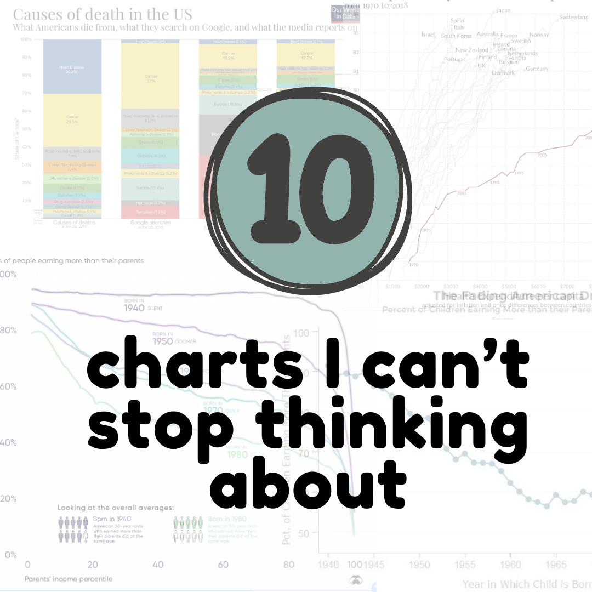](https://substackcdn.com/image/fetch/$s_!8r89!,f_auto,q_auto:good,fl_progressive:steep/https%3A%2F%2Fsubstack-post-media.s3.amazonaws.com%2Fpublic%2Fimages%2F5895108f-0004-4f63-ac69-2c53f94d07b6_1080x1080.png)

### **1. The climate spiral illustrates the rise in global temperatures over the last century**

###### Source: <https://climate.nasa.gov/climate_resources/300/video-climate-spiral-1880-2022/>

When I first saw this chart, I was fascinated by how well it drives home the impact of global warming over time. It takes the data on the earth’s global average temperature and maps it in multiple dimensions. Using the temperature throughout the year, and then in successive years, it illustrates long-term temperature trends that we might not see otherwise.

Weather is a daily occurrence, even though those of us who have lived in the same place for decades get a sense that things have changed. Human nature is to feel what's happening now most acutely, but we tend not to have as clear a sense of things that go backward or forward in time. This chart clearly shows both that the world has been getting warmer since 1880 and that the warming is accelerating, causing the fanout funnel at the top.

[Subscribe now](https://debliu.substack.com/subscribe?)

### **2. A supply-demand mismatch: There are substantially more vacant homes than homeless people**

[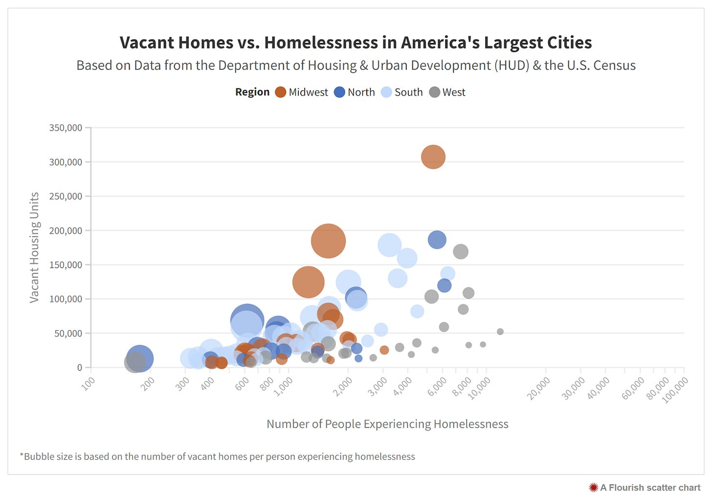](https://substackcdn.com/image/fetch/$s_!2dzm!,f_auto,q_auto:good,fl_progressive:steep/https%3A%2F%2Fsubstack-post-media.s3.amazonaws.com%2Fpublic%2Fimages%2F5a58c573-4d75-4340-9b74-685ab8910abb_1600x1120.png)

Source: <https://unitedwaynca.org/blog/vacant-homes-vs-homelessness-by-city/>

I love exploring San Francisco, and each time I am there, I enjoy walking around the city to meet up with friends. But ever since Covid, the homeless situation has become acute. It is a tragedy that so many people have no place to call home, so when I saw this chart, it was really surprising. As you can see from the graphic, there are many more open homes than there are homeless people. So where’s the disconnect? [Here’s a great Substack article explaining the issue.](https://someunpleasant.substack.com/p/three-factoids-that-arent-quite-right) Turns out that over six million homes are either abandoned or in places where homeless people don’t live ([ref](https://www.lincolninst.edu/news/lincoln-house-blog/vacant-properties-plague-struggling-us-cities-according-new-report)). There are also a large number of second homes in vacation spots that are only used sporadically, contributing to the crisis.

This hit home for me because of the situation I am dealing with right now. Both of my in-laws passed away last year. We had offered them our old house (which we loved and maybe want to move back to someday) so they could come live closer to their grandchildren. Since their passing, the house has been empty for months as we’ve gone through their personal effects. Between work, our kids’ schedules, and everything else on our plates, it has been an agonizing process to juggle. But the fact remains that although it’s a statistic among many, it’s still taking one more home out of the housing stock.

### **3. The cost of things is lower, but the cost of services has skyrocketed**

[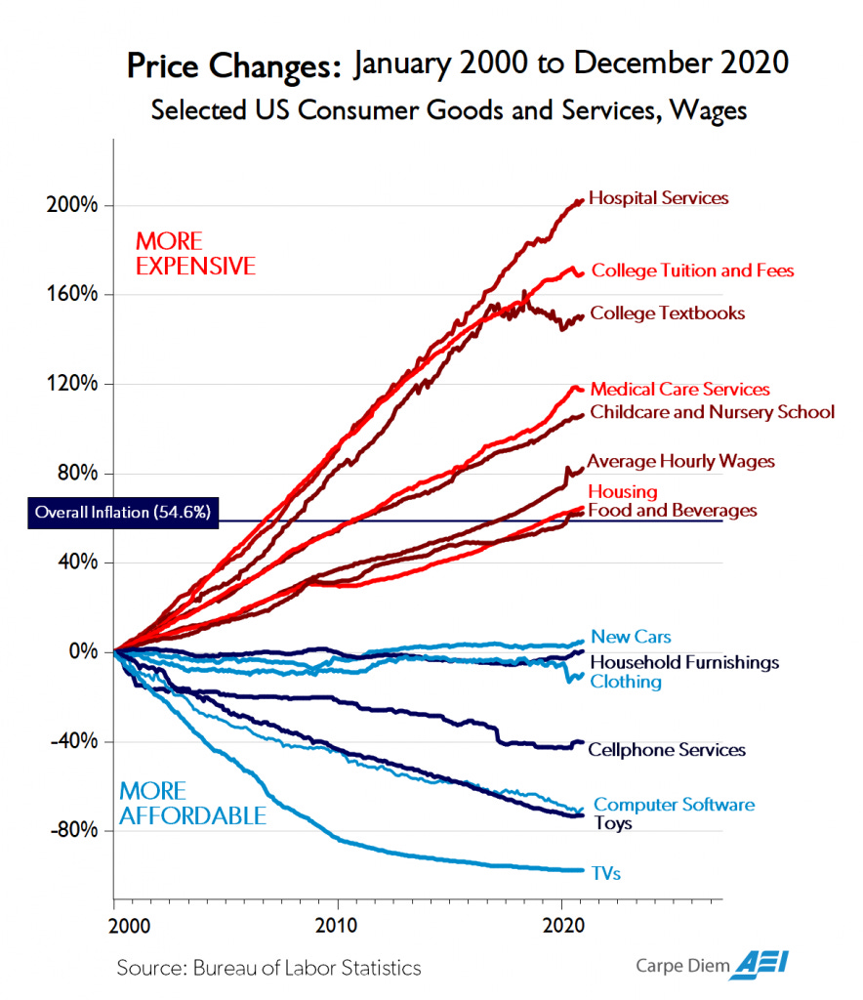](https://substackcdn.com/image/fetch/$s_!eRZM!,f_auto,q_auto:good,fl_progressive:steep/https%3A%2F%2Fsubstack-post-media.s3.amazonaws.com%2Fpublic%2Fimages%2Fa750bbcd-a264-4b47-b1d3-b590196b0e04_884x1024.png)

As a society, we seem to be very good at lowering the cost of physical things that can be made and shipped. I remember my parents having to save up to buy a TV, but now a flatscreen is accessible to nearly everyone. However, services are outpacing inflation.

The outsourcing boom of the past 30 years has allowed us to import inexpensive goods from all over the world, but we still pay full price for local services that can’t be outsourced. I often noodle on this chart and wonder what it will look like over the next two decades if we redraw it. Given where they are now, can prices continue to increase at this pace, or does something have to change?

### **4. Firearm ownership is greater than 1:1 in the U.S.**

[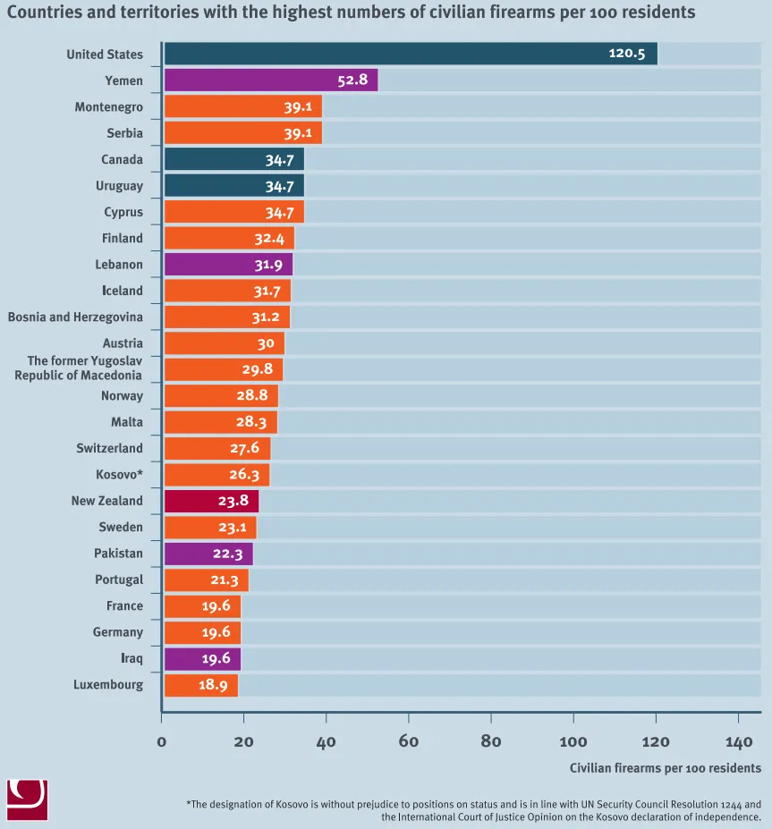](https://substackcdn.com/image/fetch/$s_!qzt0!,f_auto,q_auto:good,fl_progressive:steep/https%3A%2F%2Fsubstack-post-media.s3.amazonaws.com%2Fpublic%2Fimages%2Ff1a1d87e-b483-48e8-9ef8-895a4fe88538_863x927.png)

Source: <https://www.vox.com/2018/6/21/17488024/gun-ownership-violence-shootings-us>

My Dad taught my sister and me to shoot at a young age. We lived in a small town, and it was a part of life there. We didn’t use guns for hunting so much as we did to scare the squirrels and raccoons that took up residence in and around our home.

When I saw this chart recently, I was surprised. We have more guns in America than people. According to the Pew Research Center, 40 percent of people live in a household with a gun, and 32 percent say they own guns ([ref](https://www.pewresearch.org/short-reads/2023/09/13/key-facts-about-americans-and-guns/#:~:text=About%20four%2Din%2Dten%20U.S.,asked%20this%20question%20in%202021.)). Gun ownership is highly concentrated.

School shootings get a lot of media attention (and as a parent, I pay a lot of attention to them). Since 1970, 680 lives have been taken during these incidents ([ref](https://www.campussafetymagazine.com/safety/k-12-school-shooting-statistics-everyone-should-know/)). In 2021, there were nearly 21,000 murders and 26,000 suicides, but only 700 deaths in mass shootings, including school shootings.

[Share](https://debliu.substack.com/p/ten-more-charts-i-cant-stop-thinking?utm_source=substack&utm_medium=email&utm_content=share&action=share)

### **5. America spends more on healthcare but has a lower life expectancy than most developed countries**

[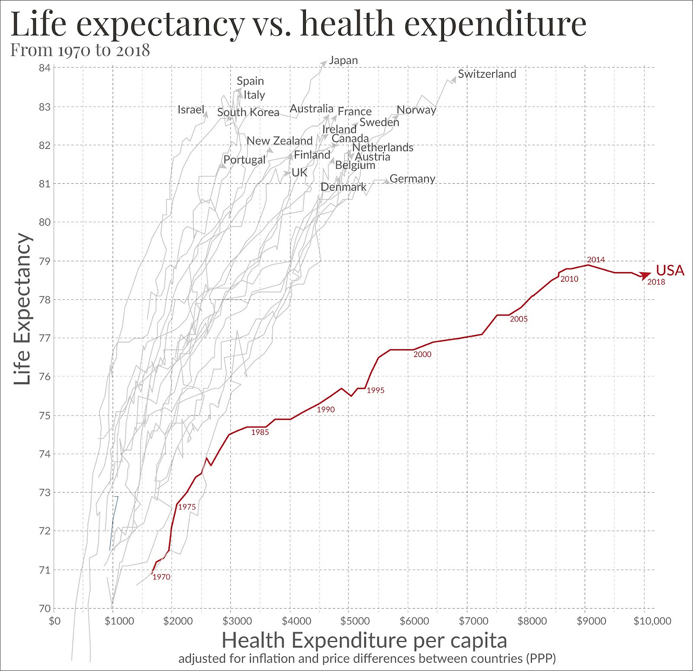](https://substackcdn.com/image/fetch/$s_!3VTB!,f_auto,q_auto:good,fl_progressive:steep/https%3A%2F%2Fsubstack-post-media.s3.amazonaws.com%2Fpublic%2Fimages%2Faad9cd97-b454-4362-a1d1-35e74a07728d_1600x1549.jpeg)

Source: <https://en.m.wikipedia.org/wiki/List_of_countries_by_total_health_expenditure_per_capita>

[In a previous LinkedIn post](https://www.linkedin.com/posts/deborahliu_while-eating-a-burrito-one-night-at-speech-activity-6998047994776338432-KjKe/?originalSubdomain=es), I wrote about the $17,000 emergency room bill I received when my son got a radish stuck in his esophagus. This chart illustrates what the money in that system buys us. It shows that over time, we have diverged from other wealthy countries in one very specific way: We are paying more per person for worse health outcomes in the form of shorter lives.

Healthcare in America is complex, with lots of players in the current system. It is hard to reimagine something new without some sort of catalyst.

[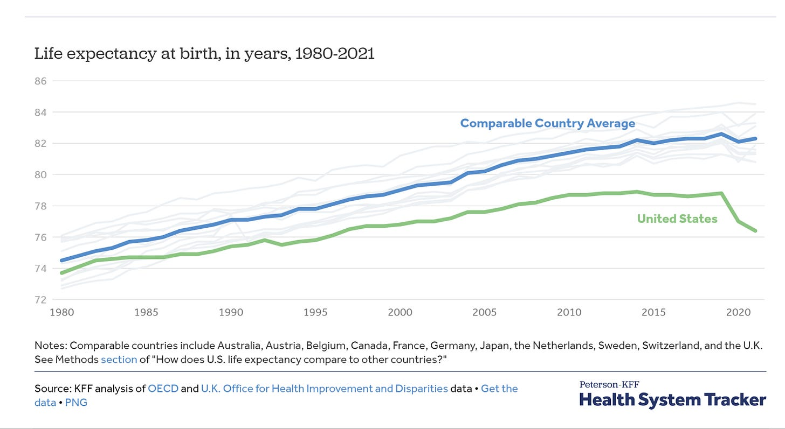](https://substackcdn.com/image/fetch/$s_!qfZ1!,f_auto,q_auto:good,fl_progressive:steep/https%3A%2F%2Fsubstack-post-media.s3.amazonaws.com%2Fpublic%2Fimages%2F2e7719c6-2f6e-420e-ba0d-b96d9355ae1f_1600x876.png)

Source: <https://www.healthsystemtracker.org/chart-collection/u-s-life-expectancy-compare-countries/>

This corollary chart shows that we are seeing real declines in life expectancy. Even before Covid, U.S. life expectancy was flattening out while the life expectancy in other comparable countries was going up. We are now seeing even more steep declines. Food for thought.

### **6. More than half of young people live with their parents**

[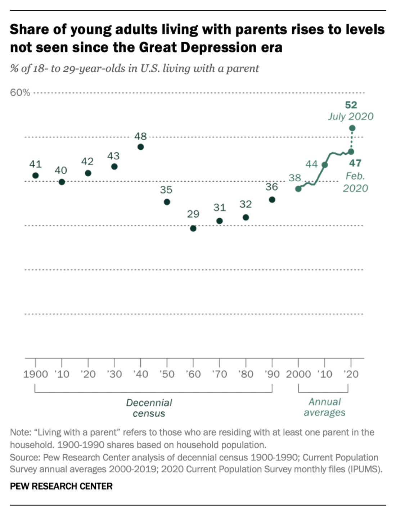](https://substackcdn.com/image/fetch/$s_!x9a9!,f_auto,q_auto:good,fl_progressive:steep/https%3A%2F%2Fsubstack-post-media.s3.amazonaws.com%2Fpublic%2Fimages%2Fd52b0b47-1ced-42bd-8482-d276c3fc7576_1100x1426.png)

I left home for college at 18 and never lived with my parents again. It wasn’t because I didn’t want to, but because they lived in a small town where it was really hard to find work. I ended up moving to Atlanta, two hours away from their home in a town outside of Augusta. In the Asian culture, most people live at home and only leave to set up their own household when they marry.

Nearly half of young people between 18 and 29 live at home today. This shift to multigenerational households is changing a lot about how we live as a community. Many of my friends with post-college-aged kids are seeing them return home now. When I was graduating from college in the 1990s, that was nearly unthinkable. It’s been interesting to see this shift, and it makes me wonder if things will revert when housing prices moderate. Could this be the start of a cultural change?

### **7. Americans are losing confidence in higher education**

[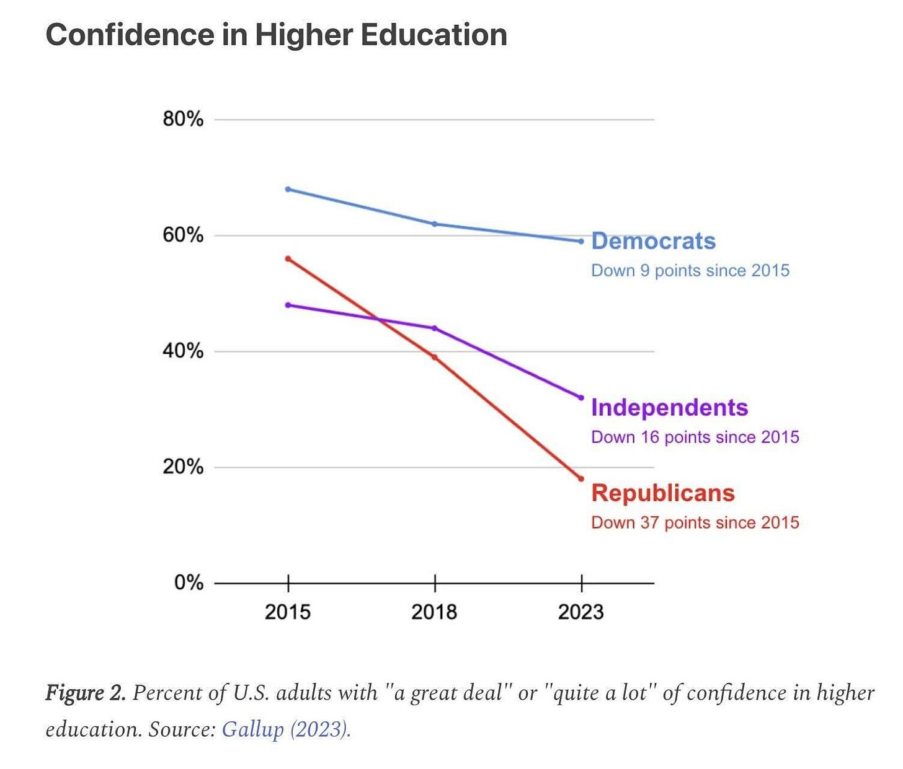](https://substackcdn.com/image/fetch/$s_!hzyO!,f_auto,q_auto:good,fl_progressive:steep/https%3A%2F%2Fsubstack-post-media.s3.amazonaws.com%2Fpublic%2Fimages%2F1a6daaea-e7fe-4ec2-ae19-23c53576235f_1502x1280.png)

Source: <https://www.threads.net/@profgalloway/post/C0j0cflAU2X>

[As I mentioned in my New Year’s post](https://www.linkedin.com/feed/update/urn:li:activity:7150543274053668864/), my son just got into college after working toward it for many years. I am proud of him for putting in the work and knowing what he wants, even if his dream is not the same dream that I had for him. (Full disclosure: I wish he’d wanted to go to a school closer to home, or to one of our alma maters.)

I saw this chart recently when it was shared by Professor Galloway on Threads, and I found it fascinating. It used to be that the return on a college education was a given. That equation has changed as the cost of college has grown three times as fast as inflation (see Chart #3 above). The demands of college have grown as parents and students look for additional amenities (e.g. a lazy river) and colleges feel the need to deliver. I went to a college where we didn’t have air conditioning in the sweltering North Carolina heat (my parents saw the price difference and we opted for no AC), but I heard recently that Duke has added air conditioning to every dorm.

Every investment requires a cost-benefit analysis, including college. And the further out of reach those costs are, the fewer people will believe the value is there long term.

### **8. Causes of death are vastly divergent from what gets interest and attention in the media**

[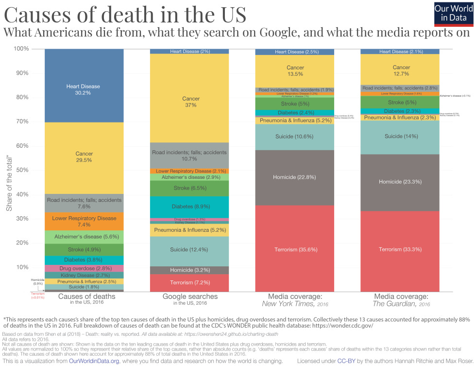](https://substackcdn.com/image/fetch/$s_!-0TC!,f_auto,q_auto:good,fl_progressive:steep/https%3A%2F%2Fsubstack-post-media.s3.amazonaws.com%2Fpublic%2Fimages%2Fbbda8f5a-950f-49c6-ad66-7b1087427346_980x753.png)

Source: <https://johnmjennings.com/causes-of-death-vs-what-we-google-vs-what-media-reports-on/>

What we talk about and what we *should* talk about are two very different things. Heart disease is the top killer of Americans, but it is often the least talked about or researched, whereas terrorism is salient but invisible in the grand scheme of things. What makes a good story is an unexpected and surprising event. No one writes about the 45,000 flights that land safely every day; instead, we focus on the one that was a near-tragedy because we need to understand what happened. That is human nature.

Heart disease builds up over time, and it is not a catastrophic event. Rather, it is slow-moving and hard to detect until something goes wrong. This chart says so much about how we process the events around us, how salience works, and how we so often have a hard time assessing risk.

[Share](https://debliu.substack.com/p/ten-more-charts-i-cant-stop-thinking?utm_source=substack&utm_medium=email&utm_content=share&action=share)

### **9. Younger Americans are making less than their parents at age 30**

[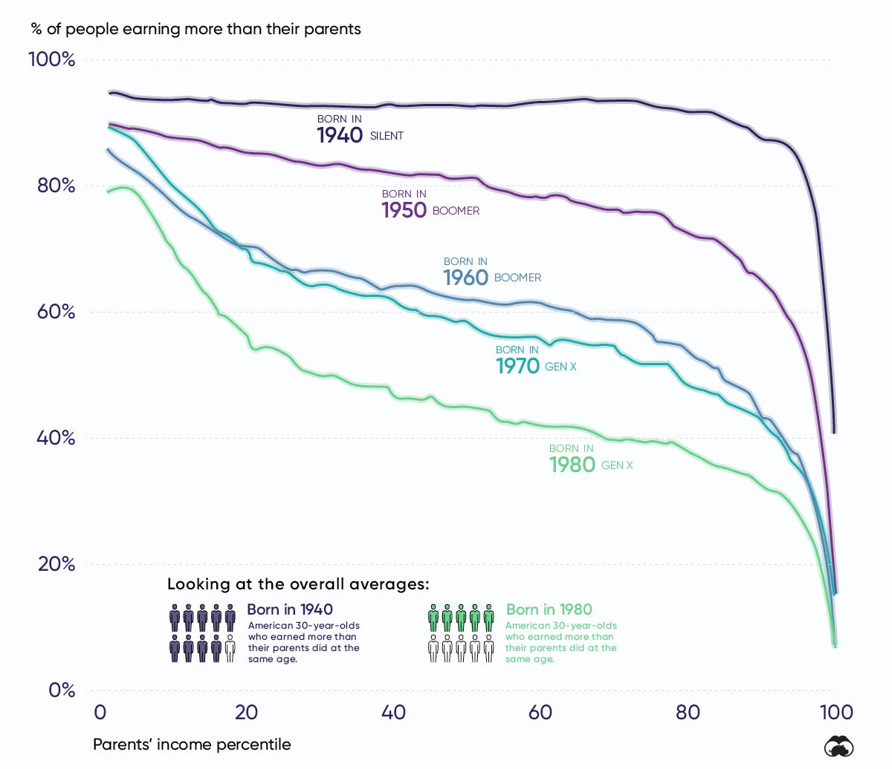](https://substackcdn.com/image/fetch/$s_!a6hM!,f_auto,q_auto:good,fl_progressive:steep/https%3A%2F%2Fsubstack-post-media.s3.amazonaws.com%2Fpublic%2Fimages%2F87ffb018-7882-4940-a3e2-90a6ec6d3ec0_1200x1036.png)

Source: <https://www.visualcapitalist.com/the-decline-of-upward-mobility-in-one-chart/>

[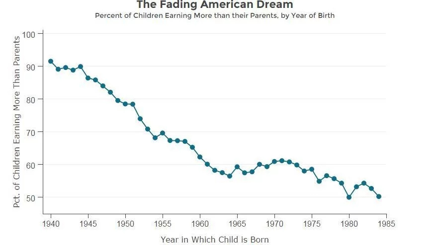](https://substackcdn.com/image/fetch/$s_!FM9L!,f_auto,q_auto:good,fl_progressive:steep/https%3A%2F%2Fsubstack-post-media.s3.amazonaws.com%2Fpublic%2Fimages%2F7f044161-928e-47f5-88ae-479491bfb8e9_879x494.png)

Source: <https://www.npr.org/sections/thetwo-way/2016/12/09/504989751/u-s-kids-far-less-likely-to-out-earn-their-parents-as-inequality-grows>

When I got my first full-time job, I showed my Dad my offer letter. He smiled broadly and said, “You are making more than I am!” He said it with such pride that I was caught off-guard. He had been working for three decades, and I was just starting out. I realized then that this was why he had come to America: to give the next generation a better chance at success than he’d had.

This is the implicit social contract of the United States. Each generation works hard and gives the next one a better chance at success. But this promise has been stretched for a long time—and for the next generation, it looks like it’s at its breaking point.

### **10. Standardized tests predict success for low-income students**

[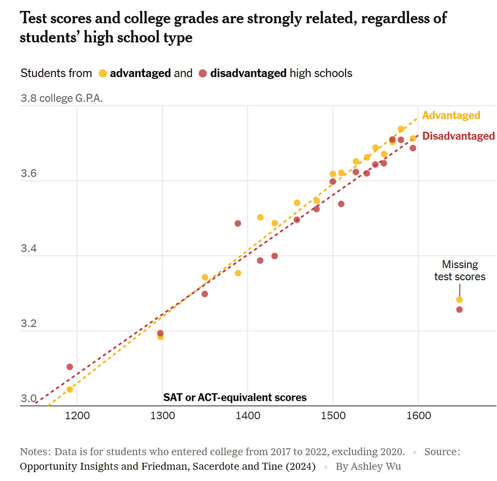](https://substackcdn.com/image/fetch/$s_!uz1q!,f_auto,q_auto:good,fl_progressive:steep/https%3A%2F%2Fsubstack-post-media.s3.amazonaws.com%2Fpublic%2Fimages%2Fbc3ff1c1-8bc7-46e2-9473-239e84ce4895_1564x1512.png)

Source: <https://www.nytimes.com/2024/01/07/briefing/the-misguided-war-on-the-sat.html>

As I mentioned earlier, my son recently completed his applications to college. The process was eye-opening, to say the least. College admissions are now so competitive that it’s bewildering to those of us who applied a generation ago. I was a kid who came from a small-town school but managed to get on colleges’ radar because I had a strong SAT score to go with my GPA. I would never have gotten a scholarship to Duke without it.

Standardized testing has fallen out of favor because it is said to favor the wealthy. Data shows a strong correlation with wealth, but testing has also helped those without an easy way to distinguish themselves. I don’t think there is a simple answer here, but it is interesting to see data that is challenging long-held assumptions.

---

There you have it: ten more charts that have been on my radar in 2023. I hope you’ve found them as interesting as I have—or at the very least, that they’ve given you some food for thought. As 2024 begins, I would love to know: What graphics have you found fascinating? How has data like this changed or cemented your views? Let me know in the comments!

[Leave a comment](https://debliu.substack.com/p/ten-more-charts-i-cant-stop-thinking/comments)