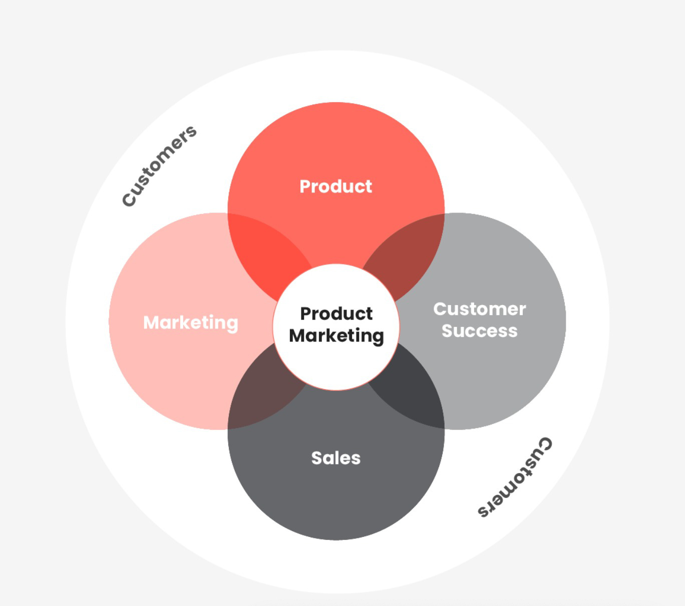

# The Art and Science of Product Marketing 

* A guide for Product Marketers and insight for those who work with them*

**Note from Deb:** From time to time, I invite thought leaders from across the industry to write about topics that I could not do justice to myself. I have long wanted someone to share a definitive guide to Product Marketing with all of you. I was a Product Manager most of my early career, but for a time, I also worked in Product Marketing. It is an important field, but it is also quite misunderstood. I decided to ask my Product Marketing partner and friend, [Des](https://www.linkedin.com/in/desireemotamedi/), to write this week's article. She is a foremost expert in PMM, and I am excited about how she brings together the art and science of PMM.

---

It was the aughts, still the early days of tech. I was fresh out of college, struggling with nagging symptoms of imposter syndrome. I was a brand-new Product Marketer, and I was completely out of my depth. I felt neither technical enough to speak to the engineers nor creative enough to walk the walk of a marketer. I was in a role somewhere in between, neither fish nor fowl. I was a Product Marketer, the platypus of the technology world.

Now, after two decades, I look back at that time with fondness and wistfulness. If I had known then what I know now, I would have realized that the core of Product Marketing wasn’t the hard skills, but rather the soft ones: relationships, connections, and heart. During my time in that role, I discovered, with the help of a supportive Product Manager at Adobe, that my relationship with the product and the customer was the job. I fell in love with the idea that, with a website, whitepaper, datasheet, or webinar, I could help someone see how a product could be impactful for them. The story I told was what made that connection. It was magic. And it changed me into the Product Marketer I am today.

Product Marketing holds a unique and powerful place in an organization. It is the bridge between the *inspiration* of Marketing and the *practical application* of Product. The story that connects those two worlds is the heart of what we do. I wrote this article as a love letter to the discipline—both for Product Marketers and for those who work with us.

[Subscribe now](https://debliu.substack.com/subscribe?)

## **PMM is at the center of it all**

\* Credit: [Product Marketing Alliance](https://www.productmarketingalliance.com/)

Product Marketing Managers (PMMs) are constantly performing a balancing act. We serve as the storytellers for the product, but we also bring the voice of the customer into the organization. We act as advocates for both sides to ensure that what we are building and what we are selling align. Many organizations treat PMMs as support staff—people who write blog posts at launch or make sure press releases go out—but that is short-sighted.

A great PMM is an advocate for the brand and product. We connect the product to the message through marketing, PR, and communications. We also ensure that boxes like Legal compliance get checked before things go out the door.

Sound exhausting? I find it exhilarating! At the end of the day, we are bringing all of these voices together into a story that is strong and compelling enough to convince someone to use our product—and, ideally, become a promoter of our product themselves. When we’re able to get everyone pointed in the same direction, that is when a product can take off.

I love this quote from [Chandar Pattabhiram](https://www.linkedin.com/in/chandarp/overlay/about-this-profile/), CMO of Coupa Software, in response to a post by famed author Geoffery Moore on the different types of marketing roles in an organization:

“A PMMs goal s(sic) to use Positioning to Win the Battle for the Mind and this is best achieved speaking "outside in" - value driven - vs. "inside out" feature-driven. In my experience, product marketers part of the marketing org. have more of an organizational emphasis to be value-driven. People buy candles not because we need candles; because we need light!! Feature-centric PMMs are more focused on highlighting the candles vs. the light!!!” ([ref](https://www.linkedin.com/feed/update/urn:li:activity:7008090716270645248?commentUrn=urn%3Ali%3Acomment%3A%28activity%3A7008090716270645248%2C7008192641272098816%29&dashCommentUrn=urn%3Ali%3Afsd_comment%3A%287008192641272098816%2Curn%3Ali%3Aactivity%3A7008090716270645248%29))

The best PMMs are all about extolling the virtues of light to sell candles.

[Share](https://debliu.substack.com/p/the-art-and-science-of-product-marketing?utm_source=substack&utm_medium=email&utm_content=share&action=share)

## **Partnership is the key to success**

PMMs don’t code the software. They don’t design the flows. They don’t get to determine the product roadmap. They are wholly dependent on others to successfully launch, grow, and scale a product. Their messaging encapsulates what the product is and what it does.

PMs, PMMs, and creative teams form a dynamic trio, each playing a pivotal role in a continuous feedback loop that drives a product's success. PMs steer the strategic direction, focusing on market trends and setting clear objectives. Meanwhile, PMMs, with their deep market and audience understanding, shape the product's narrative, positioning it effectively against competitors and communicating its value through sharp messaging. Creative teams bring these strategies to life with compelling visuals and storytelling. This synergy, with each team's insights and expertise feeding into one another, ensures that every stage of the product's life cycle is finely tuned to resonate with the market and achieve its goals.

## **The three pillars of Product Marketing**

Product Marketing is like a three-act play: Inbound Marketing, Go-to-Market initiatives, and Outbound Marketing. While every company approaches the PMM role slightly differently, these are the most common areas of focus. Let’s take a look at each, and how they come together to tell the product story.

### **Inbound Marketing/Market Context: Insights that fuel innovation**

Inbound Marketing sets the foundation for a product's journey by developing an understanding of the market, the users, and their needs. Some organizations give this work to other teams, such as Research or Strategy, but an effective PMM must have a handle on these areas.

Inbound marketing is the precursor to effective product development. It encompasses:

* **Market Research:** Deep analysis to identify trends, customer needs, and competitive threats
* **Opportunity Sizing:** Assessing the potential market for the product and identifying opportunities
* **Persona Creation:** Crafting detailed user personas
* **Quantitative and Qualitative Insights:** Gathering data-driven insights to influence product strategy and marketing messaging
* **Competitive Intelligence:** Understanding the competitive landscape
* **User-Centric Feedback:** Actively seeking input from internal and external stakeholders and sharing insights back with internal teams
* **Market Trend Analysis:** Staying at the forefront of industry trends and representing the point of view of the market

Inbound Marketing is where Product Marketing finds its roots, laying the groundwork for informed decisions and strategic direction.

### **Go-to-Market Initiatives: Capturing attention**

Go-to-Market initiatives are the bread and butter of Product Marketing. In some organizations, these are seen as the core, (and sometimes only) function of PMM.

While PMM is much more than just go-to-market, excellence in GTM is table stakes. It focuses on the alignment between how a product is launched and explained to its target audience. This involves:

* **Strategic Planning:** Charting effective launch strategies and shepherding creative asset development
* **Alpha-Beta Testing:** Gathering early insights for product refinement
* **Messaging and Positioning:** Crafting compelling narratives around products and/or features for specific audience segments
* **Market Preparation:** Building anticipation and excitement around the product
* **KPI Setting and Measurement:** Defining what success looks like and monitoring progress (which is often overlooked, but it’s what separates good PMMs from bad PMMs)

Effective GTM strategies ensure that a product hits the market with a bang, capturing the attention and interest of the target audience.

### **Outbound Marketing: Nurturing engagement**

Outbound Marketing is what a PMM does after launch. It is focused on nurturing user engagement and driving the adoption of the product in the market.

Many companies just focus their PMMs on Go-to-Market and assume that once a product is out there, the job is done. But that is just the start of the customer journey, especially for products with long lead times or complex sales cycles. The Outbound phase is equally important. It includes:

* **Sales Enablement:** Empowering sales teams with the knowledge and materials to attract and engage customers
* **Marketing Campaigns:** Strategically designing campaigns to create product awareness and stimulate adoption (these can be campaign-based or evergreen)
* **SEO and SEM:** Optimizing online visibility through search engine marketing
* **Email Nurturing:** Guiding users along the journey through well-crafted email sequences
* **Cross-Sell and Up-Sell Plans:** Encouraging users to explore additional product offerings

Outbound Marketing ensures that the product's journey continues long after the initial launch, with a focus on fostering lasting user relationships. It’s important to put KPIs in place for these initiatives to measure success and inform future strategies. Overlooking this step can result in a lot of wasted resources.

[Subscribe now](https://debliu.substack.com/subscribe?)

## **The skills needed to be an effective PMM partner**

In the world of Product Marketing, career progression is not a linear climb from one "level" to the next. Instead, it's a dynamic evolution, marked by continuous learning and skill development. The journey from a junior Product Marketer to a seasoned professional involves honing distinct skills and qualities.

**Leadership Skills: Inspiring excellence**

As Product Marketing Managers advance in their careers, they often assume leadership roles, inspiring and motivating teams to excel. As they are entrusted with driving product or product line success, leadership skills become non-negotiable.

**Strategic Thinking: Navigating complexity**

Product Marketing Managers must master the art of strategic thinking. That means aligning product marketing with the company's broader business objectives, making critical decisions, and prioritizing effectively. Strategic thinking involves understanding business goals, measuring results, and evaluating ROI.

**Market Research: Delving deeper**

Deep market analysis becomes even more critical for career progression in Product Marketing. PMMs must identify market trends, customer needs, and competitive threats to formulate effective strategies.

**Cross-Functional Collaboration: The art of alignment**

Collaboration across departments is crucial. PMMs work hand-in-hand with product development, sales, and marketing teams to ensure a product's success in the market.

**Data Analysis: Insights-driven decision-making**

In a data-driven world, proficiency in data analysis tools and the ability to derive insights from data are indispensable.

**Other Key Skills: Crafting success**

Beyond the core skills I listed above, strong PMMs must also excel in:

* **Messaging and Positioning:** Crafting narratives connecting products to customer needs
* **Product Orientation:** Becoming a true expert on the products and the markets they serve
* **Organization:** Successfully juggling multiple projects and launches
* **Communication:** Clear and effective communication with both internal and external stakeholders
* **Curiosity:** Asking insightful questions to uncover customer insights and enhance cross-departmental understanding
* **Empathy:** Cultivating a deep understanding of user and buyer perspectives

## **PMMs are made, not born**

PMMs are here to sell light, not candles. As such, their greatest superpower is the ability to understand customer pain points and help them see how a product can fill the gaps in their lives.

I believe the best PMMs are made, not born. They hone their skills, apprentice with strong PMMs, and build customer empathy one day at a time. What I’ve written here is not rocket science, but it took me years of seeing how PMM was done at organizations like Google, Meta, Shopify, and now Salesforce to understand that each of these skills can be learned and mastered.

The job of PMM in most organizations is amorphous. Although this can present challenges, it also presents a unique opportunity. Strong PMMs have the ability to shape and evolve their roles, just as I have done.

---

## **Finding a home in the world of PMM**

My journey in PMM has taught me to embrace my role as the platypus of the tech world: unique, multifaceted, and essential. Initially, I felt lost, caught between the technical and creative realms. Yet it was at this intersection that I found my true calling. (I’m guessing, if you’ve read this far, that you have, too.)

Being a PMM leader is about more than just mastering skills or building market knowledge. It’s crafting stories that connect people and products, turning technical features into human experiences. It’s seeing firsthand the wonder on the faces of customers experiencing augmented reality for the first time. It’s understanding that the new feature you just shipped is going to help a merchant make her online store profitable. It’s seeing a client rave about your product to a prospect (without any prompting from you)! It’s bridging the gap between technology and the humans who use it. This journey has not just shaped my professional life; it has given me a sense of purpose and belonging.

When I look back on my time in Product Marketing, I realize that what I once saw as challenges were actually strengths. I found a home in PMM, where being a platypus is not just accepted, but celebrated. My hope in sharing this guide is to light the way for others on their PMM journeys and encourage them to discover their own place in this unique role.

[Leave a comment](https://debliu.substack.com/p/the-art-and-science-of-product-marketing/comments)

---

**[Desiree Motamedi](https://www.linkedin.com/in/desireemotamedi/) - SVP & CMO - Next Gen Platform, Salesforce**

Des is the SVP & Chief Marketing Officer, championing the vision and strategy of Salesforce’s Next Gen Platform. Prior to her role at Salesforce, Desiree was the VP and Global Head of Product Marketing at Shopify, where she focused on awareness and adoption of their commerce platform. She previously worked at Meta as a Senior Global Marketing Director, defining a strong brand and driving pipeline results for the company’s work collaboration tool, Workplace. Earlier in her career, Desiree built a vibrant developer community in her role at Google as a Marketing Lead. She started her career at Adobe, where she led the effort to repackage Creative Suite and Flash Media Server. Des is also an advisor to startups.