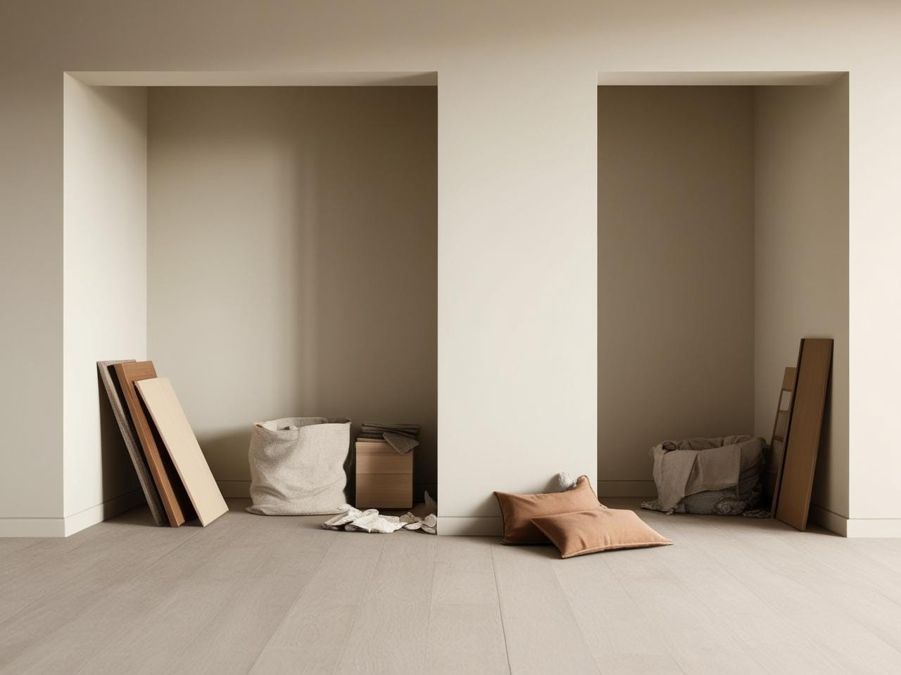

# Adding Not Subtracting: What Leaving 90% of Our Things Behind Taught Me About Life 

*How it can transform your way of thinking too *

Last week I found myself staring at a box labeled "BCG Stuff” and thought to myself that I lost the plot. I have not worked there in nearly a quarter century, and this box no doubt has traveled with me unopened in the intervening years. In 48 hours, it would become someone else's problem (figuratively) - along with literally decades of accumulated stuff. Somewhere in these boxes and crates were my eBay Inventors jacket (not worn in 20 years), my once loved BCG fleece, and even a PayPal blanket, all memories from another corporate life. But they were all going to be left behind in the impending move.

We started building a house over 4 years ago, just 50 feet from our current one. The plan seemed simple: create space for my in-laws to move in with us alongside my mom who already lived with us. But their failing health stretched what should have been a straightforward project into a marathon of delays. In the intervening years of hospital visits, ICU stays, and hospice, we lost all three of them. We moved forward to complete the house, but without the reason and motivation. The original September move-in date slipped to October, then through the holidays, and into January. Each month brought new complications and pushed our timeline further out. We finally reset our sights on mid-February when my sister planned to visit and help with logistics.

Then life threw us a curveball.

[Subscribe now](https://debliu.substack.com/subscribe?)

## **The triggering event**

As we started preliminary packing, I developed increasingly severe allergic reactions to our current house. Apparently, unearthing years of stored stuff kicked up endless dust and mystery particles. Who knew? Every box opened was like unleashing a new time capsule of allergens. The reactions made each day more miserable than the last. Living between two houses, neither of which we could keep dust-free, was becoming impossible.

When our contractor unexpectedly offered an earlier move-in date, I didn't hesitate. That single "yes" set off a chain reaction I hadn't anticipated.

On Wednesday, I booked movers for Friday. Six months of planning collapsed into 48 hours to vacate a house we'd called home for eight years. That alone was overwhelming, but our kids' reaction was worse. They didn’t want to move at all. They'd ignored my pleas to pack, assuming the endless delays meant they were off the hook. When we dropped the Friday bombshell on Wednesday night, they were devastated.

The actual move happened in a blur. Our daughters left for school Friday morning from their familiar beds and came home to those same beds in a completely different house. We took only the essentials - furniture and about a week's worth of clothes. That first night we had to run back for basics - toothbrushes, shampoo, even our phone chargers.

We left nearly everything behind. The irony wasn't lost on me. Throughout 2024, I'd spent 20 minutes each day decluttering, removing nearly 50 boxes of accumulated stuff from my parents, my in-laws, and ourselves. I'd read it all - [Marie Kondo's joy-sparking](https://amzn.to/4giwr6M), [Swedish death cleaning](https://amzn.to/4hbV5ax), [Dana White's books](https://amzn.to/3WEhhSq), [The Art of Enough](https://amzn.to/40OcCQu), and [The Home Edit](https://amzn.to/4aJ9FUD). Yet standing in our old house, surrounded by the leftovers of our lives, it felt like I'd barely scratched the surface, and none of those books could solve my deeper problem.

[Leave a comment](https://debliu.substack.com/p/adding-not-subtracting-what-leaving/comments)

## **The mindset of adding not taking away**

When I was getting rid of stuff, I bumped headlong into [loss aversion](https://thedecisionlab.com/biases/loss-aversion), a very human tendency to feel losses more deeply than gains. I'd tested this theory throughout my year of decluttering. I threw away or donated things that were on my maybe list. It physically hurt at the time. But once something left the house, I never thought about it again. So what if we applied this to everything?

My husband, David, resisted this approach with every fiber of his being. He's the guy who rescued frisbees from donation bins because "the kids might want that someday" - never mind that they've never played with it in the past decade. The same guy who spent six months convincing me that the wheelbarrow he hasn't touched in 20 years is suddenly essential.

When he found an old wine glass in his parents' things, he wondered aloud if it was from their wedding toast. The pained look on his face as I suggested it could just as easily be from a garage sale made me realize how differently we view these objects. I think about our grandchildren finding that glass someday and wondering why on earth we kept it.

Watching David wince as I listed a futon on Marketplace and put an old microwave and mini fridge in my Buy Nothing group was almost comical. Each item posted felt like a personal betrayal to him, while to me it felt like freedom.

The girls are slowly bringing over their favorite stuffed animals, books, and toys. It's fascinating to see what they truly value. Their precious things have found homes, while piles of remaining things sit on their old bedroom floors. If we'd packed normally, those things would be buried in bins at the backs of their new closets, waiting for the future them to wonder why they kept it all.

We stumbled on moving this way by accident. I did three loads of laundry just before moving day, and those turned out to be the clothes we actually wear and love. I just moved those and folded them in the new house.

A friend recently lost all her phone contacts and is slowly adding back the important ones. At first, I was horrified at the thought of losing my lifelong contact list. But watching her thoughtfully rebuild her connections made me realize - maybe it's freeing to consciously choose what (and who) matters most and add them back as you need them.

## **The aftermath**

Moving is hard, even when it's just 50 feet. Our daughters are processing the loss of their old home right now. They both finally have their own rooms, and nothing about their school or neighborhood is changing. [As Bethany wrote recently, it's still a loss to leave behind all of the memories of a place she loved](https://asamnews.com/2025/01/24/moving-childhood-memories-lost-family-relationships/).

Danielle spent our first day in the new house sitting on the couch in the old one. She refused to come until I put dinner on the table, and even then only reluctantly. Her forlorn look of holding Wonton on her favorite couch - [the "couch hole" couch](https://debliu.substack.com/p/beyond-whats-next) we left behind was visible across the adjacent backyards. Wonton spent her first night equally unsettled. She whimpered as she went to sleep, contemplating when she could go back to her familiar place.

[Share Perspectives](https://debliu.substack.com/?utm_source=substack&utm_medium=email&utm_content=share&action=share)

---

Moving by leaving nearly everything behind may seem like a drastic step, but ultimately it was what set us free from all of the things holding us back. We learned what we needed to live and what we could live without. We are going to give it a month. We will go back slowly and take whatever we need in that month and then we will donate or discard everything else. Ultimately, this move taught us something. Sometimes the best way forward is to leave things behind. From now on, we are adding, not subtracting.