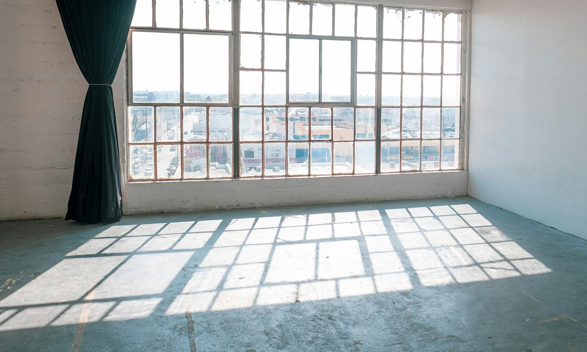
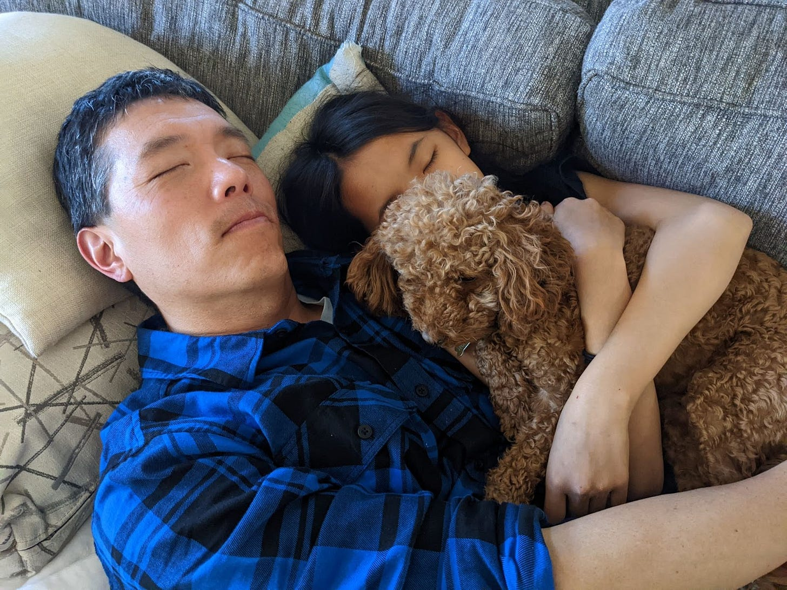

# Beyond What's Next 

*Declaring Freedom from My Productivity Treadmill*

Photo by [Daniel Salcius](https://unsplash.com/@dsalcius?utm_content=creditCopyText&utm_medium=referral&utm_source=unsplash) on [Unsplash](https://unsplash.com/photos/gray-framed-glass-window-CLhRF_3CE6I?utm_content=creditCopyText&utm_medium=referral&utm_source=unsplash)

Last year I wrote the article, [The Danger of What's Next](https://debliu.substack.com/p/the-danger-of-whats-next). We spend a lot of our lives anticipating what is to come. When we are children, we dream of when we are adults and have the freedom to make our own choices. We look forward to driving, graduation, and college. We anticipate our first job, who we will marry, and when we have kids. We dream of owning a house and the next promotion. We climb, seek, and want through the decades: the next accomplishment and the one after that. We anticipate retirement. The reward for a life of achievement is to get off the treadmill, perhaps?

[Subscribe now](https://debliu.substack.com/subscribe?)

[As my chapter at Ancestry comes to a close](https://debliu.substack.com/p/looking-back-and-looking-ahead), I spend a lot of time thinking about what's next. A friend of mine had a totally different experience from me. Each time she changed jobs, she took time off and discovered what she wanted and then jumped in knowing exactly what she wanted. She shared that it was in that space she found who she was and what she was looking for next. In contrast, I went from role to role, job to job with no time in between. My immigrant parents would be appalled to consider we would take time off and not work, so I always felt the pressure to be productive and never waste one second.

A lot of people reached out after the announcement last week and asked me "What's Next?" The answer is absolutely nothing. After a lifetime of doing the next thing and putting one foot in front of the other to get to what is to come, I am taking a friend's advice, "Give yourself space. Don't jump into anything. Sit with the emptiness."

As someone who has always had to be doing something, it was hard to hear. I always have something to do, some place to be. I have filled my life back to back with jobs, kids, and family. Even our vacations are tied to work or what I can squeeze in between. But now that has all changed.

For the first time, I am looking at an empty calendar. I am not having to schedule seeing my friends two or three months out. I am not having to blow off my friend's birthday parties or showing up late and leaving early. I am not living my life in the small snatches of time between 24 trips per year and trying to shuffle things so I can make some of the events for the kids where I am in town.

As I look at my days starting on February 1st with nothing on it, it is both glorious and scary. I have long been defined by the jobs that I have done. The companies I work for. Being a mom and a wife. So much so that I wonder who I am without a title or a place to be.

I entered this phase of my life with no plan and just space. I scheduled a few lunches here and there with people I have wanted to see for a long time. But otherwise I am open to doing nothing until the kids are back in school in the Fall.

[Share](https://debliu.substack.com/p/beyond-whats-next?utm_source=substack&utm_medium=email&utm_content=share&action=share)

### **What the Space Feels Like**

I have product-managed the heck out of my life. I have had roadmaps, goals, and metrics. I measure things and track them. I am a chronic scheduler and planner. My plans have plans. I am always trying to optimize: taking a call on the way to the airport, writing my newsletter on the plane, working out while replying to emails.

My whole life has been about efficiency and productivity. When we bought our first house, David picked out our couches. One day, several years later, he asked me, "Can you just sit on the couch and watch a movie with me?" I balked. There was laundry to be done, dishes to be loaded, things to be tidied. Finally, he convinced me to sit down and watch Finding Nemo with him. It felt strange to not multitask. He tried to convince me that life was not about being busy doing something all the time, but then we had three kids, our parents to take care of, and busy jobs.

David suffers from "heavy dog syndrome." He gets on the sectional (we call it the couch-hole because once you get on it, you can't leave it), and the super cuddly dog jumps on his chest. Suddenly, he can't get up. Our 12-lb weight-defying poodle weighs him down so much that he is glued down while I flitter around the room packing for our move, cooking dinner, or tidying up. Since he holds down the fort for the two dozen trips I made last year for work, I have no room to complain.

We have juggled family and work for nearly two decades. When Jonathan was 11, David and I went to New York together for a conference. While we were there, we realized we hadn't gone anywhere overnight without them for 11 years. That came as a shock to us. In the craziness of our lives, we barely spent any time together without them.

[Leave a comment](https://debliu.substack.com/p/beyond-whats-next/comments)

"Life is what happens when you are busy making other plans," wrote Allen Saunders in 1957. This hit home so much more during the past four years at Ancestry. We are in the business of family history, and so many lives are reduced to a name, birthdate, marriage date, and death date. The time in between these events is the life of someone whose story we can only piece together.

### **In Praise of Doing Nothing**

So this year, my goal is to invest time in making space for everything but being obligated to nothing. I want to sit in the vacuum and see what comes. I want to not live by the 5-minute Outlook dings that remind me that I need to race to the next meeting. I want to stop chasing the next milestone and optimizing every minute of every day.

I'm learning that "nothing" isn't really nothing at all. It's having impromptu coffee with an old friend without checking my watch on what I have next. It's sitting on the couch with David, the kids, and Wonton to watch an entire movie without folding the laundry. It's showing up to choir concerts, speech tournaments, and publishing parties during the day without booking it months in advance.

The spaces between the dates in our family histories – those seemingly empty periods between birth, marriage, and death – they're where life actually happens. They're filled with ordinary Tuesdays, quiet moments, and small choices that shape who we become. Maybe that's what my friend meant about sitting with emptiness. It's not really empty at all; it's full of possibility.

As I write this, I realize that "what's next" doesn't always need an answer. Sometimes the best thing we can do is resist the urge to fill every moment with something. Perhaps the greatest achievement isn't in doing more, but in being present for the life that's already happening around us.

[Share Perspectives](https://debliu.substack.com/?utm_source=substack&utm_medium=email&utm_content=share&action=share)