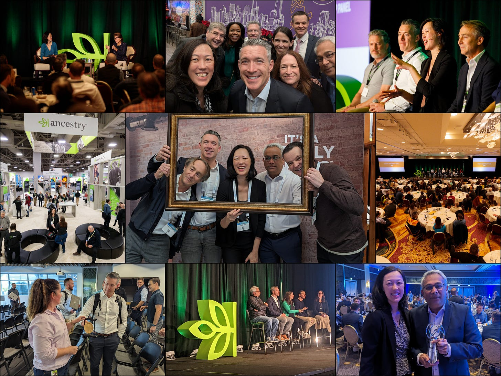
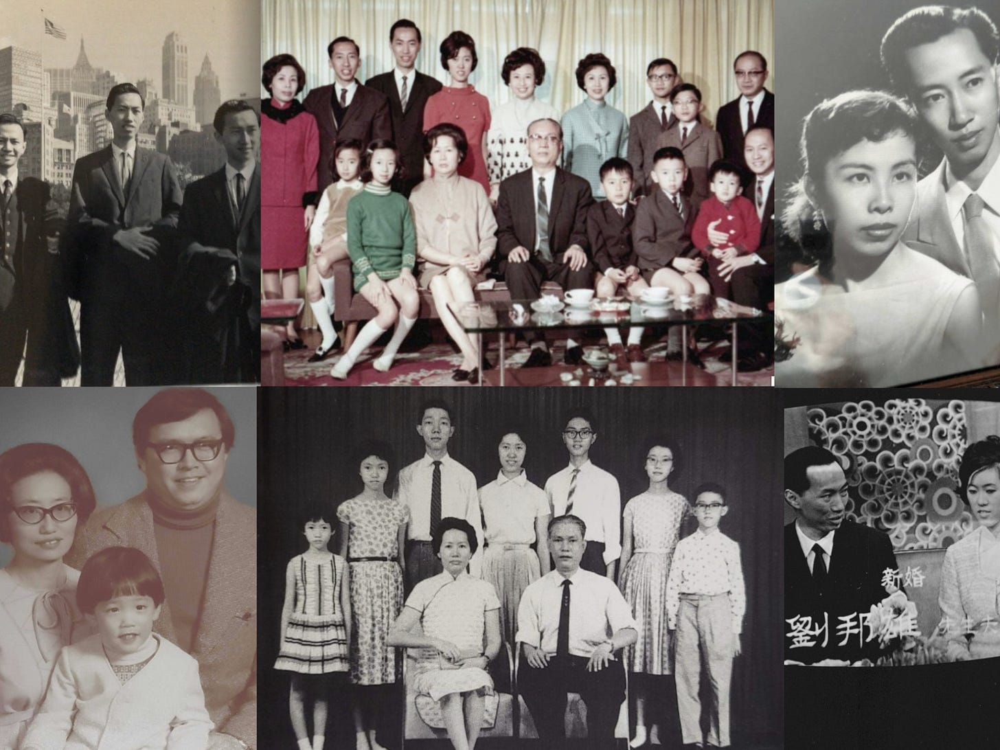

# Looking Back and Looking Ahead

*An end of one chapter and the start of the next *

I remember my first day at Ancestry. It was March 2021. The world was grappling with COVID, and so everything work-related was still virtual. There was no physical building to go to, no shuffle to pick up a badge, and no searching for my desk. There was no fanfare, no handshakes and welcomes. Instead, I was shipped a laptop, which I opened and logged in from my teen son's bedroom. That was the start of a four-year journey, which will end on January 31st.

Ancestry's mission is to empower journeys of personal discovery. We want our product to help people discover, craft, and connect with their family stories. During my time at Ancestry, we invested in making these things more accessible and possible for more people.

Over the last 4 years, we've grown to connect over 27 million people through our DNA network. We revolutionized our platform with the dynamic homepage, launched ProTools, completed our largest ethnicity update ever, and added billions of records from Newspapers.com, including more than 38,000 pre-1870 newspaper articles related to enslaved people in the United States. Over the last several years, we have made available important content collections, including records from the Freedmen’s Bureau, Chinese Exclusion Act and Japanese Incarceration, accessible at no cost. Our community contributed over a billion pieces of their own family content this last year alone. Behind each of these numbers are countless personal discoveries, connections made, and stories preserved for future generations.

[Subscribe now](https://debliu.substack.com/subscribe?)

## **My Chapter of the Story**

It's been an incredible honor to be a part of the Ancestry story. I am but one of many leaders who have been at the helm of the company over the course of its 40 years, and I am proud that my time focused on building culture, driving innovation, and growth will remain a part of the company's DNA for many years to come.

I hosted monthly dinners with people from all across the company. There we talked about our Magic Wands—the things we hoped to launch for customers, changes we wanted to see made to our processes, and parts of the culture we wanted to maintain or evolve. These were some of my favorite events. Having a chance to break bread with people who have very different roles and who often hadn't had the chance to meet one another, created a type of magic in and of itself. I loved hearing real-time problem-solving and debugging of our systems and products. I also enjoyed hearing the ideas for products, including ProTools, that later became a reality. In my four years, I hosted dozens of dinners and met hundreds of team members, each teaching me something new about the company and the work they did every day.

What I loved most about my job is that there wasn't a single party or event that I attended where somebody didn't tell me their Ancestry story. I was on many flights where people showed me their family trees or what they discovered about themselves. I met people who found new branches of their family they never knew existed—across the globe and right nearby. These stories remain some of my most treasured memories. Ancestry is about capturing your family stories—both old, new, and yet to be discovered. Hearing how the work we did each day touched someone's life is one of the most wonderful parts of what I did.

The past four years for me personally have been times of great challenge and change. My mother and both in-laws were seriously ill for a large part of it, and after months in the ICU and in hospice, we lost all of them in a short period. The grief and loss has been a weight we carried. Because of their health and the intensity of the work, I had to say no to many things.

[Leave a comment](https://debliu.substack.com/p/looking-back-and-looking-ahead/comments)

## **What Is Next**

I have lived in a state of suspended animation with everything going on. For the first time in my career, I am taking some time off. I graduated from business school and started work at PayPal just a week later. I left PayPal and immediately joined eBay. Then I walked out of eBay on Friday and started at Facebook the next week. I closed my computer on Friday and began my journey at Ancestry on Monday.

The answer to "What's next?" is "What is now?" I want to say yes to so many things I have had to say no to, to see all of the people I have put off, and take care of my health given some recent news.

I know the company is in good hands with Howard Hochhauser, the new CEO, at the helm. I know our customers are in good hands with passionate employees who show up every day to build and maintain our product experiences. And I know our employees are in good hands with the incredible Ancestry leadership team. Just wait until what we announce at RootsTech... I won't spoil it, but it will be game-changing.

My own Ancestry story is not done. One of the projects I started while my mom was in hospice was to scan all of her photos and memories to save them for future generations. I am documenting my own family history day by day and saving her story so one day my kids will be able to see the incredible journey that brought them to where they are.

As I close this chapter, I find myself thinking about the legacy we leave behind, both the one we create through our work and the one we pass down through our families. In my time at Ancestry, I've had the privilege of helping millions of people discover where they come from and how they got to where they are. My mother's lifetime of photos, now preserved in our database, and the billions of records we've digitized are more than just pixels and records attached to nodes. They are the artifacts of lives lived and personal journeys completed. While my role at Ancestry may be ending, I'll always remain part of the story of this company, where we helped enable journeys of personal discovery so everyone can know where they come from and who they are.

[Subscribe now](https://debliu.substack.com/subscribe?)