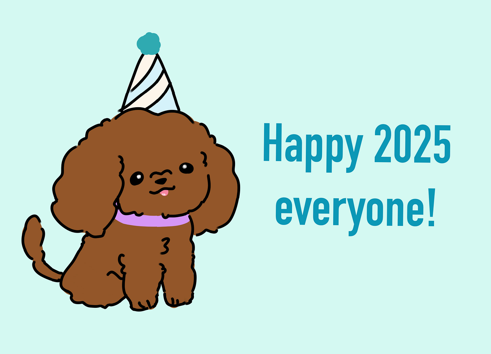

# Ten Ways You Can Use New Year’s Resolutions to Change Your Life 

*How twenty-two years of resolutions shaped who I am*

As a student of New Year's resolutions, I have used them, researched how to make them successful, and made them an important part of my life. For the past 22 years, I have assiduously incorporated them to help me grow in new and different ways. Though it may sound crazy, it has been really transformative in how I see the world and impacted all aspects of my life.

I started this journey in my last year at business school in 2002. This was well before we had kids; David and I were still newlyweds, and I was just starting my career in Silicon Valley. On a whim, I started using resolutions to set goals. I had used them before in various ways since childhood but had never been serious about it. The process of setting, contemplating, and executing these resolutions showed me that with enough effort and clarity, things I once thought weren't possible suddenly were.

[In a study published in 2020, researchers Norcross and Vangarelli tracked people for two years as they made and kept or dropped their resolutions](https://pmc.ncbi.nlm.nih.gov/articles/PMC7725288/). About 44% of Americans set resolutions in any given year. The researchers found that among their 200 participants, only 40% kept it after 6 months and less than 20% made it to the 2-year mark. While that may seem like a disappointment, I see that as a success. After all, one in five people did something to improve their lives in a new way.

Time flies. It's been over two decades since I started this process, and I have learned so much. That I have transformed large areas of my life. It has also shown me that with the right mindset, a bit of willpower, and different habits, you can evolve and grow in ways that you never thought possible before.

1. **Start with the end.** Write down what you have accomplished at the end of the year. Then write a note to your current self about how it feels to achieve it. Place a post-it note on your bathroom mirror or computer monitor to remind you of what success looks like. By envisioning your future self, you can set motivation for you to focus on moving forward. I know the future-me will evaluate my progress, so I am accountable to her.
2. **Don't set yourself up for failure.** Put things on your list you can envision yourself doing and have the motivation to make happen. Half-hearted attempts at impossible tasks are not recipes for success. Losing 50 pounds, while doable, is not as achievable as working out 30 minutes five times a week. Pick something that you know the steps to achieve, even if it is hard. Make it easy to succeed and hard to fail.
3. **Create actionable and measurable plans.** Theoretical plans are just that, dreams yet to meet reality. Rather than saying "I want to declutter," I said, "I want to spend 20 minutes a day organizing or clearing out things we don't need anymore." This helped me move from an idea to action. There is no perfectly decluttered home, but there is progress. Plans that are specific but not just a finish line are more likely to be achieved.
4. **Remove all obstacles and friction.** Resolutions are easy to say but hard to do. Take a moment to remove everything between you and your goal. I wanted to do strength training, but I didn't have a good way of incorporating it. So I bought a Tonal and signed up for a monthly workout training schedule that automatically increases the weight as your muscles adapt. I wanted to declutter more, so I put a bin by the front door for donations. This led to removing over 1,000 items from the house in my decluttering sessions.
5. **Change your environment to change your mindset.** I read with great interest about heroin-addicted Vietnam veterans returning to the United States. The government and military were worried that they would bring an epidemic home. [But nearly everyone who came home immediately gave up the highly addictive substance and went back to their families with minimal withdrawal symptoms or physical consequences](https://pubmed.ncbi.nlm.nih.gov/27650054/). Their environment changed and their addiction disappeared. Make your environment work for you instead of against you. If you want to eat healthier don't let your sister take your kids to Trader Joe's and load your house with temptations (just a random example, of course). You will succeed or fail based on the water you swim in so make it work for you.
6. **Find an accountability partner.** Having someone do this with you is an important part of the process. [The Guardian cites a study from the American Society of Training and Development (ASTD) that states that telling someone you are doing something will increase your chance of sticking to it by 65% and even goes up to 95% if you have regular check-ins](https://www.theguardian.com/lifeandstyle/2023/nov/27/the-buddy-boost-how-accountability-partners-make-you-healthy-happy-and-more-successful). I found that having my husband do a resolution with me helped me stick to it. We started intermittent fasting together, and we held each other accountable for the timing.
7. **Stay positive and optimistic**. Choose goals that are about changing something for a positive versus something to be avoided. [According to a 2020 study in PLOS ONE by Oscarsson et al, 58.9% of those with approach-oriented resolutions versus only 47.1% of those with avoidance-oriented resolutions succeeded](https://journals.plos.org/plosone/article?id=10.1371/journal.pone.0234097). Thus adding something to your life is easier to achieve than removing something. Positive changes will yield great dividends.
8. **Seek more or less of, not all or nothing.** Select two to four things you want to do more or less of. Don't make it all or nothing. That is a recipe for failure. The first time you skip that soda or miss an exercise, your mind tells you that you failed and wants you to give up. Instead, look for ways to make changes where you're incorporating something or removing something. You don't have to get to 100% (yes, the tiger mom🐯 in me cringes), but rather seek to change one day at a time.
9. **Progress, not perfection.** Every day is a chance for progress, not perfection. If you fail one day, the next day is the day to restart from scratch. Don't allow yourself to be off course for more than one day. Once it hits midnight, the clock resets. While I have drastically reduced the sugar I eat, I still partake on occasion. The goal is not perfection, but rather progress every day. Having a small lapse is not a reason to completely give up, but rather another chance to do more tomorrow.
10. **Just do it!** The year will pass whether you do it or not. Give yourself the gift of possibility. Open up your mind to changing this year in some way, even if it is baby steps. Many of my resolutions were done on a whim just to see if I could. But 20 years out from drinking soda and sugary drinks, every little bit counts. If it doesn't work forever or you discard it in favor of other things, it is just for a year.

## **My 2024 Resolutions**

Each year for the past 22 years and counting, I have set New Year's Resolutions. And for the past 10 years, I have posted them on Facebook to keep myself accountable. Some of these resolutions I keep and turn into regular habits, while others I discard in favor of other things. Thanks to these commitments, I no longer drink soda (20 years), floss daily (17 years), work out every night (12 years), eat less sugar (8 years), practice intermittent fasting (7 years), write regularly (6 years), cook for my family (5 years), get more sleep (3 years), and simplification (2 years).

## **How last year’s resolutions went**

[Here were my 2024 Resolutions](https://debliu.substack.com/p/ignorance-is-bliss-until-it-comes) that I wrote about 1 year ago.

* **Simplify:** We had been planning on moving in 2024, but it didn’t happen as delay after delay piled up. So I took 20 mins a day while I was at home to declutter, clean, and prep for the move. I made tremendous progress because I was able to ask myself, “If I didn’t own this, would I buy one for the new house?” Half the time the answer was no. And 20 minutes turned out to be the perfect amount of time to do without overthinking. 7/10
* **Fix and finish:** I started a project with my mom to finally get my parents’ photobooks digitized. Thanks to Digital Whims, I am 80% of the way there. I also forced myself to pull out the things pushed into the bowels of my cabinets and fix the things that we call “deferred maintenance” like broken switches, bad light bulbs, and doors that were sagging. 7/10
* **Health:** I have to admit, having traveled a great deal this year (23 trips!), I put this on the back burner. I rallied in the back half of the year after reading *[Young Forever](https://amzn.to/3BP5FFa)* and *[How Not to Die](https://amzn.to/4gC02t7)* and really got myself moving. I did my Dexa scan, bought a Tonal (highly recommend), and now eat more plant-based. 2/10 at the start of the year, 8/10 in the last part of the year.
* **Creativity:** Bethany and I started [A Tiger Mom and Cub column](https://asamnews.com/2024/12/04/teenage-drivers-responsibility-biking-safety-family-responsbility/) for AsAmNews which showed a new side of our relationship. We will be doing more together at the start of the year. I also wrote Perspectives for the 4th year in a row. I was not sure I would have anything left to say after many years of writing it, but turns out I still have more to share. 8/10

## **My 2025 Resolutions**

* **Connect:** While my in-laws and mom were sick, we could barely keep it together working full time, taking care of them, and ensuring our children were healthy and happy. Connecting fell by the wayside for years and years. This year, I want to be able to reconnect with old friends. And finally host David’s 50th birthday/housewarming party (albeit a bit - okay a lot - late).
* **Health:** While I have started weight training, I want to make more lifestyle changes for the long term. I started some basic testing including a Dexa scan and found I had early bone loss. I am committing to eat more fiber, less carbs, less red meat, and be much more serious about strength training.
* **Simplify:** The great thing about moving into a new place is that I can edit as we move. I want to be able to reduce what we have in the house by 50% and finally make progress on the large number of boxes that are occupying our garage and stuffing every closet.
* **Learn:** It has been a while since I learned something new. I want to pick up some new skills, including deepening my knowledge of AI and getting back into digital art with the girls. I want to spend 20 minutes a day reading (or listening) to books so I can go deeper into various topics that I want to learn.

See you next year, same time, same place.

**2021 Resolutions:** <https://debliu.substack.com/p/resolve-to-progress>

**2022 Resolutions:** <https://debliu.substack.com/p/2022-new-years-resolutions>

**2023 Resolutions:** <https://debliu.substack.com/p/new-years-resolutions-and-the-power>

**2024 Resolutions:** <https://debliu.substack.com/p/ignorance-is-bliss-until-it-comes>

Today is the first day of 2025, so use it as a new start. Don’t put it off another day.