# 10 Charts That Explain the AI Era

*Concrete data to visualize an intangible phenomenon*

[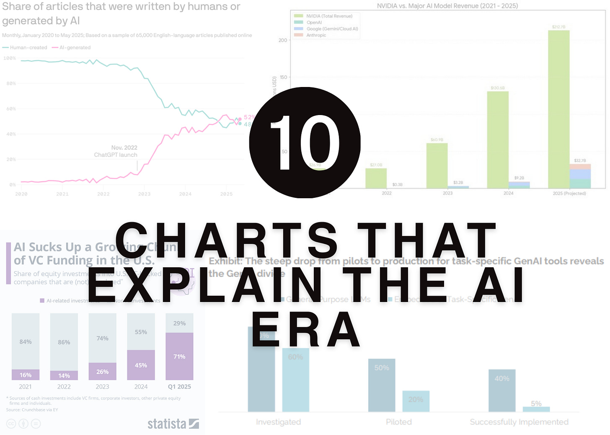](https://substackcdn.com/image/fetch/$s_!HC5p!,f_auto,q_auto:good,fl_progressive:steep/https%3A%2F%2Fsubstack-post-media.s3.amazonaws.com%2Fpublic%2Fimages%2F442abcd9-46c5-4302-9757-3b707fc4aadd_2000x1429.png)

I have always loved data. Charts allow us to visualize data, which in turn reveals perspectives we hadn’t considered. A chart can validate something you long suspected, or challenge a bias you didn’t even realize you had. I have a penchant for collecting interesting charts, and I have shared many of them here with you.

You can read the original posts here:

* *[Ten Charts I Can’t Stop Thinking About](https://debliu.substack.com/p/ten-charts-i-cant-stop-thinking-about)*
* *[Ten More Charts I Can’t Stop Thinking](https://debliu.substack.com/p/ten-more-charts-i-cant-stop-thinking)**[About](https://debliu.substack.com/p/ten-more-charts-i-cant-stop-thinking)*
* *[Ten Charts I Can’t Stop Thinking About - Part Three](https://debliu.substack.com/p/ten-charts-i-cant-stop-thinking-about-855)*
* *[Ten More Charts I Can’t Stop Thinking About - Fourth Edition](https://debliu.substack.com/p/ten-more-charts-i-cant-stop-thinking-beb)*

Today, at a time when AI is moving faster than any technology before it, it can feel like a runaway train of progress. Data provides much-needed grounding, and charts can help us demystify the buzz and also offer clarity. I’ve collected these charts that illustrate the AI era and shared them below, along with my thoughts.

## **1. Gen AI Launched With A Bang, and Consumers Felt It**

[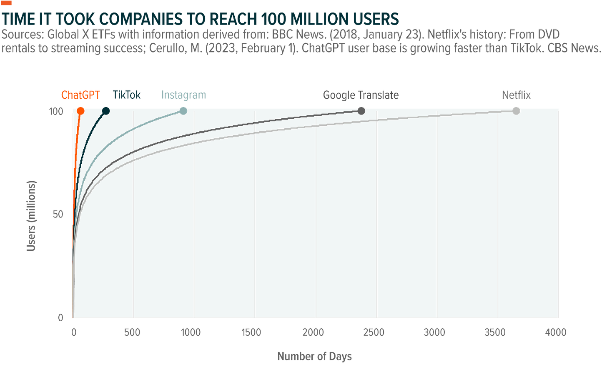](https://substackcdn.com/image/fetch/$s_!517z!,f_auto,q_auto:good,fl_progressive:steep/https%3A%2F%2Fsubstack-post-media.s3.amazonaws.com%2Fpublic%2Fimages%2Fbce6e5fd-6fb8-41b3-9cdc-ebb3f4d1bfff_1600x994.png)

Image: <https://www.globalxetfs.com/articles/generative-ai-explained>

The ChatGPT adoption curve is a chart I always think about. ChatGPT 3.5 launched in November 2022, and within just two months, ChatGPT hit 100M users, faster than many modern tech tools.

Something that always seemed five years away (after decades of investments) arrived with an unmistakable impact, making a huge splash that everyone felt. AI went from abstract to real almost overnight. Consumers adopted it at an incredible rate of speed, and it wasn’t just a flash in the pan. [Retention was 80%+ after one month](https://www.linkedin.com/posts/debarghyadas_chatgpts-product-retention-curves-are-a-activity-7338384752393035776-ice1/) (crazy high), and the curve up at the end (60%+) means people are coming back more. Whether it is for personal or professional use cases, users are clearly finding reasons to stick around past the hype.

## **2. AI Adoption is Faster Than the Internet and Cellphones**

[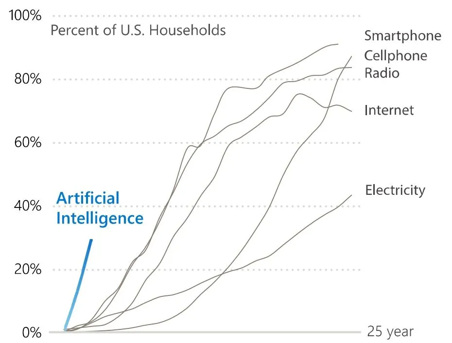](https://substackcdn.com/image/fetch/$s_!qIHG!,f_auto,q_auto:good,fl_progressive:steep/https%3A%2F%2Fsubstack-post-media.s3.amazonaws.com%2Fpublic%2Fimages%2Fe4508e3e-89ea-47a9-8a1f-11772b3faa42_930x706.png)

Image: [Winbuzzer](https://winbuzzer.com/2025/10/30/microsoft-ai-is-the-fastest-adopted-tech-in-human-history-with-a-drastic-global-divide-xcxwbn/), [Microsoft](https://www.microsoft.com/en-us/research/wp-content/uploads/2025/10/Microsoft-AI-Diffusion-Report.pdf)

This chart puts AI’s adoption in the context of other revolutionary technologies, not just internet products. Each of these technologies was the AI of its time. They changed so much of the world around it, yet still took years to take hold. Not so with AI.

Usually, there is an S-curve of adoption. A few early folks picked up the technology (I am looking at you Gordon Gekko), but it didn’t hit widespread adoption for years. AI was different because there wasn’t a long ramp. Usage began immediately, speaking to the clear value people felt from the start.

## **3. Cost to Compute Far Exceeds the Revenues**

[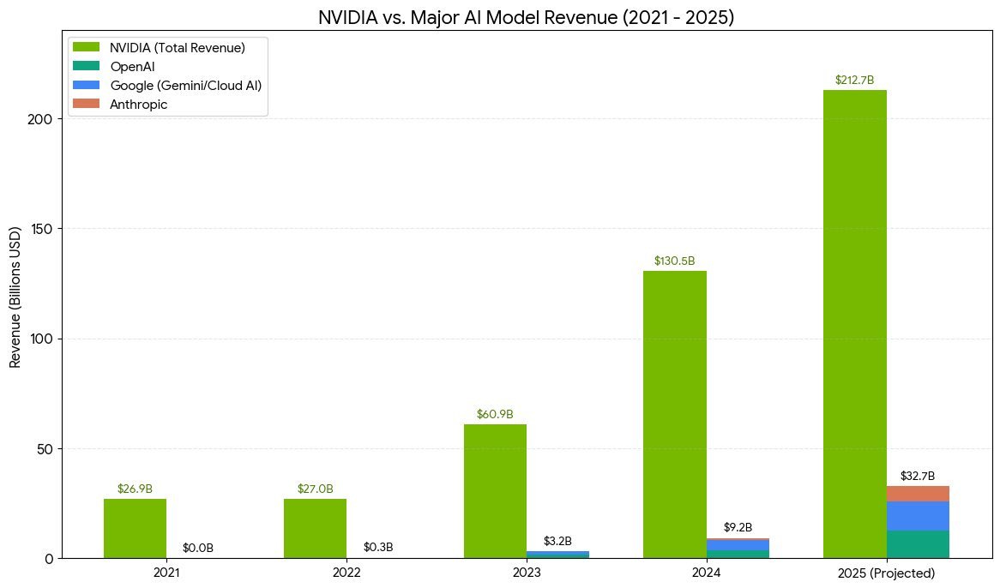](https://substackcdn.com/image/fetch/$s_!cQP5!,f_auto,q_auto:good,fl_progressive:steep/https%3A%2F%2Fsubstack-post-media.s3.amazonaws.com%2Fpublic%2Fimages%2Fb695a4b0-9431-4701-80a9-8daa5e6fc7e1_1166x686.png)

Image: *[A1a2research](https://x.com/a1a2research/status/2013019678268936387/photo/1)*

This chart is a quiet but critical one.

Despite massive usage, the cost of training and running large models far exceeds the revenue they generate today. That tells us where we are in the cycle. We are still building the rails on which the whole system is built.

This is an investment phase, not a harvest phase. Just like early internet days, there was a lot of investment, but it takes time for business models to shake out. [Pets.com](http://pets.com), [Webvan.com](http://webvan.com), and [Kosmo.com](http://kosmo.com) fell by the wayside, but what emerged later was Chewy, Instacart, and DoorDash. We still need a lot of CPUs to do the training to extract value, and it looks like that phase will last for quite a while longer.

## **4. Capital is Highly Concentrated**

[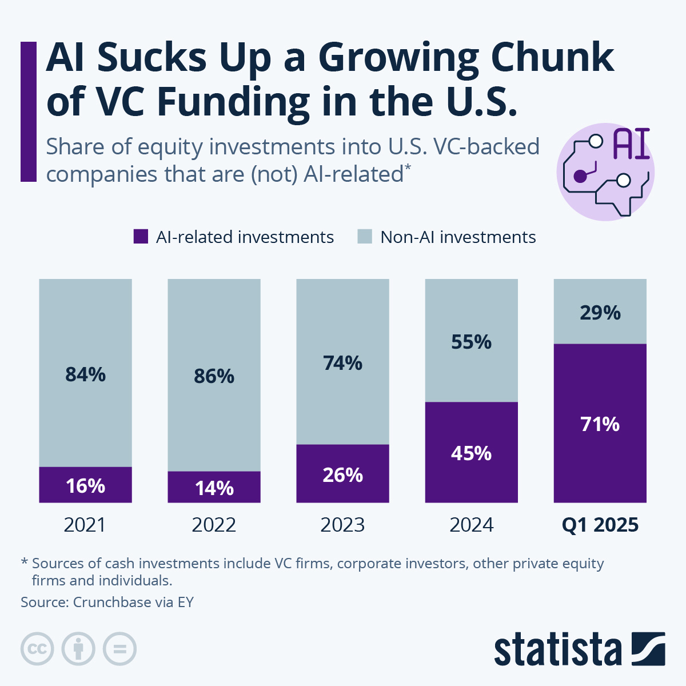](https://substackcdn.com/image/fetch/$s_!AN-X!,f_auto,q_auto:good,fl_progressive:steep/https%3A%2F%2Fsubstack-post-media.s3.amazonaws.com%2Fpublic%2Fimages%2F565b87fe-7353-409b-b7f3-195077e76c18_1200x1200.png)

Image: *[STATISTA](https://www.statista.com/chart/33346/ai-share-of-vc-investments-in-the-us/?srsltid=AfmBOoquLe7mBaLGRYlWOEUjkACmg6MUNP0bTxo5GmZqzc-qvb1dyM2o)*

[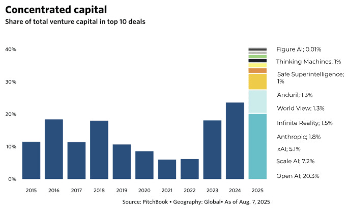](https://substackcdn.com/image/fetch/$s_!kgkw!,f_auto,q_auto:good,fl_progressive:steep/https%3A%2F%2Fsubstack-post-media.s3.amazonaws.com%2Fpublic%2Fimages%2Fe4cac9c8-07a3-4590-9949-010f257159ab_684x414.png)

Image: [SaaStr](https://www.saastr.com/venture-has-never-been-more-concentrated-40-of-vc-going-to-just-10-deals/), Perspectives

This chart shows capital concentrating heavily in a small number of companies, models, and infrastructure providers. The power law is extreme. A handful of players control the foundational layers of AI, and that is where a lot of money is going. Beyond that, we are seeing the emergence of applications and businesses on those foundational layers, all built with AI. But that means other spaces are getting much less investment during this time.

## **5. AI is Changing Industries and How Things Are Done**

[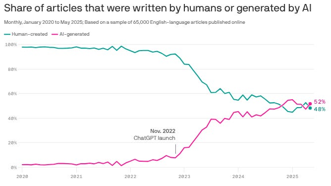](https://substackcdn.com/image/fetch/$s_!_hVn!,f_auto,q_auto:good,fl_progressive:steep/https%3A%2F%2Fsubstack-post-media.s3.amazonaws.com%2Fpublic%2Fimages%2F79c7c4b1-e7ad-4822-a8c8-2584b4171e02_668x375.png)

Image: *[AXIOS](https://www.axios.com/2025/10/14/ai-generated-writing-humans)*

This chart is startling because of how quickly it became true.

In under two years, AI-generated content crossed the halfway mark. Entire industries changed almost overnight. The takeaway is not that AI content is inherently bad, but that in a short time, original content is now a minority of what is available. What happens when AI is training on AI writing? Do models improve or degrade? The jury is out.

## **6. Companies Are Struggling to Achieve ROI**

[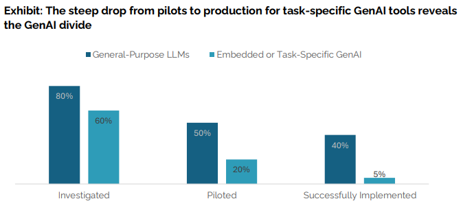](https://substackcdn.com/image/fetch/$s_!tM5d!,f_auto,q_auto:good,fl_progressive:steep/https%3A%2F%2Fsubstack-post-media.s3.amazonaws.com%2Fpublic%2Fimages%2Faed30fa0-08ac-4cb8-a4a7-42d9182c1670_671x306.png)

[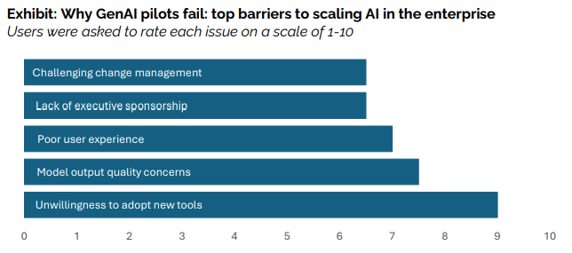](https://substackcdn.com/image/fetch/$s_!vauA!,f_auto,q_auto:good,fl_progressive:steep/https%3A%2F%2Fsubstack-post-media.s3.amazonaws.com%2Fpublic%2Fimages%2F65802d04-6b15-460e-ae0c-446ffbe9d478_644x285.png)

Images: *[MIT](https://mlq.ai/media/quarterly_decks/v0.1_State_of_AI_in_Business_2025_Report.pdf)*

The MIT data showing that roughly 95% of embedded or task-specific AI pilots fail to reach production is sobering.

There was a rush of excitement about how AI was going to change everything, but it didn’t translate to tangible business results. AI experiments launched without changing workflows, incentives, or decision-making won’t succeed.

AI does not work if we don’t include the human factor. If people don’t trust the tools or they are unwilling to adopt them, these pilots will continue to fail. Companies need to take into account that just implementing AI is not enough. It requires integration of the work into what people are doing, and the work has to be redesigned to integrate both AI tasks and human input.

## **7. AI is More Beneficial for Executives Than Frontline Workers**

[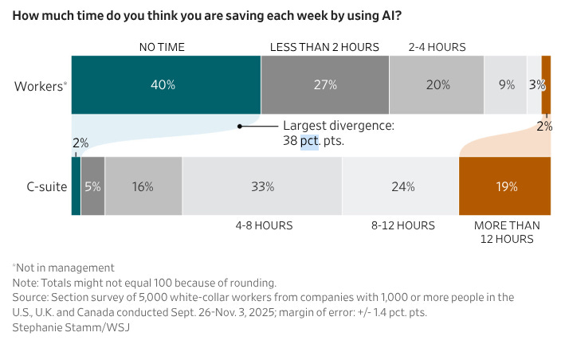](https://substackcdn.com/image/fetch/$s_!k4Lk!,f_auto,q_auto:good,fl_progressive:steep/https%3A%2F%2Fsubstack-post-media.s3.amazonaws.com%2Fpublic%2Fimages%2F9739077b-baec-487a-92f5-4acf16612f0c_704x432.png)

Image: *[Wall Street Journal](https://www.wsj.com/lifestyle/workplace/ceos-say-ai-is-making-work-more-efficient-employees-tell-a-different-story-6613ce9d?st=vnnWYh&reflink=desktopwebshare_permalink)*

This chart makes the unevenness visible.

Executives report larger time savings than frontline employees. That makes sense. Many AI tools are optimized for summarizing, synthesizing, and decision support, work that maps closely to executive responsibilities.

Further down in the organization, workers are stuck with antiquated processes, tools, and workflows. The interdependency makes it hard for any individual worker to effect change. Without intentional design and thoughtful adoption, AI will quietly widen internal value creation.

## **8. Women Use AI Much Less Than Men**

[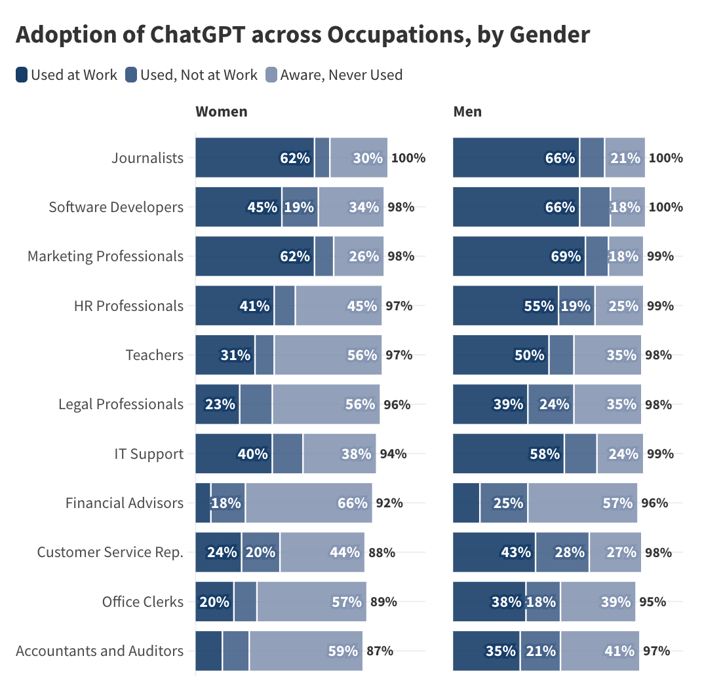](https://substackcdn.com/image/fetch/$s_!YHoD!,f_auto,q_auto:good,fl_progressive:steep/https%3A%2F%2Fsubstack-post-media.s3.amazonaws.com%2Fpublic%2Fimages%2Fa3f2d724-ff07-4c50-bfdf-8be1ded31cc1_1074x1054.png)

Image: *[University Of Chicago](https://bfi.uchicago.edu/insights/the-adoption-of-chatgpt/)*

Even within the same roles and industries, women use AI tools at lower rates than men. [Many women report feeling like AI is a shortcut or cheating](https://www.library.hbs.edu/working-knowledge/women-are-avoiding-using-artificial-intelligence-can-that-hurt-their-careers), and thus they avoid it. I was speaking with a recruiter at a big Silicon Valley firm, and she said that without AI on the resume, candidates are at a significant disadvantage. Imagine you were applying for a job at a tech company in 2000, but didn’t use the internet. Or you were working in consumer tech in 2013, and you said you didn’t understand mobile.

Adoption gaps compound over time, especially in fast-moving technological shifts, and companies are looking for talent that is AI-ready and can demonstrate proficiency.

### **9. AI Is Changing the Employment Landscape**

[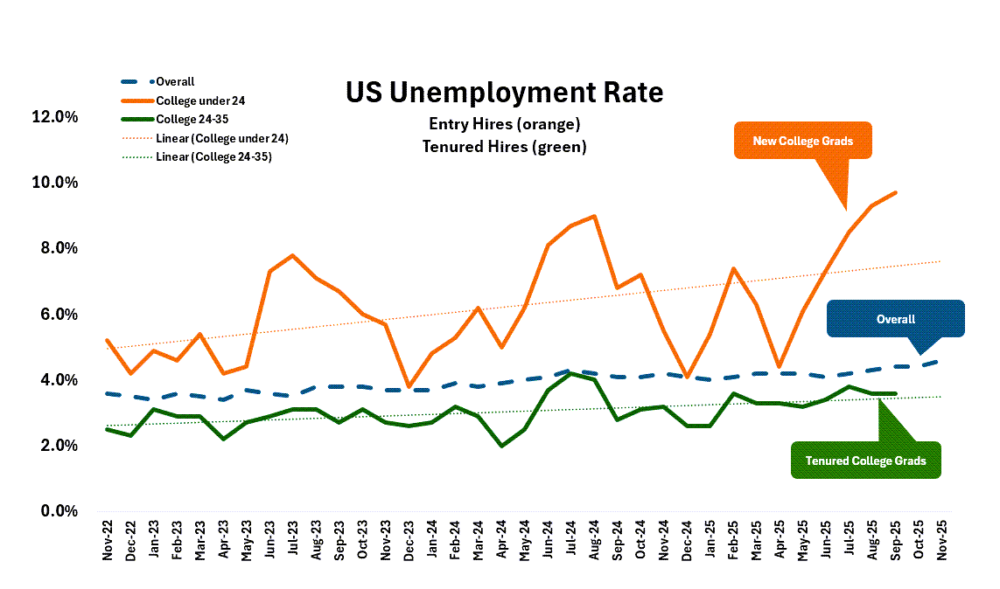](https://substackcdn.com/image/fetch/$s_!0SBe!,f_auto,q_auto:good,fl_progressive:steep/https%3A%2F%2Fsubstack-post-media.s3.amazonaws.com%2Fpublic%2Fimages%2Fe0798fca-c59f-4718-b7a2-496ab34da0c2_1143x674.png)

Image: *[Josh Bersin](https://joshbersin.com/2025/12/yes-ai-is-really-impacting-the-job-market-heres-what-to-do/)*

The labor market shows that new college graduates are being hit first.

Many industries employ on-the-job training. Entry-level work is often structured and repetitive as you learn the ropes. But that is exactly the kind of work AI can replace. If no one starts as a copywriter, does anyone make it to editor? If there aren’t first-year associates at professional services firms, will there be partners?

This is something we need to wrestle with.

### **10. We Are Only Beginning to See What AI Can Do**

[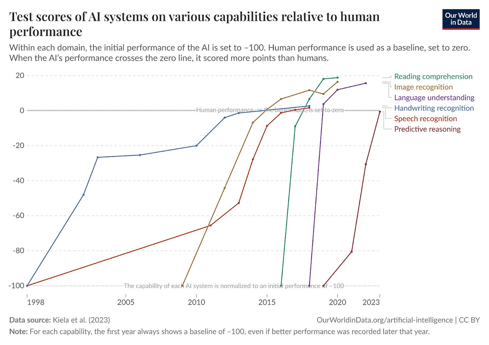](https://substackcdn.com/image/fetch/$s_!02CO!,f_auto,q_auto:good,fl_progressive:steep/https%3A%2F%2Fsubstack-post-media.s3.amazonaws.com%2Fpublic%2Fimages%2F51fda98e-d80c-4ac1-a6ec-6c68c5fa9e8a_1600x1130.png)

Image: [Our World In Data](https://ourworldindata.org/grapher/test-scores-ai-capabilities-relative-human-performance)

The final chart is the most important because it is the most humbling.

When placed alongside past technological revolutions, AI adoption is still early. What feels experimental now may look obvious in hindsight. Technology is advancing at an incredible clip. If these patterns of improvement are a guide, expect more industries and workers to be disrupted.

---

We don’t know the ultimate destination, but AI is disrupting so much, so quickly, that things are changing by weeks, not years. We ignore the implications at our own peril. I hope as you ponder the role of AI in the world, you take a moment to think about how it is affecting what you do and what you need to do to [future-proof yourself](https://debliu.substack.com/p/future-ready-thriving-in-the-age?r=3k88l).