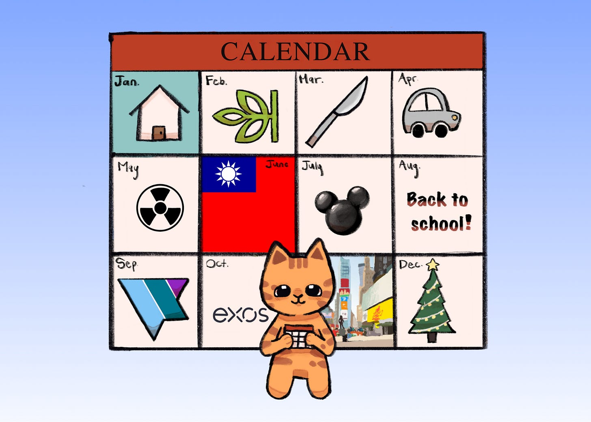
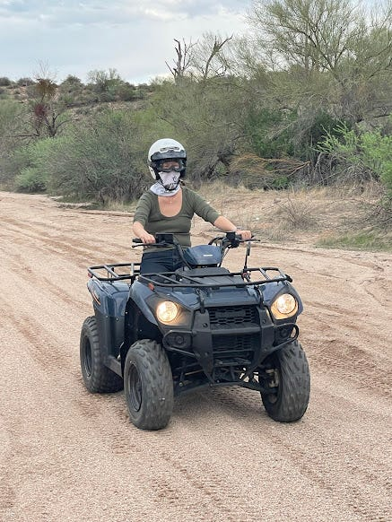
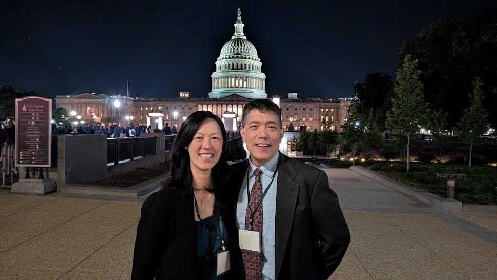
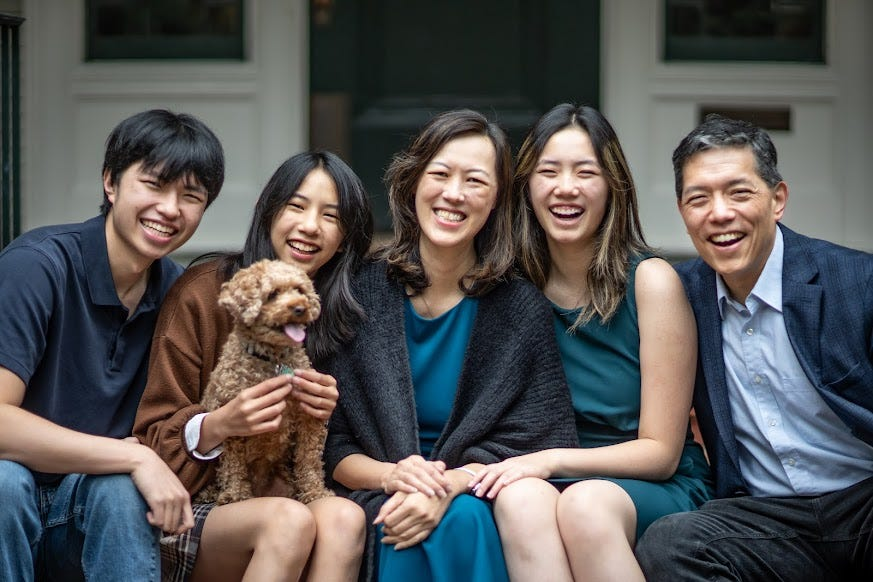
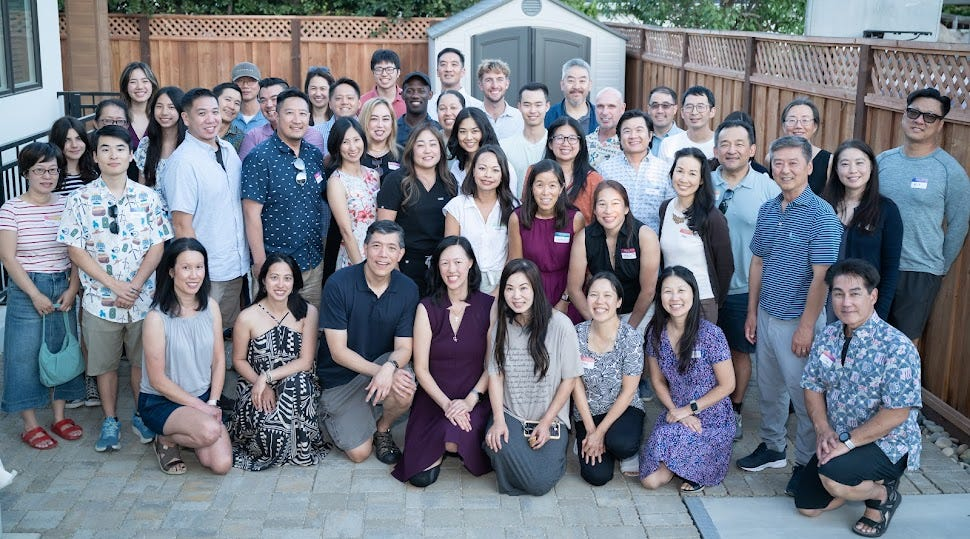
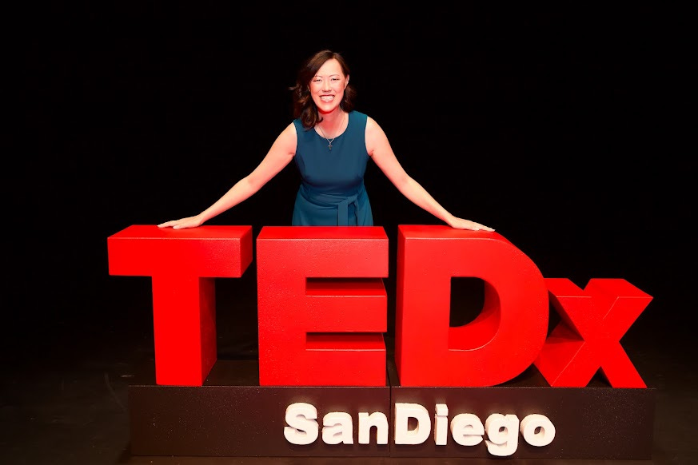
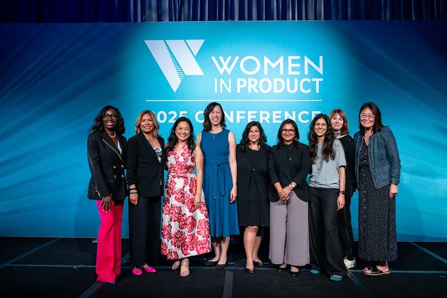
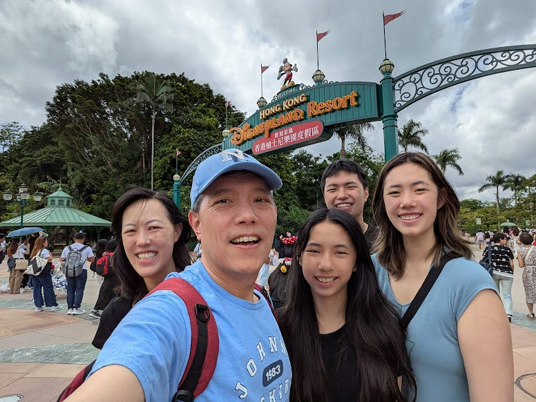

# Lessons from My Year of Yes

*What I Learned When I Opened Myself Up to More*

I have spent much of the past few years having to say no. Not out of desire, but being swamped with so much, I had to learn to prune to retain my sanity and focus on what mattered. That also meant I missed out on a lot.

From the moment I landed my first job out of business school, I have worked continuously. A week later, I started at PayPal. From there, I went from role to role, company to company, without a break in between. I would end one job on a Friday and start the next one on a Monday. I never took time off between chapters. I never left space between identities. I just put on a new badge and marched on.

Other than [pausing](https://debliu.substack.com/p/the-truth-about-maternity-leave?r=3k88l) to have [kids](https://debliu.substack.com/p/what-they-dont-tell-you-about-having?r=3k88l), I barely gave myself the chance to breathe, much less take a break. Suddenly, I woke up and more than two decades had passed since I started in tech.

I put one foot in front of the other and continued my path upward and onward. I chased forward momentum and kept building and building. I never stopped long enough to sit still, and anyone who knows me knows that stillness is not something that is in my nature.

But this year changed all that. As I worked on my [Year in Review](https://debliu.substack.com/p/writing-a-year-in-review?r=3k88l) (a practice Katia taught me), it looked totally different. This year broke the pattern. It was a year where I didn’t have a set path, and thus had the freedom to say “yes” to things that I could not have imagined.

[Subscribe now](https://debliu.substack.com/subscribe?)

### **Embracing Yes**

Early in the year, I stepped down as the CEO of Ancestry after [4 wonderful years at the company](https://debliu.substack.com/p/looking-back-and-looking-ahead?r=3k88l). My last day was set to be the same as my surgery for early-stage breast cancer. Simultaneously, my husband’s company was acquired, so we decided to take the year off together and explore our interests.

I told myself that this year, I would show up. I had missed countless events with friends and family: birthdays, anniversaries, and more. I had traveled nearly half the weeks last year, even when my mom was at home with us in hospice care. So, I wanted to be able to say yes to everyone and everything I could.

Some yeses, I did not get to choose.

I said yes to surgery. Yes to 20 rounds of radiation. Yes to being vulnerable in ways I had never practiced before. Yes to learning the limits of my body. Yes to five years of Tamoxifen, a drug with meaningful side effects, because it also cut my chances of recurrence in half.

Those yeses were necessary. They taught me that sometimes the freedom to choose means making space for things we didn’t anticipate or want, but saying yes meant embracing and running toward something rather than reluctantly accepting it.

In the middle of all of this, between diagnosis and surgery, we finally moved into a house we spent nearly four years building. The house was meant to be a place where our parents could all live together with us, but sadly, we never got to enjoy it with them. We moved in when it was still partly unfinished. I hired movers to just [move our furniture and whatever laundry we had in the baskets](https://debliu.substack.com/p/adding-not-subtracting-what-leaving?r=3k88l), and then we spent the next few months slowly bringing what we needed over.

For years before that, my mom lived with us. She had Stage IV cancer for many years, and her health was fragile. We lived carefully during Covid and even after. We rarely had people over because we didn’t want to risk her increasingly fragile health. Our home became a place of protection from the outside world, rather than a place we could invite others in. When we moved into the new house, we made a conscious decision to change that.

David had told me before we married that he wanted a home that was open to everyone. We hosted weekly Bible studies and dinner parties for years, but after mom got sick, we stopped. He continued to admire our friends, [Al and Ann Ko](https://open.substack.com/pub/debliu/p/create-your-own-table?utm_campaign=post-expanded-share&utm_medium=web), who always had others over, even when it was messy, busy, or imperfect. Now, without our parents here with us, we said yes to inviting people in. We hosted three Women In Product events, invited the Duke DTech community over, and had our friends over for our 25th anniversary. We had monthly dinner parties for friends and strangers, and we invited friends to come and stay with us.

### **Yes to Connection**

I opened up my calendar to connection. That led me to meet [Sheila](https://debliu.substack.com/p/what-happens-in-the-mirror?r=3k88l), who connected me with TEDx San Diego for a talk, where I met incredible people like [Sarah Patcher](https://debliu.substack.com/p/awkward-family-dinners-and-other?r=3k88l) and [Emily Bouchard](https://emilybouchard.com/women-power-unconscious-bias-with-deb-liu/). I had planned to speak about the book I was working on, but pivoted to [Let’s Make It Awkward](https://www.youtube.com/watch?v=a3Xja3Lmp7A) instead. Sometimes “yes” means letting go of pre-planned notions and letting it take you where it will.

I started advising founders and helping entrepreneurs make their dreams come to life. I joined the board of Poshmark after being a seller and customer for many years. I consulted for a couple of large organizations that were looking for advice. I worked with Ha on recruiting for a startup.

I said yes to writing my next book, and I created [the framework](https://debliu.substack.com/p/at-the-edge-of-whats-next-navigating?r=3k88l) that will be the basis for it. I shared the framework with dozens of people who gave feedback and insight into their transitions.

I said yes to dinners with the kids. We played board games and sang karaoke and drove each other crazy. We binged Resident Alien, Matlock, Psych, and Ghosts together. I spent late-night sessions helping Bethany with her college applications and Danielle practicing her speech for competition.

I said yes to events I could never have made before. I was attending a milestone birthday party and ran into someone who had flown in from far away just to be there. He said, “Life is too short not to celebrate every moment we have together.” I went to back-to-back holiday parties and stayed late without feeling the need to rush home.

I said yes to learning AI and understanding where this revolutionary technology can take us. I took a vibe-coding class, which led me to become a founder myself.

Saying yes meant being open to things I never could have done before and filling it with friends, connection, and possibilities.

[Share](https://debliu.substack.com/p/lessons-from-my-year-of-yes?utm_source=substack&utm_medium=email&utm_content=share&action=share)

### **What I Learned from a Year of Yes**

1. **Yes does not have to be perfect.** You do not need to see the entire path to take the first step. Your house can be messy, and your first steps can be wobbly. My mantra is “people come for connection, not perfection.”
2. **Showing up is often enough.** Don’t wait until you are ready. Sign up and do it. Improvise and learn along the way.
3. **Push yourself out of your comfort zone.** Saying yes to things you find challenging stretches your muscles in new and unexpected ways. Like any muscle, it gets stronger the more you use it.
4. **Take time to process.** The temptation of go-go-go means sometimes you leave no time to reflect. In the midst of yes, learn to sit in silence and think about what you’re learning and what you want.

After a lifetime of momentum, I let go of my identity tied to a job and joined the “[Blank Name Tag Club](https://www.linkedin.com/posts/deborahliu_%F0%9D%90%96%F0%9D%90%A1%F0%9D%90%9A%F0%9D%90%AD-%F0%9D%90%9D%F0%9D%90%A8-%F0%9D%90%B2%F0%9D%90%A8%F0%9D%90%AE-%F0%9D%90%9D%F0%9D%90%A8-a-week-after-activity-7361073348979691520-FRIz/)”. Rather than letting it feel like a loss, I created a sense of possibility. Anything and everything could fill that line, and that led me in new and unexpected directions.

I’m excited to see where the next set of yeses take me.

---

*What are you saying “yes” to this year? Let me know in the comments.*

[Leave a comment](https://debliu.substack.com/p/lessons-from-my-year-of-yes/comments)

Related *Perspectives*: