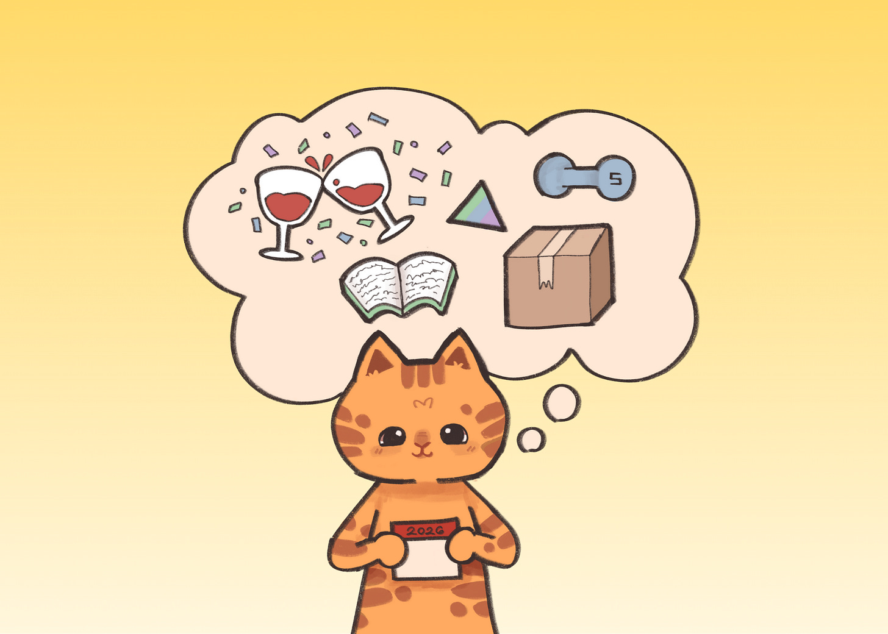

# Progress Not Perfection: Leveraging Resolutions to Change Your Life 

*Turning resolutions into habits*

Artwork by my youngest, Danielle.

I started this newsletter at the beginning of 2021. I did it on a whim, not knowing where it would take me. Now, five years later, I have written about everything and anything that comes to mind. It became my place to put my errant thoughts and deeper musings. Things that used to live in drafts and notes took shape on these pages. This Substack began as a 2021 New Year’s resolution and has become a place to document the pages and chapters of my life. Much has changed, but my tradition of starting the year with my resolutions continues.

I have been keeping New Year’s resolutions for 23 years now. For the past decade or so, I have shared them publicly, partly for accountability and partly because it forces me to be honest about what works. Some resolutions stick with me and become a permanent part of my life. Others fall away, replaced by something more relevant to the season I am in.

### **Why Resolutions**

New Year’s resolutions are often dismissed as silly or performative. Sure, everyone joins a gym. Everyone vows to eat better. Everyone promises to finally fix whatever feels broken. A new year offers a fresh start, but that momentum often sputters shortly after leaving the gate.

By mid-January, most of the best intentions are gone. [Activity data from Strava](https://runningmagazine.ca/the-scene/quitters-day-why-strava-thinks-youre-about-to-give-up-your-resolution/) showed that the second Friday in January is when most people quit their fitness goals, a day they dubbed “Quitter’s Day.” Research backs this up. [A study from the University of Scranton](https://evidencebasedliving.human.cornell.edu/blog/how-to-keep-your-new-years-resolutions/) found that fewer than 20 percent of people keep their New Year’s resolutions going two years later.

The odds are stacked against success. Yet that same study found that those who set resolutions were ten times more likely to successfully make a change than those who did not make any resolutions at all.

[Subscribe now](https://debliu.substack.com/subscribe?)

### **Resolutions as a Tool**

I have used resolutions as a tool to change my life in real and very positive ways. Each year, I pick something I want to change about myself and embark on a journey to see if I can actually change it. Sometimes things fall by the wayside, but many times they stick. The things that stick end up on my permanent list, and I pick something else to work on the following year.

The reason this approach has worked for me, when it seems to fail for others, is that I have figured out how to make resolutions part of my life.

What over two decades of this has taught me is that resolutions are not about perfection. They are about progress, made day by day. These small habits get layered on top of one another, year after year, until one day you look back and realize your life looks very different than it once did.

Because of these resolutions, I no longer drink soda, something I once loved. That habit has been gone for over two decades, and I do not miss it. I floss every day. I work out nearly every night. I eat much less sugar. I practice intermittent fasting. I write regularly. I cook for my family. I sleep more. I have simplified my life in ways that once felt overwhelming.

Every single one of these habits was hard in the beginning, but at some point, they became second nature. Now, I rarely have to think about them because they are ingrained habits, part of my routine, like brushing my teeth in the morning or locking the doors at night. In the end, it is not willpower that carries you forward as much as making a habit so integrated into your life that it feels wrong when you do not do it.

Research on habit formation supports this. [A 2009 study from University College London](https://www.ucl.ac.uk/news/2009/aug/how-long-does-it-take-form-habit) found that habits take about 66 days to form. That is roughly two months, which is long after many people have given up on their resolutions. But if you can stay committed for those first two months, you are far more likely to stick with it over the long term.

### **Making Things Stick**

Based on my track record, you might think I am good at this. In reality, failure is part of the process.

1. **Seek accountability**

Years ago, I started practicing intermittent fasting in the loosest possible way. I simply stopped eating after 8:00 pm most nights. It worked well enough, but it was inconsistent. I did my best, but I was too casual about it. Some weeks were better than others. This year, I started using the Zero app to track my fasting windows, and suddenly I had data. It revealed patterns I could not see when everything lived only in my head.

2. **Pick doable things**

We have a habit of choosing goals that feel insurmountable. If your goal is to eat a bear, you have to do it one bite at a time. Rather than saying you are going to work out for an hour every day at the gym, start with something more achievable. Maybe increase your steps by 500 per day until you hit 10,000. Or aim for 120 minutes of exercise per week. Pick something within reach of your daily activities. [Research from Stanford](https://lifestylemedicine.stanford.edu/5-ways-to-make-healthy-habits-stick/) shows that habits stick best when they are small, easy, and anchored to something you already do.

3. **Set yourself up for success**

My leadership coach, Katia, once watched me struggle at work and kept telling me, “Swim downstream.” It took me a long time to understand what she meant. She was telling me to make things easier on myself.

When I was diagnosed with peri-osteoporosis a few years ago, I knew I needed to start weight training. I already worked out regularly, but I needed to lift heavy things to build bone density. So I bought a Tonal and set it up near my bedroom. Now I weight train four or five times a week. No excuses. I keep my workout shoes right next to it, and I know I am always about fifteen minutes away from being done for the day.

4. **Seek progress, not perfection**

Most people fail because they adopt an all-or-nothing mindset. Instead, seek more or less in your life. Want to read a book a week? If you miss one week, read more the next. Want to get healthier? Focus on taking a walk after dinner. Missed out on quality time with family? Redouble your efforts the following week.

Rather than making it all or nothing, give yourself space to make progress every day. Seek progress, not perfection. More days with better sleep. Less sugar in your diet. A larger vocabulary in the language you want to learn.

[Share](https://debliu.substack.com/p/my-2026-new-years-resolutions?utm_source=substack&utm_medium=email&utm_content=share&action=share)

---

Habits are not static. We are always growing and evolving, and we can change if we allow ourselves to. Each year, I use the New Year as a chance to iterate toward a better version of myself. Step by step, year by year, I am building new muscles, both figuratively and literally.

Some changes come easily. Others take years to incorporate. But over time, I learned to swim downstream. Looking back on this two-decade journey, I see just how far I have come. That is why I keep doing this.

Today is the first day of 2026. Make a commitment to yourself to make a change. Pick something you can master and start taking steps toward it. Do not let another year, or even another day, pass without making progress toward who you want to be.

[Leave a comment](https://debliu.substack.com/p/my-2026-new-years-resolutions/comments)

---

### **My 2026 New Year’s Resolutions**

Each year for the past 23 years and counting, I have set New Year’s Resolutions. And for the past 11 years or so, I have posted them on Facebook to keep myself accountable. Some of these resolutions I keep and turn into regular habits, while others I discard in favor of other things. Thanks to these commitments, I no longer drink soda (21 years), floss daily (18 years), work out every night (13 years), eat less sugar (9 years), practice intermittent fasting (8 years), write regularly (7 years), cook for my family (6 years), get more sleep (4 years), and simplification (3 years), and weight training (1 year).

### **How last year’s resolutions went**

[Here were my 2025 Resolutions](https://debliu.substack.com/p/ten-ways-you-can-use-new-years-resolutions) that I wrote about 1 year ago.

* **Connect:** We moved into a new house this year and it was much more suited to entertaining. We hosted several large events including a 25th anniversary party and monthly dinner parties. Though we are still getting used to opening our home, it was a good start. 9/10
* **Health:** I was diagnosed with early stage breast cancer and was successfully treated (yay!). I started weight training for early bone loss, and I have been eating much healthier. I took intermittent fasting much more seriously and ended up losing 10 lbs in the process. Now if only one of my kids didn’t love making so much… 9/10
* **Simplify:** In January, I forced the move from our old house to the new one by just relocating our furniture and three loads of laundry. We went back to get what we really needed which led us to getting rid of about ⅓ of what we owned, but we ended up with way more stuff than we anticipated still. 7/10
* **Learn:** I wanted to learn something new and that I did! After leaving my job, I spent a Year of Yes where I tried many different things. I started working on my new book, explored new interests, and deep dived into the world of AI. More on that later. I ended up “reading” well over 20 books as well! 8/10

Overall, this was a great year for resolutions!

### **My 2026 Resolutions**

* **Connect:** I want to continue to welcome people into our home and connect with others through events, dinners, and the like. I also want to be a conduit for others to connect with each other.
* **Health:** I want to continue weight training while also working on my balance. I also want to start testing Pilates and more stretching exercises. I will continue to intermittently fast, but I want to eat more whole foods and less ultra-processed food.
* **Simplify:** After years of making moderate progress, I would like to continue to edit the things in my life. I want to also finally clean out the garage and sort through our old paperwork. Less stuff and more freedom.
* **Challenging myself:** After my Year of Yes, I want to continue to learn new skills and continue to grow. I want to improve my Chinese, continue to improve my knowledge of AI, and do more writing and speaking. I want to make progress on my next book as well.

See you next year, same time, same place.

**2025 Resolutions:** <https://debliu.substack.com/p/ten-ways-you-can-use-new-years-resolutions>

**2024 Resolutions:** <https://debliu.substack.com/p/ignorance-is-bliss-until-it-comes>

**2023 Resolutions:** <https://debliu.substack.com/p/new-years-resolutions-and-the-power>

**2022 Resolutions:** <https://debliu.substack.com/p/2022-new-years-resolutions>

**2021 Resolutions:** <https://debliu.substack.com/p/resolve-to-progress>