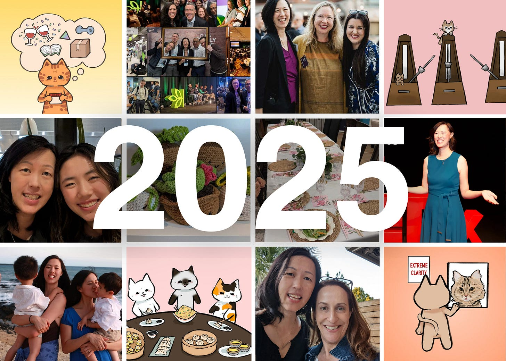

# Perspectives 2025 in Review

*The most popular and poignant perspectives of 2025*

Last year was a significant one for me, with exciting new opportunities, difficult lows, and big changes; but it was also a big year for Perspectives. Next week, I’ll share my learnings from 2025, but this week, I wanted to share some highlights from this incredible community we’re building together.

For starters, there are over 4,000 more of you than there were in 2024. Welcome! I never thought back in 2021 that Perspectives would grow (and continue to grow) as it has. This newsletter is a labor of love. Each week, I think I am out of things to say, and every week, I am inspired to write something because of all of you.

Across socials, Substack, email, and LinkedIn, Perspectives has reached hundreds of thousands readers, connecting people across industries and cultures through shared interests and values: family, parenthood, AI, heritage, health, career growth, and leadership. Late last year, we relaunched [Dear Perspectives](https://www.linkedin.com/newsletters/6928783823941877760/), a LinkedIn newsletter companion to Perspectives, where you can read answers to your questions. That newsletter quickly grew with over 2,000 new faces.

Together, we’ve swapped stories about everything from grief and decluttering to napkins and first jobs. We’ve discovered commonalities, learned how to make things awkward, bonded over being the “lecture” parent, and more. I started this blog as a way to untangle my thoughts and share what I felt may be helpful to others on their journey, even as I walked my own. Looking back at 2025, I can see that I am not working them out alone.

### **Top 5’s of 2025**

Here’s our 2025 highlight reel. Catch up on anything you missed below.

**Top 5 LinkedIn Posts:**

These LinkedIn posts clearly resonated with so many of you, as they were my most popular posts on the platform last year.

1. [My Ancestry exit](https://www.linkedin.com/feed/update/urn:li:activity:7285415620509159425/) announcement was a bittersweet moment.
2. My post about the [2025 Women in the Workplace](https://www.linkedin.com/feed/update/urn:li:activity:7404223955274022912/) report. The ambition gap is widening, and women need more support inside and outside of the office to recover that lost ground.
3. Bethany and I shared our tips for [teaching kids about money](https://www.linkedin.com/feed/update/urn:li:activity:7382105041865945088/); we also had the opportunity to share those tips at the JP Morgan Asian American Summit. Dave told me I’m not allowed to cut napkins in half anymore.
4. I shared guidance for [building executive presence](https://www.linkedin.com/feed/update/urn:li:activity:7330605611967008768/), a cheat sheet I wish I’d had as an introverted manager, but any professional can use to elevate their career.
5. About a week after my Ancestry exit, I shared [what I was planning to do next](https://www.linkedin.com/feed/update/urn:li:activity:7288252337154863104/). (Which, after two decades of nonstop work, was a healthy dose of nothing!)

**Top 5 Substack Articles:**

The Stacks readers loved most from 2025.

[Subscribe now](https://debliu.substack.com/subscribe?)

**My Top 5 Perspectives:**

These are my personal favorites from 2025.

### **Featured Guest Writers**

Last year, we had the opportunity to learn from guest contributors who introduced us to new perspectives and resonant stories. I would like to extend a special thank you to the friends and colleagues who joined us in 2025:

* **Audrey Wisch**, CEO and co-founder of Curious Cardinals, shared [what parents need to know](https://debliu.substack.com/p/what-every-parent-should-know-about?r=3k88l) to prepare kids to thrive in an AI future.
* My surprise cousin, **Kat Lieu**, shared her story of [trading in her white coat for an apron](https://debliu.substack.com/p/from-white-coats-to-chiffon-cakes?r=3k88l), and how food connects us all (to ourselves and each other). As a bonus, this guest article included a wonderful Taiwanese Snowflake Crisp recipe (Kat’s favorite).
* Former perfectionist and recovering overachiever **Yue Zhao** (ex-Instagram, Thumbtack) challenged us to view [failure as a feature](https://debliu.substack.com/p/failure-as-a-feature-not-a-bug?r=3k88l), not a bug, of success.
* My new friend **Sheila Gujrathi, MD**, talked about the power of [mirrors in our lives](https://debliu.substack.com/p/what-happens-in-the-mirror?r=3k88l); she shared the touching story of her incredible mother as her first mirror, and the journey she took to becoming her own.
* **Marily Nika** expounded on the [dawn of the AI Product Builder](https://debliu.substack.com/p/debunking-the-myths-of-ai-and-product?r=3k88l) and what it takes to succeed as a PM in the age of AI.
* My eldest daughter, **Bethany**, authored a retrospective essay, sharing what [she’s learned from watching my example](https://debliu.substack.com/p/what-i-learned-from-my-mom-an-essay?r=3k88l). (It wasn’t as bad as I thought it would be!)
* My sister, **Caroline**, peeled back the curtain to talk about [her life behind the spotlight](https://debliu.substack.com/p/success-rewritten-my-life-behind?r=3k88l), and how success can be found in many ways beyond climbing the ladder.

### **The Art of Perspectives**

Last year, I decided I wanted Perspectives to have a unique, signature look. When my youngest daughter heard I was using AI to create custom images for my Substack cover photos, she was having none of it. So, beginning in September, she insisted on hand-illustrating all of my cover images. Each Sunday, she illustrates an original image to match the theme of the article I’ve written for the coming week.

Here are my top 5 favorite illustrations she created for Perspectives this year:

---

Whether you are a casual reader of Perspectives or an every-newsletter devotee, thank you for being here. I’m excited to see what 2026 holds for us. We have some really great things planned for the year.

Is there anything you’d like to see me write about this year? Please let me know in the comments.

[Leave a comment](https://debliu.substack.com/p/perspectives-2025-in-review/comments)