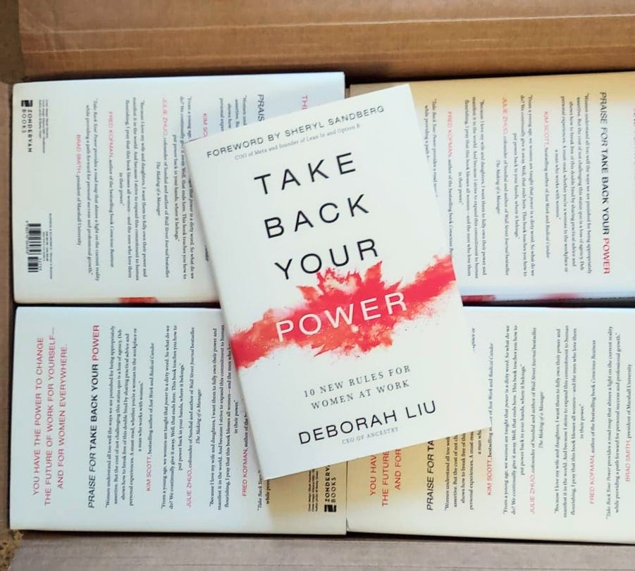
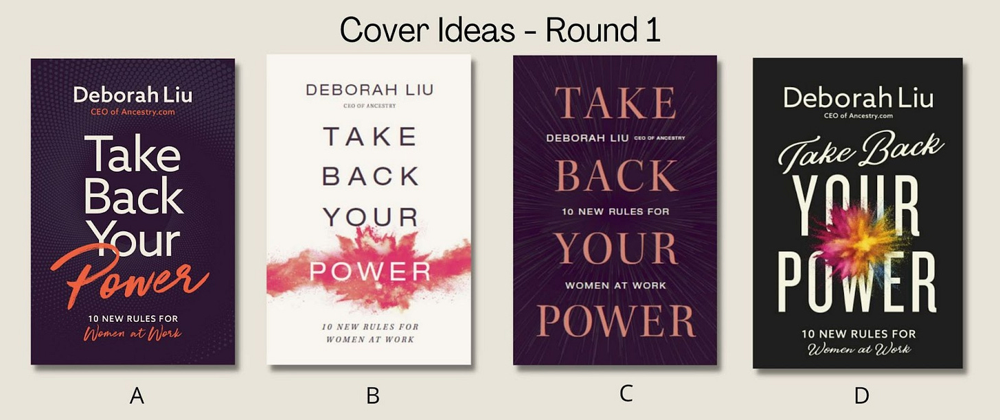
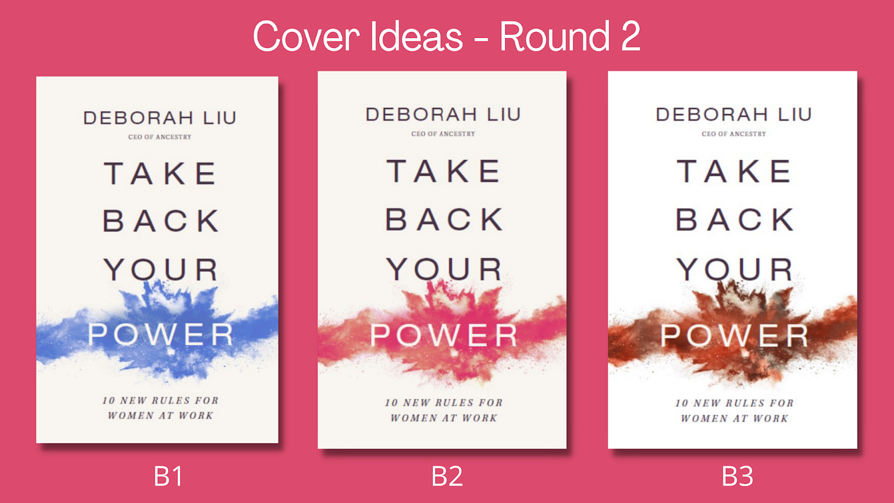
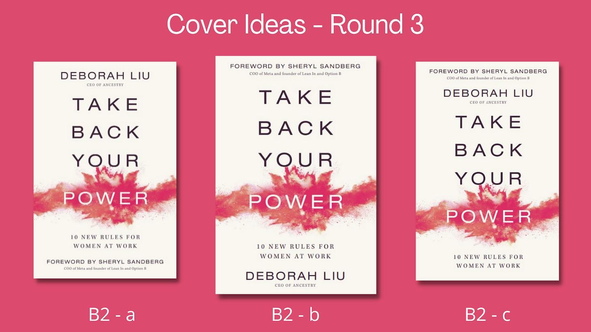

# Behind the Scenes: Book Cover Edition

*Other things you don’t think about when writing a book*

They have arrived!

There was a time when I thought writing a book was actually about, well, *writing*. Putting words on a page. I had this idea that it would just take a few months in front of a computer, maybe a couple of phone calls with a publisher, and then somehow, miraculously, I would be holding a published book in my hands.

Boy, was I wrong. From idea to execution to shipping, [publishing a book is way more complex than shipping software](https://debliu.substack.com/p/perception-vs-reality). Because it is a tangible object, decisions that you make upfront will benefit or haunt you in the months and years after it’s been finalized. Things you didn’t consider as you were drafting will dawn on you after you’ve submitted the final draft, and as your writing evolves, you may find yourself wishing you had done things differently. Now I understand why authors put out second editions and updated versions: they want to make edits and tweaks. They want to fix or change the things they regret, or add things that they missed in the original edition. Even when you finish the manuscript, the publishing process is far from over.

Perspectives is a reader-supported publication. To receive new posts and support my work, consider becoming a free or paid subscriber.

In less than 14 days, my first book, *Take Back Your Power*, will be released. It is the culmination of a nearly four-year process, one that started with a single, impulsive statement: “I will write a book.” That one decision, after a long and circuitous path, has brought us to where we are today.

In [my perception versus reality post](https://debliu.substack.com/p/perception-vs-reality), I talk more about my original preconceptions about publishing a book, and how there was so much more to it than I first thought. Today, I want to discuss a few of the steps in that process that may seem simple, but are actually quite complicated—in particular, choosing a cover. Whether you’re an aspiring author or simply curious about the publishing process, I hope this post gives you an interesting inside look.

After 20 years in the tech industry, I’ve come to understand the ways that we deliver the technology we use. But publishing a book has taught me so much about how the presentation of a physical object can affect the ways people perceive it. When it comes to reaching an audience, that presentation becomes critical.

The [Diamon Sutra](https://www.history.com/topics/inventions/printing-press#:~:text=The%20Diamond%20Sutra%2C%20a%20Buddhist,carved%20wood%20blocks%20in%20reverse.) from 9th century China is considered to be the first printed book in the world, created using words carved in reverse. The first mass-produced book, also published in China during the 13th century, was printed using moveable characters, and it was not until the 15th century that the [Gutenburg Bible](https://en.wikipedia.org/wiki/Gutenberg_Bible), the first book printed using moveable letters, was published. Printed books have become firmly cemented in human history in the hundreds of years since then, capturing the imaginations of millions—including me.

Books have always held a fascination for me. They are the physical embodiment of a person’s ideas, words, research, and creativity, and that is a powerful thing. **When you hold a book in your hand, you are holding someone’s dreams in a corporeal form.**

That is why selecting the cover is so important. It is one of a hundred tasks that are involved in delivering a book, but it is also critical to the entirety of the endeavor. The cover is the first thing anyone will see when they look at your book. How do you use it to convey your message? What font should you use? Serif or sans serif? What should the color scheme be? Bright and vibrant, or reserved and intriguing? What other information needs to be included on the front?

As I finalized my book, I found myself having to consider all these little details I had never thought about before. It was a lot to take in. The publisher, Zondervan, was an excellent partner, and they gave me a great deal of leeway in the process while supporting my point of view. We discussed at length how we wanted the cover to feel, and what elements would be needed. These included:

1. Title: ***Take Back Your Power*** — all in uppercase letters.
2. Subtitle: ***Ten New Rules For Women at Work***— also in all uppercase.
3. My name: It took me a while to decide whether to use Deborah or Deb. While I decided to publish under the name Deborah, I use Deb on a day-to-day basis. (There is a story behind that!)
4. Design: It needed to be something eye-catching that conveyed a sense of power.

Once we had established what the cover would need to include, I sent along some examples to give an idea of the kinds of covers I admired. From there, the publisher proposed the following options:

All four were very different. Purple, appearing on Cover A and Cover C, is my favorite color, but both seemed dark and muted. I liked the look of Cover D, with the black background, but the splash of color seemed to take away from the words “Your Power” rather than contribute to them.

But what about a cream or white cover? There are a million books out there by women authors with similar backgrounds, and I was a little worried about that, but something about it caught my attention.

These were my notes on the different styles:

* *A. The font is simple but the background is dark. The script, while elegant, can be hard to read (what does the last line say?). The orange-red on the purple was not a favorite.*
* *B. The background is clean. The font is easy to read. The splash accentuated the word “POWER” but kept it easy to read.*
* *C. The serif font is not as clean as sans serif. The color of the words “Take Back Your Power” is muted against the darker-colored background. The highlight in the background was nice, but a bit hard to see.*
* *D. The script font on the cover wasn’t as easy to read. I liked the eye-catching splash, but it covered the words. Much like A, the last line was hard to read.*

I then shared the images with my agent and several friends to get their thoughts. Nearly all of them agreed on Cover B. I also felt drawn to it, so that was the design we chose. There were multiple color options for Cover B and Cover D, so I went back and reviewed all of the alternate styles for Cover B to see if there was something that resonated better than the red.

Though a pink-red splash against an off-white background was more feminine than I usually am (my husband jokes that my entire closet is black, gray, and blue), I thought this cover represented the material best. In Chinese culture, red is auspicious and celebratory. It represents vitality and power, so that was how we decided to stick with the initial design.

Even with the cover design chosen, there was still more work to be done. While I had completed the book, the publisher asked me who I wanted to write the foreword. I didn’t even realize I needed one! I gave some thought to who would best encapsulate the voice and message of the book, and Sheryl immediately came to mind. She has been my mentor and sponsor for over a decade, so I approached her about it. I expected her to let me down gently, but surprisingly, she said yes.

Once the foreword was written and finalized, it was back to the design table when the publisher asked me how I wanted to feature Sheryl’s name on the cover. Cue yet another decision I had to consider. The amazing Zondervan design team played around with a few options, and there was a flurry of emails back and forth debating each of them. Should my name be at the top or hers? Were there too many words jammed close together? In the end, we went with Cover B2 - b, which spaced our names out and gave more breathing room to all of the different elements.

But there was still more. I needed to include endorsements, and gathering them was going to take some time. First I had to ask a list of people I admired to read the book and share their reflections. This went on for a couple of months, from initially reaching out to picking which of their quotes to include in the book. These then needed to be edited and finalized. Only then was the book done.

---

The process of writing a book doesn’t stop when you finish the draft. In many ways, the real work starts when you put down your pen, and seeing what’s involved in getting it ready to ship has been an eye-opening experience. Today, my very first set of hardcover copies arrived at the house, complete with spot embossing. Getting to hold the finished product in my hands has made it all worth it!

[Preorder my book here](https://amzn.to/3FmjU0v)

If you have enjoyed this article, please consider becoming a subscriber.