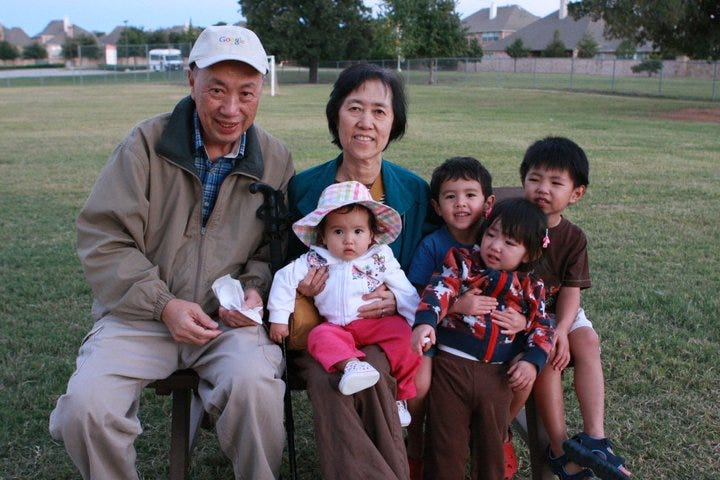

# How to Be a Great Self-Advocate

*Lessons from encounters with an imperfect medical system*

My dad (while he was being treated for stage IV lung cancer with my niece and my sister)

No one is perfect at their job. But when there's a lot on the line, it is even more critical that you get it right. The stakes don’t get higher than life and death, but those are exactly the stakes doctors face day in and day out.

I write this not to criticize doctors, but to point out how difficult their work truly is. Debugging the human body in all of its intricacies is a challenge unlike any other, and doctors, like all of us, are only human. We are all imperfect, and we must become our own best advocates to navigate a complex and often fragmented medical system. This lesson is also applicable beyond health: when facing a complicated challenge with a lot on the line, speaking up for yourself becomes a critical skill.

Perspectives is a reader-supported publication. To receive new posts and support my work, consider becoming a free or paid subscriber.

## **Be persistent**

My father had a cough for years. I remember when I first heard it, after I had just gotten home with my second child, Bethany. She had her days and nights mixed up, so she was awake all night and asleep all day. I was in misery. My dad would hold her all night so I could get some rest.

He coughed. Then he coughed some more. I asked him about it, and he said it was allergies. I asked him, "Allergies to what?"

He replied, "Pepper".

I tried cooking without pepper, but my father's nagging cough remained. Over time, it slowly got worse and worse.

Eventually, I asked him to have it looked at, so he did. The doctor told him it was nothing to worry about. First, it was allergies. Then it was asthma. Then bronchitis. Then, years later, my father got a chest X-ray, because the doctor began to suspect it was pneumonia.

[The truth was so much worse: stage IV lung cancer](https://debliu.substack.com/p/what-i-learned-about-empathy). The doctor was horrified—perhaps because he had also been the person ignoring the symptoms for years. However, one of the things that sticks in my mind even today was how my father’s doctor acted when giving him the results.  My dad had asked the doctor to please allow him to call his daughters on the phone so we could hear the results with him and my mom. The doctor said, “I don’t have time for that.” and my dad and mom had to hear the prognosis in Georgia alone without our support. My dad didn’t realize stage 4 cancer wasn’t out of 10 stages. To this day, 10 years later,  the lack of empathy from his doctor stays with us.

I understand that my father's doctor was playing the odds. Lung cancer in non-smokers makes up only 20 percent of cases. Dad didn’t have obvious risk factors, other than being Asian, which comes with a higher incidence of lung cancer in non-smokers. But the doctor's gamble meant my Dad lost. I wish I had pushed harder. I wish we hadn't taken no for an answer. I wish we had sought a different doctor. My dad passed away 18 months after his initial diagnosis.

Pushing back in these situations can often feel fraught, but persistence is critical to navigating our medical system. If something doesn't feel right, standing up for yourself can make all the difference.

My dad and mom after they moved in with my sister so my dad could get treated for stage IV lung cancer.

## **Trust your gut**

Around when she turned one, my daughter, Bethany, started getting sick. A lot. She seemed to catch every illness in the book—even catching things more than once that should have been one and done. She was diagnosed with hand, foot, and mouth (three times), tonsillitis (twice), croup (four times), double ear infections (twice), and a persistent cough. The cough would cause her to throw up, sometimes as many as eight times in one night. She was banned from going anywhere she would have contact with other kids, including pre-school and church Sunday school.

I spent every other week at various doctor's offices with Bethany, trying to figure out what was wrong. For nearly a year, doctor after doctor told me something different. Maybe allergies. Maybe asthma. They even put Bethany on an inhaler, but nothing worked. This went on until she was almost two years old. At one of these appointments, the doctor was dismissive, telling me I was overwrought and that “mothers like you overthink things.” I got angry because I felt so frustrated and dismissed. I asked his assistant to print out her medical history and tell me that what she was going through was normal. Even armed with pages of history, I ended up getting brushed off again.

Three doctors later, I finally found someone who would listen. Dr. Bocion looked at Bethany and said, “She has a bad sinus infection. The other antibiotics didn’t knock it out because they weren’t strong enough. She is getting sick because her body is fighting off the infection, which makes her susceptible to everything else that comes along.” He gave her a strong antibiotic and something he dubbed the "Bocion potion": a mix of an Afrin-style nasal spray and saline. Within three weeks, she was cured, after she had been sick for more than a year.

We often fail to listen to our instincts, especially when professionals are telling us we have nothing to worry about. But when we're sick, the problem either gets resolved, or it becomes too big to dismiss. When that happens, it’s critical to listen to your gut and not take no for an answer.

## **Know that doctors are imperfect**

I once had a strange condition in my ear, which started on one side and then spread to the other. I was told by two generalists and one specialist that it was mild irritation or eczema. They instructed me to apply Aquaphor and a mild steroid, which helped a bit, but not that much. This went on for nearly a year. It drove me crazy, and the itching kept me up late into the night.

One day I went to the onsite clinic at work for something completely different. She immediately knew what the ear condition was and prescribed me an antibiotic drop. Within a week, the problem was resolved.

The experience was deeply frustrating, but it was also a reminder that doctors are imperfect. They do the best they can, but they aren't mind readers, and they can't feel what you're feeling. Being willing to accept that, and acknowledging just how imperfect I am at my own job, has given me a measure of grace.

## **Get a second, third, or even fourth opinion**

My mom was chronically unwell for many years. They told her it was everything from an autoimmune disorder to a thyroid issue, and ultimately, after she had seen many specialists, they even told her it was all in her head. I remember her suffering through my teen years, and I didn’t know how to help. Finally, when I was about to finish high school, she was diagnosed with [mitral valve prolapse](https://www.mayoclinic.org/diseases-conditions/mitral-valve-prolapse/symptoms-causes/syc-20355446), which was the source of her dizziness, shortness of breath, and tiredness. Heart disease runs in her family, and my grandfather died of sudden cardiac arrest in his 60s. Several of my other close relatives on that side of the family also have heart problems.

After the doctor diagnosed her, they put her on a heart medicine that has stabilized her condition to this day, three decades later. But the process of getting a diagnosis was a long one. It took nearly a decade of her facing down doctor after doctor until, towards the end, more than once told her it might be in her head.

Sometimes, you have to seek advice from multiple people to get to the bottom of a problem. If one answer doesn’t seem to be right, don’t shy away from getting another opinion. Finding the source of the issue is well worth the effort.

## **Be vigilant and prepared**

Oftentimes we wing it when we go to the doctor, but our health deserves a higher level of vigilance.

When my children were younger, I would make lists of things to ask the doctor before every appointment, because there were so many things wrong with them. Thankfully, they've outgrown most of these things, but being a self-advocate means more than just coming prepared.

A couple of days after we brought my son, Jonathan, home from the hospital, I could tell something was wrong with him. His eyes were almost bright yellow, like a dragon’s. My parents told me he likely had jaundice. I hustled him back to the doctor, and they immediately tested him. He was one point away from nerve or brain damage on the bilirubin scale. We ended up back in the hospital for a couple of days getting him treated.

We also noticed that Jonathan constantly threw up. He had trouble nursing and struggled to keep milk down. He was finally diagnosed with baby reflux after several weeks of abjectly painful crying. Once he was on the reflux medicine, it was like he was a new kid: he rarely cried, and even when he did, it was relatively quiet. He went from screaming his head off every day for hours at a time to being practically angelic.

Being a good self-advocate means understanding yourself and knowing when things are off. The more awareness you have of what’s normal, the better you can detect when something is wrong.

## **Sometimes there is no answer**

When we had our third child, Danielle, she had similar problems with nursing. She cried all the time. It was awful. We tried all the medicines we gave Jonathan, but they didn’t seem to help. I tried an elimination diet for weeks and weeks to see if it was something to do with breast milk. We tried using different bottles to feed her. Nothing worked. She cried for two to three hours a night for over a year.

Then, when she was nearly 18 months old, Danielle got a new baby shopping cart to play with. Just like that, she started giggling and laughing and having fun. We were so astonished that we looked at each other and asked if something was wrong with her. This was a baby who rarely even smiled in the evenings, let alone laughed. My mom said, “Maybe she's finally growing out of it.” It turned out she was right. We never did figure out what was wrong with Danielle, but today she's a happy, healthy little girl.

---

We trust the experts, but they're seeing us through their lens, for an appointment that lasts maybe half an hour. And nobody knows you better than you do.

Advocating for yourself and your family means recording what's happening and understanding when things are off. Knowing how to trust your instincts and when to push for what you need is also an important skill. I wish I had done more for my father. I wish I had caught my mom's cancer sooner. I wish the kids didn't suffer for so long. But life isn’t perfect, and we can only do what we can do.

Being a great self-advocate means knowing when to push and when to ask. These skills will take you far, at the doctor’s office, at work, and in life, so prioritize following your instincts, even when you worry they’re wrong. You owe it to yourself.

[Share Perspectives](https://debliu.substack.com/?utm_source=substack&utm_medium=email&utm_content=share&action=share)

---

Before you go, here are some articles you might be interested in related to empathy, food, family, and my other thoughts:

**[What I Learned About Empathy:](https://debliu.substack.com/p/what-i-learned-about-empathy)** Some thoughts during my dad’s journey with cancer.

**[Lessons From My Parents:](https://debliu.substack.com/p/lessons-from-my-parents)** Things my immigrant parents taught me and how it shaped my journey.

**[Memories Through Food:](https://debliu.substack.com/p/memories-through-food-how-taste-passes)** How food can shape memories in unique ways.

Perspectives is a reader-supported publication. To receive new posts and support my work, consider becoming a free or paid subscriber.