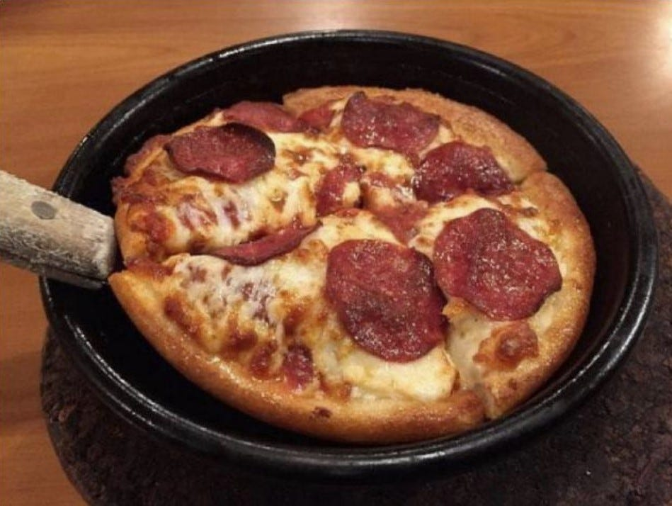

# On My Bookshelf: What I Am Reading Now, and Some of My All-Time Favorites

*Some great nonfiction to learn and grow with*

Photo by [Pickawood](https://unsplash.com/@pickawood?utm_source=unsplash&utm_medium=referral&utm_content=creditCopyText) on [Unsplash](https://unsplash.com/s/photos/bookshelf?utm_source=unsplash&utm_medium=referral&utm_content=creditCopyText)

I like to read. A lot. It's a habit I developed when I was a kid, and while I don't check out dozens of books at a time like I did when I was in school, I still read when I have time.

Back in the 1980s when I was in elementary school, Pizza Hut had a program called **Book It!** where reading and meeting certain goals meant earning a personal pan pizza. For my sister and I, dining at Pizza Hut was a rare treat since my Chinese American father didn't believe that pizza could be eaten as a real meal. It was more palatable for our parents since we were able to eat for free. I had a stack of the certificates I used like they were cash! (BTW: **[Book It](https://www.bookitprogram.com/programs/book-it)!** still exists today!)

What my personal pan pizza would have been like in the 80s; From Reddit Post on /nostalgia

There's always something new out there to learn, and good nonfiction is one of the best ways to expand your horizons and better understand the world around you.

With that in mind, today I will be introducing you to the books I'm currently reading, as well as some of my favorite reads.

---

## **On My Nightstand**

#### ***[7 Rules of Power: Surprising—but True—Advice on How to Get Things Done and Advance Your Career](https://amzn.to/3yGyjnH)*** **by Jeffrey Pfeffer**

*7 Rules of Power* is Professor Pfeffer’s follow-up to his wonderful book, *[Power](https://www.amazon.com/Power-Some-People-Have-Others/dp/0061789089/ref=sr_1_2?crid=78D9KOD7PQ6R&keywords=jeffrey+pfeffer+power&qid=1656787530&sprefix=jeffrey+pfeffer+%2Caps%2C528&sr=8-2)*, from a decade ago. The original *Power* was transformational to my career. This is a more straightforward guide.

#### ***[Originals: How Non-Conformists Move the World](https://amzn.to/3NAbki9)*** **by Adam Grant**

We started an office book club, and this was our selection. I am excited to read about founders who changed the world by building what only they could see.

#### ***[The Founders: The Story of PayPal and the Entrepreneurs Who Shaped Silicon Valley](https://amzn.to/3yuwFFu)*** **by Jimmy Soni**

Full disclosure: Jimmy spoke to me while researching for his book, and he has been generous with his time as I put out my first book. That said, I’ve loved reading *The Founders*. The best part has been seeing so many familiar faces appear and hearing the stories I had only ever heard secondhand from those who actually lived it.

#### ***[The Conversation: How Seeking and Speaking the Truth About Racism Can Radically Transform Individuals and Organizations](https://amzn.to/3OAJALs)*** **by Robert Livingston**

I just got this in the mail, so I have not started reading it yet. However, I love Robert Livingston’s [content on LinkedIn](https://www.linkedin.com/in/robertwlivingston/). I will be digging into this book soon. Talking about race is hard, so I hope to learn more about how we can discuss it with equanimity and grace while also making progress.

#### ***[$100M Offers: How To Make Offers So Good People Feel Stupid Saying No](https://amzn.to/3OWavkX)*** **by Alex Hormozi**

This book is worth reading for founders, investors, and startup advisors. An action-oriented guide to finding and building for a large and rich market. An easy read for anyone looking to grow a business.

---

## **Top Picks**

### **Politics**

#### ***[The Righteous Mind: Why Good People Are Divided by Politics And Religion](https://amzn.to/3ytpc9E)*** **by Jonathan Haidt**

I return to this book from time to time. Written before our recent era of political partisanship, it explains a lot about how conservatives and liberals see the world.

#### ***[Why We’re Polarized](https://amzn.to/3QXvOnT)*** **by Ezra Klein**

This history of modern American party affiliations is a fascinating read. Thorough and thoughtful, it reminds us that many forces over the decades have led us to where we are today and that these forces are hard to even acknowledge—let alone undo.

### **Behavioral Economics**

#### ***[Freakonomics: A Rogue Economist Explores the Hidden Side of Everything](https://amzn.to/3y50Y44)*** **by Steven D. Levitt and Stephen J. Dubner**

The original is still the best. This exploration of behavioral economics takes an unconventional look at data to reveal a different perspective on the world.

#### ***[Predictably Irrational: The Hidden Forces That Shape Our Decisions](https://amzn.to/3a2rPpo)*** **by Dan Ariely**

*Predictably Irrational* is a revealing look at honesty, behavior, and environment. Ariely has many subsequent books that are also worth reading, but this one is the best. It’s a great place to start if you want to get into his books.

### **History and Economics**

#### ***[Guns, Germs, and Steel: The Fates of Human Societies](https://amzn.to/3nw1sv6)*** **by Jared Diamond**

Some people were born in places with native benefits (e.g. tamable animals, natural resources), and others without. We like to think that hard work is what makes people successful, but the accident of birth and geography has more impact than we’d like to admit.

#### ***[Poor Economics: A Radical Rethinking of the Way to Fight Global Poverty](https://amzn.to/3OWFXzA)*** **by Abhijit V. Banerjee and Esther Duflo**

*Poor Economics* is a contemplation of how hard it is to survive for people in countries that lack infrastructure. The story of buying bricks one at a time has stuck with me ever since I first read it. It’s a hard-hitting reminder of how we blame those in poor countries for a lot of things outside their control, and of how critical national infrastructure is.

#### ***[The Better Angels of Our Nature: Why Violence Has Declined](https://amzn.to/3I1rNe9)*** **by Steven Pinker**

We tend to think the world is getting more and more violent. *The Better Angels of Our Nature* shows us that violence has actually substantially decreased over the centuries. Violent death is now rare, and relative to history, kidnappings are almost negligible. The arc of history bends toward peace, which is comforting knowledge in these challenging times.

### **Human Nature and Relationships**

#### ***[The 5 Love Languages: The Secret to Love that Lasts](https://amzn.to/3y6b7gW)*** **by Gary Chapman**

Since its release in the early ‘90s, this niche Christian marriage counseling book has become a staple for all relationships. I read this in 1995, a few years after it came out when I was dating David. We still refer to our love languages, and the kids’ love languages, in our daily lives.

#### **[Influence: The Psychology of Persuasion](https://amzn.to/3nunQoI) by Robert Cialdini**

*Influence* is the definitive book on how to influence others. I read this in business school, and it has been a valuable resource throughout my career.

#### ***[The Purpose Driven Life: What on Earth Am I Here For?](https://amzn.to/3ywPLL5)*** **by Rick Warren**

No matter who you are, seeking purpose is critically important to living a fulfilling and meaningful life. This book is a guide to finding your “why.” Even if you read it a long time ago, it’s still worth a revisit.

#### ***[NurtureShock: New Thinking About Children](https://amzn.to/3y1sAqO)*** **by Po Bronson and Ashley Merryman**

I bought this when the kids were little, and it was such a refreshing read. It was fascinating to learn just how unscientific traditional parenting wisdom is, and what science tells us about child-rearing.

#### ***[Quiet: The Power of Introverts in a World That Can’t Stop Talking](https://amzn.to/3y5VGW6)*** **by Susan Cain**

I am an introvert, and so are two of my three kids. It was nice to hear a full-throated defense of those who are more naturally quiet.

### **Leadership**

#### ***[Radical Candor: Be a Kick-Ass Boss Without Losing Your Humanity](https://amzn.to/3udQa2q)*** **by Kim Scott**

*Radical Candor* is an absolute must-read if you are a manager. Kim Scott shows us how—and why—to lead with directness and honesty. She explains how feedback is a gift, and teaches us how to give it well.

#### ***[Lean In: Women, Work, and the Will to Lead](https://amzn.to/3ytAOcL)*** **by Sheryl Sandberg**

Sheryl gave me the “lean in” talk when I was first thinking about joining Facebook. I was working part-time at eBay, and I had a newborn and a toddler. I was debating whether to join this 900-person startup. Thanks to Sheryl’s message, I took the plunge and never looked back.

#### ***[Conscious Business: How to Build Value through Values](https://amzn.to/3QZy5ir)*** **by Fred Kofman**

This book talks about how to work with others based on aligned values. It’s all about leading through authenticity and truth, even when it is hard. *Conscious Business* cuts through the challenges of relationships and opens the door to real connection. (Full disclosure, Fred coached me through a challenging work relationship. He knows what he’s talking about.)

#### ***[Power: Why Some People Have It—and Others Don't](https://amzn.to/3AhcfRB)*** **by Jeffrey Pfeffer**

The idea for *[Take Back Your Power](https://www.amazon.com/Take-Back-Your-Power-Rules/dp/B09NF4THQF/ref=sr_1_1?crid=1Q253NCONDX3V&keywords=take+back+your+power+deborah+liu&qid=1656790630&sprefix=take+back+your+powr%2Caps%2C330&sr=8-1)* originated as an answer to Pfeffer’s original book. *Power* reveals the playing field around you, but how you respond to it is up to you. My book is the version for women who have to navigate the workplace differently.

---

These are some of the books that have impacted me greatly over the years and are mainstays on my bookshelf. What books have you read that have changed your life? Share them in a comment. Were you a **Book It!** reader like me?

[Leave a comment](https://debliu.substack.com/p/on-my-bookshelf-what-i-am-reading/comments)

[Share Perspectives](https://debliu.substack.com/?utm_source=substack&utm_medium=email&utm_content=share&action=share)