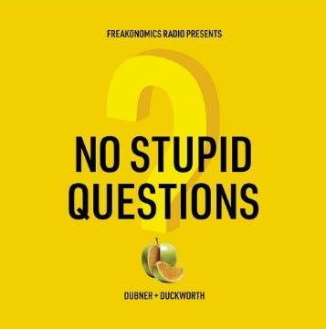
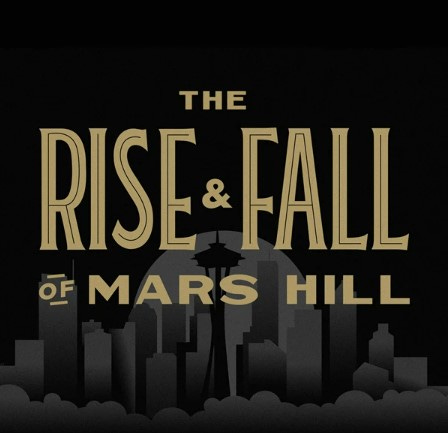

# Podcasts on My Must-Listen List 

*Favorites, go-tos, and guilty pleasures to add to your list *

Everyone in our family listens to podcasts!

I love podcasts. Not only are they a great way to learn new things and expand your horizons. Whether I’m cooking, walking Wonton, driving, or working out, you can almost always find me listening to one. I love hearing the banter, stories, and insights, and there’s never a shortage of episodes to enjoy, no matter what I’m in the mood for.

Last week, [I talked about some of the books I love and am currently reading](https://debliu.substack.com/p/on-my-bookshelf-what-i-am-reading?utm_source=substack&utm_medium=email). Today, I want to share another list of recommendations with you: this time, podcasts that I subscribe to and listen to.

## **For news and politics junkies**

[FiveThirtyEight](https://fivethirtyeight.com/podcasts/): This is my absolute favorite podcast. I love numbers, statistics, and politics, and FiveThirtyEight is the trifecta: just nerdy enough for my tastes, with a lot of interesting political discussion. With segments like, "good use of polling or bad use of polling", ModelTalk, and the Republican and Democratic presidential candidate drafts, it is both educational and fun. I've learned a lot about polling from this show, as well as politics in general.

[Politico](https://www.politico.com/podcasts): Politico produces five- to ten-minute snippets on various topical issues. They are quick takes, great for making you sound smart when you talk about current events in Washington D.C. and the world of politics.

[The Daily](https://open.spotify.com/show/3IM0lmZxpFAY7CwMuv9H4g): Imagine reading a story and wanting to talk to the people behind it. That is the approach The Daily takes. It covers a wide array of topics and features a variety of interesting guests. The conversations often go in unexpected directions, so it is definitely worth a deep listen.

[The Ezra Klein Show](https://open.spotify.com/show/3oB5noYIwEB2dMAREj2F7S): Ezra Klein hosts thoughtful discussions about difficult issues, featuring a wide range of guests with different political leanings. It's like sitting in on two really smart people having coffee and talking about challenging things that are happening in the world.

[The Argument](https://open.spotify.com/show/6bmhSFLKtApYClEuSH8q42): Have you ever wanted to hear both sides of an argument? Me too. That's why I love The Argument, a debate podcast where participants disagree with grace and civility. The problem with other debate formats is the tendency for people to shout each other down. This one takes a refreshingly different approach.

[The Weeds](https://podcasts.voxmedia.com/show/the-weeds): The Weeds features wonky discussions of topical issues by smart people. It goes deeper than you can imagine on subjects that you didn't think you would have any interest in, and makes them enjoyable to learn about.

[1A](https://www.npr.org/podcasts/510316/1a): I listen to NPR’s 1A to get a summary of the week's top news events. It is a simple, easy-to-digest way to catch up on anything you missed in the world.

[Stay Tuned with Preet](https://open.spotify.com/show/2FKKBenMavZsJQrtrqQU6N): Stay Tuned provides an inside look at the world of politics and the judicial system through the eyes of a former prosecutor. It includes interesting guests and discussions about the world from someone who used to work at the junction of politics and justice.

## **For interesting storytelling and interviews**

[This American Life](https://www.thisamericanlife.org/): If you love the podcast format, this American life did it first on the radio. It’s the granddaddy of podcasts, and it is truly storytelling at its finest. Even when I don't think I'm going to like the topic, five minutes in, I'm down the rabbit hole. I have relistened to several episodes over the years that stuck with me, including [Notes from a Native Daughter](https://www.thisamericanlife.org/165/americans-in-paris/act-three-11), [The Herd](https://www.thisamericanlife.org/736/transcript), and [Santaland Diaries](https://www.thisamericanlife.org/47/christmas-and-commerce).

[Conversations](https://www.abc.net.au/radio/programs/conversations/episodes): In this quirky little podcast, the hosts talk to really interesting Australians. It's fascinating to hear the life stories of people who grew up in a place that is so different from everything I've known, yet so familiar at the same time.

[No Stupid Questions](https://freakonomics.com/series/nsq/): This is one of those "talk podcasts"—I call it the "two likeable people chatting" genre—but with an academic twist. The conversation sounds like two old friends catching up and letting you listen in as they talk about assorted questions and studies that prove their point. (This comes from one of the authors of the *Freakonomics* books and podcast series.)

[Science Vs](https://gimletmedia.com/shows/science-vs): This Australian import is one we listen to as a family. I think we have heard all of them together, except for the ones that aren't safe for kids. The [placebo episode](https://gimletmedia.com/shows/science-vs/5whgzd) is a particular standout. Science Vs is entertaining and well-researched, with a charming host.

[Criminal](https://thisiscriminal.com/): From WUNC, run by David's alma mater, Criminal features stories from long ago and more recent crimes. A lot of them are based in North Carolina or nearby states. The episodes are thoughtful and contemplative—imagine a kinder, gentler version of a true crime show that discusses more than just murders.

[Hello Monday](https://open.spotify.com/show/1UpjOrXiDCANThT21viw4E): Hello Monday features conversations with interesting people who all want you to have a great week. The host, Jessi, does a great job of being your cheerleader at work, and she is a calming presence for even the most stressful times.

## **For tech, economics, and psychology nerds**

[Freakonomics](https://freakonomics.com/podcasts/): Humans do really strange things sometimes. Freakonomics shows you why. Based on the book of the same name, this podcast brings interesting statistics and facts to light through the eyes of those who live them. When you look behind the scenes of behavioral economics, you realize that the world is not as orderly and simple as you imagine.

[Marketplace](https://www.marketplace.org/shows/marketplace/): I used to listen to Marketplace every day on KQED during my commute home, but now I can stream it on demand as I work out on my elliptical. It provides a great rundown of the business news you need. Not only is it completely accessible, but it's also really engaging. I rarely miss an episode.

[Hidden Brain](https://hiddenbrain.org/): Our brains are often a black box. We know what we think and how we behave, but we don't really understand the reasons why. Human nature is stranger than we think, and research is only scratching the surface. Hidden Brain provides a fascinating peek into why we do what we do.

[How I Built This](https://www.npr.org/series/490248027/how-i-built-this): How I Built This is your chance to hear from those who built your favorite tech products. Guy Raz talks to those who were inspired, iterated, and fought their way to success. It's a must-listen for founders and those in tech.

[You Are Not So Smart](https://podcasts.google.com/feed/aHR0cHM6Ly93d3cub21ueWNvbnRlbnQuY29tL2QvcGxheWxpc3QvYWFlYTRlNjktYWY1MS00OTVlLWFmYzktYTk3NjAxNDY5MjJiL2RhMDQ3ODYxLTcxMjEtNDQ0Ny04Y2NiLWFiMWEwMDE2NWMwZS8zMzdhZDAzNS1kMmU5LTQ5NDItOWU0ZC1hYjFhMDAxNjVjMWMvcG9kY2FzdC5yc3M?ep=14): Produced by one man, David McRaney, alone in his Mississippi home, this podcast is oddly fascinating. He talks to professors and researchers about how we take on beliefs—and how we get talked out of them. You Are Not So Smart does a good job of explaining the partisanship of recent times, as well as the collective delusions we engage in. Some of the best episodes discuss [tribal psychology](https://youarenotsosmart.com/transcripts/transcript-tribal-psychology/), the [Dunning-Kruger effect](https://youarenotsosmart.com/2020/12/14/yanss-192-why-we-are-unaware-that-we-lack-the-skill-to-tell-how-unskilled-and-unaware-we-are/), and [the science of persuasion](https://youarenotsosmart.com/2021/08/23/yanss-213-how-to-improve-your-chances-of-nudging-the-vaccine-hesitant-away-from-hesitancy-and-toward-vaccination/).

[Lenny's Podcast](https://www.lennyrachitsky.com/podcast): This one is brand new, but Lenny Rachitsky is a true powerhouse of product information. Every product leader worth their salt said yes to being on his podcast (myself included). Listening to it is like learning from your favorite product people about how they build and what they value.

## **For food lovers**

[Milk Street Radio](https://www.177milkstreet.com/radio): Christopher Kimball from the original America's Test Kitchen goes off on his own in this new podcast and show. He talks to a lot of interesting people in the food world and answers listener questions. Milk Street appeals to the nerdy and scientific cooks in all of us.

[The Sporkful](https://www.sporkful.com/): It's hard to classify this show. A bit of food, a bit of culinary expertise, and a bit of friendship. It centers around food, but is not about the fancy food scene. Rather, The Sporkful contemplates how food affects our lives and relationships in different ways.

## **For kids**

[Good Night Stories for Rebel Girls](https://podcasts.apple.com/us/podcast/good-night-stories-for-rebel-girls/id1350594046): My girls insist on listening to this when we are on road trips together. We listen to the stories and then discuss the women who have changed the world in different ways. It's inspirational, and it's great for family listening.

[Brains On](https://www.brainson.org/): This is a great little science podcast that explains things in a way that kids can understand without talking down to them. It's geared toward younger kids, but it's still a ton of fun for listeners of all ages.

[Million Bazillion](https://www.marketplace.org/shows/million-bazillion/): Million Bazillion is economics for kids, from the makers of Marketplace. It's a good primer on basic economics concepts that is both fun and educational. We listen to it mostly on long road trips, when we have time afterward to talk to the kids about the different topics.

## **Limited Runs**

[The Rise and Fall of Mars Hill](https://www.christianitytoday.com/ct/podcasts/rise-and-fall-of-mars-hill/): Even if you are not part of the evangelical Christian church, this podcast series is fascinating. I grew up an evangelical Christian and attended a church that had similar characteristics to Mars Hill. To hear about the church through the eyes of those who helped build it and take it down reminded me so much of what we take for granted in faith. This is the story of what happens when faith in God becomes faith in a fallible human being.

[Conviction](https://gimletmedia.com/shows/conviction): What happens when a woman goes missing and no one seems to notice or care? I'm in the middle of this mystery. Even though she’s been gone for a long time, part of me doesn't want to get to the end, because I don't want to know that she is truly gone forever.

---

A good podcast is like a good book: something you can enjoy, learn from, and use to gain a fresh perspective. No matter what interests you, there’s bound to be a podcast out there that you can get lost in. I hope this list has given you some ideas!

What are some of your favorite podcasts? Let me know in the comments. I am always looking for new podcasts to add to my playlist.

Thank you for reading my post on podcasts. To receive new posts and support my work, consider becoming a free or paid subscriber.