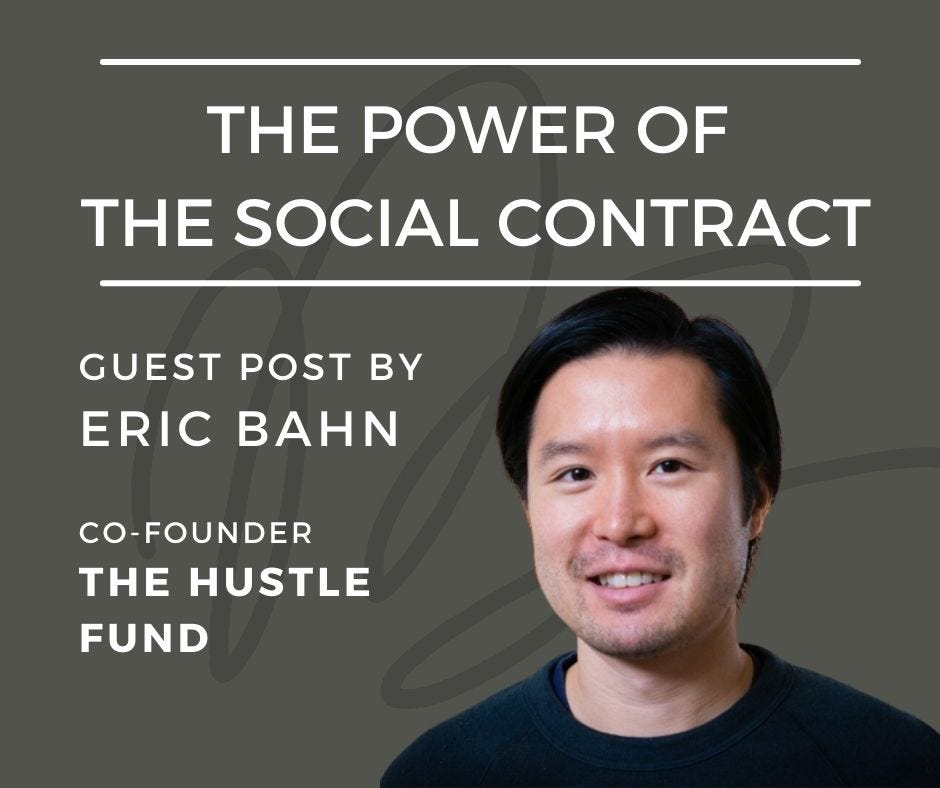
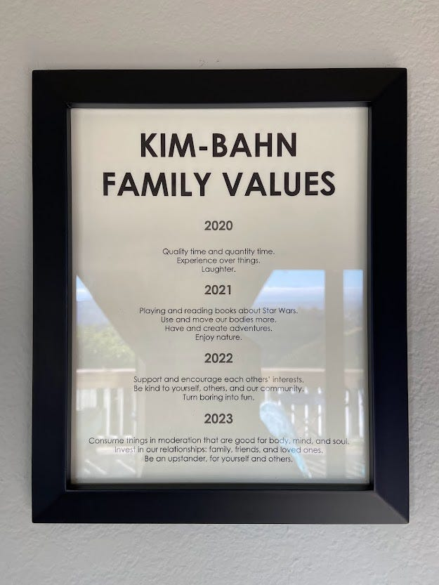

# The Power of the Social Contract

*Laying the Foundation for Fruitful Collaboration and Alignment*

[Eric Bahn](https://www.linkedin.com/in/ericbahn) is co-founder and general partner at Hustle Fund, an early-stage venture capital firm. Prior to becoming a VC, Eric was a founder (three exits) and product manager at Meta and Intuit. He’s most proud of being the husband to Beatrice Kim (beakim.com), and father to Stella and Owen. Today he shares his thoughts on the power of the social contract.

As one of the co-founders of Hustle Fund, I’ve had the privilege of investing in, and working closely with, quite a few early-stage startups—and when I say early, I mean *early.* And, as any early-stage founder can tell you, working with VCs can be, well, challenging. Imposter syndrome, client churn, and employee turnover are very real obstacles, all overshadowed by constant pressure to deliver returns and succeed as a company.

This, of course, leads to haziness in the relationship. Founders may feel like they can’t be fully open with their investors. As a result, information gets missed, and agendas fall out of alignment. It’s a lousy situation for everyone involved.

I would know; I’ve been through it myself.

Back in my founder days, I was frankly scared of my investors. Communicating with them felt a lot like walking on eggshells—not because of anything they said or did, but because of the enormous responsibility that I felt to make good on their investment. I struggled to share bad news, and my insecurities got in the way of a successful working relationship.

So, how can business leaders establish a culture of honest, open communication? The answer is [a concept I’ve previously posted about on LinkedIn](https://www.linkedin.com/feed/update/urn:li:activity:7083204869922181120/): establishing a social contract.

[Subscribe now](https://debliu.substack.com/subscribe?)

## **What is a social contract?**

A social contract is an agreement between people about how to engage—and what to expect while engaging—with one another. It’s essentially a set of unspoken rules that both parties need to understand, and follow, in order for the relationship to be successful. In practice, social contracts are more like sets of social norms than literal, written contracts—and, really, they exist everywhere in your life: in how you engage with your significant other or friends, how you collaborate with your coworkers, or even, on a bigger scale, how people interact with their governments and communities.

A social contract can be a great first step to a strong working relationship. The issue, however, is that social contracts are not usually explicitly described, just sort of implied—which is where confusion or frustration can sometimes occur. I experienced this firsthand when I was a founder myself, but it didn’t really gel for me until a moment when I was speaking to my wife: a long-time tech exec, founder, and the best people manager I know. I’ve made a long-time habit of asking her for advice on my own management, and the *number one principle*that she always sets with her team is this: *We should try our best never to be surprised.* My wife has created an environment of safety, trust, and immediate, real-time feedback within her team. This allows them to tackle issues early, instead of letting them get bigger.

And doesn’t that just kind of make sense?

This led to the birth of the **Hustle Fund Social Contract**: the rules of engagement (*explicit,* not *implicit)* that we operate by while interacting with our investors—and that we expect them to operate by while interacting with us. We make a point to communicate these during our first meeting with a founding team, and I’ll never get tired of seeing people’s reactions when we do. It’s almost like witnessing a sigh of relief in that moment when founders realize they can feel totally safe with us.

At Hustle Fund, our social contract involves three key principles:

**Blunt honesty—but with a caveat:** Trust is the foundation of any strong relationship, and you can’t have trust without honesty… sometimes blunt honesty. There are times when tough feedback is needed to solve problems and lead both parties to success, but that feedback should be coming from a place of genuine care. We like to establish from the beginning that any critiques will always come from a good place in our hearts—and we expect the same from the founders we work with. (Shouldn’t they be able to express their doubts and concerns without fear of judgment?)

**The expectation that things are going badly**: The startup world is full of obstacles. Being a founder can be disheartening and full of pitfalls, and failure happens—more often than not. As investors, I believe it’s our job to take off the rose-colored glasses and understand the struggles our founders can face. That means creating a culture where the default is to expect problems, not perfection. We can’t work together to tackle challenges if our founders don’t feel like they can come to us with them.

**Acceptance of risk**: Similarly, we acknowledge that the world of startup investing comes with inherent risk. We understand that not all of our investments will yield high returns, and not every company we work with will be successful. That’s why the third component of our social contract (and I know this might sound radical) is not just understanding that companies might lose our money, but giving them permission to do so. Obviously, that shouldn’t be the *goal*, but what’s more important than immediate returns is that all of us remain transparent, stick to our agreement, and make a point to keep learning and growing. False starts are a part of entrepreneurship. As long as everyone is on the same page from the beginning, that’s an understanding we can all be happy with.

These three agreements form the basis of our relationships with all of our portfolio companies. Laying out your expectations, and talking through what that relationship will look like, is always critical—ideally as early as possible—whether with a new team, coworker, or anyone else who matters in your life. When it comes to creating a successful partnership, the key is to make these implicit expectations explicit, and that’s what creating a social contract is all about.

## **The social contract in action**

The power of the social contract is in its ability to provide a clear roadmap for how two parties will engage with each other. While the backbone of the Hustle Fund social contract lies in establishing trust and accepting the reality of startup life, a social contract isn’t bound by a specific industry or company.  In any personal or professional partnership, having a social contract can be the path to success.

More than one of our portfolio founders have expressed their happiness and relief to have been able to get a clear framework for our relationship from the beginning. Many have heard the horror stories of founders being hesitant to speak honestly with their investors, or feeling railroaded into conflicting agendas. Instead, our founders have been pleasantly surprised to be invited into a dynamic where we’re here as equal partners, on equal footing. One product leader even created his own social contract after our initial conversation, which he credits for helping him better manage his team and enhance his professional relationships.

These reactions, and others, serve as a testament to the power of ironing out the details of any working relationship ahead of time. This allows us to break free from the dynamics that so often hinder relationships between business partners and set the stage for success.

[Share Perspectives](https://debliu.substack.com/?utm_source=substack&utm_medium=email&utm_content=share&action=share)

## If you’re ready to create your own social contract with your colleagues and/or the other people who are closest to you, I recommend trying the following process:

**Describe the environment where you thrive. Write it down.** Think about a work/volunteering/school project where you absolutely thrived in a team environment. What set you up for success? Write down the conditions in which you and your teammates felt you could thrive. This is a great starting blueprint for the kind of environment you wish to encourage.

**Introduce the social contract to your teammates—but ask permission.** One of the biggest problems with most social contracts is that they are often implied. But not having a direct discussion about the tenets of an implied social contract can lead to confusion or, possibly, misinterpretation. To avoid this, grab time with your teammates and ask for permission to talk through a social contract for working together. I’m a big believer in asking for permission, in that it tends to set a tone of higher-order critical thinking among a team, and better listening all around. Walk your colleagues through your view of how you propose working together.

**Listen to responses and try to be flexible.** After you walk through your proposal, gather feedback! Is there anything that your teammates would want to clarify or change? A social contract isn’t a social contract unless those around you also opt in, so allow folks to feel ownership in this process too.

**And finally, write it down.** After your team has had a chance to talk through and agree on the social contract, write it down. And print it. And put it on your wall. This artifact will serve as a great reminder of how your team will work together.

On this last point: my wife and I revisit our family values social contract with our kids every year during the holidays. We hold a meeting to talk about our values and hear out proposals, from all family members, on how we’d like to change how we interact with each other in the coming year. After we agree, we print the document, which is currently hanging in our dining room.

---

Our social contract has enabled us to better support our founders on their journeys. In the world of investing (and beyond), making the unspoken spoken is the key to making informed decisions, bringing problems to light, and working in the spirit of true collaboration—and in any relationship, that’s what matters most.

[Leave a comment](https://debliu.substack.com/p/the-power-of-the-social-contract/comments)