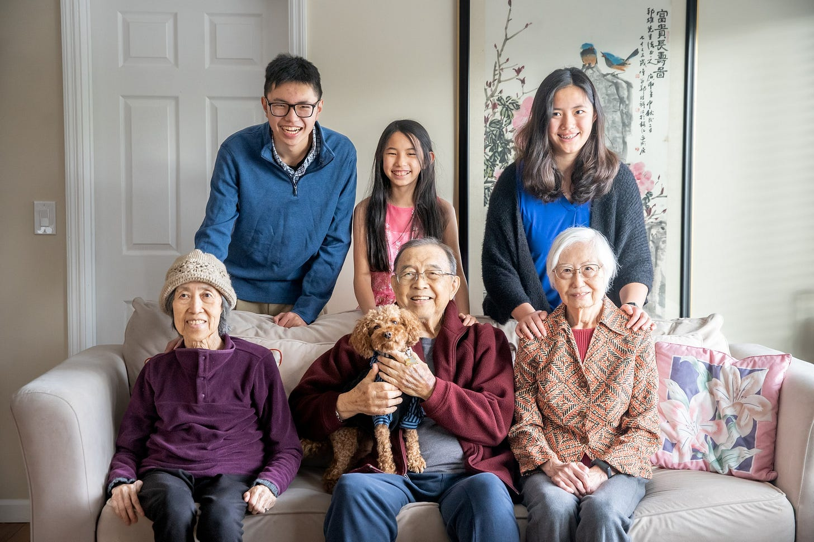

# The Sandwich Generation 

*What it really means to care for both aging parents and kids*

My parents struggled with infertility for many, many years. They got married in their late 20s and then spent the next seven years trying to have children. After two miscarriages and many disappointments, they finally had my sister, and a little over a year later, they had me. At this point, my mother was in her late 30s, and my father was 40.

My in-laws, meanwhile, met and married in their mid-thirties and had my husband within a year. He was born quite prematurely, and they decided not to chance a second child, much to David’s disappointment. (He told me he begged them for a sibling well into middle school, and I mused that his mom would have been close to 50 at that point, so he was asking in vain. He replied, “I was 12. What did I know about having kids?”)

As we grew up, my sister and I noticed how much older our parents were than the average family’s, but it didn’t matter all that much in our day-to-day lives. After David and I got married, both my parents and his asked us to have kids sooner than they had. I joked with them that they had waited until their late 30s, so why ask us in our mid-twenties?

David and I married early, and we wanted to take our parents traveling as they enjoyed their retirement. They had worked so hard their whole lives, so we wanted to spend our vacations with them seeing the world they had missed out on while raising us. The first big trip that we took our parents on together was an Alaska cruise, something my father had dreamt of doing for decades. Anyone who knows David knows he can score a good deal. He got us rooms for the week for $500, although they were next to the anchor and, well, not the quietest. (It was our first big gift to our parents after becoming gainfully employed, so we made sure they stayed in nicer accommodations.) On the last night, as we were talking about the next big trip we wanted to save up for and gift to them, our parents replied, “We talked about it as a group. We would rather you have kids instead of taking us traveling.”

[Share](https://debliu.substack.com/p/the-sandwich-generation?utm_source=substack&utm_medium=email&utm_content=share&action=share)

## **Life has other plans**

Eventually, David and I did have kids. Our first, Jonathan, was born when I was 30, and our last, Danielle, was born five years later. During that time, our parents were invaluable, staying for a month at a time to help us out each time one of them was born. The kids adored them, and they were an integral part of our lives, even though all four of them lived on the East Coast. As my father-in-law started struggling with kidney issues, eventually requiring a kidney transplant, we started traveling twice a year to see my in-laws, bringing the kids with us. Hauling young children across the country was grueling, but it was the only way they could see their grandparents.

Then, in September of 2010, we got the call that my father had Stage IV cancer. My parents, who lived in Georgia, immediately moved in with my sister to have her and her husband manage my father’s care in Dallas. A few months later, I found out I was pregnant with Danielle, our surprise third child.

The following years were a blur. I watched my dad’s health decline as I struggled through a difficult pregnancy. David and I both worked intensive jobs while our second child suffered multiple acute illnesses in a year ([turns out it was a fixable issue that was hard to diagnose](https://debliu.substack.com/p/how-to-be-a-great-self-advocate)). We were also in the process of renovating our house, and all the plates we had spinning threatened to topple over at the slightest nudge.

We were blessed that my dad was healthy enough to come and spend time with Danielle, who was born a little over a year after his diagnosis. He held her like he had held the other kids, carried her around, and sang her lullabies. But he was so tired from the treatment, and he had lost a lot of his previous vigor. One day, a couple months after Danielle was born, he said he felt dizzy, and he fell, crashing into our wall. That marked the beginning of the end. The cancer had spread to his brain.

## **The hidden cost of the sandwich generation**

More than 20 million American adults are caring for someone in their household beyond their children ([ref](https://nyti.ms/3BcP3UJ)), for reasons such as special needs or declining physical or mental health. This makes them part of the so-called “sandwich generation.” According to the AEI-Brookings Paid Leave Project, published in November 2020, “Slightly more than one in 10 Americans provide care to another adult. Forty percent of families have children under age 18 present.” ([ref](https://www.aei.org/wp-content/uploads/2020/11/Paid-Leave-for-Caregiving.pdf))

What we don’t talk about is the fact that those who act as caregivers have eight percent less employment participation than those who don't have the same responsibilities ([ref](https://nyti.ms/3BcP3UJ)). Being part of the sandwich generation—which often means caring for both young children and older parents at the same time—takes a huge toll on caregivers’ long-term career prospects and earning potential.

This hidden cost is often borne by women in the family, likely because of societal norms, or the fact that they make less money to start with. Women caregivers are estimated to provide nearly $150B worth of care each year ([ref](https://www.caregiver.org/resource/women-and-caregiving-facts-and-figures/)). At the same time, the Department of Labor estimates that caregiving costs women an average of $295K in lifetime earnings: $237K in direct earnings, and the rest in lost retirement income and social security payments ([ref](https://19thnews.org/2023/05/caregiving-women-parents-children-cost-lifetime/)). This is more than the average American's entire retirement savings ([ref](https://www.forbes.com/sites/andrewrosen/2023/03/02/how-your-retirement-savings-compare-to-the-national-average/amp/)). In essence, caregivers, particularly women, are trading off the equivalent of their own retirement funds to care for others.

Compounding matters further is the fact that, for those in the sandwich generation, the cost of caregiving often exceeds take-home pay. Given this, juggling the needs of aging parents and kids who are still at home is a dicey proposition, especially when your parents may go from being able to help out to suddenly being the ones in need of help.

## **Beyond facts and figures**

When looked at on the surface, these numbers can seem large and abstract, but the reality on the ground is much more complex for individual families.

Our family is one example. After my father passed, my mother moved in with us. We had renovated our house expecting a family of four, so with the addition of both a new child and my mother, the living situation became untenable as the kids grew. After a few years, we looked for a home where my mom could have her own space and not have to share a bathroom with three young children. We moved into another place down the street, and within a month, my mother found out she had cancer, which she has been battling since. David’s parents agreed to relocate from North Carolina, where they had lived since coming to America in the ‘60s, to California, where they moved into our old house so they could be nearby in case anything happened. Between my mom’s condition and the kids’ schedules, it was becoming harder and harder to travel, so we were grateful they could live nearby.

The pandemic presented another challenge: my mom was in active cancer treatment and therefore immunocompromised, and we had no way to bring in outside help. Managing her doctors’ appointments while also juggling our jobs and three kids in online school created a lot of tension and stress. [I felt so burnt out.](https://debliu.substack.com/p/burnout-the-silent-thief) By the time we were past the pandemic and we felt like we had reached a certain level of peace, my mother fell and broke her knee. She went from being somewhat independent to nearly immobilized. She has mostly recovered by now, but that experience was a reminder never to take anything for granted.

Still, the challenges continued to pile on even into 2023. After having a series of medical emergencies in 2022, David’s father collapsed a couple of weeks before Christmas. He ended up in the hospital. We were once again spinning more and more plates, one incident away from disaster.

Then this summer came. We needed to take Jonathan, who is a junior, on college tours, but David's father remained in the hospital, going in and out of the ICU. While we were in Boston in June, we called my mother-in-law, and she sounded winded. I asked the caregiver watching my mother go over and take my mother-in-law to urgent care. By the next day, David’s mom had been checked into the hospital, where she spent the next two weeks battling a major respiratory infection. David ended up having to skip a trip to Texas to care for her after she was discharged. While caring for his mom at our house, he got a call from the hospital that was caring for his dad that he should come right away. He arrived at the hospital to find the medical team performing CPR on his father, who passed away moments later. I felt both devastated that my father-in-law never got the chance to speak to his grandkids again and relieved that he was no longer suffering. As it had with my dad, losing my father-in-law meant the end of a difficult journey, but it left a hole in our lives.

All of this has unfolded against the background of our demanding work lives and our kids’ schedules. The sandwich of caregiving is real, and it presses on us on both sides. We want to give our kids a happy and meaningful childhood while also caring for our aging parents. This has been both joyful and stressful.

When David and I started dating, we discussed the idea of our parents one day moving in with us as part of our long-term plans. We knew when we were young that this day would eventually come, and I am grateful that we planned for it and were on the same page. We lived our lives such that it was possible for our parents to live with us and be a part of our household, just as David’s grandmother was an integral part of his, and we want to continue to pay that forward.

[Share](https://debliu.substack.com/p/the-sandwich-generation?utm_source=substack&utm_medium=email&utm_content=share&action=share)

## **Tips for planning ahead**

As I discussed last week, [sometimes the best thing we can do in the present is to make things easier on our future selves.](https://debliu.substack.com/p/stop-outsourcing-to-your-future-self) If you are considering taking on a caregiver role while also juggling the responsibilities of parenthood, that means taking steps to avoid burnout and counteract some of the biggest stressors of being part of the sandwich generation. Here are four things you can do to prepare yourself:

* **Plan jointly with your parents.** An important first step is to make sure you understand your parents’ desires and needs, whether that means aging in place or getting care. They may want to stay in their hometown, or they may want to be closer to their grandkids. Get clarity on their perspective, and keep them involved in the process to the extent that you are able. Also, consider setting up a durable medical power of attorney so there is a contingency plan in place should something happen.
* **Get on the same page with everyone involved.** Discuss with your partner what you want to do to support long-term caregiving. Make a list of everything that will be involved, including financial support, physical caregiving, and estate management. The more details you can iron out in advance, the better, so it’s important to align with everyone involved—including spouses and siblings—about what might be required, and who will be handling what.
* **Decide what you are and are not willing to do.** Medical events, like my dad getting cancer or my mom’s fall, can be abrupt and disruptive. That’s why it’s important to have an idea of what you will do if something unexpected comes up. For example, my sister and brother-in-law took care of my father during his grueling cancer treatment, but they didn’t have a way to care for my mom in their home long-term. These sorts of considerations are all worth thinking through ahead of time.
* **Look into long-term care insurance.** I am fortunate that my mom had long-term care insurance, which covers a few hours of care a day now that she can’t live on her own. Though it can be expensive, it could provide your parents more support when the time comes, as well as some breathing room if you are also managing a household and kids.

These are just a few things worth considering when thinking about taking on the responsibility of caregiving. Although this list is not exhaustive, I hope it provides a starting point for planning ahead, and for understanding the decisions you may one day be faced with.

---

If you are part of the sandwich generation, I am sure you are reading this knowing exactly what I am talking about. If you are not, know that the time may come when you are. Plan ahead, and take the time to think things through before you are faced with difficult choices. As much as we might like to think differently, it doesn’t take much for that one plate to come crashing down—and with it, so many others.

[Leave a comment](https://debliu.substack.com/p/the-sandwich-generation/comments)