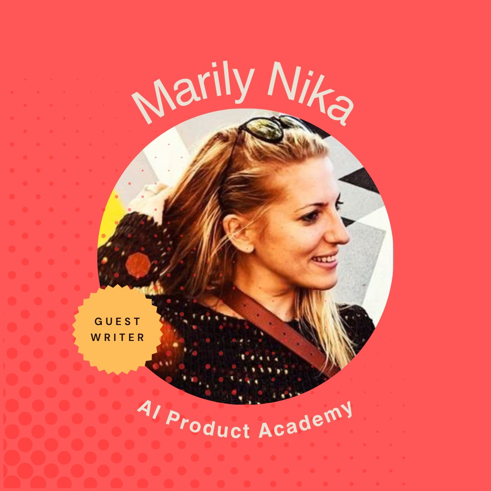

# Debunking the Myths of AI and Product Management 

*How AI can give you a huge leg up if you leverage it *

**Note from Deb:** I have had the privilege of mentoring Marily for many years. We first met because she reached out to me out of the blue to ask for advice. One conversation turned into many, and it has been incredible to see how far she has come.

Marily is an influential voice in AI. She serves as a GenAI product leader at Google and invests her time educating PMs on how to be AI-ready. She co-founded the AI Product Academy, which offers AI product management certifications, and writes on her own substack - **[Marily Nika’s AI Product Academy Newsletter](https://marily.substack.com/)**

She is also speaking at this year’s [Women In Product conference](https://womeninproduct.swoogo.com/25wip)!

---

When large language models first arrived, I heard all sorts of speculation.

* “AI will replace product managers.”
* “PMs are a dying breed.”
* “Engineers can just work with AI.”

I get why people say that. AI feels like magic when you first see what it can do. But from where I sit, leading GenAI products every day, the story is different.

The heart of product management has not changed. Our job is to make sense of chaos, keep the user at the center, and align teams on where we are going. Those skills will still matter as much as ever. What is changing is the way we work. GenAI is not a shortcut. It is not a replacement. It is the next leap, like the internet or mobile once were. And we can either treat it like a threat or learn how to use it to become stronger, faster, and more creative.

So, let’s talk about a few myths.

### **Myth 1: Using AI as a PM is “cheating”**

I still remember when people said using a computer for work made things too easy. Or when cloud tools showed up and everyone wondered if they made us lazy. Or how mobile was making a generation stop thinking. It sounds silly now, but that is where we are with AI.

Good product managers do not let technology do their jobs for them. They use it to clear the clutter so they can spend more time on what matters most. AI can take on the tedious work, like summarizing customer feedback or pulling together a first draft of a document. That gives us time to ask the hard questions, have the right conversations, and do the work only humans can do.

The PMs who will thrive are the ones who use AI to accelerate ideas, sharpen storytelling, and automate busywork so they can focus on strategy, empathy, and creative problem solving.

[Subscribe now](https://debliu.substack.com/subscribe?)

### **Myth 2: AI can do everything a PM does**

AI is powerful, but it is not magic. It cannot replace your judgment, your ability to weigh trade-offs, or your understanding of users. It cannot navigate your company’s politics or build trust with a skeptical customer.

I learned this lesson early in my career at PayPal when I was handed a massive strategic shift to navigate. On paper, the data told one story. But in reality, the success of the plan hinged on a partner relationship that was fragile and full of unspoken history. No amount of dashboards could show me that. It was hours of conversations, hallway chats, and human context that helped us avoid failure.

Where it shines is in helping us work smarter. It can speed up research, draft documents, and simulate outcomes we want to test. But those outputs still need us to guide them, edit them, and decide what matters most.

### **Myth 3: AI will replace intuition**

Someone told me recently, “Why do we need gut instinct when we have models and dashboards?” But intuition is not a wild guess. It is built through years of experience, hundreds of conversations, and more failures and launches than you can count.

I once led a launch where every metric looked perfect, but my gut told me we were missing something. Users were churning after the first interaction, and though the data looked fine, the sentiment in a handful of user comments told me something deeper was wrong. We paused, dug deeper, and found a trust issue we would have missed otherwise. No AI system would have caught that in time.

Your intuition is the little nudge that something feels off before the metrics move. AI can sharpen your instincts by surfacing patterns, but it does not know your company’s history or your customer’s frustration after a rough onboarding. Those human threads are still what tie everything together.

The best PMs will let AI make them sharper, not softer.

### **Myth 4: You need to be technical to be an “AI PM”**

Being an AI-powered PM is not about becoming an engineer. It is about learning how to work with intelligent systems. Clear communication matters more than code.

When I first learned to delegate as a manager, it was hard to trust that people could run with things without me. But over time, I learned to treat my team not as a group to micromanage but as trusted owners who could execute without constant check-ins. Working with AI feels similar. I think of these tools as a team of smart interns. They can do a lot of heavy lifting, but only if I tell them exactly what I need and give them the right guardrails.

The PMs who lean into experimentation and learn how to prompt and guide these systems will get the most out of them, no matter what industry they work in.

[Share](https://debliu.substack.com/p/debunking-the-myths-of-ai-and-product?utm_source=substack&utm_medium=email&utm_content=share&action=share)

### **Myth 5: All AI product work is the same**

There are two distinct paths here. One is ***building AI products***, where you need to be comfortable with the probabilistic nature of AI, obsessed with data quality, and plugged into research from places like Google AI or OpenAI so you can see where the field is heading.

The other is ***using AI to amplify your own work as a PM***, whether that means brainstorming with ChatGPT, using Dovetail to analyze customer interviews, or experimenting with tools like v0.dev to spin up prototypes quickly.

Most PMs will live in the second camp, at least for now. The key is not to master every tool at once. It is to start small, block off time each week to experiment, and find the handful of tools that genuinely make you better at your job.

## **So, is AI going to make PMs obsolete?**

No. What it will do is take away the repetitive parts of the job that no one will miss, and give us more time for the pieces that make product leadership fun: talking to customers, solving big problems, and bringing new ideas to life.

The real shift is not AI itself. It is how we choose to adapt to it. Just like we did with mobile or cloud, the PMs who experiment, share what they learn, and rethink how they work will come out ahead.

AI will not do your job. But it will reward the PMs who learn how to reimagine it.

[Leave a comment](https://debliu.substack.com/p/debunking-the-myths-of-ai-and-product/comments)

---

My own "AI PM Stacks" optimize my product management craft and process from ideation to execution. Here is how these tools can be integrated across the Product Development Lifecycle:

### **From Idea to Prototype**:

* **Step 1: Initial Brainstorming and Idea Generation**.

  + Gemini, ChatGPT, Claude (or even using Perplexity’s ‘social’ mode to query all of Reddit)
* **Step 2: Drafting Product Requirements Documents (PRDs)**

  + With your own GEM / CustomGPT or a tool like ChatPRD: [chatprd.ai](http://chatprd.ai)
* **Step 3: Use your PRD as an input to visualize UIs and develop prototypes with:**

  + VO: v0.dev
  + Loveable
* **Step 4: Use your prototype as an input in order to translate your idea into code** **using**:

  + Cursor: cursor.sh/
  + GitHub Copilot:  
     [github.com/features/copilot](https://github.com/features/copilot)

### **User Understanding and Prioritization**:

* **Step 1: Transcribing and Analyzing User Interviews**.

  + Dovetail:  
     [dovetail.com/](https://dovetail.com/)
  + Grain:  
     [grain.com/](https://grain.com/)
* **Step 2: Synthesizing Insights, Creating User Personas, and Building User Stories**.

  + Notion AI: notion.so/product/ai
  + Airtable AI:  
     [airtable.com/ai](https://airtable.com/ai)
* **Step 3: Integrating Insights into Roadmaps for Prioritization**.

  + Productboard AI:  
     [productboard.com/ai/](https://www.google.com/search?q=https://productboard.com/ai/)
  + ProdPad CoPilot:  
    [prodpad.com/blog/introducing-prodpad-copilot-the-future-of-product-managemen](https://www.google.com/search?q=https://prodpad.com/blog/introducing-prodpad-copilot-the-future-of-product-managemen)...

### **Decision Making and Optimization**:

* **Step 1: Identifying User Behaviors and Conversion Funnels**.

  + Mixpanel:  
     [mixpanel.com/](https://mixpanel.com/)
  + Amplitude:  
     [amplitude.com/](https://amplitude.com/)
* **Step 2: Gathering Targeted Quantitative Feedback and Validating Hypotheses**.

  + Quantilope:  
     [quantilope.com/](https://quantilope.com/)
  + Survicate AI:  
     [survicate.com/features/ai-survey-maker/](https://www.google.com/search?q=https://survicate.com/features/ai-survey-maker/)
* **Step 3: Consolidating Data, Analyses, and Insights into a Centralized Knowledge Base**.

  + NotebookLM:  
     [notebooklm.google.com/](https://notebooklm.google.com/)
  + Obsidian: [obsidian.md/](http://obsidian.md/)

[Share](https://debliu.substack.com/p/debunking-the-myths-of-ai-and-product?utm_source=substack&utm_medium=email&utm_content=share&action=share)