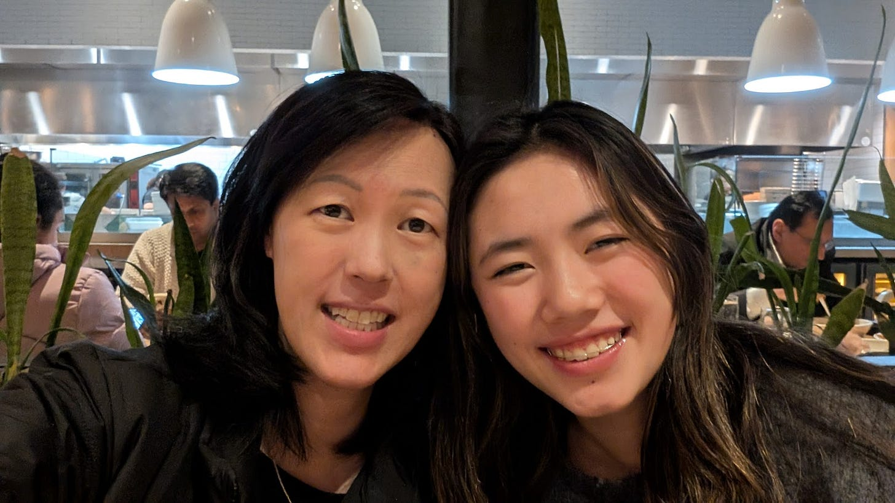
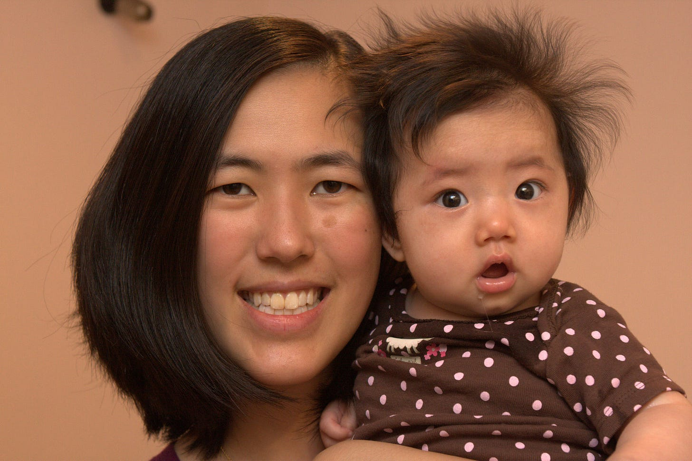

# What I Learned from My Mom - An Essay by Bethany Liu Age 16 

*Tiger Cub takes over writing for her mom today*

We’re on vacation for two weeks celebrating the fact that my mom is done with her cancer treatment. As a gift to her, I’m hijacking Mom’s Substack to give her the week off. For those who don’t know me, I’m Bethany, Mom’s favorite child. I’m sure my siblings would disagree if they weren’t so absorbed with their phones. Since my phone broke early on the trip, I have plenty of time to work on this.

Mom and I write a blog together called [Tiger Mom and Her Cub](https://asamnews.com/category/a-tiger-mom-and-her-cub/), about the relationship between Asian American parents and their children. The goal of the blog is to create a space for intergenerational conversation where we can learn to understand each other’s perspectives positively. In the past, we’ve talked about dating, therapy, grief, moving, and more. But today, I’ll be peeling back the layers on what it is like being the daughter of my mom.

Everything you think about her is true. She works all the time. As we were packing, she told my dad and my siblings not to bring our computers because we would be too busy to work. As I write this in the Hong Kong International Airport on her computer, I can tell you that while she thought we’d be too busy having fun, she had every intention of doing work herself as we traveled. On the MTR subway, I could see her alternating between reading work emails and discussing trip plans with Dad. And she isn't even officially working!

[Share](https://debliu.substack.com/p/what-i-learned-from-my-mom-an-essay?utm_source=substack&utm_medium=email&utm_content=share&action=share)

## **1. Family is important**

My mother is a busy woman. She’s “unemployed” now, but she still works day in and day out. Yes, the work has changed since she was CEO of Ancestry, but I don’t think Mom has ever actually sat down and taken a break from everything for a day. But even at her busiest, Mom still cooked dinner for our whole family. Whenever she has free time, there’s a good chance she’s working away over stovetop or the Instant Pot, making butter chicken, preparing bolognese, or grilling meat for our faux Pepper Lunch skillet. Even after putting in the hours feeding us, Mom always goes on nighttime walks with me and our dog, Wonton. She never trusted me to walk the dog alone at night, so she always came with me. No matter how stressful or busy work was, if she was not on a work trip, she would make the time. She would put aside her actual issues and listen to my random thoughts and anxieties or play New York Times Games with me.

## **2. Never procrastinate**

Unlike my mother, I do not make good use of my time. Most days, when I get home from school, I take a nap on the floor before doing homework. So I asked her how she gets so much done. She summarized her secret in just two words: “Never procrastinate.” Mom’s favorite thing to say to me is, “Bethany, you’re making a mountain out of a molehill.” Your work is always the same molehill, big or small, but it is always something you can work through. She believes procrastination just makes the molehill seem more and more like a mountain.

## **3. Don’t waste time**

In line with the last thing, my mother is a firm believer in using every second of the day productively. When she isn’t doing work, she’s cleaning, she’s cooking, or she’s helping me find something I’ve lost. Time is a precious and finite resource. Whenever we’re spending family time together, she likes to do housework on the side. We’ll be playing Mahjong and she’ll have us call out the tiles we drop as she marinates meat. We’ll be watching Elementary and she’ll dump a pile of clean clothing on the couch for us to fold.

[Leave a comment](https://debliu.substack.com/p/what-i-learned-from-my-mom-an-essay/comments)

## **4. Be a creator, not a consumer**

My mother has always preached the idea of being a creator, not a consumer. She believes it’s important to put things out into the world, not just take them in. When I was younger and obsessed with reading trashy YA fantasy books, she saw that as an interest in literature and signed me up for every writing camp she could find. After those had no impact, she tried to get me to write my own trashy YA fantasy book. I wasn’t made for the novel-writing life, but I appreciate what she tried to do, which is to teach me to create, not just mindlessly consume.

## **5. Don’t be afraid to make mistakes**

While it seemed to young me that my mother had never failed at anything, I now know she’s not perfect. She makes mistakes just like everyone else. One could even say that her willingness to make mistakes is what has made her so successful. When she has a hunch or idea, she goes for it fully. Last week at Hong Kong Disneyland, it was hot and humid. We were all carrying bags and about to enter the bag check line, which was ridiculously long. Instead of waiting in the normal line like the rest of us, Mom walked off into a much shorter line. We thought it was for premium Disney guests, but no, she was right, it was just empty because people got it confused with the Premiere access line right next to it. She got inside 10 minutes faster than we did. Maybe it was a mistake, maybe not, but what mattered is that she wasn’t afraid to try.

## **6. Incentivize yourself to do hard things**

Mom doesn’t always love doing hard things. Who does? But she always finds ways to motivate herself and can get a lot of hard things done this week. When we needed to clean out our old house after moving, Mom spent hours there every day. I wondered how someone could stay so devoted to such a miserable task or sorting through the junk we left behind. Then I realized: from any part of the house, you could hear NCIS playing. Mom didn’t want to clean any more than the rest of us, but by giving herself the reward of watching TV while working, she got through it.

[Leave a comment](https://debliu.substack.com/p/what-i-learned-from-my-mom-an-essay/comments)

## **7. You can’t control everything**

As kids, we believe our parents can fix anything. But Mom always taught me that you can’t control everything. A lot of unexpected things have happened to our family these past few years. First, all three of my remaining grandparents passed away within nine months. Then my Mom was diagnosed with cancer. She taught me that bad things happen and that it’s okay. She likes to remind me of the Chuck Swindoll quote, “Life is 10% what happens to you and 90% how you react to it.”

## **8. Adaptability is critical**

Mom works in a fast-moving industry, and she’s always shown a willingness to adapt. She didn’t expect to have two kids with generalized anxiety disorder, but she helped us succeed despite that just as she did after she had panic attacks all through high school. She’s also a fierce champion of AI. For an author and blog writer, she’s surprisingly encouraging of AI even though she recently discovered that one of the big LLMs had trained on her book without her permission. To her, AI is inevitably going to be part of the future, and the best way to thrive is to adapt and incorporate it in your life.

## **9. Don’t be afraid to ask for help**

My mother and I used to have a difficult relationship. I hated talking to her and Dad because it felt like every other word was about preparing for college, even in seventh grade. This meant they only saw my outbursts, not the struggles underneath, because I couldn’t share my vulnerable self with people who seemed to care only about one thing. Over time, we made a deal: they would talk less about college, and I would be more open. That helped me share my struggles, and I learned to ask her for help. When I hid my struggles, I was hurting myself. So now I ask for help much earlier so I can get and stay on top of things before they spin out of control.

## **10. You need to show others kindness**

Mom believes in showing kindness to yourself and to others. On our trip around Taiwan, I dragged the family through countless night markets looking for the perfect Winnie the Pooh charm for my bag. Even though Mom was in pain from finishing radiation, especially in the evenings, after a tiring day, she was a good sport about hunting down the perfect Pooh for me. When my phone broke on the trip, I ran out of socks, or when I bruised my ankle, she always helped me make it through.

---

I love my mom, and I’m so lucky to have her. There are things I don’t like (that is for a follow up article), but she is still the best mom I’ve ever had. She’s so smart and capable, and she’s taught me so many important things. I hope to grow up someday to be the person she is.

[Subscribe now](https://debliu.substack.com/subscribe?)