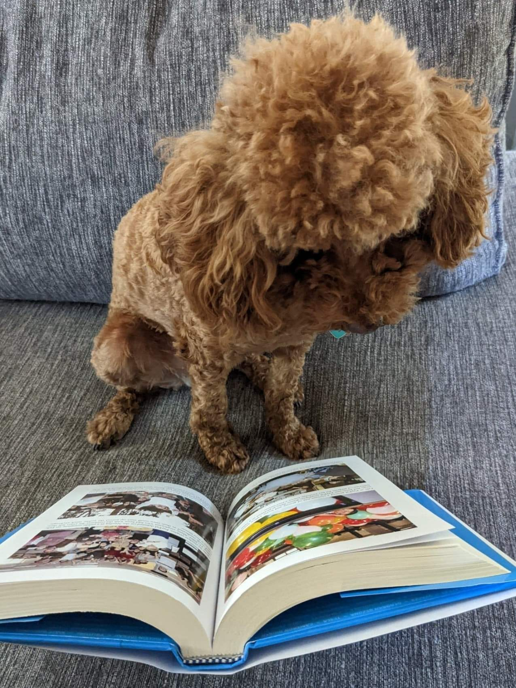
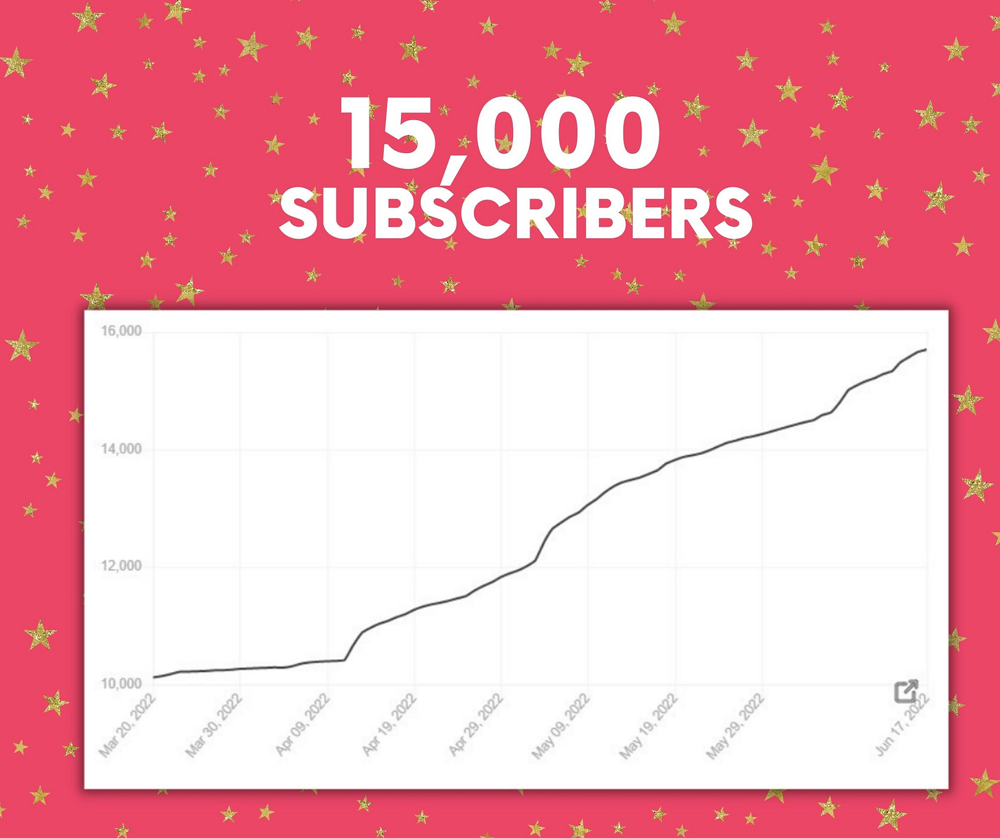

# Celebrating 15,000 Subscribers By Sharing My Top Substack Reads

*Sharing just in time for summer, 15 of my favorite substack reads*

Wonton love to read too

I was looking at my subscriber data today, and I was shocked to see that *Perspectives* has just reached a 15,000-subscriber milestone! It was only in March of this year that it [hit 10,000 subscribers](https://debliu.substack.com/p/ten-lessons-i-learned-from-writing). I'm honored now, as I was then, to be able to share my thoughts with such a broad audience.

I want to thank all of you who are here and who open and read my newsletters. Thank you for supporting me in my writing, sending me your thoughts and comments, and going on this journey with me. I couldn’t have done this without your support, or the support of my blog manager, Caroline, and my editor, Izzy.

18 months to hit 15,000 subscribers!

Along with writing, I also do a lot of reading—particularly of other blogs. I believe you should never stop learning and evolving. Maintaining a [learning mindset](https://debliu.substack.com/p/overcoming-imposter-syndrome) is what allows me to grow and become a better version of myself, and reading the work of other bloggers has given me so much inspiration, insight, and motivation.

That's why today, in honor of 15,000 subscribers, I want to share a list of my top 15 favorite Substack newsletters (in no particular order). There are a lot more that I could include here, but to keep this post from being ten pages long, I’ll give you the biggest highlights—along with some of my favorite posts from each.

---

Perspectives is a reader-supported publication. To receive new posts and support my work, consider becoming a free or paid subscriber.

---

### **My Top 15 Substack Recommendations**

**[Lenny’s Newsletter](https://www.lennysnewsletter.com/):** Lenny Rachitsky provides a weekly advice column on tech, community, people, product, and growth. (I did a [guest post](https://www.lennysnewsletter.com/p/the-inside-story-of-facebook-marketplace) for his newsletter a while back about how Facebook Marketplace came to be.) Lenny has built an amazing community of readers who work together to share their knowledge. This allows you to learn from the experiences of others in tech without having to reinvent the wheel. I always refer PMs to Lenny’s [list of templates](https://www.lennysnewsletter.com/p/my-favorite-templates-issue-37) that others have shared for working on visions, strategies, one-pagers, and more. It's an excellent resource that is well worth the read.

**[The Dispatch](https://thedispatch.com/):** I was always a fan of *The Weekly Standard*. When it ceased publication, The Dispatch was born under Jonah Goldberg, Steven Hayes, and Toby Stock. The art of journalism has changed a lot over the past 20 years. With so much noise in the news world, it has been interesting to watch The Dispatch's evolution, and I feel it does an amazing job in its reporting. While there are various subsections under the Dispatch umbrella, my favorite has to be the [Fact Check](https://factcheck.thedispatch.com/) section. I also really enjoy the writings of David French.

**[Agents and Books](https://katemckean.substack.com/)**: Kate McKean's newsletter is a one-stop-shop for information on book writing, literary agents, proposals, editors, and other aspects of the publishing world. That world is a completely different environment from the tech industry, one that [I have been plunged into headfirst](https://debliu.substack.com/p/perception-vs-reality) during the last three years. I have found Agents and Books to be an especially helpful guide on my journey to publishing my first book. A great resource if you are considering writing a book is McKean’s [post on book proposals](https://katemckean.substack.com/p/whats-a-book-proposal).

**[Ask Gib](https://askgib.substack.com/)**: Gibson Biddle was a VP at Netflix before becoming Chief Product Officer at Chegg. Today, he graces us with his vast knowledge and insight into product vision and execution. I eagerly read his articles whenever they arrive in my mailbox. He provides a lot of information on a wide variety of topics, and [his commentary on what Netflix should do next](https://askgib.substack.com/p/ask-gib-how-should-netflixs-product) is a must-read.

**[The Audacity](https://audacity.substack.com/)**: Roxane Gay is a writer, culture critic, and the daughter of immigrants. She has written some amazing books, including *Difficult Women* and other best sellers. My favorite part of her newsletter, The Audacity, is how she uses it to amplify the voices of new and emerging writers. I also loved her [reflections on her trip to Paris](https://audacity.substack.com/p/flour-water-salt-yeast), where she visited a beautiful French bakery and saw the care they put into their art form. (What can I say? I’ve never met a carbohydrate I didn’t like).

**[Creator Economy by Peter Yang](https://creatoreconomy.so/)**: Peter Yang is a Product Lead at Reddit, and he has written a lot of articles about Crypto, NFTs, and the creator community. My daughters and niece are super into Roblox, and that is how they connect with each other. While I am just a casual observer of the Roblox community, I appreciated [the article Peter wrote about the game and how the creator economy works there](https://creatoreconomy.so/p/roblox-gaming-creator-economy-metaverse).

**[The Hard Parts of Growth](https://amivora.substack.com/)**: Ami Vora is a friend and former colleague from Facebook. She currently leads Product at WhatsApp, and she has some amazing wisdom on motherhood, leadership, and growth strategy. Her insights are always on point. We have often spoken about our different challenges and used each other as sounding boards over the years. One of my favorite articles of Ami’s is one in which she talks about upgrading to the [2.0 version of herself.](https://amivora.substack.com/p/leadership-hack-upgrade-my-self-image)

**[The Jungle Gym](https://junglegym.substack.com/)**: Nick DeWilde is the cofounder of Invisible College. His work has spanned the realms of product, career and life balance, and more. I would like to highlight an article he published at the beginning of the year, titled [Reprioritize Reality](https://junglegym.substack.com/p/reprioritize-reality). In it, he describes wanting to focus more on his life and family after the loss of a dear nephew. It is a profound reminder not to lose sight of what’s most important.

**[Product Life](https://productlife.to/)**: Will Lawrence is a Product Manager at Paxos. His superpower is the ability to break down the roles and responsibilities of product managers in clear and concise terms, especially for those new to the industry. His article, [15 Roles in Tech That You Need to Know](https://productlife.to/p/meet-the-team-behind-your-feed-), clearly defines different jobs and demystifies the structure of a product team. It’s a great read for those who are just dipping their toes into tech and want to understand who does what.

**[The Looking Glass](https://lg.substack.com/)**: Julie Zhuo and I worked together at Facebook, where she was VP of Design, and she now works at Sundial, which she co-founded. I am lucky to be able to call her a friend and former colleague. One of my favorite reads from her newsletter, The Looking Glass, is [A User Guide To Working With You](https://lg.substack.com/p/the-looking-glass-a-user-guide-to). In it, she candidly discusses her strengths and challenges, and how they affect her interactions with her teams.

**[Your Local Epidemiologist](https://yourlocalepidemiologist.substack.com/)**: Dr. Katelyn Jetelina is an epidemiologist and Assistant Professor who works at a nonpartisan health think tank. In the early months of 2020, she created Your Local Epidemiologist to keep her students and coworkers informed during the pandemic. Jetelina disseminates data about COVID, vaccines, boosters, and more, presenting it in a clear and concise manner. She also presents data on women’s health, mental health, and other infectious diseases. [Her post](https://yourlocalepidemiologist.substack.com/p/wastewater-taking-surveillance-to) on using wastewater data to track COVID infections was a fascinating read on the new ways science has adapted to the pandemic.

**[Your Friendly Neighbor Epidemiologist](https://emilysmith.substack.com/)**: Dr. Emily Smith currently works as a professor at Duke (go Blue Devils!) and was educated at UNC (“Go Tarheels!” says my husband). In a similar vein to Jetelina’s newsletter, Your Friendly Neighbor Epidemiologist was an incredible resource throughout the pandemic. It also provided guidance for churches and schools based on COVID data. I especially enjoyed an article Dr. Smith published in December 2021, in which she [wrote about the shepherds](https://emilysmith.substack.com/p/to-the-shepherds). Her newsletter is currently on hiatus but will return soon.

**[Longer Tables with José Andrés](https://substack.com/profile/92499833-jose-andreshttps://joseandres.substack.com/)**: I have always been a fan of José Andrés. He started the World Central Kitchen to serve those in need after crises, and he is an example of what I consider servant leadership. He did more than just start an organization to help people; he is on the front lines, cooking and serving. I was thrilled when I found out he recently joined Substack. His [paella Valenciana recipe](https://joseandres.substack.com/p/paella-valenciana) is amazing, and I cannot wait to see what else he shares with us.

**[Andrew Zimmern’s Spilled Milk](https://andrewzimmern.substack.com/)**: I have always been a fan of Andrew Zimmern’s Bizarre Foods. I can still remember the one episode where he couldn’t finish the durian! Side note: even though I am Asian, I am not a big fan of durian, either. My sister and I would hide in our 婆婆(maternal grandmother—po po)’s room and turn on the AC while the rest of her Hong Kong apartment filled with the fragrance of durian. It was a sweet smell to the rest of the family, but not to my sister and me. Andrew Zimmerman’s writings are a mix of recipes, travel recommendations, and discussions about foodie topics. I especially like [this one](https://andrewzimmern.substack.com/p/is-it-a-real-pizza-if-it-has-sauerkraut), where he asks if pizza is still real pizza if it has pineapple and/or sauerkraut on it.

**[Kitchen Projects](https://kitchenprojects.substack.com/)**: Nicola Lamb is a recipe creator, writer, and pastry chef based in London. In Kitchen Projects, she goes behind the scenes to show the often-unseen research and development side of creating recipes. It takes iteration after iteration to get it right. [This article and recipe](https://kitchenprojects.substack.com/p/steamed-buns) for steamed buns from the creator of Shanghai Supper Club is bookmarked and ready for me to share with my family. (My post, [Memories through Food: How Taste Passes on Culture](https://debliu.substack.com/p/memories-through-food-how-taste-passes), discusses how food is important to me, and how I am passing it down to my kids.)

---

These are some of the top Substack reads I get in my inbox, all of which are incredibly inspiring to me. By reading these other blogs, I get to learn something each day that I didn’t know before.

Thank you all again for 15,000 subscribers. I hope this list helps you discover some new and interesting Substacks to follow. Have one or two you want to share? Post them in a comment below!

If you enjoyed what you read here, please forward it to a friend or colleague who you think might like it too. Sharing is caring so if you would share it to any of your social networks, I would be grateful.

[Share](https://debliu.substack.com/p/celebrating-15000-subscribers-by?utm_source=substack&utm_medium=email&utm_content=share&action=share)