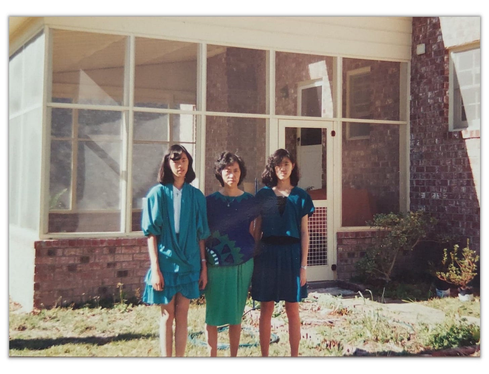
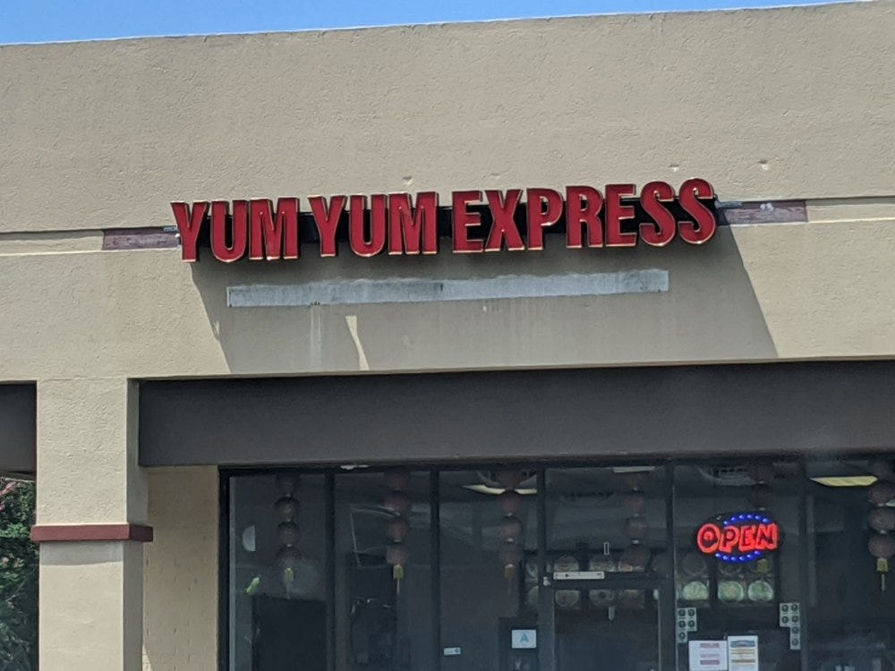

# What Was the First Job You Ever Had?

*We all started somewhere that led us to where we are today*

“You should smile more.” Me, my mom, and my sister in the 80s.

For many of us, our first jobs are our first taste of freedom and responsibility. They start us on a path to learning and growth. They teach us about the value of hard work, the challenge of serving others, and, yes, the bite taxes take. These early lessons remain with us even as we move on to bigger and better things.

From Yelp- the sign looks the same 30 years later!

My very first “real job” was at a Chinese fast-food restaurant called Yum Yum Express, where my mom had a part-time job. It was a tiny hole in the wall across from the Air Force Base in North Charleston, South Carolina. Today it would be deemed “fast-casual,” but at the time, it was considered a humble place to get cooked-to-order Chinese food for a great price. Our special was only $3.95, and it included a main course (made to order), fried rice, and an egg roll (handmade on the premises). Our chefs had worked in the industry for 20 years, and they were extremely talented. They had come to the U.S. to live the American Dream, and they worked long hours for low pay. They taught me to cook basic dishes, do prep work, roll egg rolls, and run the fryer. On top of that, I also managed the register, did the artwork for the specials of the day, cleaned the bathrooms (yuck!), refilled the soy sauce containers, counted the money, vacuumed the carpets, and wiped down every single surface in that place—all for $4 an hour (plus a free meal). Tips were really rare.

My sister and I worked at Yum Yum Express during summers and school breaks, usually filling in for someone else. There, we learned the ins and outs of the restaurant business. We also learned that hard work is *hard*, and that money was not to be spent frivolously. Years later, before making any purchase, I would divide the cost by four to remind myself how many hours I would have had to work to be able to afford it. Even today, we live very frugally, because I’ve seen firsthand how hard it can be to make each dollar.

My time at my first job taught me that the most difficult kinds of work are often the most undervalued. I worked harder and was more exhausted at Yum Yum than at any job I’ve had since. I was cursed at, yelled at, and treated terribly for things that were beyond my control. I firmly believe that everyone should work in the service industry at some point in their life, just to see how people interact with you when they consider you unworthy of their respect. Small businesses are critical to our economy, but they also have it the hardest. The people who work in service are not treated as real people, and there is an incredibly small margin of error. It is nice to know that Yum-Yum is still around, even after all this time!

Our first jobs come and go, but they can have a lasting impact on our values and work ethics. That’s why I wanted to take a moment to reflect on first jobs and the lessons they teach us. For today’s post, I have asked some amazing leaders to share the stories of their first jobs—and the things they learned there—with all of you. As you read about their experiences, think back on your first job. What lessons did it teach you?

---

## **[Kathleen Ortiz](https://twitter.com/kortizzle) - Owner/Literary Agent, KO Media Management**

**What was the first job you ever had?**

[I was a] cashier and assistant at Eckerd Pharmacy. I was seventeen, and I did everything from helping customers at checkout to processing photo requests to processing pharmacy orders and stocking shelves.

**What did you learn from your first job?**

Embracing the first job by doing a little bit of everything helps expand your opportunities.

**How did it affect how you work and live today?**

I focus on my role as an agent, but I'm quick to expand outside of my role as needed. I embrace learning about new opportunities as a technology and the industry change, and I'm happy to help others and do other roles in an effort to do what needs to be done for my clients.

---

## **[Ania Smith](https://www.linkedin.com/in/aniasmith/) - CEO, Taskrabbit**

**What was the first job you ever had?**

My first job was to deliver a local paper early in the morning to about fifty homes in our neighborhood. I was twelve. I was also responsible for collecting payments for the newspaper.

**What did you learn from your first job?**

I learned to be responsible and accountable, no matter what. Snow or rain or anything else, the papers had to be delivered, and money had to be collected.

**How did it affect how you work and live today?**

I recognize that there is always someone counting on me for something, and I don't want to let them down. I never missed a day delivering papers—sometimes I would pay someone else to do it for me if I wanted a break, but it's important to do what you say you will do. [That was] a lesson I learned very early.

---

## **[Julie Wenah](https://www.linkedin.com/in/julie-wenah-0138b813/) - Associate General Counsel, Civil Rights, Facebook/Meta**

**What was the first job you ever had?**

I sold candy on the school bus in the morning on the way to school.

**What did you learn from your first job?**

I learned about the importance of supply, demand, and timing when trying to sell the product.

**How did it affect how you work and live today?**

When sharing an idea, product, or service with the world, I think about who we are impacting, how it serves/enables/unlocks something for them, and how I can build with the community I am trying to serve. This has served me well, from selling candy on the school bus as a child to leading President Obama’s manufacturing communities partnership as an adult.

---

## **[Bora Chung](https://www.linkedin.com/in/borachung/) - Chief Experience Officer, Billing.com**

**What was the first job you ever had?**

I worked at Itochu International in NYC during my sophomore year summer as a receptionist. The receptionist job got rolled up to facilities, which rolled up to HR, so I got to do some compensation analysis too!

**What did you learn from your first job?**

As a receptionist, spotting tailgating is important! [My job] as a comp analyst opened my eyes about the job ladder for each function.

**How did it affect how you work and live today?**

It taught me reliability; as a receptionist, it was even more critical that I show up on time and spot non-employees. Matching names with faces is also a very foundational part of relationship building!

---

## **[Jenny Ming](https://www.linkedin.com/in/jenny-ming-36607b75/) - Founder - Old Navy, Board of Directors for Levi Strauss & Co, Poshmark, Affirm, Kendra Scott and Kaiser Foundation Hospital and Health Plan**

**What was the first job you ever had?**

Department Manager for Domestic (Linens) at Mervyn's. I was 22 years old. I was responsible for a staff of 30-plus, [managing] daily operations to deliver daily/weekly/monthly/quarterly/yearly sales.

**What did you learn from your first job?**

I learned to set and communicate clear objectives and goals to deliver results.

**How does it affect how you work and live today?**

Communicating clear expectations is a key to success in managing any situation.

---

## **[Katie Jacobs Stanton](https://www.linkedin.com/in/katiestanton/) - Founder and General Partner, Moxxie Ventures**

**What was the first job you ever had?**

Not very glamorous, but my first job was as a cashier at Roy Rogers ringing up roast beef sandwiches and french fries.

**What did you learn from your first job?**

I learned that I needed to work hard, that minimum wage was not going to make a dent in my college bills, and [that] my dad was proud of me—he ate there every night to show his support.

**How does it affect how you work and live today?**

I have worked hard to get to a place where I love my job.

---

## **[Amanda Richardson](https://www.linkedin.com/in/amandahartrichardson/) - CEO, CoderPad**

**What was the first job you ever had?**

I was a customer service representative at Blockbuster (aka: I worked the checkout and cleaned shelves—and rewound tapes because that really was a problem back then). I was sixteen.

**What did you learn from your first job?**

How to sell, how to talk with anyone, how to understand needs, and give ideas.

**How does it affect how you work and live today?**

Every day I sell to new customers, I work with diverse users, and I see my job as understanding needs above all. I rarely have *the* answer, but I have ideas, and I work to get ideas from others.

---

## **[Elizabeth Ames](https://www.linkedin.com/in/elizabethames/) - CEO, Women In Product**

**What was the first job you ever had?**

My first "job" was in fact working for a company owned by my Dad—yes, nepotism at its best! The company was a small machine tool operation. It made portable equipment for testing the hardness of heat-treated materials in critical applications. I worked in planning and purchasing metal stock for the production group. I did this job part-time while attending college. It was my Dad's way of connecting me to the "real world" of work and helping allay some of the costs of college.

**What did you learn from your first job?**

How to get things done. You had to have the right stuff in stock at the right time, or production would shut down.

**How does it affect how you work and live today?**

I appreciate people who can deliver on commitments and problem-solve in difficult circumstances. And when we are considering new programs or offerings, I am good at thinking through what it is likely to take to make something happen. Overall, I love problem solving and making things happen. It’s very satisfying.

---

## **[CC Lee](https://connects.catalyst.harvard.edu/Profiles/display/Person/84382) - Associate Professor of Pediatrics, Harvard Medical School, Director of Global Advancement of Infants and Mothers (AIM)**

**What was the first job you ever had?**

My first job was a summer temp job working at a bank in Columbia, South Carolina in the early 1990s. I had just graduated from high school, and I was responsible for book-keeping: tabulating bank ledgers of all the daily deposits and withdrawals using an old-fashioned Casio calculator with a paper roll. I thought the system was too inefficient and prone to data entry errors (I would add up every page twice to double-check myself and get different numbers about ten percent of the time). I suggested developing a computer database to the bank manager; my boss was in such shock that I would make such a suggestion and challenge the establishment!

**What did you learn from your first job?**

Think outside the box. Strive for excellence and innovation.

**How does it affect how you work and live today?**

Most of the work I do now is developing strategies to deliver high-quality healthcare and improve health outcomes globally in low-resource settings. We often work in weak health systems with few resources, and implementing change is difficult. We strive to improve the quality of existing standards of health care, listen to and engage local stakeholders, and creatively co-design innovative solutions to problems together.

---

Our first jobs can be easy to forget, but the wisdom they provide us stays with us long after we move on. The lessons of my first job remain close to my heart to this day, and they have shaped who I am, how I work, and how I treat others. Take a moment to reflect on your first job and the things it taught you. How can you continue to make the most of those lessons—in your current role and beyond? Feel free to share your thoughts in the comments!

[Share Perspectives](https://debliu.substack.com/?utm_source=substack&utm_medium=email&utm_content=share&action=share)

[Leave a comment](https://debliu.substack.com/p/what-was-the-first-job-you-ever-had/comments)