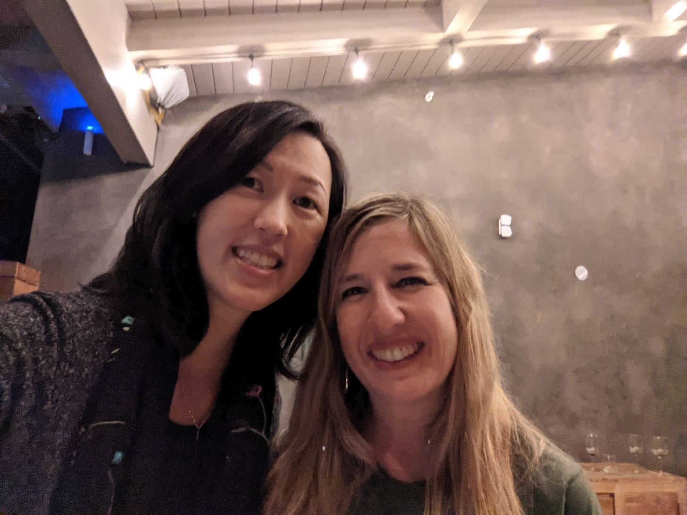

# Activation Energy: the Hidden Superpower Leaders Can Leverage

*How a small nudge can yield dividends*

Everyone has a neighborhood organizer: the person who makes sure things happen. The person who hosts the incredible parties and ensures no one leaves hungry. The person whose home is the neighborhood gathering place. The person who is the center of the social and school life of the community.

In our neighborhood, my friend, Robyn, fills that role. Formerly an early employee of both Google and Facebook, Robyn now spends her energy as they president of the various school parent organizations took steps to help tens of thousands of voters who ran into issues in the last presidential election and even created a Halloween experience that turned our dead street into a bustling hub of activity. Robyn doesn't just talk about doing things; she actually *does* them, creating ripples through our community—and the world at large. From assembling our Lean In Group to holding incredible salons in her backyard, Robyn never seems to run out of reserves. She is an Energizer Bunny, the Queen of Making It Happen.

When I published [my post about linchpins](https://debliu.substack.com/p/the-importance-of-linchpins-and-why), Robyn immediately emailed me to tell me, "I think I'm a linchpin." I absolutely agreed. But Robyn isn't just someone who is the center of a community; she is someone who takes initiative, making things happen that would never happen otherwise.

What's her secret? It's called activation energy, and it can be a game-changer if you know how to harness it.

## **What is activation energy?**

In physics class, we learn that every action has to start from somewhere. When a ball is standing still, it takes energy to get it rolling. That first push is where the most force is required, because you have to overcome inertia and friction. In fact, it actually takes more energy to get something moving than to *keep* it moving once it's in motion.

Activation energy is the ability to get  the ball rolling when you see a problem. It's your power to take action, enlist others, and make things happen.

Robyn is a prime example of someone who sees a problem and says, "Let's find a way to solve it."  She told me a year before my book was published that she would host an event at launch, and sure enough, a year later, it was standing room only as I spoke in her backyard. She had an idea and saw it through, as she always does. Without fail, Robyn is able to overcome the inertia of the status quo and take action.

Needless to say, activation energy can pay dividends in our professional and personal lives. But what makes this skill so important?

## **What it means to lack activation energy**

I once had a team member who lacked activation energy. At first, I couldn't figure out what was going on. It felt like no matter what I said, they just weren't sure what to do. It wasn't that they were bad at their core job, but rather that they saw it as a series of things they were trying to keep in motion. What they lacked was the activation energy to create new things and start initiatives from the ground up.

When I asked this team member about an important initiative that we needed to kick off, they heard me, but they didn't seem to know what to do. Rather than start the project, they just punted it week after week. Finally, I outlined the steps that would be required to start the work, but even then, the project was slow getting out of the gate.

Their key skill was to keep things running, not creating new things. But not knowing that, I asked and was disappointed. Eventually we came to an understanding that played to their strengths, but it was hard won.

Companies and teams tend to hire for those with high activation energy: people who can start things and see them through. This doesn't mean that everyone has to have this same level of energy. However, there always need to be at least a few high-activation people to innovate and grow in new areas. This is where transformative change happens.

## **How you can develop activation energy**

There are some people who can will things into the world through sheer effort alone, but for many of us, it's a struggle. How many times have you thought, "Someone should do something about that," only to go back to your day job and forget all about it?

But what if you could flip the script? By reframing issues and tasks in a way that adds accountability, you can overcome the inertia of being a bystander and create the change you want to see.

Next time you see an issue, instead of wishing for a solution, ask yourself, "What can I do to make a difference?" It's important to remember that you don't have to solve the problem all by yourself. Sometimes all it takes is an initial push to get momentum going, inspire others, and have a tangible impact.

For several years at Facebook, I was one of only a handful of women product managers at the company. Confused by this gender disparity, I wanted to help change it. Though I had previously run large product orgs, at the time I was an individual contributor in the bowels of the organization. I was neither powerful nor important within the company, so I was at a loss about how I could address the gender gap.

I then read an article about a prominent PM at Google, who said they had noticed something interesting: in general, women candidates only accepted job offers if they met a fellow woman during the interview process. Given that our proportion of women PMs was less than 10 percent at the time, the chances of that happening at Facebook was low. So I went to the head of recruiting, Ruta Singh, and volunteered to interview every single woman candidate in the first round. I quietly did this for a couple years, and we were able to bring on several other women product managers. Eventually, others heard about what I was trying to do, and when it came time for the VP who was leaving to hand off responsibility for product management recruiting, he chose me (perhaps an unlikely candidate for the role).

It was also around this time that we started organizing quarterly dinners for women product leaders throughout Silicon Valley. After four years, at one of these dinners, a few of us decided we wanted to host our own conference. This ultimately led to the development of Women in Product, which now has over 30,000 members.

Activation energy doesn't necessarily have to be intentional, but you do have to do *something* with the passion you feel about an issue. Rather than sit back and say “Someone ought to do something,” turn it around and say, “I ought to do something.” Then make it happen.

Ultimately, that leads others to help, becoming part of the force that you have set in motion. Like a rock rolling downhill, you can gather steam and support. But it's that first person, the one who sets things in motion, who is so critical. This is the person we all need in our lives—and that person could be you.

**There are only four steps to get started:**

1. Identify the problem that you care about (not enough women in product management)
2. Pick one thing you can do to make a difference (set up dinners and eventually a community to help more women enter and succeed)
3. Enlist others to be part of the solution (create a founding group of women to turn these dreams into a reality)
4. Scale and grow (raise money to sustain a non-profit and hire staff)

Not every solution requires building a non-profit. Some are setting up coaching circles or hosting events to drive awareness around an issue. My kids learned that many teens like them don’t have access to glasses (they are both quite dependent on them) so they are hosting a drive to gather 1000 pairs of them to donate to be refurbished. The point is that someone doing something is how all things happen.

---

[Leave a comment](https://debliu.substack.com/p/activation-energy-the-hidden-superpower/comments)

Next time you notice a problem that needs solving, consider rolling up your sleeves and turning on your activation energy. What small steps can you take to get the ball rolling? What if you organized with a few other people to set things in motion? The barrier to action—and creating tangible change—is often smaller than you think. All it takes is a little push.

If you need a bit of activation energy in your life or company, reach out! I asked, and she’s open to spreading her magic to areas where you need it. [Reach out here.](https://www.linkedin.com/in/robynreiss/)

[Share](https://debliu.substack.com/p/activation-energy-the-hidden-superpower?utm_source=substack&utm_medium=email&utm_content=share&action=share)