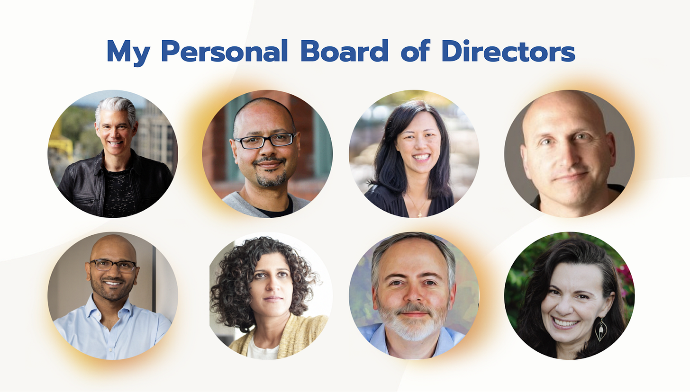
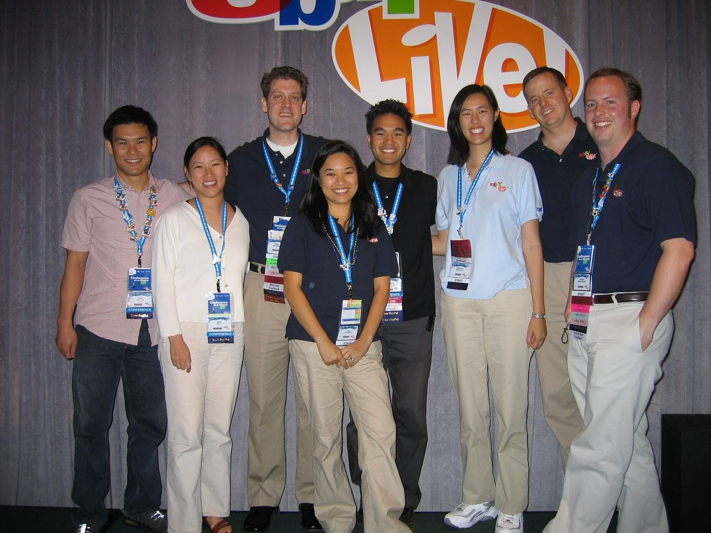

# Forget Networking and Build Your Personal Board of Directors Instead

*How a small group of people can be the trusted advisors you need to catalyze your extraordinary success *

In 2015, after I had worked in product leadership roles for more than fifteen years, I was ready for something different… I just didn’t know what.

After much consideration, I began to realize this wasn’t a decision I could make on my own. What I needed was outside advice from people who knew me well—not just a colleague, an acquaintance, or even a manager, but people who would have my best interests at heart, and who could push me to stretch myself in new ways. What I needed was advice from my **personal board of directors:** a trusted network of advisors who could provide me with guidance, advice, encouragement and brutal honesty over the course of my career.

[Share Perspectives](https://debliu.substack.com/?utm_source=substack&utm_medium=email&utm_content=share&action=share)

I had spent years building my personal board of directors, and the time had come to reach out to them for advice on my next career move. So I did. That was when one of my board members – my former eBay boss, [Shripriya Mahesh](https://www.linkedin.com/in/shripriya/), who was a Partner at Omidyar Network at the time –  invited me to join the wonderful world of venture as an Executive-in-Residence (EIR). This led to a full-time job in venture capital, a field I had never even considered before—and it was all thanks to my personal board.

Whether you're early in your career or looking to take your success to the next level, building a network of advisors like this can be a game-changer. Why? Because having a personal board of directors means having a dedicated group of experts who are all invested in your success and well-being. Your board members will be there for you no matter what, available to provide insight and encouragement whenever you need it, and their advice can be the key to reaching new levels of success.

So here’s my advice: forget about traditional networking, and build your personal board of directors instead. Rather than chasing LinkedIn connections, network with a purpose by building the support system you need to achieve success today, and to continue achieving it far into the future. This is what having a board can do for your career—and that’s just scratching the surface.

## **The power of a personal board**

A personal board of directors is more than just a group of acquaintances you call on when you need advice. These are people who know you at your best and at your worst. They can see your strengths and are realistic about your areas of improvement. They are willing to invest their time and energy into helping you grow.

A personal board of directors doesn't just exist to seek and provide opportunities for you. Sometimes, their role is to push you beyond your comfort zone, and that was exactly what my board did when, in 2022, I left Swimply, where I had spent two years working as the Chief Experiences Officer. During this time of transition, I once again turned to my board for guidance on my next move. This time, [Dave Zinman](https://www.linkedin.com/in/dzinman/), a seasoned CEO, was the one who pushed me to go beyond my limits, all with a simple statement: "I think you're ready for a CEO role."

It had never occurred to me that I might want to become a CEO, but Dave made me see it as a real possibility. That was why, when a CEO opportunity presented itself, he was the first person I turned to. Dave suggested that I put together a plan to present to the company’s board. I reviewed my draft plan along with him and a few other members of my board, and guess what: neither Dave, nor [Sonny Mayugba](https://www.linkedin.com/in/sonnymayugba/), a seasoned entrepreneur, were afraid to tell me that the first iteration... Well, for lack of a better word, “sucked.” I was talking too much about myself and why I was right for the role, as opposed to how I would deliver true enterprise value and build a billion-dollar company with my plan. With this feedback, I was able to iterate on the plan and eventually present it to the company’s board. What had once only been a pipe dream had suddenly become a real possibility.

Although that CEO role didn't pan out, my board—and Dave, in particular—opened my eyes to the fact that I was capable of running a company. In March of this year, with the encouragement and advice of my board, I launched my new business, [NextStep](https://nextstepfwd.com), a fractional and advisory COO practice to help early-stage founders and CEOs become master operators, company builders, and people leaders. (Fun fact: one of my other board members, [Prakash Raman](https://www.linkedin.com/in/prakash-raman/), a friend and executive coach, helped me in convincing my future cofounder and business partner, [Garrett Kelly](https://www.linkedin.com/in/garrett-kelly-pdx/), to join me on this new journey.)

So many times in my career, I've found myself at a crossroads, feeling stuck, or in need of advice. Each time, I’ve turned to my personal board of directors for help, and I’ve never regretted hearing what they’ve had to say. Their insights into everything from compensation negotiation (including exit clauses) to career choices to dreaming bigger have helped me make some of the most pivotal decisions in my career—and your board can offer you the same.

[Subscribe now](https://debliu.substack.com/subscribe?)

## **What is a personal board of directors, anyway?**

A personal board of directors has three key features:

1. **People you trust:** One of the biggest differences between a network and a personal board? The people on your board aren't just acquaintances. They're people who know you well—sometimes even better than you know yourself. These are individuals who have a strong understanding of your strengths, weaknesses, and challenges, and who deeply care about your ability to grow and succeed. They will treat your discussions with the utmost confidentiality, and they will always keep your best interests at heart. The people on your board shouldn't just pay lip service to your goals; they should be invested in helping you achieve them.
2. **Diversity of perspectives:** Just as a company board brings a range of diverse perspectives to the table, your personal board should provide you with a range of opinions and insights. Having a variety of points of view on a problem or decision can help you make better choices and approach challenges from different angles. The more diverse your board is, the more you can tap into their different areas of expertise—and that's where the real magic happens.
3. **Brutal honesty and accountability:** How many times have you asked for feedback from someone, only to have them say things that prop up your ego, without giving you any actionable advice? When someone doesn't know you that well, they're more inclined to sugar-coat what they tell you. But here's the thing about growth: it requires people who are willing to be brutally honest with you. I'm talking *brutally* honest. Your board of directors should include people who aren’t afraid to give you constructive criticism in the interest of seeing you succeed. And because they want you to succeed, they can also hold you accountable when it comes to achieving your goals.

## **Why so many of us don't have boards**

For all we talk about LinkedIn connections and after-work socials, many of us don't build networks with intention—let alone boards of directors.

The reasons for this can vary. Often, receiving tough feedback is challenging, if not downright scary, and it takes courage to gather a group of people who aren't just willing to provide that, but eager to, in some cases. This requires a willingness to accept your imperfections—as well as an understanding that no one on your board will be perfect, either. Their advice may miss the mark at times, which can make it easy to lose your sense of direction if you don't take the time to reflect on the reasoning behind it.

But the real potential of a personal board of directors lies in the fact that the people who form it genuinely care about you. By maintaining your own compass, and knowing when to take your board's advice—as well as when not to—you can capitalize on this unique relationship without losing your way. You may even discover new areas of growth that you would never have identified otherwise.

## **Advice for building your board**

So, how do you go about creating your own personal board of directors? This process may look different for everyone, and no two boards will look exactly alike. My board, for instance, consists of VCs, CEOs (including the amazing [Deb Liu](https://www.linkedin.com/in/deborahliu/)!), executive coaches, and C-suite executives, but yours might look different depending on your skills, goals, and needs. What’s most important is that the people on your board know you're a rockstar and have seen you in action. As a result, they know what you're capable of, and they are willing to invest in your success.

That said, there are a few key pieces of advice that I would give my younger self on building a board, and I believe these are applicable to anyone. I encourage you to heed these lessons as you build a board of your own.

As I mentioned earlier, **your board of directors should consist of individuals who care deeply about your success.** They should be trusted advisors, those who are willing to give you tough feedback and help you put it into practice. That’s why you want to make sure that your board members are individuals you know well, who understand your goals and values, and who know what you're capable of. This is what equips them to give you useful advice and help identify the right opportunities for you.

Secondly, and just as importantly, **you shouldn't just approach someone outright and ask them to join your board.** This may put them in an awkward position, especially if they themselves don't feel like they know you well enough to give you good advice.

The better approach is to **look for opportunities to show your skills.** If there's someone you admire, who you'd like to have on your board, one approach is to find projects or initiatives that they're passionate about and offer to lend your skills and expertise. By working on a passion project together, you will build trust, rapport, and an understanding of one another. If you give them a chance to experience your best work, demonstrate that you are a good human being, and allow the relationship to develop naturally, you'll be surprised at how willing they will be to help you in the long run.

## **What if I don’t have the right network?**

As you can probably tell, I have long been an advocate of building a personal board of directors. Even still, when I was asked how to build one by someone without a network of incredible people, I was caught off guard. Then, recently, I met [Lexy Franklin](https://www.linkedin.com/in/lexyfranklin/), founder of [Sidebar.com](https://www.sidebar.com/?utm_source=haarticle&utm_medium=web&utm_campaign=waitlist_launch&utm_content=pbod), who helps founders, executives, and emerging leaders build their boards and catalyze their growth. During his time at Facebook, Lexy noticed an interesting pattern while he was there: those who grew into top executives at the company had surrounded themselves with people who helped them grow. These advisors were willing to give them the support they needed to become the best versions of themselves, professionally and personally.

Intrigued by this insight, Lexy founded Sidebar to replicate that dynamic for those who don’t otherwise have that in their lives. If you feel you lack the right connections, or you don’t know where to start, consider [Sidebar](https://www.sidebar.com/?utm_source=haarticle&utm_medium=web&utm_campaign=waitlist_launch&utm_content=pbod) as a shortcut to building your board.

## **Your board can help catalyze your extraordinary success**

Boards of directors aren't just for companies—they're for people, too! And they can be invaluable tools for anyone who's willing to turn to them for advice and expertise. A personal board of directors can shape you into a better leader, challenge your decisions, and help you fully unlock your potential. So forget about standard networking, and focus on finding your board of directors. It may just be the best professional step you ever take.

Do you have a personal board of directors? How have they helped you? Feel free to share your story in the comments. If you’re looking to build your personal board of directors and want to brainstorm with me about it, please feel free to reach out: [ha@nextstepfwd.com](mailto:ha@nextstepfwd.com)

[Leave a comment](https://debliu.substack.com/p/forget-networking-and-build-your/comments)