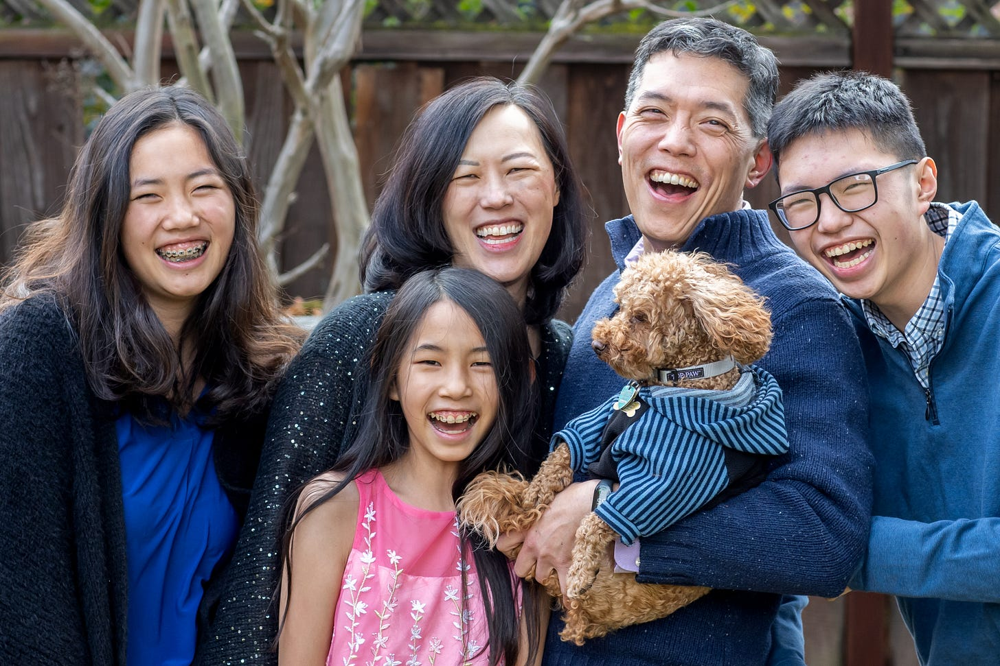

# What They Don't Tell You About Having Kids And A Career

*More hidden pitfalls and challenges of being a working parent *

Ever since I was a little girl, I knew I wanted to have kids. I used to play with stuffies and treat them like babies. My sister (who runs this newsletter, and seems to have mellowed out a bit) knew how much I loved them, so she used to squish their faces in glee to make me cry. But I loved them to death, and I knew that someday I wanted to be a mom. When I turned 30, that dream finally came true when we had our son, Jonathan. Then, a couple of years later, we had Bethany, and a couple years after that, we had Danielle, our surprise addition.

[Subscribe now](https://debliu.substack.com/subscribe?)

Motherhood is scary, wonderful, and frustrating all at once and all the time, and that’s something many of us have heard and discussed. But there are so many things about this facet of life that we don't talk about, especially in the context of work.

Back in September, I published a post about [the secrets behind pregnancy and maternity leave](https://debliu.substack.com/p/the-truth-about-maternity-leave). Ever since then, I’ve been noodling on writing a second article, this one focusing on what being a working mom is *really* like—but I held back. I didn’t want to sound like I was complaining, because having children has been the greatest joy of my life. But it's not always easy, and it's hard to say a lot of the things that I discuss here.

Still, these are things that I think need to be said, because every working woman deserves to know what they will be getting into if they have kids: the good, the bad, and the ugly. So, without further ado, here are a few more things they don’t tell you (but really should) about motherhood.

## **Motherhood will most likely slow down your career**

Though we don't like to talk about it, having kids often slows down your career in ways that you can't even imagine. I have absolutely no regrets about having children, but there was a price to be paid, and I definitely paid it.

As I mentioned in my earlier post about maternity leave, [during the six years I was pregnant](https://debliu.substack.com/p/the-truth-about-maternity-leave), on leave, and breastfeeding, I was not only *not* promoted once, but I even took a demotion to go to a new company. I was frustrated at my lack of progress, and at least twice I considered dropping out of tech altogether. I was fortunate enough to have had wonderful mentors and sponsors who talked me out of it, but if not for them, I would not be where I am today.

Even with their support, however, it was a long and difficult road, and not everyone has the level of resources that I did. The truth is, being a full-time working mother outside the home, especially to young children, is *hard*. The juggling act of trying to pump between meetings, get out in time to pick up the kids, and manage a family when someone always seems to be sick is real.

I think that because we understand the challenges of being a mother so viscerally, unconscious bias leads us to assume that mothers are less committed to their work. As a matter of fact, the motherhood penalty is so great that it is currently one of the biggest sources of discrimination in the workplace. According to the American Association of University Women, citing research by the Census Bureau on women in opposite-sex relationships, “two years before the birth of a couple’s first child and a year after, the earnings gap between opposite-sex spouses doubles. The gap continues to grow until that child reaches age 10.” ([ref](https://www.aauw.org/issues/equity/motherhood/))

Meanwhile, a study in the *American Journal of Sociology* found that mothers were rated lower, offered less money if they were hired, and perceived to be less committed to their jobs than women without children ([ref](https://gap.hks.harvard.edu/getting-job-there-motherhood-penalty)). On the other hand, fathers were seen as more committed to their work than non-fathers (presumably because they are supporting a family and likely to work harder) and offered more money ([ref](https://gap.hks.harvard.edu/getting-job-there-motherhood-penalty)). Think about that for a second: an opposite-sex couple could be equally interested in work and advancement, but as soon as they have kids, the father will see a bonus while the mother will see a penalty.

This is the reality that we face as working mothers, and although we can work to change it, that doesn’t change the fact that it exists now, and it can have very real consequences.

[Subscribe now](https://debliu.substack.com/subscribe?)

## **The world is not set up for two working parents**

When she was in elementary school, my daughter, Bethany, asked if one of us could attend her “publishing party” at school the following week. They had worked on writing a book with chapters, and they were throwing a party to celebrate. I silently hoped that it was at either the start of the day or the end, but nope: it was at 11 AM, right in the middle of the week. One of us would have to move everything around on short notice in order to make it, or risk disappointing her. I felt so bad, since I had a meeting that couldn’t be moved, but David was able to make it.

This happened so many times. Concerts, school events, parent-teacher conferences, classroom volunteer events… So many activities often required a parent to be at school during work hours. We always had to juggle, shuffle, and negotiate to try to be there for each of our three kids.

David and I are fortunate, because we work in relatively flexible jobs, so at least one of us could usually make it, but it was tight. This was particularly difficult when we were both working in the office full-time pre-pandemic. At one point, we had three kids in four different schools (public elementary, public middle, and private elementary, plus Chinese after-school). The shuttling was intense, since getting them places took a huge amount of time. We’re talking about hours upon hours of driving around town, getting them from school to activities and then back home again. The fact that the schools all let out at different times, each with occasional “short days” or biweekly extended days, only threw everything even further into chaos.

This experience taught us a hard lesson: the world is not made for families with two working parents. Between kid-related responsibilities and a five-day in-office culture, finding a balance can be difficult, if not downright impossible, and that’s something every prospective mother needs to understand.

## **No one can do this without support**

The quiet struggle of managing your life with children alongside a full-time job is one that no one sees. I’m talking about the agony of having your entire family sick with the stomach flu and knowing you have an executive presentation in three days. The stress of having to decide between attending a work trip and a school play. The panic when a meeting runs long while daycare is letting out.

At one point, mornings were so chaotic that David and I ended up fighting over who was going to do drop-offs when one of us was running late. Half the time, we were frustrated and rushing the kids out the door, all while scrambling to help them find missing shoes or lost books. The chaos was hurting our relationship—with each other and with our kids—so we ended up hiring back the nanny we'd had when they were small. She would come in each morning for one hour to make them breakfast and drive them to their respective schools. She was like a third grandmother to them, and she loved seeing them off each morning. Though it seemed like a small change, this support helped us find a level of household peace that we lacked. While not everyone has the means to do this, we considered it an investment to keeping our household in balance.

I will say that the difficulties of motherhood have made me more efficient, more understanding, and more patient. A senior executive friend of mine once told me, “Becoming a parent taught me how to be a great manager. When you are a parent, you want the best for your kids, whether you praise them or show them tough love.” She was an encouraging, supportive, and kind manager, and she said she had parenthood to thank for that. But the reality is that over 70% of mothers with children under 18 at home work nearly full time or more ([ref](https://www.aauw.org/resources/article/fast-facts-working-moms/)), and the challenges they’re facing are all too real.

## **Succeeding at work as a mother requires a supportive workplace**

70% of male top-earners have stay-at-home spouses, but only 22% of women top-earners do, according to a study published by the American Sociological Association ([ref](https://www.yahoo.com/now/70-top-male-earners-us-162154561.html?guccounter=1&guce_referrer=aHR0cHM6Ly93d3cuZ29vZ2xlLmNvbS8&guce_referrer_sig=AQAAAFYKISIPHEKYvm7L01xmedkuzoWiLncg7oW_DvU-ygrMBaXQaHfyWZl8I7G6CNfUjcQfvyJhqsQif9d1SuhVC1dZi0UbizGuEVjg9lKUwN6kl-ga79iONakyWh_NmNkGs_P8Ci8ow_cbk92v7WeYZcXUD1ulHre2zn12UPsIMVam)). Think about that disparity: a vast majority of men who reach the top of companies have someone to take care of things outside work, but far fewer women do. What does that mean for women in the workplace?

The second time I nearly dropped out of the workforce was shortly after I had my third child. She was an extremely colicky baby who cried relentlessly for two to three hours a night. At the time, my dad was in hospice dying of stage IV cancer, I had two young kids at home, and I was wrestling with this all while working a very demanding job.

I ended up going to my new manager and explaining the situation to him. He did something that surprised me: he acknowledged my feelings, and then he asked, “Why do you think you have to do it alone?”

I was taken aback, but then my manager pointed out our male peers one by one, and reminded me that each of them had wives who either worked part-time or stayed at home. That really hit home for me: I was in desperate need of the type of support that is normalized for men, but far harder to come by for women. That conversation made me feel seen at a time when I felt like I was carrying an invisible load. With my manager’s support and encouragement, I redoubled my efforts and thrived under his leadership, but for many women, this simply isn’t possible.

[Subscribe now](https://debliu.substack.com/subscribe?)

## **The world will judge you no matter what**

Many times, I have been asked vaguely judgmental questions about my decision to continue working while raising kids. "Who takes care of your children while you are at work?" is a common one. I even get the occasional, “Don't you regret missing out on their childhood?"

Each time I mention this happening to my husband, he laughs and tells me no one has ever asked him those things. This is a sobering reminder that although we may be equal partners in our household, we’re not in the eyes of the world. David is seen as less essential to our children’s upbringing, while I am judged for working instead of staying home with the kids. We were equals in school, we both have graduate degrees, and we can command the same respect in the workplace. But the difference is that I am a mom, and he is a dad.

When I was pregnant with my son, another couple we were close to were pregnant at the same time. The husband worked at a big law firm, and he shared the following story: “The partner I worked for asked me this week, ‘Is your wife going to breastfeed?’ I thought he was going to tout the benefits of breastfeeding for babies, so I replied, ‘Yes, she is.’ He nodded and said, ‘That’s good. Then you can sleep and not have to get up with the baby at night.’”

At first, these sorts of statements frustrated me. I could acutely feel the double standard. But then I realized that these questions said as much about the person asking them as they signaled to me that I was doing something wrong. If working outside the home is somehow wrong, then 70% of mothers with children under 18 are doing it wrong. Realistically, most mothers work out of necessity, and they are the norm, even as they are judged negatively for making that choice. As a result, I have learned to accept that there is judgment no matter what path you choose.

## **We need to destigmatize getting help**

Because of how harshly we judge working moms, I see many senior women make an effort to hide the help and support they get in raising their kids. They don't want to be stigmatized, and they don't want to seem like they can't do it all. But I actually think that having to hide it makes it harder for those who are struggling and don’t have those levels of support. If all of us who have "made it" pretend we did it alone, what does this say to those who really *are* alone on their journeys?

What if we could stop pretending that our houses look like the inside of a magazine? What if we could all acknowledge that sometimes we need help to make it work? What if we could just accept that in order to succeed in the workplace, women often carry a heavier burden, and we can't do it alone?

I was once at a founder event for women, where one of the attendees sheepishly told me and another founder, "I got an au pair." She said it like it was something to be ashamed of as if it were somehow abnormal that she couldn’t stay home for her two kids while growing a startup at the same time. The other woman I'd been speaking to, a successful founder in her own right, responded, "I've had 13 au pairs." She was unapologetic that she had help.

And do you know who else has had an au pair? Their husbands. I doubt they stand around wondering if they're going to be judged for saying it.

---

The world is changing. The majority of mothers with young children work outside the home, and in 41% of households in America, mothers are the primary or sole breadwinners ([ref](https://www.americanprogress.org/article/breadwinning-mothers-continue-u-s-norm/)). But the culture surrounding motherhood—particularly working motherhood—has not caught up with the times, and it’s time we start talking openly about this.

Motherhood is rewarding, but it also has a lot of hidden costs. Working moms are no less committed to our work and our families than those who choose one or the other. Nevertheless, the motherhood penalty is real, and it is felt by so many working mothers who silently struggle to keep all the plates spinning, hoping that none of them tip over. That feeling of precariousness and stress is all too real for so many of us, but if we can’t even talk about it, how can we ever hope to solve it?

[Leave a comment](https://debliu.substack.com/p/what-they-dont-tell-you-about-having/comments)