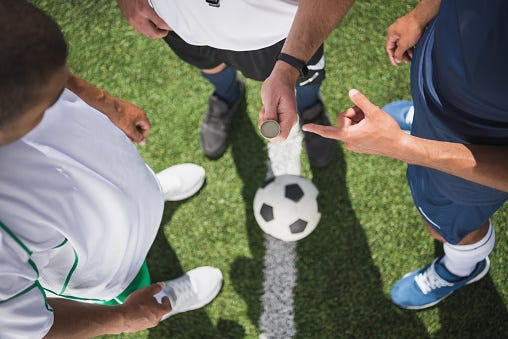
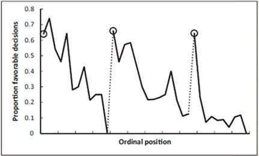

# Cognitive Biases You Don’t Think About

*Small fallacies can add up to big consequences*

We have a running joke at work. Whenever we have an off-site or all-day meeting, we always quip, “Don’t take the ‘no parole’ slot.”

Confused? Take a look at this chart that a researcher put together. It shows your probability of getting paroled based on the time of day your case is heard.

Source: <https://phys.org/news/2011-04-early-lunch.html>

What do you see?

Early in the morning, your probability of getting paroled is in the 60-70% range. Over the course of the morning, those odds gradually decrease until you reach the “no parole slot,” which is right before the first break and then declines again until just before lunch. During this “no parole” window, your odds of getting parole drop precipitously.

Any given prisoner’s parole review could fall into any of these slots, and their merits for parole are completely unrelated to the time of day. Yet judges show a bias based on what it seems like, well, being hangry.

Why is that?

## **The illusion of objectivity**

As humans, we tend to think of ourselves as objective. We believe we judge every person on their merits, every idea on its value, and every strategy on its coherence. But in actuality, many other things weigh into how we feel.

No doubt, judges believe that they are being completely objective. Nobody says, “I didn't give that guy parole because I was hungry and wanted to get to lunch.” But the data is what it is.

In 2020, [researchers at Johns Hopkins did a study](https://www.sciencedaily.com/releases/2020/06/200608163446.htm) to see if it was possible for humans to truly see the world accurately. The participants were shown two coins - one was shaped as an oval and one a circle. They were told to pick which one was the oval. This might sound straightforward, but when the circular coins were tilted ever so slightly, participants struggled to correctly identify their shape. That study gives confirmation to what many of us have already realized: The smallest shift in perspective changes our perception of reality.

I’ve previously written about how [different people can see the same thing completely differently](https://debliu.substack.com/p/perception-is-reality?utm_source=publication-search). Each of us has our own point of view, goals, and background that we’re bringing to any situation. Like it or not, this context is intertwined with the ways we see reality, leading to biases, assumptions, and full-blown mistakes.

[Subscribe now](https://debliu.substack.com/subscribe?)

## **The bias against streaks**

Consider this scenario: You ask someone to do a series of coin tosses and write the results on a chalkboard. You then ask someone else to pretend they did a series of coin tosses, but without actually flipping a coin, and write down their results.

[A researcher studied whether people could tell which was really coin flips and which was human created](https://pubmed.ncbi.nlm.nih.gov/29202364/), and participants could tell when someone faked the coin tosses. Why? Because faked results don’t account for streaks: sequences of multiple “heads” or “tails” in a row.

When I read about this, I found it fascinating, but now that I've learned more, it makes sense. In a real coin toss, there is a 50/50 chance of it being heads or tails. But what we don't realize is that [streaks are a real thing](https://www.omnicalculator.com/statistics/coin-flip-streak). Individual coin tosses are completely probabilistically independent of each other. Therefore, you will naturally see streaks of all heads or all tails. For example, there is an [80% chance of a streak of at least five heads when you roll 100 coins](https://www.omnicalculator.com/statistics/coin-flip-streak). The odds are even higher if you count a streak of either five heads or five tails. This genuinely happens. But when someone pretends to toss a coin, the discomfort of claiming a bunch of heads or tails in a row often keeps them from faking a long streak. This is the gambler’s fallacy in action.

What does this have to do with cognitive bias? [One study looked at asylum claims that were heard by immigration judges](https://academic.oup.com/qje/article/131/3/1181/2590011). If one claimant was granted asylum, the next one had a lower probability of also being granted it by a measurable amount. In this scenario, the judge is acting like the person pretending to toss a coin. The discomfort of saying yes to three people in a row is so great that if you came after somebody who had a meritorious claim, you were much less likely to get asylum—even if your claim also had merit. But just like coin tosses, asylum claims are completely independent of each other. You could have ten meritorious claims in a row or ten failed claims.

Judges have also been found to make decisions based on what happens in their own lives. [“One study of a million and a half judicial decisions found that judges were harsher in the days following the loss of a local football team. Another review of 200,000 immigration court decisions found that people are less likely to get asylum when it’s hot outside,”](https://news.uchicago.edu/big-brains-podcast-noise-judgment-cass-sunstein-kahneman-sibony) says Paul Rand, host of the podcast “Big Brains” citing data from [the book, Noise](https://amzn.to/3xi3xDo).

Our discomfort with streaks is a cognitive bias we don't think about, but it can also have impacts in the workplace. Take hiring as an example: We did batch hiring at a company I once worked for. A large group of people would come in, and we would rotate and interview six of them at a time in groups of three. Any individual interviewer would interview three people in a row. What I found was that the interviewers always felt like they had to say yes to at least one person and no to at least one person. Very rarely did you actually have three yeses or three nos. But doing this over a long period of time, you would see that statistically, it was impossible for the numbers to be coming out the way they did where in any group of three, there was at least one yes and one no.

Eventually, I realized that the interviewers were ranking the candidates against each other, even though the groups were assigned at random. The fact that every group of three had at least one hire and at least one rejection meant that our process was breaking down. We had to go back and audit it to see why. Aversion to streaks was what actually caused this, but because only those of us running the process could see all of the data, everyone thought they were being completely fair.

[Leave a comment](https://debliu.substack.com/p/cognitive-biases-you-dont-think-about/comments)

## **Following the crowd**

One of the biggest issues we once had in hiring was that if two interviewers said yes, the third person felt pressure to also say yes. The same was true when two interviewers said no. The way we overcame this was by making everyone write down their decision, and their conviction about that decision, before going into the debrief. That ensured that there was less in-room persuasion. Even still, when somebody—especially someone more junior—was interviewing someone alongside two more senior leaders, they felt the need to yield. So instead, whenever there was a dissenting opinion, we asked that person to speak first to try to persuade the other two.

Once we moved to this model, it changed the way the debriefs for hiring worked. Suddenly, the person with the dissenting opinion had a bigger voice because they spoke first and anchored the conversation. The others spoke second, addressing that person's point of view as well as sharing their own. It no longer felt like two against one, which balanced things out a lot more. This helped us get to better decisions.

## **Judging on context**

I love seeing people’s reactions to famous performers busking on New York City subways. These are people you would pay hundreds of dollars to see, and they’re playing for free. Yet often, no one stops. A lot of the pomp and circumstance of seeing a performance is the concert hall, the lights, and the atmosphere. The music itself is only part of the experience.

This brings me to the other fallacy I want to address: We often judge unintentionally based on context. We’re always making assumptions based on someone’s stress levels, or their car, or where we interact with them. We develop all these ideas about who they are.

It's interesting what people ask when you visit different cities. In Silicon Valley, people often ask you where you work. But in other places, they might ask which part of town you're from, or where you went to school. There are places where your workplace is part of your identity—and others where that doesn’t even factor into the equation. Whether we realize it or not, context can play a huge role in our opinions and behavior.

I remember how, at one of the companies where I worked, we didn't have any titles until “Director.” But in sales, everybody had a senior title. Partly, it was because people wouldn't talk to someone they thought was “Junior,” so they needed the extra clarification. But on the technology side, some of the best people weren’t the ones with the biggest titles. The context didn't matter when you were talking about building products, but in sales, it's very different.

Someone who was a peer GM in another org once interviewed half a dozen candidates and said no to all of them. Usually, the final rounds of interviews had a hit rate of about one in three, so it was unusual that he said no to everyone.

I asked him what had happened. He reflected for a while before coming to the realization that maybe it wasn’t the candidates themselves; maybe it was the interview room. We were running out of conference rooms, and so the only one he’d been able to book for these interviews was a stuffy, cramped room off in a corner. We joked that it was like interviewing someone in a broom closet. The room was so stifling, the candidate was already behind before they even answered the first question. The interviewer was more influenced by the space than the candidate’s responses. The next batch of candidates were interviewed in another room, and just like that, they found the person they wanted.

Ultimately, whether those rejections were more due to the interviewer or interviewees’ discomfort in that space, I'm not sure. But the cramped conditions were certainly a factor for one or both parties.

[Share Perspectives](https://debliu.substack.com/?utm_source=substack&utm_medium=email&utm_content=share&action=share)

---

These are just a few of the fallacies and biases that we run into every day. We tend to think of ourselves as logical and fact-driven, but in reality, our opinions and choices are much less rational than we might think. Context, fallacies, and even our personal lives can guide our decision-making without us even being aware of it.

We might not be able to ever see things completely objectively. However, being aware of these errors in thinking may make it easier to catch them. And as we’ve seen, the consequences of these little lapses in logic are often bigger than we think.

Perspectives is a reader-supported publication. To receive new posts and support my work, consider becoming a free or paid subscriber.