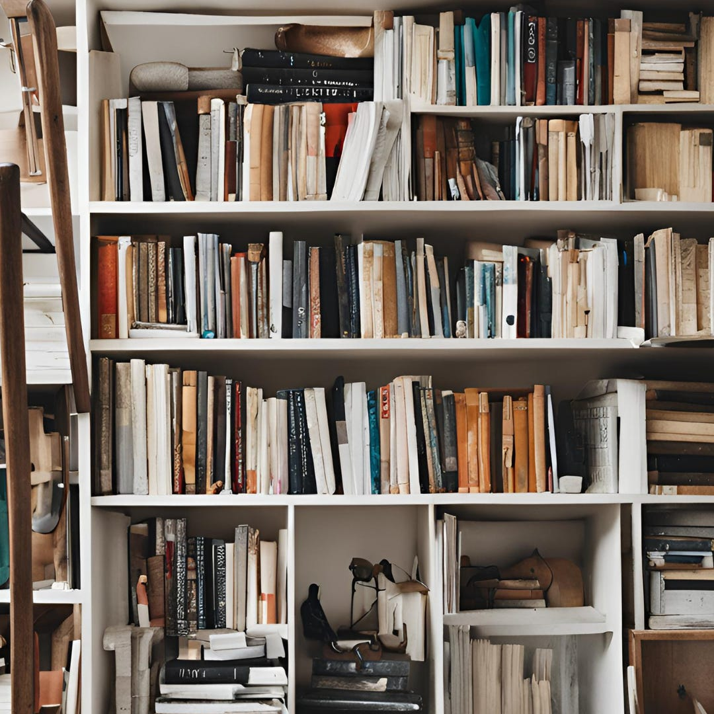

# Less Is More 

*How to add to your life by taking away *

There are days when I just want to throw my hands up and declare “house bankruptcy.” The act of [clearing out my in-laws’ house](https://debliu.substack.com/p/what-are-you-resisting) and [my mom’s room](https://debliu.substack.com/p/dealing-with-grief) has reminded me how much mindshare sundry things can take up. Case in point: My husband saw an old wheelbarrow in the shed that his dad had when he was a kid, and he wanted to keep it. I replied, “You have not needed a wheelbarrow in the past 20 years of our marriage. You probably won’t need one for another 20 years.” Guess what? We kept the wheelbarrow—just on the off-chance he may *possibly* need to move soil around once in a blue moon. When we inevitably have to find a place for it in our new home, I’m taking another shot.

The saying “Less is more” can sound cliche, but so often, it rings true. How much of the clutter in your life—literal and metaphorical—do you really need? How much more space and energy could you free up by clearing it out?

[Subscribe now](https://debliu.substack.com/subscribe?)

## **Pare back what you don't need**

For a while, our home library was completely out of control. We eventually ran out of space on our built-in shelves, so in a fit of pique during the lockdown, I took down all the books in the house and piled them in the living room. Each family member got a chance to take back the books they wanted for their shelf, and we donated the rest to local Little Libraries and Goodwill. We must have given away 50% of the books, and we still ended up with two entire bookcases’ worth.

Now, instead of always finding our books piled in front of each other and having to painstakingly sort through them every time we want to read something, we can actually see what we have. And now that the books are organized by owner, we can easily pick out what we want immediately. As difficult as it was to scale back, we were rewarded with a system that was easier to navigate, nicer to look at, and far less draining to use.

The secret? *Rather than focusing on figuring out what to discard, we focused on figuring out what to keep.* It was a small difference in perspective, but it forced us to prioritize. As a result, we were left with exactly what we needed and wanted—nothing more.

Right now, there is most likely a ton of stuff in your home that you don’t need, but can’t let go of. If you’re struggling to know where to start, here is a short list of things you can pare back on immediately:

* **Reusable shopping bags:** I’ve found that at most, we need about ten of these—and we used to have about 40. Unless you’re buying enough groceries to feed a small army, you probably don’t need that many, either, and it feels good to give away the others to a good home.
* **Plastic grocery bags:** A lot of people don’t know what to do with these, since most recycling pickups don’t collect them. But most grocery stores have bins where you can drop off “film plastic” like grocery bags, sandwich bags, and bubble wrap. Recycle your “bag of bags” and free up space.
* **Kitchen gadgets:** “No more unitaskers.” That’s become my new motto on my quest to downsize. As cool as gizmos like egg separators, apple corers, and barista-style milk steamers are, they take up a lot of space—and often go unused. Donate them for a less complicated kitchen.
* **Clothes:** I now have a rule that [if I haven’t worn something at least once in the last year, I pass it along](https://debliu.substack.com/p/creating-systems-to-scale-and-simplify?utm_source=publication-search). This has freed me from the “maybe” syndrome that led to heaps of unworn t-shirts I was keeping for sentimental reasons.
* **Books:** Like clothes, it can be easy to save books you’ll most likely never read on the chance that “maybe” you’ll get around to them one day. Save the ones you care about and pass along those that can go to a good home.
* **Tools:** David’s wheelbarrow is a classic example. If you’re not doing highly specialized home improvement projects, a basic tool kit is usually more than enough. Avoid hanging on to things if you can’t think of a specific reason you’ll need them in the coming months.

Just taking a few minutes to chip away at these basics can make your daily life less complicated and more organized. In the words of Michaelangelo, “Every block of stone has a statue inside it, and it is the task of the sculptor to discover it.” Inside your home is a simpler one. Your job is to free it.

[Share](https://debliu.substack.com/p/less-is-more?utm_source=substack&utm_medium=email&utm_content=share&action=share)

## **“Maybe” means “no”**

Less can be more beyond just your physical environment, but deciding what to prioritize—and what to turn down—can be tricky. I’ve actually written [a whole post](https://debliu.substack.com/p/ruthless-prioritization-and-the-art?utm_source=publication-search) about this exact topic, and I *still* find it challenging. We may have been able to pare back on clutter in our home, but what about in our lives? We have a lot of things that we could stand to prune.

I recently saw a quote in an advice column that really resonated: “*Maybe* means *no*.” If you're dating somebody and it feels like a “maybe,” the answer is no. If you get an invitation to something and you’re just not sure, the answer is no. Whenever you say “yes” to something, you should say it with gusto, and say “no” to anything that doesn't feel quite right. Sure, sometimes we have to accept obligations that we don't otherwise want to have, but life is too short to constantly force ourselves to do things that are “maybes.”

Now, this also doesn’t mean that you should just immediately say no to things you have no experience with. This can close you off to new opportunities and activities you might end up liking. Instead, I have a rule that I give everything a chance once or twice before I start giving a definitive answer. For example, I give every book I start at least two chapters to hook my interest. Then, if I’m still not invested, I allow myself to say no.

We do the same thing with TV shows. I have one kid who doesn't like watching a ton of shows with the family. Her tastes are somewhat particular, but I tell her, “Give it 20 minutes, and if it doesn't catch your fancy, you're welcome to go do something else. But at least stay with the family for 20 minutes and watch intently.” You would be surprised at how many times she was so sure the answer would be “no” until she actually tried it.

We often torture ourselves with “maybes” when our lives could be so much simpler by just saying “no.” Open the door, give it a shot, and then close the door. If something doesn't work out, then you’ll know for sure that you made the right decision.

[Share Perspectives](https://debliu.substack.com/?utm_source=substack&utm_medium=email&utm_content=share&action=share)

## **Just do it**

My in-laws used to live in our old house. In the midst of renovating in 2011, our contractor decided to retire and not complete the project. As a result, there were small things all over the house that hadn’t been fixed. This wasn’t much of an issue at first, but it got harder as we moved back in—and then even harder when we moved out and my in-laws moved in. Every single time I walked into the house, I could spot things that weren’t quite right. One wall in the bathroom was unfinished and unpainted. Another area was covered with a metal plate. The lights flickered, and the ceiling fans were wired strangely. I finally bit the bullet and hired people (thanks, Thumbtack!) to fix everything I should have fixed long ago. I had put off all these little irritants for so long, and they ended up sitting in the back of my mind for years.

There are so many of these little things in our lives, issues we ignore that we know we should fix. When those simple things pile up, they turn into mental clutter. Mental clutter turns into stress. That’s why sometimes, the best way to do less is to tackle those things head-on. Remove what’s in the back of your mind, cluttering it up.

For our starter home, we bought a lovely, modest house. The family who lived there before us had put a lot of love and care into it, but there was one thing that drove us crazy: the wallpaper in the kitchen, [which had a pattern of chickens and hearts on it](https://debliu.substack.com/p/the-secret-power-of-fresh-eyes). Yes, we had chicken wallpaper on our wall. It drove us insane. It was the kind of '90s “country chic” look that was definitely not our style. But it just seemed like so much work to get rid of all that wallpaper and replace it with something else, so we just kept it. Then, when we were selling that house, our real estate agent told us we had to get rid of it because no one was going to buy a house with chicken wallpaper. So we finally sucked it up and found a contractor to come in, scrape off all the wallpaper, and paint the walls. The house looked a hundred times better. For years and years and years, every single photo we took in that house had that chicken wallpaper in it. Now, looking back, we wish we had gotten rid of it when we first moved in.

Don't allow things to linger. What is the chicken wallpaper in your life?

---

“Decluttering” is one of those necessary evils. We always hear about how important it is and how much it will simplify our lives, but it’s painful in the moment, so we tend to put it off. But all those heaps of miscellany come with a cost, too. A study in 2010 found that living in a cluttered home can contribute to higher levels of the stress hormone cortisol ([ref](https://www.nytimes.com/2019/01/03/well/mind/clutter-stress-procrastination-psychology.html))—and that’s not even getting into the mental clutter of maybes and to-dos.

Scaling back is unpleasant, but so is being surrounded by unsolved problems and things you don’t need. Start small and look for ways to simplify your world, and you’ll notice that often, less really is more.