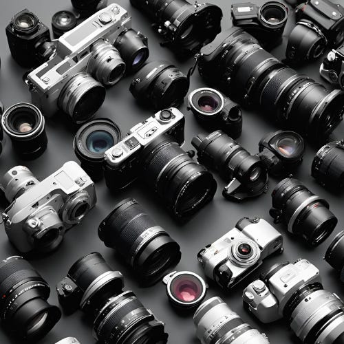
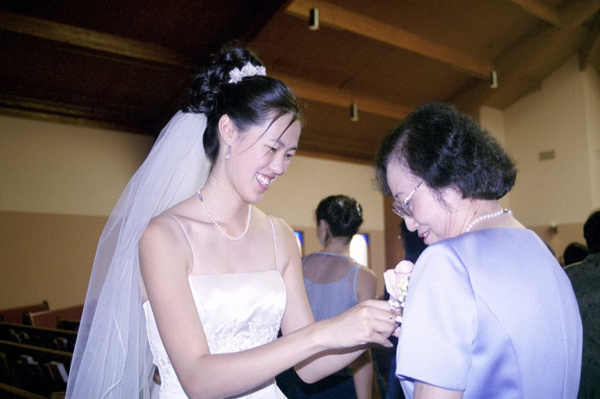

# The Filter You Use Changes How You See Things

*How your filter changes your perception and your perception changes your relationships *

[Canon sponsored an experiment where six photographers captured the photo of the same man in the same location](https://petapixel.com/2015/11/04/6-photographers-asked-to-shoot-portraits-of-1-man-with-a-twist/). Each of them were told a different backstory for the man. The photos that came out were a reflection of the photographer’s filter (figuratively not literally) on their subject. The shock on the faces of the photographers in the video when they saw each other’s work showed how much they didn’t realize that their impression impacted the output.

We think that a camera just captures what is there, but photography, like most things in life, is interpretive. What we see is impacted by the filter in which see the world.

I was not what my mother-in-law expected for a daughter-in-law. I knew this from when we started dating. Though she had a successful career outside the home, I could tell she wanted someone nurturing and warm for her son. She never said I fell short of her expectations, but I know it was something that stayed on her mind.  She thought I worked too hard and traveled too much (and my mother thought the same thing about me). And she also wished I was more domestic. But throughout our relationship, she worked hard to love me for who I was and not place her expectations on me. I loved her for that and now allowing her desires to keep her from building a strong relationship with me.

[Share](https://debliu.substack.com/p/the-filter-you-use-changes-how-you?utm_source=substack&utm_medium=email&utm_content=share&action=share)

## **See your filter**

We don’t think we are biased, but objectively, we are. Our blind spots are real. I recently [read a column from David French in the New York Times](https://www.nytimes.com/2024/06/09/opinion/presbyterian-church-evangelical-canceled.html), about how adoption of his daughter from Ethiopia opened his eyes to the racism around him, including from his own church community.

Having grown up in the South in a nearby state to where he lives, I saw that racism up close and personal. But many well-meaning people around me, including teachers and even my friends, often told me that I was misinterpreting things or misunderstanding what was said. (Not sure how they thought you could misinterpret people saying, “Go back to where you came from” but I digress).  I saw the world so differently than them because people treated me differently, yet I could not explain adequately to them what I experienced. Years later, classmates reached out and asked about my experience. A couple even apologized for not understanding. We occupied different realities that looked from the outside to be the same one.

The problem with most filters is that we can’t see them. A study in 2017 found that 12% of a sample of photos on Instagram tagged with #nofilter actually had been filtered. I am sure you are not surprised to hear this but to see it quantified is a reminder we don’t always see the subtle ways that we are getting influenced by our perception or those of others.

I love reading non-fiction books that weave in biographical elements. Most writers have a point of view, but it is driven by their filter. It is fascinating to see how someone comes to their perspective and how that in turn affects their writing. That is why I name this blog Perspectives. It is a reflection of how we each see things from different perspectives but also that we should put things into perspective. I had an original blog many eons ago called Put into Perspective to remind me to see life in context, not just up close and personal.

## **Put on glasses**

I have a friend who is colorblind. He has spent his whole life knowing that there was something he couldn’t see clearly. Then someone gave him a pair of glasses that allowed him to see colors correctly. Suddenly the world looked different. He was stunned by the colors he could previously not see. Even though he knew he couldn’t see the world as others did, he also couldn’t see what he had been missing.

Once we know we see the world in a specific way, we should aim to put on glasses. I love listening to podcasts about politics and the law. I have several podcasts that I subscribe to that span from the conservative to liberal points of view on SCOTUS (Supreme Court of the United States). It is fascinating to listen to trained lawyers speak about the cases so differently. Even the hosts themselves who are close to each other on the political spectrum often at times won’t agree with each other.  This is high season for SCOTUS rulings, so I am sure I will hear all sides of the argument in full. Most people listen to only one point of view -- the one most likely to agree with them. I find hearing different people who are genuinely seeking the best for our country explain their reasoning and put forth their perspective to be a valuable way to examine my own beliefs.

I hate wearing glasses. When I was a teen, I was forced to get them, but I fought wearing them. I tried contacts and over a dozen pairs of glasses, but I have never been able to wear them reliably without a headache. I learned to adapt by sitting close to the front of the room or pretending I could see when I couldn’t. The only time I wear glasses is when I drive since not actually being able to see street signs and pedestrians is a potentially suicidal and homicidal behavior. Each time I put them on, I am still a tiny bit surprised that the world could be so clear. But knowing you need glasses is different than putting them on. We always forget just how deep our filters can be.

## **Ask for a snapshot**

Our perspectives are so shaped by our unique filters that we often fail to recognize how vastly different others' views can be. If we were to lay out side-by-side snapshots of how each of us perceives the world, we might be astonished by the contrasts.

One time I was in a heated debate over prioritization with another team. We were both adamant that our respective priorities should take precedence. Arguments flew back and forth, until finally, I asked them to explain why they believed their priority was more pressing. It turned out I had been completely unaware of the intense pressure they were under to move a particular metric, just as they had no knowledge that we were bound to a crucial launch date.

We were each so sure our perception was the real one and the other person was seeing a distorted picture. But two people taking a snapshot of the same thing from different angles can have totally disparate perspectives. As I wrote about recently, you can see things differently [by turning the tables](https://debliu.substack.com/p/turn-the-tables). Make the other person show you the picture from where they stand, and then you show them your picture from your point of view.

Once we stopped viewing each other as adversaries and instead saw ourselves as partners, we found a path forward. It wasn't a perfect win-win, but we accomplished enough of both our needs to hit the deadline. By taking the time to understand each other's perspectives and pressures, we turned an unproductive clash into a workable compromise.

[Leave a comment](https://debliu.substack.com/p/the-filter-you-use-changes-how-you/comments)

## **Change your point of view**

I loved my mother-in-law, and I learned from her how to love unconditionally even if I was not quite what she envisioned for her son. Seeing someone through grace rather than our expectations changes everything in how we read their actions. Someone transferred onto my team in terrible circumstances. Their former manager didn’t think they were a good fit for their team, and the PM felt out of place and unsupported. I was given warnings not to take them on. At one point, my team was jokingly called the “Island of Misfit Toys” where PMs who struggled on other teams could find safe haven. While it didn’t always work out, most of the time, I found incredible people that others had overlooked or not seen the magic in.

If we brought someone onto the team, we collectively supported them from the start. I didn’t want transfers who already were struggling to feel like they had to earn my trust. I realized something important. Looking at someone with faith and encouragement often gave them the confidence to do their best work.

Seeing others with a positive lens changes both you and them. You treat them with kindness and encouragement rather than questioning and skepticism. You see mistakes are learning experiences not catastrophes. You believe in their abilities, and they want to live up to that potential. Yes, there have been times when this didn’t work out, but by putting on a positive filter in interactions, you are more likely to get a positive outcome.

---

We are surrounded by filters - our own preconceived notions and those of others. Part of our ongoing work must be to recognize their existence, adjust for their distorting effects, and correct course when needed. The ability to view the world through different lenses empowers us to understand the distortions we face and make the necessary adjustments.

Engage with someone you struggle to understand. Learn about something previously hidden from your view. You may discover an entirely new perspective you've been missing.

By making a conscious effort to identify our blindspots and expose ourselves to alternate worldviews, we can chip away at the filters that constrain how we see reality. The wider our aperture, the more complete our grasp of the larger picture becomes. Embrace the opportunities to adjust your focus this week.

[Subscribe now](https://debliu.substack.com/subscribe?)