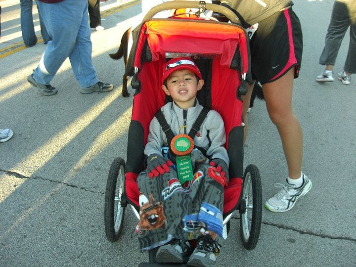
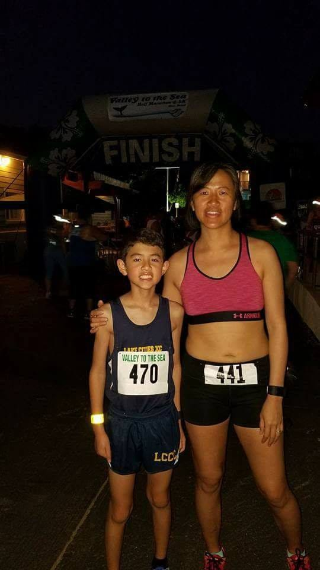
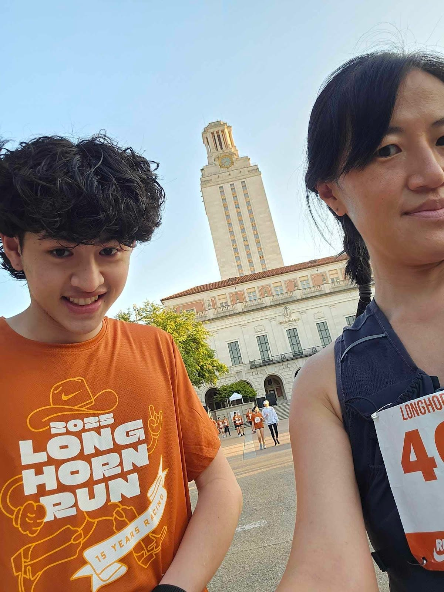

# Finding Your Pace

*What parenting, running, and leadership taught me about showing up and letting go*

This is Deb’s sister, Caroline. Thank you to everyone who commented on [my first post a couple of months ago](https://debliu.substack.com/p/success-rewritten-my-life-behind) on Perspectives. (Side note: my LinkedIn still has not been updated since 2019. One of these days, I’ll get around to adding my last 5+ years of helping start-ups with operations.)

Today, I’m filling in for Deb as she takes some much-needed time off with her family after completing her intensive radiation treatments. I know how deeply grateful she is for your support, and I’m honored to step in for a moment while she rests and recovers.

This won’t be a post about project management, product strategy, or metrics dashboards. It’s about something just as foundational and maybe even more so. Parenting.

Even though I’ve worked full time for nearly three decades, one of the most important jobs I’ve ever had is raising my children. Parenting is a long game, with no org chart, no quarterly reporting, and no clear promotion path. You show up, day after day, and hope that the investment you’re making in love and patience and presence adds up to something that lasts.

Over the years, I’ve come to realize that the lessons I’ve learned as a parent have shaped how I lead, how I work with others, and how I see the world. Today, I want to share a small story from my life that began with an unexpected question from a six-year-old and has led to a lesson I keep returning to, even now. (Note: this post is about one of my two kiddos. I will talk about my other spitfire child who is a carbon copy of me in a different post!)

[Share](https://debliu.substack.com/p/finding-your-pace?utm_source=substack&utm_medium=email&utm_content=share&action=share)

### **1. Perception vs. reality: how it shows up in the workplace and relationships**

It was 2012, and my 6-year-old, Noah, was completely swept up in the London Olympics. We were watching the track and field events, and when Usain Bolt won the gold in both the 100m and 200m, Noah turned to me with wide eyes and asked, **“Mama, are you as fast as Usain Bolt?”**

In his mind, the answer could very well have been yes. I was the fastest person he knew.

The truth? I didn’t start running until college. I was in the middle of trying to figure out who I was, learning how to take care of myself. My weight had fluctuated that first year from 108 pounds at 5’7" to 130, and running became my outlet, my structure, my way of finding some sense of control. I paired it with lifting weights, and those two habits have stayed with me ever since. It’s been 31 years.

As Deb has said, *[perception is often reality](https://debliu.substack.com/p/perception-vs-reality)*. Noah didn’t know or care about my mile time or my form. In his mind, I was a superhero. One of the fastest people in the world. It reminded me how powerful belief can be and how sometimes, the way others see us isn’t about credentials or achievements, but presence and consistency.

One of my favorite memories is from a fun run we did when Noah was about five. It was just a one-miler. Like so many others, he burst off the starting line at full speed (like his favorite race car, Lightning McQueen) for the first hundred yards. I called out, “Slow down! We’ve still got a long way to go.” Not long after, he looked up at me, out of breath, and said, “Mama, can you carry me?”

I couldn’t. I had a 5K to run right after, and he had a comfy seat waiting in the jogging stroller. But what stuck wasn’t the moment I said no. It was the moment he learned to pace himself. We still talk about that race today.

[Subscribe now](https://debliu.substack.com/subscribe?)

So many of us start like Noah, sprinting at the beginning, eager to prove ourselves. We want to show we belong, that we’re fast, capable, ready. But if we don’t learn to pace ourselves, we burn out. We get discouraged. We ask someone to carry us not because we’re weak, but because we didn’t plan for the long haul.

In leadership, I’ve learned that you can’t carry someone the whole way. But you *can* run beside them. You can coach, pace, encourage, and cheer them on. Whether it’s a colleague on your team or a partner in your life, the goal isn’t to win every race; it’s to keep showing up, together.

Perception, pace, and presence. That’s what Noah taught me. And honestly, that’s what has carried me through the hardest seasons at work and at home.  
  
Even today, I run the slack channel for workouts in the places I work. I encourage those around me to keep moving. Some of the younger ones start out surprised I talk about Smith machines or aerobic capacity, but I have no qualms about being my true self and will share a sweaty selfie after my soccer game or a run.

### **2. Pacing and growth: learning how to slow down, speed up, or let others lead**

Before I had kids, I had gotten my 5K time down to under 21 minutes. I’d run a couple of marathons and was close to qualifying for Boston until I ran out of steam in the final miles. Back then, I had the time, energy, and discipline to train 40 miles a week. But once the kids came along, everything shifted. I didn’t have the mental or physical capacity to run a company, raise little ones, and still wake up at 4 a.m. to knock out 15 miles. That chapter quietly closed, and I had to learn to let it go. And that was okay.

When Noah showed signs of being a natural runner, I encouraged him to join one of our local cross-country clubs. He had raw speed, but he needed structure and community. This club welcomed everyone from beginners to kids setting national records in their age groups. It gave him a space to grow. And maybe just as importantly, it wasn’t me coaching him. He was learning from people who could challenge and stretch him in ways I couldn’t.

He didn’t care much for the competition, but he loved the rhythm of practice. Two hours of running gave him a calm mind and steady focus, something he came to crave. Not long after he joined, we signed up for a race together.

[Leave a comment](https://debliu.substack.com/p/finding-your-pace/comments)

Here we are in Maui, one of our first races side by side. A 10k that started on a road along the beach and then finished with 3 miles in the sand. Except this time, Noah wasn’t beside me; he was ahead. He beat me fair and square. He was a 6th grader. And I couldn’t have been prouder.

Looking back, that moment in Maui wasn’t just a parenting milestone. It was a lesson in how roles shift not only at home, but at work, too.

Before kids, I was the one pushing my limits, training hard, chasing personal bests. I had the time, energy, and control to set the pace. But over time, my role changed. I was no longer the one out in front.

It’s a lot like the shift from individual contributor to manager. At first, your wins are measured by your personal performance. You cross the finish line. You beat your time. But as a leader, your job becomes something else entirely. You create the conditions for others to succeed. You coach, mentor, and support. You step off the track and cheer from the sidelines, and sometimes (if you’re lucky) you get to run alongside them, even if they fly past you.

When Noah joined that running club, I realized something else: sometimes, you shouldn’t be the one coaching. In work, as in life, the people we lead often grow the most when we let others step in to guide them. Our ego has to step aside to make room for their growth.

That’s what I’ve come to understand about leadership: it’s not about staying ahead. It’s about helping others find their pace, even when that means they eventually outpace you.

[Subscribe now](https://debliu.substack.com/subscribe?)

### **3. Evolution of roles: from being the one out in front to supporting others from behind**

Even now, 13 years later, my kiddo and I are still running.

This past April, we made a pact to run the University of Texas Longhorn 5K together. I teased him that I was training to beat him, even though we both knew that was unlikely. He was in the middle of engineering school and didn’t have much time to train, but we used our weekly check-ins to joke about our paces and place our bets.

Race day arrived. It was a beautiful Austin morning, the kind that makes you feel grateful just to be outside. About 6,000 students and another 2,000 parents, staff, and community members lined up to run. As we waited, Noah shared his plan. He would run with the 8:30 pacer. I chose the 9:30 group and wished him well. The course was hillier than I had trained for, but I settled in and enjoyed the cool breeze and the energy of the crowd. (Note: the race was longer than 3.1 miles and finished uphill, so I had to reset my expectations for the last 0.2 miles).

By the end, he had beaten me by exactly one minute per mile which was the same gap as when we ran a 10K together in Maui seven years ago.

And yet, this time, something felt different.

Watching Noah plan his race, choose his pace, and follow through reminded me how much has changed. There was a time when I was the one leading, setting the tone, carrying the water bottles, and pushing the stroller. Now I get to be the one who shows up, supports, and cheers from just behind.

This is the evolution of roles. It happens in families. It happens at work. You start as the one out front. Then, if you're doing it right, you make space for others to rise.

In leadership, that means knowing when to step back so someone else can step forward. It means being proud not of your finish time, but of the person next to you who has found their stride. And sometimes, the real victory is not in crossing first, but in crossing together.

We all go through seasons where our roles change. At home. At work. In life. Sometimes we lead from the front. Other times, we support from behind. What matters most is not where we are in the race but that we keep showing up for the people who matter. Watching Noah run his own race reminded me that letting go of the need to lead every time is its kind of strength.  
  
Noah and I have already set out our next goal. We are going to cut our Longhorn 5k time by 90 seconds each next year.

---

If you’re in a season of leading, ask yourself where you can step back and make room for someone else’s growth. And if you’re in a season of learning, take a moment to thank the people who ran beside you. Whether at work or at home, choose one person this week to encourage or support in their next step. That’s how we all move forward—together.

[Share Perspectives](https://debliu.substack.com/?utm_source=substack&utm_medium=email&utm_content=share&action=share)