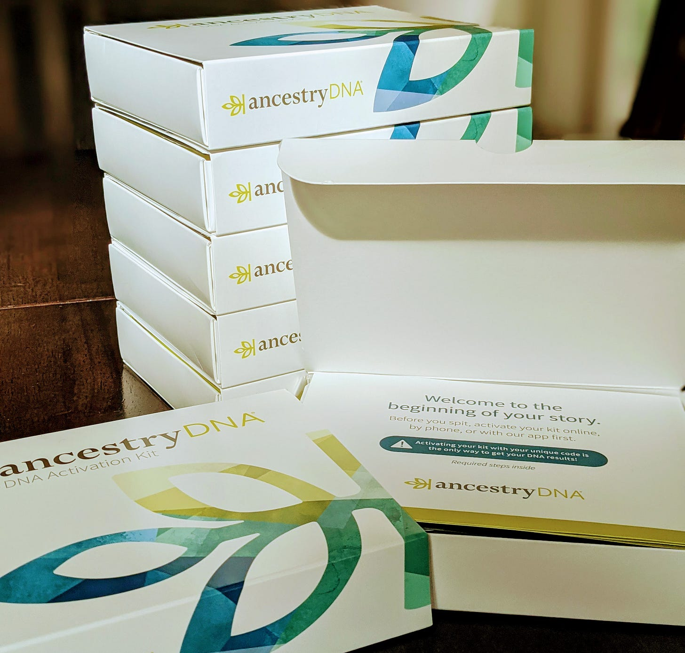

# A Guide for Onboarding into a New Role

*Six simple lessons to help you get started*

Today I am starting at a new company for the first time since 2009. Starting a new job is always a challenge, even more so during a time of lockdown. I met the board and team through the interview process, but never in person. In fact, I have never been in the physical offices.

Last Friday I walked out of my office working for my previous employer, and today I walked into the same [four-foot-deep office (AKA my son’s bedroom)](https://www.instagram.com/p/CGJKIAypzaH/) as the CEO of Ancestry.

I taught a new hire class on how to onboard to a new job and new culture at my previous company. Today I’m that new hire, and it’s time to put my own lessons below into practice as I embark on this next chapter.

1. **Build trust** - Trust is earned, not given. Trust is built through repeated interactions where you live up to your word in small things and big. People are naturally and rightfully skeptical of new leaders trying to fix things before they understand the challenges and history that brought a company to this moment. Instead, trust is built through knowing you act with integrity and consistency through good times and difficult ones.
2. **Listen first, act later** - I’m starting my first 30 days with a listening tour, so that I can meet as many people as possible to understand the culture and business. I will ask everyone the same set of questions (see below). By listening and digesting the insights from throughout the company, opportunities and challenges will reveal themselves. Leaders are not hired to have all of the answers, rather they are sought out because they can facilitate the company finding the answers together. At the end of the thirty days, I plan to share a state of the union assessment with insights from these conversations and how it will guide us going forward.
3. **Practice [servant leadership](https://www.forbes.com/sites/ciocentral/2017/12/18/product-management-lessons-from-the-front-lines/?sh=4f3f2ee25244)** - Servant leadership means empowering and unlocking, not dictating and directing. It does not mean shying away from hard decisions, but rather focusing on decision-making that serves customers, employees, and stakeholders first. There will still be challenges ahead, but focusing on servant leadership places the emphasis on those you support through times of change and challenge.
4. **Approach learning with curiosity** - Just as each person is a product of their experiences and history, so is a company and its culture. While fresh eyes are a gift, remember to first seek to understand. Avoid the instinct to criticize and instead focus on being curious. Being open to listening to the history allows you to have context on the choices made and what lessons can be gleaned from them for the future.
5. **Seek alignment and clarity** - The atomic unit of success is not an individual, it is a team. Alignment is often one of the biggest stumbling blocks for new leaders and their teams. Everyone leaves the room with a vague notion of what decisions were made, yet they have a different interpretation of what happened. True alignment is a team where everyone can disagree and commit, and lead as if it was their idea.
6. **Have a plan** - Know what you want to do and on what timescale. Share it widely. I have written a personal 30-60-90 day plan with my goals and priorities, and I will adjust it weekly as new information comes in. This will serve as a guide as I get started.

Today is day one. I’m excited to get started.

-------------

**Listening Tour Five Questions** (courtesy to [Gokul Rajaram](https://www.linkedin.com/in/gokulrajaram1/))

1. What is working well?
2. What is not working?
3. What should we do that we aren’t doing today?
4. What would you do if you were in my shoes?
5. What should I learn about Ancestry that will be helpful to me in my role?

[Subscribe now](https://debliu.substack.com/subscribe?)

[Share](https://debliu.substack.com/p/a-guide-for-onboarding-into-a-new?utm_source=substack&utm_medium=email&utm_content=share&action=share)