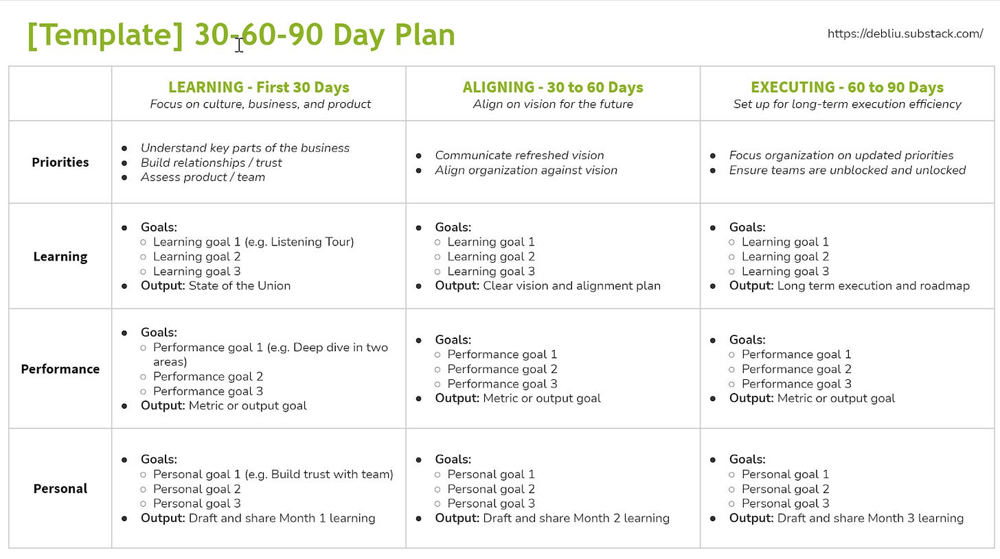
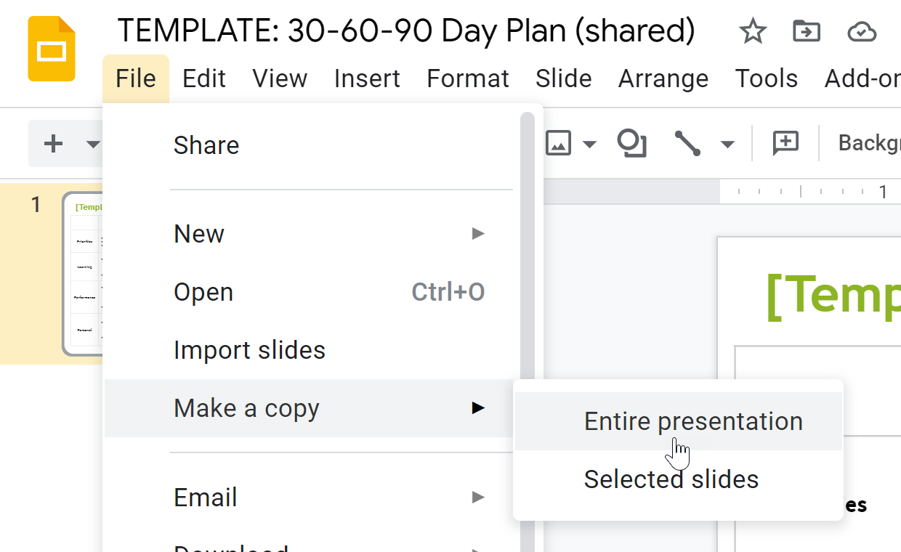

# Make the First 90 Days Count

*A Simple 30-60-90 Day Plan *

Change is hard.

Whether it is moving from one team to another, taking on a larger role, or transitioning to a new company, the first 90 days of anything new are challenging.  When you start a new job, you are going from a role in which you know the ins and outs to a place where the culture, the history, and even the acronyms are foreign to you. This is doubly difficult when you start a new role remotely. You may not have even seen the office or met your team members in person.

Last week, I started as the new CEO of Ancestry after leaving Facebook, where I spent the last 11 years of my career. Joining a storied company with over three decades of history means that I have a lot to learn in a short amount of time. As part of the onboarding process, I have created a 30-60-90 Day Plan to outline my transition to this new role.

While these plans are often written by and for the person onboarding, I’ve found that writing a plan that can be shared widely gets everyone on the same page and aligned quickly. This transparency of information ensures your team understands:

1. Your priorities
2. Your timeframe
3. Your commitments and deliverables

A plan doesn’t need to be complicated, but it does need to be clear and easy to understand at a glance. I have created a simple template inspired by [the Muse’s onboarding plan](https://www.themuse.com/advice/30-60-90-day-plan-instructions-template-example).

Template for 30-60-90 Day Plan

[Click for Template](https://docs.google.com/presentation/d/1JdqkxZjWQ2T5K5ewEePczoxWeY5QY0xB8EKgTJ8Ruzs/copy)

How to make a copy for your own use

Here are some simple steps to a clear action plan:

* **Start with the end of the first 90 days in mind.** It is easy to start a new role and hope to learn on the job, but without a clear idea of what you want to accomplish, you won’t be able to make the most of the time you have at the start. Like it or not, you are on an invisible clock that starts ticking the minute you walk in the door. You get to enjoy a honeymoon period, but within three months, any problems and opportunities become yours. During this starting period, you have the chance to ask questions and ramp up on the organization, business, and company culture without judgment, so make the most of it. The end of the first 90 days marks when you will be expected to have a strong understanding of the team, culture, and business.
* **Have clear priorities for each month.** Mapping out themes aligned to your priorities makes it much easier for others to help you as you onboard.  I chose Learning, Aligning, and Executing as my themes after examining the needs of the Ancestry organization. These work well if you are taking on a new role during [peacetime](https://a16z.com/2011/04/14/peacetime-ceowartime-ceo-2/), when you will have a chance to onboard and make sure everyone understands your goals. Joining a team or company during wartime may require you to adapt these themes into something that gets you into the action faster.
* **Communicate your plan.** Sharing your 30-60-90 Day Plan themes and priorities ensures that everyone is on the same page. I shared an early detailed draft of my plan with the Ancestry Senior Leadership Team and solicited their input. I then published a high-level summary to the entire company so that everyone knows what I am working on.
* **Make clear commitments and deliver.** Trust is the most important thing to build as you onboard to a new role. The best way to build trust is to make a commitment and live up to it.  People watch your “say”/”do” ratio. Holding yourself accountable means setting clear goals and sharing your progress against them. They are also looking to see when you have learned something new and pivoting to accommodate new information.  By publishing your priorities and sharing the output, people you work with will know what to expect and know when you have crossed the finish line.

These onboarding plans are a mutually-shared document intended to drive clarity and alignment.  When used well, they can ensure that you get off to a great start.

[Leave a comment](https://debliu.substack.com/p/make-the-first-90-days-count/comments)

[Share](https://debliu.substack.com/p/make-the-first-90-days-count?utm_source=substack&utm_medium=email&utm_content=share&action=share)