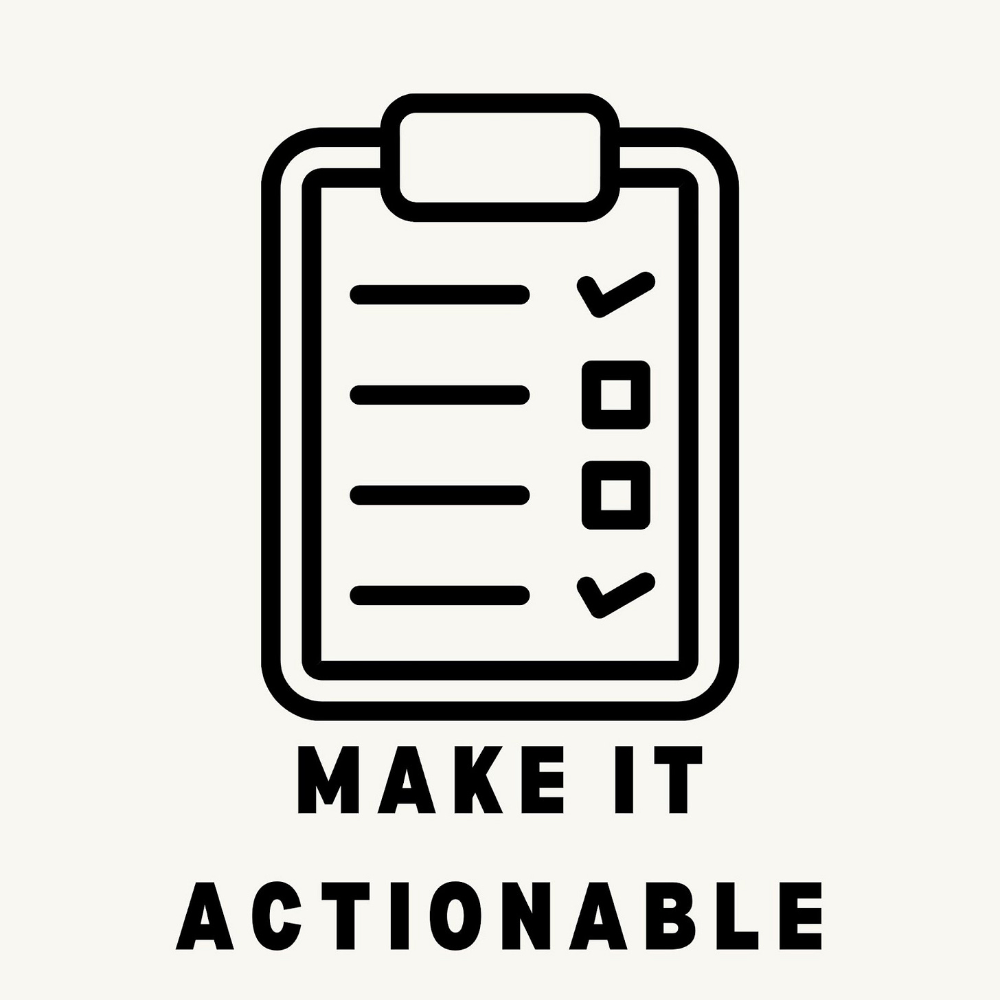
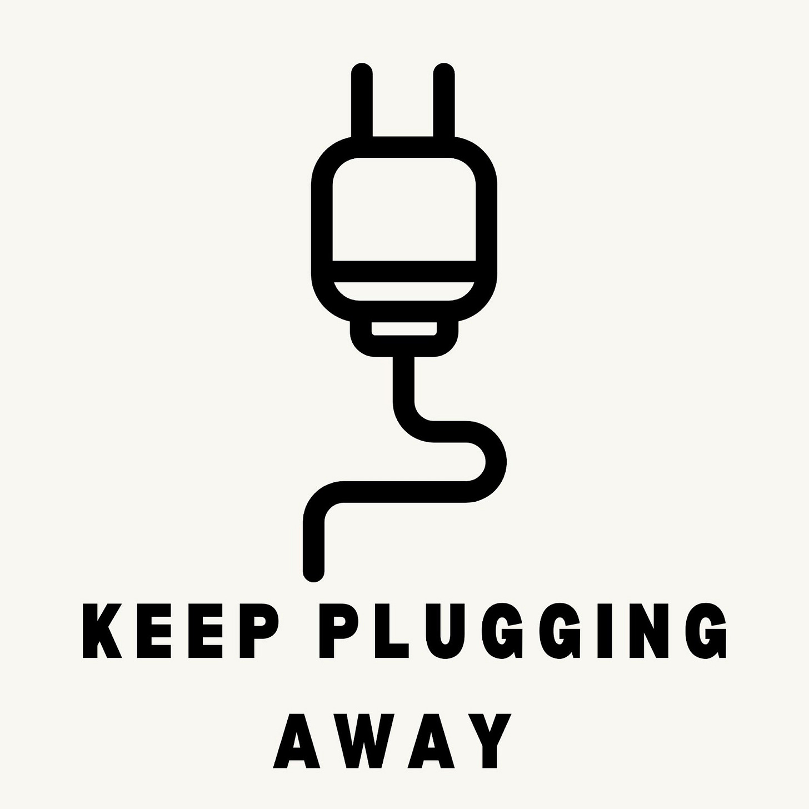

# Ten Lessons I Learned from Writing This Newsletter

*What I learned hitting a 10,000 subscriber milestone*

[Share](https://debliu.substack.com/p/ten-lessons-i-learned-from-writing?utm_source=substack&utm_medium=email&utm_content=share&action=share)

Photo by [Yukie Emiko](https://unsplash.com/@yukie?utm_source=unsplash&utm_medium=referral&utm_content=creditCopyText) on [Unsplash](https://unsplash.com/s/photos/accomplishment?utm_source=unsplash&utm_medium=referral&utm_content=creditCopyText)

It’s hard to believe that in the 15 months I've been publishing my writing, this newsletter has reached 10,000 subscribers. Let me start off by saying **thank you** to everyone who has accompanied me on this journey. As I reflect back on my very first post, I have decided to use today to discuss ten writing lessons I've learned since starting this newsletter.

1. **Just do it.** Some weeks I don't feel like writing. Some weeks I don't feel like I have anything to say. Some weeks I'm too busy. But the most important part of writing is the physical act of sitting down and putting words on paper. Once you get over that hurdle, you will almost always find that it's easier than you were expecting.
2. **Write for the one person who needs to read this today.** I always used to wonder, “Does anyone even care about what I have to say?” I would put so much pressure on myself to say something profound or earth-shattering that it was hard to meet the bar I had set for myself. Then I decided to take [Boz’s advice](http://www.boz.com): “Write for the person who needs to read this today.” That freed me up to focus on an audience of one, with the hope that perhaps others would also get something out of it. Your writing doesn't have to change the world; if it's valuable to even one person, then it's worth sharing.
3. **Done is better than perfect.** I am a perfectionist, so nothing I do ever quite feels done. But that's okay. By giving myself permission to publish something that's *good enough*, even if it's not perfect, I no longer feel paralyzed by perfectionism when I sit down to write.
4. **Make it actionable.** Oftentimes when I read newsletters, I am not able to find the **tl;dr**. I think giving the reader a clear idea of the big takeaway each week makes your posts easier to digest. Most people remember only about ten percent of what they read, so the main message needs to be relatively crisp and clear. That way, if your readers want to go deeper, they can choose to do the exercises or read more of the examples, but they don't have to. For example, one of my Perspectives posts was about creating a [30-60-90 Day Action Plan](https://debliu.substack.com/p/make-the-first-90-days-count). It included a clear summary of how to do it effectively, and the additional explanations, while helpful, weren't critical to understanding the process. As of today, it is one of my most popular posts.

make it actionable

5. **Keep plugging away.** 90 percent of podcasts don’t make it to the tenth episode. I suspect that is also true of many blogs and newsletters. To avoid this, I make sure that I'm always actively working on *something*. Some posts I spend months on, and others I work on a tiny bit at a time until I power through. I keep a list of topics that interest me on a spreadsheet, and they fill the pipeline so I can work on a couple of topics simultaneously, depending on what inspires me. Now, 14 months in, I have published over [70 posts](https://debliu.substack.com/archive?sort=new) discussing a wide range of topics.

   

   keep plugging away
6. **Write about what you know or want to learn.** Most of the things I write about are topics that I'm learning about along the way—advice and takeaways that I share with all of you as a way to gain additional insight. There are many subjects I'm curious about, so I do a bunch of reading and publish my results in this newsletter. This motivates me further, because I feel like my research serves a dual purpose: to expand my own knowledge and to pass my learnings on to others.

7. **Collaborate with others.** Getting outside input can help you generate inspiration and build creativity. I often crowdsource ideas from folks in my network, and I'm always open to other people's suggestions and ideas. I also get a ton of feedback from emails and comments on my existing posts. Sometimes when I'm giving advice to people outside this newsletter, they will ask me why I haven't written about a certain subject yet, which often inspires future posts. Alongside this Substack, I also collaborate with other writers on guest posts and other projects. (If you like, you can check out [my post](https://www.lennysnewsletter.com/p/the-inside-story-of-facebook-marketplace?fbclid=IwAR1BvG2pT0DwhCBMlLY01kxbvU_uTvedqRCJIADYvwUCufOw1zK0OCuXKAE) for Lenny’s Newsletter about how Facebook Marketplace came to be.)
8. **Be true to yourself.** When I started this newsletter, I had no idea what I wanted to write about. I didn't have a plan, and I wasn't really sure what people would read or find interesting. So instead of restricting myself to certain topics or themes, I just share my thoughts on things that I observe in my daily life. There's a story behind each post, whether a conversation, something I wish I could tell somebody, or just an interesting nugget that I heard from someone else. A big reason I've been able to stay consistent with my writing is that I've never forced myself to say something specific; instead, I write about what interests me, and the inspiration comes naturally.

be true to yourself

9. **Execution eats strategy for lunch.** We sometimes forget that at the heart of everything we do is the actual *doing*. Not the thinking, not the planning, not the strategizing. Many people have similar approaches to writing, but the execution—the actual day-to-day work—is the most important part. I'm talking about the act of consistently writing, editing, and sending out the newsletter. You can think all day about what you want to write, but if you never sit down and write it, it will stay forever in your mind.
10. **Make it sustainable.** I didn't even know if I could last a month doing this, much less a year. I enjoyed the writing part, but I hated all the other little things that went into it, which added up to a big roadblock. But I have found ways to shortcut the work. I dictate many of my posts into Google Docs, just to get my ideas on the page. I have an editor, who helps me keep my thoughts on track, and I recently hired a manager to run the newsletter so I can make more time to write. Having help has made the process so much more sustainable, and I'm optimistic that I will be able to continue writing long-term.

**Thank you all for helping me get to 10,000 subscribers. If my words have been meaningful to you, consider supporting me by sharing my posts or upgrading to a paid subscription.**

[Subscribe now](https://debliu.substack.com/subscribe?)

[Share](https://debliu.substack.com/p/ten-lessons-i-learned-from-writing?utm_source=substack&utm_medium=email&utm_content=share&action=share)