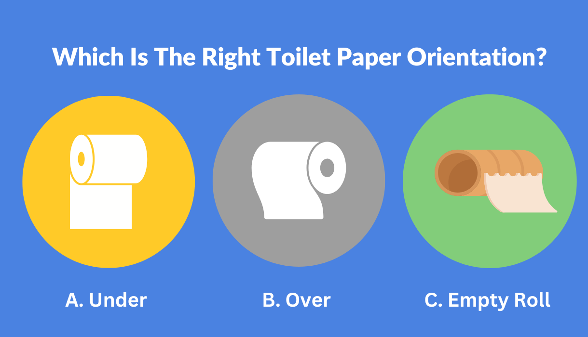

# Conscious Renegotiation: a Skill for Your Relationship

*How resetting expectations as your relationship evolves can keep your love thriving *

David and I met during my first weekend at college. We had a mutual friend, Danny, who had grown up with me in South Carolina during all of the elementary school and part of middle school. He then moved up to North Carolina, where he spent the rest of his schooling years growing up with David. When I was 18 years old, I moved north to attend Duke, and Danny invited me to attend his church with him. Lo and behold, that same Sunday, he introduced me to David. To be perfectly honest, I was mostly unimpressed by him: a tall, lanky guy with a formal suit and yellow tie and a strange sense of humor.

As I found out, the expression “don’t judge a book by its cover” eventually proved true. We started dating a year and a half later, and the rest is history: we’ve now been married for over 22 years and together for over 27. The thing that made our relationship last is something we started doing early on, which may seem transactional on the surface.

[Subscribe now](https://debliu.substack.com/subscribe?)

David and I negotiate everything.

Being a lawyer, David is no stranger to negotiation. What he and I practice is a type of conscious renegotiation, one that has helped us as our lives and relationship have evolved over the years.

We discuss everything. Toilet paper over or under? (Over, of course, since under would be unfathomable.) Toilet seat up or down? I mean, it’s just as hard for me to put down as for him to put up. (We settled on letting it stay the way the last person left it—except for when I was pregnant when we left it down.) Cleaning out the fridge? David doesn't think anything ever goes bad, so I pull it all out, audit it, clean the shelves, and replace everything.

Which way is the right way? My kids seem to think C is acceptable.

These things are funny and trivial, but they illustrate the way we approach the more important decisions, which we also talk through in detail. We discuss everything beforehand and make sure we’re on the same page before taking any action. Most people are surprised to learn that we even discussed our parents moving in with us when they were older and less independent - before we got married. As an only child, that was the expectation for David, but I also knew that we would be the ones my parents would live with someday—not because my sister wouldn’t support them, but because I was always their “Chinese daughter.” By talking through this decision ahead of time, we were able to better prepare for when the time came. Now, as we finish the house where all of our remaining parents will live together with us, we can rest easy in the knowledge that we planned for it in advance.

What always surprises me is how rarely couples take the time to talk through these kinds of decisions together. As I discovered when David and I were attending pre-marital counseling, many couples spend more time talking about their wedding invitations and centerpieces than their expectations for how their marriage will work.

What if we could make conscious negotiation and renegotiation the norm in relationships, rather than the exception? How might we all be able to benefit from it?

## **What is conscious renegotiation?**

Anticipating future disagreements, and setting the rules of engagement ahead of time, is freeing in a relationship, but it requires two people to agree with clarity and ownership.

Conscious renegotiation is about sitting down and discussing “who owns what,” not “who does what” in a relationship. David and I treat our relationship as a true partnership, which means that when someone owns something, we own it all the way. We have the typical “you cook, I clean” setup, of course, but we also have several more unique set-ups. For example, David plans all of our vacations, and I  managed all the packing and preparation. I booked all of the summer camps for the kids throughout their early childhood, and David took over as they entered middle school. He pays the credit card bills, and I pay the mortgage, utilities, and taxes. David is the primary pick-up and drop-off parent, while I take care of school tuition and permission forms. David is working with the builders on the new house, while I fix everything that’s broken in our old one. He does all of the grocery shopping, and I do most of the cooking.

In this arrangement, each of us manages our own set of responsibilities, without nagging the other about theirs. We set parameters, and we abide by them until one of us puts something up for renegotiation. This allows us to adjust the distribution of work if necessary, without the mental load of worrying whether the other person is doing what they’ve agreed to. It saves us more stress than you would believe.

## **Communication is key**

David and I started negotiating early on in our relationship. After all, he was in law school when we started dating, so it was natural that we talked everything through and made clear compromises on our needs and wants. We dated long-distance for two and a half years before we graduated—him from law school and me from undergrad. When I was in college, I applied to law school on a whim. David talked me out of going to Yale and instead convinced me to take a consulting job. He was convinced I would hate law school (he was right), and he urged me to go to business school instead. We agreed to go to the same city, Atlanta, so we could continue to date in person. Then we agreed that after a couple of years, we would get married.

Our path was straightforward because we agreed to everything up front. We talked about how long we would date long-distance, how long we would date in person, and then when we would marry. Each time we hit a milestone, we would check in with each other about our planned next step. This allowed us a chance to reexamine our goals and priorities and make adjustments if need be. For example, we knew we wanted to have two kids, and we established that upfront. [We made a deal early on](https://www.linkedin.com/posts/deborahliu_i-met-david-when-i-was-18-and-he-was-20-activity-6945043326932844544-ug8i/?originalSubdomain=ie) that if we had a boy and a girl (which we did), we would stop. If we had two girls, we would also stop. If we ended up having two boys, we would have one more. After Jonathan and Bethany, David wanted to try one more time, so we negotiated ourselves into a surprise third child, Danielle.

Some of you reading this might think this approach to a relationship is unromantic, but it’s what has kept our marriage healthy and equitable for nearly three decades. After all, people aren’t mind readers—even in a long-term relationship. Communication and open discussion must always be a priority, or you may end up with resentment, assumptions, and hurt feelings. The reason David and I have always been able to stay on the same page is that we communicate *all the time*. We never let our expectations get misaligned, and this has allowed us to stay on course.

[Subscribe now](https://debliu.substack.com/subscribe?)

## **Learning to agree and commit**

David and I made a rule before our kids were born: we would back each other up in front of the kids, no matter what, and we would never trash-talk each other. There have been times when that has been hard. Sometimes I’ve disagreed with something David did, like his choice of punishment or, conversely, letting the kids do something I didn’t like. But I always back him up in front of the kids, and then we discuss it privately later. That’s because kids are like water. They find the cracks between you and wear you down.

We decided to sleep train our kids when they were born, and though David is a total softy, we managed to get them to sleep through the night by around eight to 10 weeks. As we traveled, we had to re-sleep train each of them repeatedly, even though David’s heart broke seeing his little ones crying. That said, he rarely let his agitation show, even when he desperately wanted to pick them up and cuddle them to sleep.

Agreeing and committing means living up to your word, even when you don’t feel like it. It also means you decide up front what the rules of engagement are, and don’t change them along the way just because you don’t like them anymore.

## **Lay out ownership of the “what,” not the “how”**

The focus on conscious renegotiation is not on the “how,” but the “what.” To understand all of the “whats,” try this exercise with your partner:

1. Log everything you each do in a spreadsheet for one month.
2. Take note of the things that didn’t happen that month (e.g. income taxes, summer camp, vacation planning).
3. Estimate the amount of time it takes to do each item.
4. Sit down and look over the list together.
5. Plan out who owns what on the list, making sure to account for the hours and work that go into each task.

I’ve heard that the book (and cards) *[Fair Play,](https://amzn.to/3F9Fk35)* [by Eve Rodsky](https://amzn.to/3F9Fk35), can help with this process. I have not personally used it, since David and I do this ourselves, but if you need an outside resource, this could be a great place to get started.

It can also be helpful to think through situations when something doesn’t go as planned. Here is a breakdown of three potential hiccups in this system, and how to respond to each of them using this framework:

* **A ball gets dropped by one person or the other.**

**Solution:** Be a great partner.

* **Someone complains about how something is getting done.**

**Solution:** No complaints.

* **The responsibilities get out of balance.**

**Solution:** Revisit and renegotiate.

So, what does this look like in practice, and why? Let’s examine each of these responses in more detail.

## **Be a great partner**

Let’s say you found a company with someone else, or you have a peer you have to partner with. You would never think to drop the ball or micromanage them. The same is true of being a great partner. I have missed maybe three or four bills in the two decades David and I have been together—including one that almost ended up getting our electricity shut off, by the way. David didn’t complain, and he didn’t need to. I learned my lesson and fixed it. I never want to drop the ball, because that is not fair to him.

The same is true for David. Every week, we have groceries in the fridge, and the gas tanks get filled. He gets the kids ready to go back to school, and he picks up all of the school supplies, just as he has done for nearly a decade. I travel at least once or twice a month for work. He doesn’t complain or nag; he just tells me to let him know so that he can hold the fort while I’m gone.

None of this is to say we have never failed each other. It simply means we make every effort to do our part and not stick the other person with the responsibility for our “whats.” This is what being a great partner looks like—no micromanaging required.

## **No complaints**

The one rule we have is that, as long as it gets done, there can be no complaining about *how* the other person does something. For example, David likes to drag us to tons of outdoor activities whenever we’re on vacation. I don’t complain, even on the fourth white water rafting trip or the sixth hike to some waterfall. David’s responsibility is to plan our vacations, so I’m not going to make a fuss about how he plans them. Instead, I grab my EpiPen (I’m allergic to the outdoors), take some Benadryl, and go. Would I like to do a vacation once in a while where we don’t have four things planned every day? Absolutely. Do I go along with David’s plans because he loves to pack it all in? Yes, and I will continue to do so—unless I decide to take on the responsibility of vacation planning.

Cooking is another example. David buys the ingredients from Costco, and I do the cooking with whatever he buys. I make a massive amount of whatever it is for our six-person household, and no one complains about eating the same thing three days in a row. When I am traveling, David gets takeout from Panda Express, Dominos, or In-N-Out, and I don’t get to protest.

Part of what makes this all work is that we don’t sweat the small stuff, and we don’t get on each other’s cases about the little things. That also means letting go of things that don’t matter. Our house tends to get cluttered and messy, but not dirty. We sometimes fish clothes out of the plastic bin because they don’t get put away in time. These are all small things that aren’t worth fretting over. We learn to go with the flow, and it’s worth it every time.

## **Revisit and rebalance**

None of this is to say the dynamic is fixed in a relationship—nor should it be. Things shifted a lot for us when I was pregnant, and then again on maternity leave. Our well-balanced household completely fell apart. We had to rework the system again when I was home, and then again when I went back to work. Each milestone meant hitting the reset button so we could get the balance right.

When the kids were all home during Covid, we had to renegotiate everything once more. Without any outside help to take care of my mom, who has cancer and mobility challenges, we struggled with how to manage. But we sat down and talked through who would do what, and we found a solution.

Similarly, each time one of us took a new job, we discussed the impact it would have on our schedules, and what that meant for the tasks we owned at home. We both had careers where, at any given time, one of us was “leaning in” while the other was holding the fort. The person who needed more leeway and support always got it, and we traded off several times over the years. When I was in business school, David worked at a big law firm, so I took on more. When I went to PayPal, he stepped in more. When he went to Google and was working non-stop, I was in a more stable place at work and had our kids, so I went part-time. When I went to work at Facebook, and then at Ancestry, we swapped again, and he took the lead at home. And so on and so forth. We have done this dance for the 20+ years of our marriage, and we continue to do so as our lives evolve.

---

In every relationship, knowing when you have to reset and renegotiate can be the healthiest thing for keeping your love thriving. Being full partners means taking the time to set expectations, and not letting them become a source of friction.

As a side note, I know reading this makes it all sound ideal, but there is one tiny niggling thing that we have never resolved, even to this day. When I was on maternity leave with Jonathan (who is now 16), David handed over the responsibility of sorting the mail to me since I was the one at home, and now he refuses to take it back. I return from work trips to piles of mail on our kitchen island. I have tried to negotiate it away for basically the last 15 years, to no avail. Nothing can get him to take it back. This one sticking point is a reminder that things don’t have to be perfect, but they do have to be workable. (And given that David does more in the household than I do, I have to disagree and commit on this one.)

**So let’s settle this once and for all, which is the right toilet paper orientation (see photo above) - A, B, or C?**

[Leave a comment](https://debliu.substack.com/p/conscious-renegotiation-a-skill-for/comments)