# My Deep Dive Into ChatGPT and What I Learned

*How can ChatGPT help me with Perspectives*

If you’ve been following the news, you’ve most likely read about—or at least heard mention of—ChatGPT, an AI chatbot that has been making waves everywhere from marketing to academia. As the program has grown in popularity, it has drawn praise and criticism, with some celebrating its capabilities and others worrying about what it may mean for their jobs.

Last week, Dr. Marily Nika spoke about both the [potential and limitations of ChatGPT](https://debliu.substack.com/p/the-promises-and-pitfalls-of-chatgpt). I admit, I have been reading the headlines, scouring the articles posted on LinkedIn, and listening to podcasts on what AI means for our future. It's hard not to be impressed at the development of this technology when you see articles like this:

[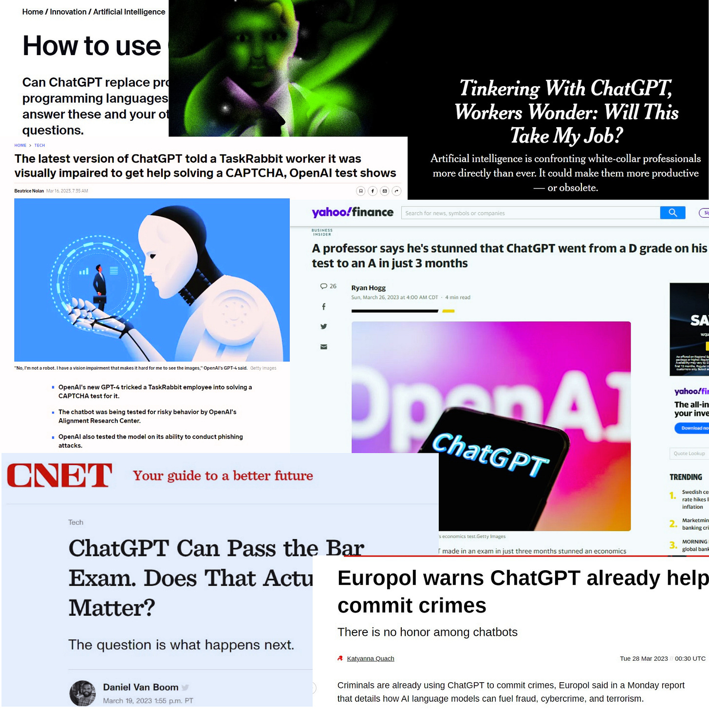](https://substackcdn.com/image/fetch/$s_!l0dM!,f_auto,q_auto:good,fl_progressive:steep/https%3A%2F%2Fsubstack-post-media.s3.amazonaws.com%2Fpublic%2Fimages%2F6a877133-d609-4a57-b4c3-3bbb57d99e13_1920x1920.png)

[Share Perspectives](https://debliu.substack.com/?utm_source=substack&utm_medium=email&utm_content=share&action=share)

These are all very powerful headlines, and these first glimpses of what ChatGPT can do are impressive. But does it live up to the hype?

There are a lot of conversations to be had about what ChatGPT can and cannot do. With that in mind, I decided to take some of the tips Marily outlined and see how ChatGPT could help me in publishing this newsletter.

As Marily wrote in her article, **“ChatGPT is not a cure-all for all of your challenges, but it can be a useful thought partner, idea generator, and research tool as you're getting started. It can also assist you in refining your idea, shaping it, and bringing it to life."**

As an experiment, I wanted to take Marily’s thoughts as a starting block and see how we could use ChatGPT to manage Perspectives more efficiently. Here’s what happened.

### **Idea Generation for Perspectives**

Idea generation is an important part of the writing process. While I have a running list of topics I plan on writing about, and I have written well over 100 articles, I am always looking for new ideas. I thought it would be interesting to see what ChatGPT could generate for me as seeds for future posts.  I fired up ChatGPT to see what it could do:

**Prompt: Please generate ideas for this substack (debliu.substack.com)**

[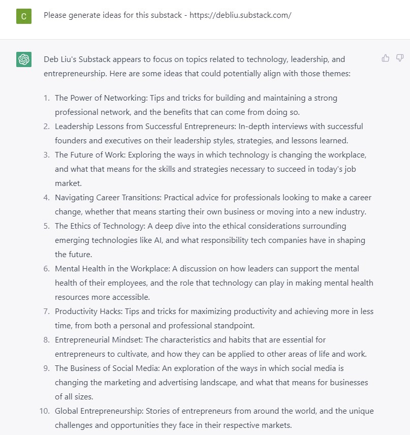](https://substackcdn.com/image/fetch/$s_!CmGz!,f_auto,q_auto:good,fl_progressive:steep/https%3A%2F%2Fsubstack-post-media.s3.amazonaws.com%2Fpublic%2Fimages%2F07bb1525-813e-4cf9-9814-6951aa8319d1_807x856.jpeg)

Some of these topics I have explored before, such as Idea #4, Navigating Career Transitions, which appears in Yuji Higaki’s piece on [Blossoming In New Soil](https://debliu.substack.com/p/blossoming-in-new-soil-a-different). I have also written about Idea #1, The Power Of Networking, in my article, [A Definitive Guide to Networking](https://debliu.substack.com/p/a-definitive-guide-to-networking/comments).

As I scanned through the ideas, I noticed there were two that I have not written about before: Idea #2, Leadership Lessons from Successful Entrepreneurs, and Idea #8, Entrepreneurial Mindset.

For Idea #2, I could most likely gather ideas from founders and innovators to compile into a post. For Idea #8, one thing I haven’t written about is one of the family businesses I started with my sister and our husbands in 2004, which we grew and worked on for 15 years: Maya Road.

To expand on an idea like this without using AI, I would typically jot down topics to cover in the article and ask for feedback from my sister. Instead, let’s see what ChatGPT comes up with when I ask it to generate topics.

**Prompt:  Please come up with 10 topics to write about from idea 8 Entrepreneurial Mindset**

[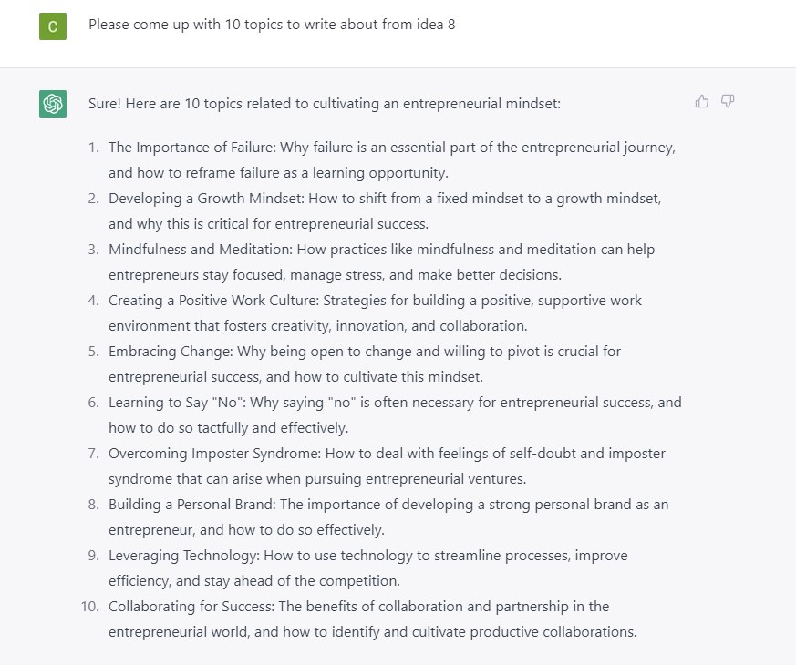](https://substackcdn.com/image/fetch/$s_!pTsR!,f_auto,q_auto:good,fl_progressive:steep/https%3A%2F%2Fsubstack-post-media.s3.amazonaws.com%2Fpublic%2Fimages%2Fd5a9c7f3-cb7d-4ddc-9d20-8d535b04bba7_873x730.jpeg)

These are all good prompts to start with, but how far can ChatGPT take them? Let’s see what its limits are when I ask it to write the article for me:

**Prompt:  Please write an article on Entrepreneurial Mindset with 5 tips outlined and expanded on**

[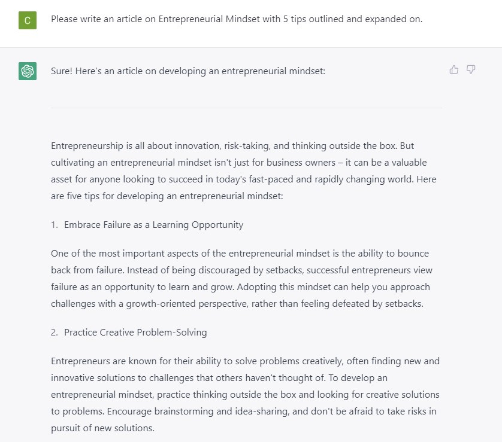](https://substackcdn.com/image/fetch/$s_!cUm1!,f_auto,q_auto:good,fl_progressive:steep/https%3A%2F%2Fsubstack-post-media.s3.amazonaws.com%2Fpublic%2Fimages%2F1c6ffa78-389d-4f3b-8213-51f6d178b4a7_838x739.jpeg)

[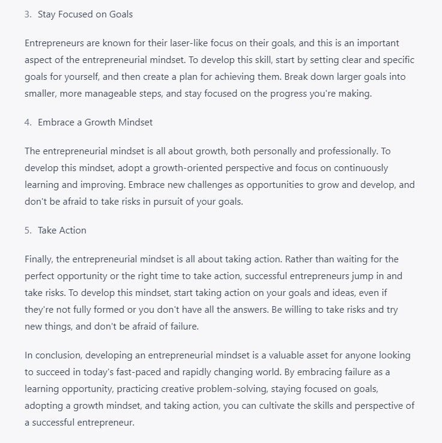](https://substackcdn.com/image/fetch/$s_!cfSW!,f_auto,q_auto:good,fl_progressive:steep/https%3A%2F%2Fsubstack-post-media.s3.amazonaws.com%2Fpublic%2Fimages%2F096d447f-58c9-483e-ac2f-f699728a25cc_736x738.jpeg)

All of these ideas that ChatGPT came up with are decent, but they are completely devoid of the human element. Because the article doesn't draw from human examples, it lacks the relatability and relevance of most of the articles I love. People don't remember details or stats; they relate to the story of someone like them who struggled with an experience similar to what they are going through. Let’s ask ChatGPT to add in a human experience:

**Prompt: Please rewrite the article Entrepreneurial Mindset and include real human examples**

[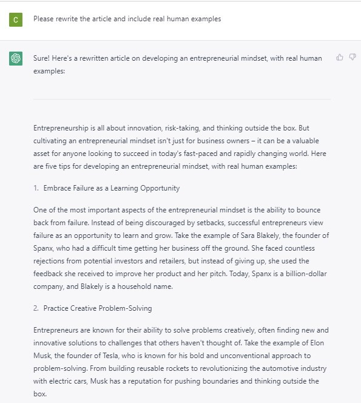](https://substackcdn.com/image/fetch/$s_!KPMS!,f_auto,q_auto:good,fl_progressive:steep/https%3A%2F%2Fsubstack-post-media.s3.amazonaws.com%2Fpublic%2Fimages%2F58716f37-f1e9-497b-b1ad-669c8de99fe6_595x664.jpeg)

[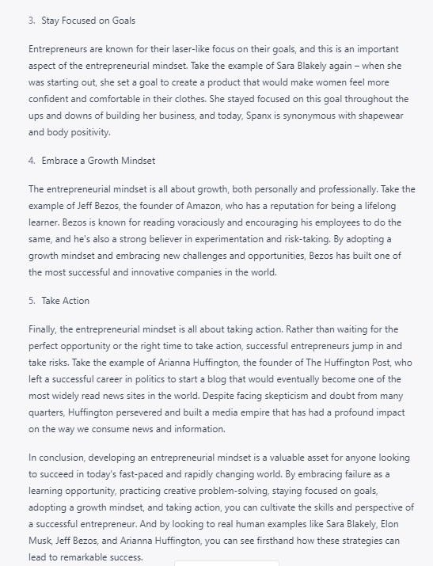](https://substackcdn.com/image/fetch/$s_!agcl!,f_auto,q_auto:good,fl_progressive:steep/https%3A%2F%2Fsubstack-post-media.s3.amazonaws.com%2Fpublic%2Fimages%2F51aae9a8-7943-4355-8f71-4a37c46695c8_547x715.jpeg)

When I asked ChatGPT for human examples, it came up with four:

1. **Sara Blakely from Spanx**
2. **Elon Musk from Tesla**
3. **Arianna Huffington from The Huffington Post**
4. **Jeff Bezos from Amazon**

All of these are very good examples (I have met Sara, and I know Arianna). The problem? Their stories are so much more profound than these summaries of their experiences. They are also not my stories, and this is not how I would share their experiences. This ChatGPT article is too generic to make it into Perspectives.

### **Article Summaries for Perspectives**

Having tested using ChatGPT to write the article, I now wanted to see how well ChatGPT could help me summarize existing articles for various platforms, such as LinkedIn and Twitter. To test this, I decided to take one of my recent articles, [Tell People What You Want](https://debliu.substack.com/p/tell-people-what-you-want), and see what ChatGPT would do to get it ready for LinkedIn and Twitter.

**Prompt: please summarize this article** [Tell People What You Want](https://debliu.substack.com/p/tell-people-what-you-want) **in less than 3000 characters**

[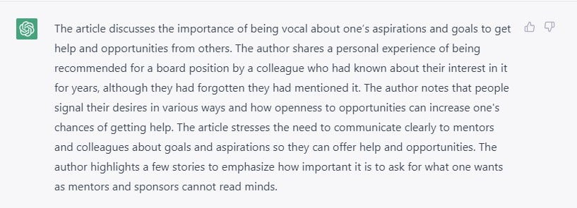](https://substackcdn.com/image/fetch/$s_!wr1v!,f_auto,q_auto:good,fl_progressive:steep/https%3A%2F%2Fsubstack-post-media.s3.amazonaws.com%2Fpublic%2Fimages%2F5f0d0c7e-582d-42f6-a8e2-e4b458e18b7f_817x295.jpeg)

While this summary is okay, it isn’t something that I could publish on LinkedIn as-is; it’s not snappy enough, and there isn’t enough of a hook or lead-in. I decided to ask ChatGPT to re-summarize it—this time, specifically for LinkedIn:

**Prompt: Rewrite as a LinkedIn post**

[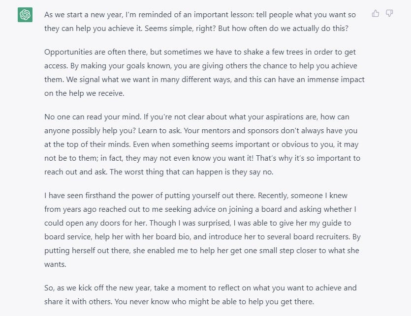](https://substackcdn.com/image/fetch/$s_!4E5N!,f_auto,q_auto:good,fl_progressive:steep/https%3A%2F%2Fsubstack-post-media.s3.amazonaws.com%2Fpublic%2Fimages%2F83e995f7-f8fa-4455-b703-b0a43282339e_835x643.jpeg)

While the summary is ok, for some reason ChatGPT assumes this article was written in the new year. It also misses out on some of the important draws of my original article, such as my story with Sheryl and other parts of my intro.

In the end, [this article](https://www.linkedin.com/feed/update/urn:li:activity:7041816371285934080/) was what was published as summarized by a person.

I then wanted to test how ChatGPT would do when asked to create a summary for Twitter.

**Prompt: summarize the article for Twitter**

[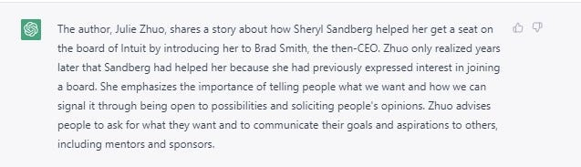](https://substackcdn.com/image/fetch/$s_!94Y5!,f_auto,q_auto:good,fl_progressive:steep/https%3A%2F%2Fsubstack-post-media.s3.amazonaws.com%2Fpublic%2Fimages%2F8701ec70-5d5d-449b-b393-090c941cf4b7_637x183.jpeg)

As I continue to ask questions, ChatGPT keeps insisting that Julie wrote the article and that Adam Grant is quoted.

[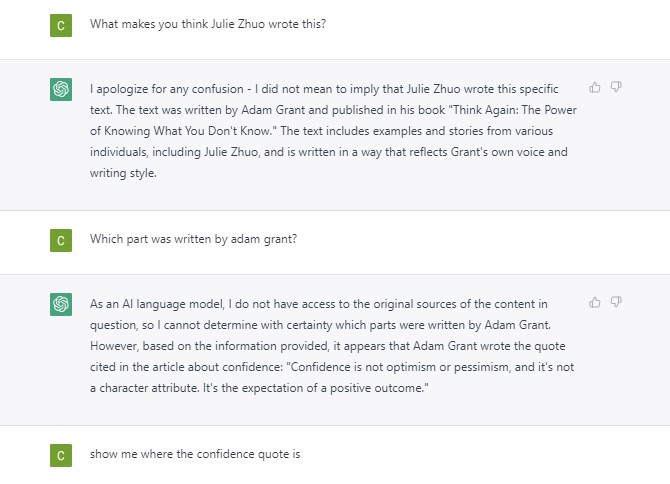](https://substackcdn.com/image/fetch/$s_!T1ci!,f_auto,q_auto:good,fl_progressive:steep/https%3A%2F%2Fsubstack-post-media.s3.amazonaws.com%2Fpublic%2Fimages%2Fcd038bd7-443a-4584-b4cf-f8be1c4d7a75_670x484.jpeg)

[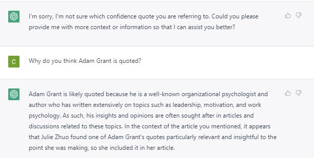](https://substackcdn.com/image/fetch/$s_!_7ka!,f_auto,q_auto:good,fl_progressive:steep/https%3A%2F%2Fsubstack-post-media.s3.amazonaws.com%2Fpublic%2Fimages%2Fb2c9cf02-fc05-46c8-b1e7-08d67063f890_612x309.jpeg)

ChatGPT insisted that Julie Zhuo (one of my friends) wrote the article, then backpedaled and said it didn’t mean to imply Julie wrote the article, before going on to reference Adam Grant (whom I respect and love to follow—but who wasn’t quoted in the article). It then goes back to declaring that Julie wrote the article. The moral of the story? Even with AI at my disposal, I’ll still need to do some quality control when it comes to my social media summaries.

---

After all, I’ve been hearing and reading about ChatGPT, I was excited to put it to the test and see how I could leverage it to help me with this newsletter. This was an experiment in productivity, but it was also a chance to experience the pros and cons of this technology firsthand. I found it especially useful for coming up with ideas and ways of expanding on them, but it fell short when it came to writing interesting articles with a human component. The Julie Zhuo debacle was further proof that not all the kinks have been worked out yet. However, ChatGPT still did an impressive job of synthesizing and distilling ideas from the information I gave it.

AI is an evolving technology, and it has a ways to go before it can do all the legwork for us. That said, I found ChatGPT to be an interesting tool and useful thought partner—and one I hope to use in the future.

**Have you tried ChatGPT? If so, what were your experiences? Let me know in the comments.**

[Leave a comment](https://debliu.substack.com/p/my-deep-dive-into-chatgpt-and-what/comments)