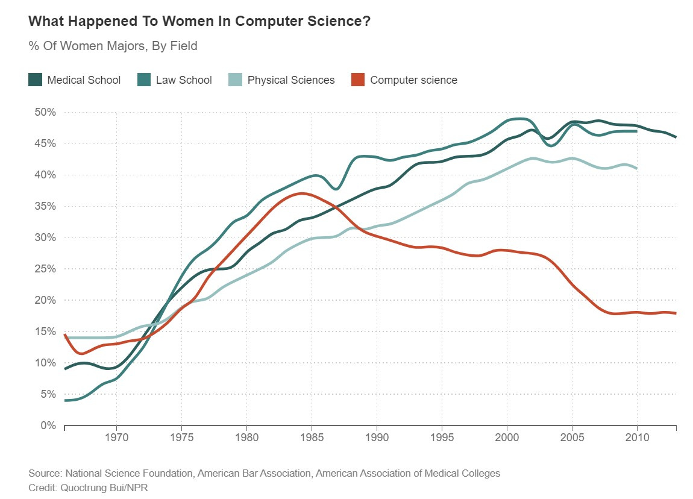
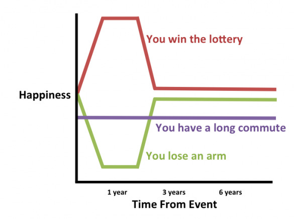
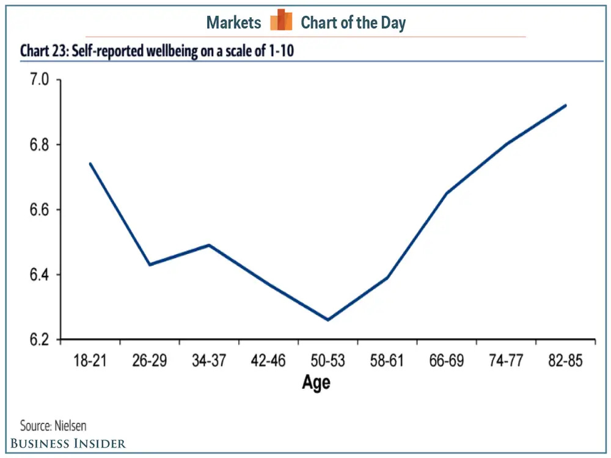
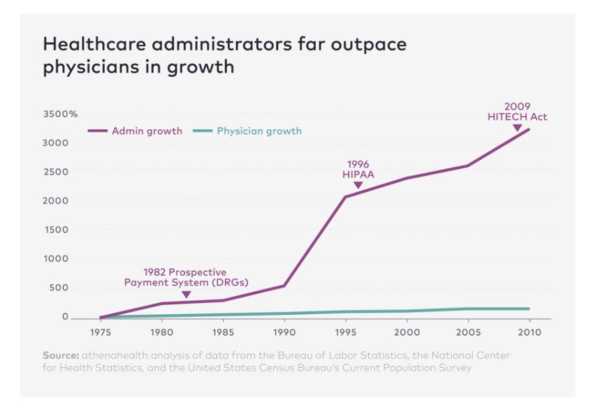
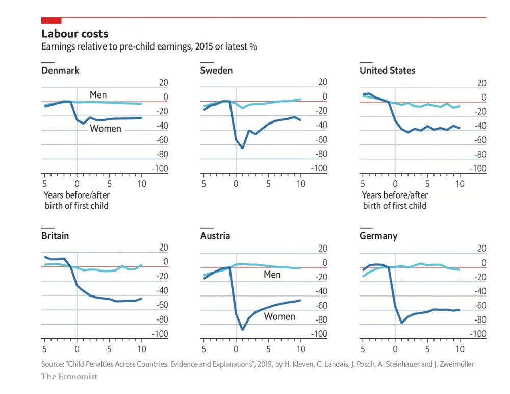
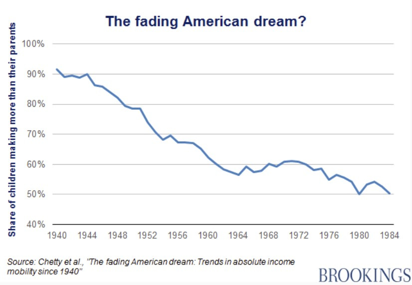
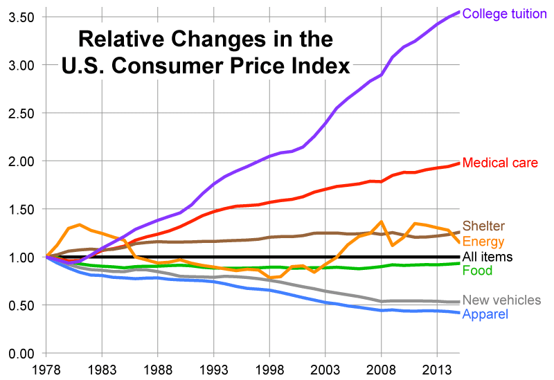
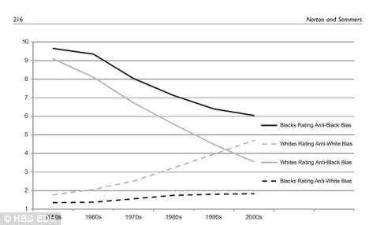
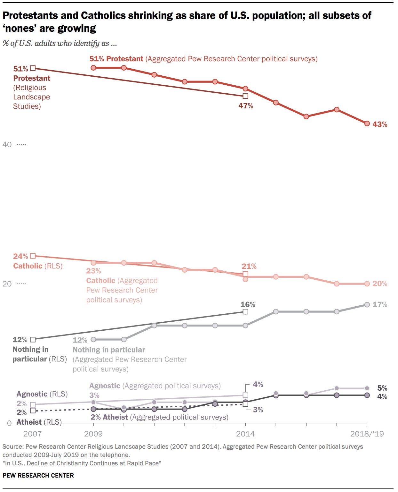
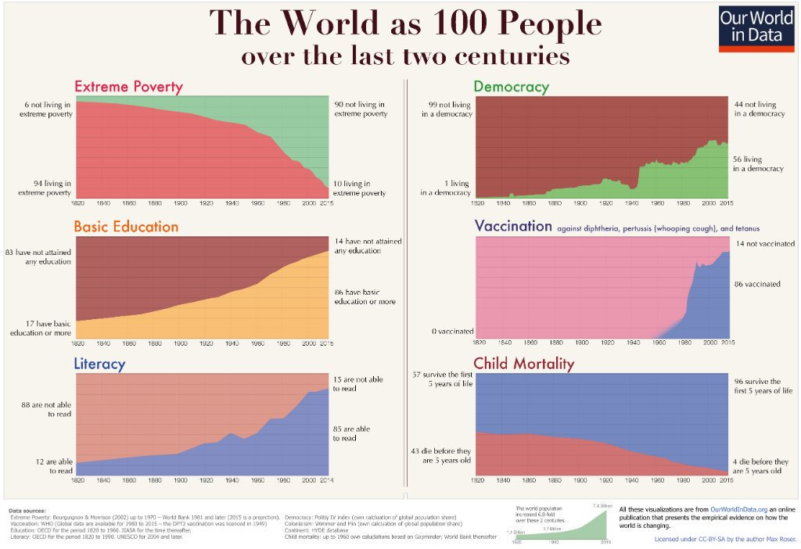

# Ten Charts I Can't Stop Thinking About

*Counterintuitive and otherwise fascinating facts and data*

I am a data junkie. I love charts and graphs. I started my career in consulting, where I learned all the ways data can be visualized on a slide. I always quote the poster that used to hang near my desk, which read, “Data wins arguments.” If I could go back in time, I would study data science, and I have been encouraging my kids to do so when they go to college.

[Subscribe now](https://debliu.substack.com/subscribe?)

All of this is to say, I have a thing for memorable charts. Here are ten of the ones I can’t stop thinking about:

### **1. “When Women Stopped Coding”**

[Source](https://www.npr.org/sections/money/2014/10/21/357629765/when-women-stopped-coding#:~:text=And%20for%20decades%2C%20the%20number,and%20professional%20fields%20kept%20rising)

There was a time when women were making massive gains in all professions. Then, seemingly overnight, they stopped studying computer science. What happened? I wrote my LinkedIn post, “[What Happened to Women in Product?](https://www.linkedin.com/pulse/what-happened-women-product-deborah-liu/)” in an attempt to discuss the aftermath, but this chart from NPR helps unpack the original source of the gap.

In short, girls stopped coding because of the marketing of Apple and Tandy personal computers, which sent the message that personal computers were for boys. That gave them a head start on understanding computers, and thus, a head start when they got to college. Women stopped going into computer science as much as they went into other professional fields, like law and medicine. Even [today, only 20% of computer science undergraduate degrees are earned by women—down from 37% in 1984](https://www.scientificamerican.com/article/there-are-too-few-women-in-computer-science-and-engineering/#:~:text=Only%2020%20percent%20of%20computer,lucrative%20and%20high%2Dstatus%20careers.). This chart gives us food for thought about how we think we can be making progress, only to backslide and realize we have much more to do.

### **2. How Commuting Can Be Worse for Your Happiness Than Losing a Limb**

[Source](https://adamsinger.substack.com/p/ditching-your-commute-worth-40kyear?utm_source=substack&utm_campaign=post_embed&utm_medium=email)

David and I made a deal many years ago: Neither of us would take a job in San Francisco (likely an hour-plus commute from our home in the mid-peninsula) until the kids were out of elementary school. He interviewed for a couple of really great roles when Danielle was little, but I begged him not to take them, showing him this chart. While the chart is conceptual, the point it makes is very much real. Although you can lose a limb or win the lottery and still return to close to your original setpoint, a long commute is a net negative to your happiness forever.

When I took the CEO job at Ancestry, I was very stressed about this. The commute took anywhere from 45 to almost 90 minutes (last week was brutal), and I struggled with the decision.

Internally, we debated our Future of Work policy and eventually decided to implement flexible work, which allows most employees to choose how much they go into the office, depending on their work and life circumstances. This allows employees to integrate their work and personal lives while still connecting with and seeing their teams. I think the forcing function of Covid taught us a new way of working. Even though we are a 40-year-old company, we are adapting to changing times as a way to help our employees while serving our customers.

### **3. The Happiest Age Is Not What You Think**

[Source](https://www.businessinsider.com/age-people-are-happiest-2016-5?amp)

I was reminded of this chart by a recent talk from Arthur Brooks, a Harvard Business School Professor of happiness. I am old enough to have watched a show called “Thirtysomething” as a teen, where everyone seemed super unhappy in their 30s. Seeing a chart like this years later explained that middle-aged angst to me. (Now that I am in my “late-ish” 40s, I cringe when I use "middle-aged” to refer to someone in their 30s, but there you have it.)

Contrary to popular belief, we are happiest when we are young and when we are old, while we are most unhappy during our middle years. Those are the “striving years,” when life feels the hardest and the most uncertain.   
  
[I also listened to an interview with author Margaret Atwood, of](https://www.cnn.com/style/article/future-library-oslo-katie-paterson/index.html#:~:text=Margaret%20Atwood's%20Future%20Library%20book%20is%20titled%20%22Scribbler%20moon%2C%22,the%20course%20of%20a%20century.) *[Handmaid’s Tale](https://www.cnn.com/style/article/future-library-oslo-katie-paterson/index.html#:~:text=Margaret%20Atwood's%20Future%20Library%20book%20is%20titled%20%22Scribbler%20moon%2C%22,the%20course%20of%20a%20century.)* [fame, who wrote a book that will take 100 years to come into print](https://www.cnn.com/style/article/future-library-oslo-katie-paterson/index.html#:~:text=Margaret%20Atwood's%20Future%20Library%20book%20is%20titled%20%22Scribbler%20moon%2C%22,the%20course%20of%20a%20century.). She said that young people suffer the most anxiety because their stories are not yet written. They can go in so many directions, including cataclysmic ones. Meanwhile, those who are reaching the end of their story, such as Atwood at 83, know how the plot will largely turn out. I sat with that for a long time, realizing that she was speaking of this apparent happiness paradox.

### **4. Why We Pay $17,000 for an Emergency Room Visit**

[Source](https://www.athenahealth.com/knowledge-hub/practice-management/expert-forum-rise-and-rise-healthcare-administrator)

After getting a [$17,000 bill for my son's ER visit](https://www.linkedin.com/posts/deborahliu_while-eating-a-burrito-one-night-at-speech-activity-6998047994776338432-KjKe/?originalSubdomain=es) for choking on a radish (where they did only an x-ray and then watched him for several hours), I have learned so much more about the U.S. healthcare system. Somebody on my post about that incident shared this chart with me, and I can't stop thinking about it. How much of healthcare is actually care? And how much is overhead?

Well, it turns out that the costs are not coming from direct care but from the rise in administrators over time. We have grown the resources needed to administer care more than the people actually giving the care. This should alarm all of us. Families are one bad radish away from insurmountable bills, and that is something that should not be happening in America.

I was helping my mom’s caregiver with a big bill for an important surgery, which they had already sent to collections. They said that since she had insurance, they couldn't help her. I spent hours trying to convince them to work with her. I am not sure what the right answer to this problem is, but it seems like we are in a Gordian knot of our own making on this.

### **5. The Hidden Cost of Motherhood**

[Source](https://www.economist.com/graphic-detail/2019/01/28/how-big-is-the-wage-penalty-for-mothers)

When they talk about the cost of motherhood, it's not just a theoretical discussion about the hardship of pregnancy, lost wages during maternity leave, or getting mommy-tracked. There is a real, hard cost to women for having children that is reflected in their lifetime wages. Even extremely progressive countries with great parental leave still face this disparity. When I saw this chart, it shocked me. I assumed America, with its haphazard, patchwork, and often lacking maternity leave system, drove down wages for women across the board. However, the reality is more complicated.

Availability of childcare, support systems, and maternity leave are important factors as to whether mothers can and do go back to work after having children. According to the Economist, “The motherhood penalty was largest in countries where more people tell pollsters that women should stay at home with the kids—presumably because in such countries, they are more likely to do so” ([ref](https://www.economist.com/graphic-detail/2019/01/28/how-big-is-the-wage-penalty-for-mothers)).

The reality is that, in a country like the US, 70% of mothers with children under 18 work outside the home, including two-thirds of those who have children under age six ([ref](https://www.aauw.org/resources/article/fast-facts-working-moms/)). Staying at home with the kids is the right choice for some families, but only if the parents have the ability to *choose*, rather than getting backed into it because they have no other alternatives.

### **6. The American Dream Is Getting Harder to Achieve**

[Source](https://www.brookings.edu/blog/social-mobility-memos/2018/01/11/raj-chetty-in-14-charts-big-findings-on-opportunity-and-mobility-we-should-know/)

My parents came to this country to live out the American Dream, and they saw the ability to make something of themselves and future generations as a risk worth taking. They arrived in America with a couple of suitcases, a few hundred dollars, and an acceptance into a college they didn’t know much about. They paid for school by waiting tables and doing piecework. Though they struggled to make ends meet and constantly worried about money, they loved this country and believed they had the chance to live out the American Dream—for themselves and for future generations.

But that immigrant dream of starting with little and building a life where generation after generation exceeds your success is increasingly out of reach. Less than half of American-born people make more money than their parents. We are not advancing; we are regressing. The immigrant dream is to come to a place where you can continue to grow your family and story over many years. The reality, however, is that it's getting harder and harder to do so.

[Share](https://debliu.substack.com/p/ten-charts-i-cant-stop-thinking-about?utm_source=substack&utm_medium=email&utm_content=share&action=share)

### **7. Why College Costs Have Outpaced All Other Categories**

[Source](http://dvschroeder.blogspot.com/2015/08/why-cost-of-college-has-tripled.html)

As the mom of two kids in high school with college just around the corner, the cost of a university degree seems astronomical to me. When I was in school, I was able to piece together a number of scholarships and work part-time and summer jobs to pay for college. My parents paid helped me a bit with my dad’s very middle-class government salary at the same time as my sister was in school. Today, that seems impossible. We have been saving for our kids’ college for well over a decade, and I still worry it may not be enough. So what’s the deal?

College costs have grown so much because of a reduction in state funding for higher education. This means more and more public school tuition costs have to be covered by tuition and fees ([ref](http://dvschroeder.blogspot.com/2015/08/why-cost-of-college-has-tripled.html)). At the same time, at private schools, there has been a massive increase in administrators over faculty members ([ref](https://www.marketwatch.com/story/there-are-more-people-working-at-colleges-but-they-probably-arent-teaching-2017-01-06)), both of which are growing much faster than the student population. For reference, the student population is up 8% since the ‘70s, compared to a 60% increase in faculty numbers, and a whopping 138% increase in non-teaching staff ([ref](https://costofcollege.wordpress.com/2014/05/30/public-schools-administrative-bloat/)). No wonder the tuition bills are getting exponentially bigger.

### **8. Attitudes about Racism in America Over Time**

[Source](https://www.washingtonpost.com/news/wonk/wp/2014/10/08/white-people-think-racial-discrimination-in-america-is-basically-over/)

I saw this chart in a book, *[The Conversation,](https://amzn.to/3muZrSR)* [by Robert Livingston](https://amzn.to/3muZrSR), and I showed it to several of my friends. Everyone who saw it asked me how this chart could possibly be correct. Given the statistics, it can be hard to believe.

Black Americans face a lack of access to opportunities/services (e.g. [fewer job callbacks for those with Black names](https://www.bloomberg.com/news/articles/2021-07-29/job-applicants-with-black-names-still-less-likely-to-get-the-interview), [less access to ride shares](https://qz.com/823559/nber-study-finds-racial-discrimination-on-uber-drivers-are-twice-as-likely-to-cancel-on-black-riders)), outright discrimination (e.g. [housing appraisals](https://www.nytimes.com/2022/08/18/realestate/housing-discrimination-maryland.html), [car loan approvals](https://files.consumerfinance.gov/f/documents/cfpb_mayer_racial-discrimination-in-the-auto-loan-market.pdf)), and a rising racial wealth gap ([the average white household has eight times the wealth of a Black one](https://www.americanprogress.org/article/eliminating-black-white-wealth-gap-generational-challenge/)). Yet somehow, there is a misconception among white Americans that racism is greater for other white Americans than it is for Black Americans.

I am truly not sure what to make of this chart, but it has stuck with me as I think about the increasingly polarized world we now face. How can we address the real problems in America if we can’t even agree on what they are?

### **9. People, Especially Young People, Are Turning Away from Organized Religion**

[Source](https://www.pewresearch.org/religion/2019/10/17/in-u-s-decline-of-christianity-continues-at-rapid-pace/)

I am a Christian. I grew up in a Christian home, and I have been a practicing person of faith my entire life. That’s why I read with interest about the decline in religious affiliation that has been happening over the past decade. 40% of millennials are religiously unaffiliated, which is a huge change from when I was growing up in the Bible Belt ([ref](https://fivethirtyeight.com/features/millennials-are-leaving-religion-and-not-coming-back/)).

We are becoming less religious as a nation, and now there is a movement among my church communities of people rethinking their faith. The tether of faith to politics is one source of this tension, as are the actions of those who are co-religious. In our faith, we are taught to be “salt and light” in the world—giving and helpful by offering flavor and illumination—but too much salt can ruin the whole pot of stew, and a light shone in someone’s eyes can be blinding.

I often ponder this chart and wonder what the state of organized religion will look like when my children are my age.

### **10. Things Are Getting Better**

[Source](https://twitter.com/BillGates/status/1086662632587907072?ref_src=twsrc%5Etfw%7Ctwcamp%5Etweetembed%7Ctwterm%5E1086662632587907072%7Ctwgr%5E4a0bb7db51c3d35eb7bcfa8fdd0adc62e7b03773%7Ctwcon%5Es1_&ref_url=https%3A%2F%2Fwww.vox.com%2Ffuture-perfect%2F2019%2F2%2F12%2F18215534%2Fbill-gates-global-poverty-chart)

I subscribe to the [Steven Pinker school of optimism](https://amzn.to/3L37xMO), believing that despite all our challenges, the world is genuinely getting better. Or, as David and I quote to each other from “The Mailman,” that forgettable post-apocalyptic movie with Kevin Costner, “[Stuff’s getting better. Stuff’s getting better every day.](https://www.youtube.com/watch?v=X6vZwjES6J0)”

This chart went viral due to Bill Gates. It illustrates how the number of people living in extreme poverty is going down with the advent of industrialization and modernization. Though Voc thoroughly goes through why this is not enough, the numbers show that we are moving in the right direction. That doesn’t mean we should get complacent, but it *does* mean that we should not allow the perfect to be the enemy of the good.

We are making progress, and that progress brings more people along. I remember when I was four and my grandfather took all of his children and grandchildren to our ancestral village in China. The village was in a rudimentary area of Guangdong, and the villagers’ circumstances were dire, with limited running water and access to electricity. We washed in buckets, slept under mosquito nets, and went to the bathroom in a hut with a hole in it over the river (yes, they washed in that water, too). I remember my mom saying, “You are so fortunate to be born in America.” The poverty and privation I witnessed there stayed etched into my mind, as did the fact that my six-year-old sister got sick from playing with pigs in the dirt roads.

I will never forget the life I could have lived but for the foresight and great fortune of my grandparents and parents, and I am optimistic that things will continue to change for the better in the coming decades.

---

I hope these charts have given you food for thought. Data lets us see the world through a different lens, and it can help us think about the big issues from a different perspective. If you have any interesting or thought-provoking charts you’d like to share, feel free to link them in the comments!

[Share](https://debliu.substack.com/p/ten-charts-i-cant-stop-thinking-about?utm_source=substack&utm_medium=email&utm_content=share&action=share)