# The Promises and Pitfalls of ChatGPT

*What generative AI can do, and what you must do for yourself*

[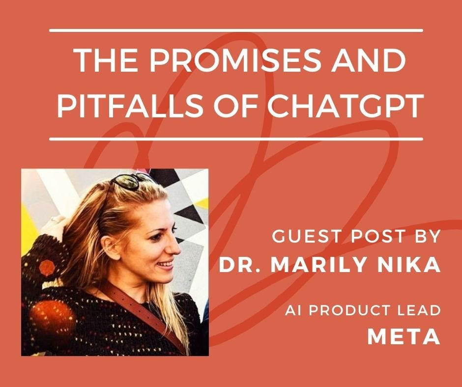](https://substackcdn.com/image/fetch/$s_!-IQg!,f_auto,q_auto:good,fl_progressive:steep/https%3A%2F%2Fsubstack-post-media.s3.amazonaws.com%2Fpublic%2Fimages%2F0e66a190-1ac2-4a9e-814d-f95cb1c52c32_940x788.jpeg)

Based in San Francisco, [Marily Nika](https://www.linkedin.com/in/marilynika/) is an Artificial Intelligence Product Leader with over 10 years of experience bringing AI products to life, having worked at Google for eight years and currently working at Meta's Reality Labs. Marily is also a fellow at Harvard Business School and also offers a popular AI Product Management course on Maven, [Building AI Products](https://maven.com/marily-nika/technical-product-management). You can find more of her writing at

[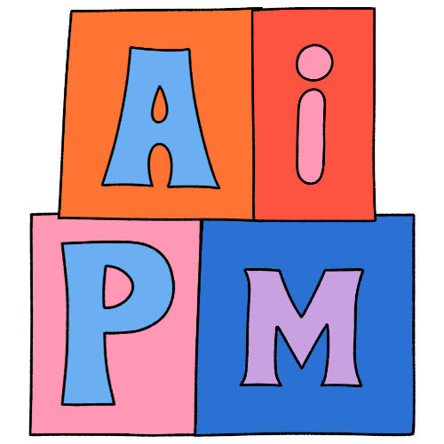Marily’s AI Product Newsletter

This is a newsletter for all AI PM enthusiasts that are interested in staying up to date with AI Product Management best practices.

By Marily Nika](https://marily.substack.com?utm_source=substack&utm_campaign=publication_embed&utm_medium=web)

# **The Promises and Pitfalls of ChatGPT**

What generative AI can do, and what you must do for yourself

The process of building a product from scratch can be both daunting and frustrating, especially if you are working with limited resources. Many times, you may find yourself facing a blank page, with nothing but a concept or a problem to guide you.

Everything starts with that one great idea, but where do you go from there?

This is where programs like ChatGPT can help you. ChatGPT is not a cure-all for all of your challenges, but it can be a useful thought partner, idea generator, and research tool as you're getting started. It can also assist you in refining your idea, shaping it, and bringing it to life.

[Share](https://debliu.substack.com/p/the-promises-and-pitfalls-of-chatgpt?utm_source=substack&utm_medium=email&utm_content=share&action=share)

## **But first, a warning: ChatGPT has serious limitations right now.**

There are a few things that I always keep in mind while interacting with ChatGPT. It's critical to remember these before you begin leveraging ChatGPT.

* **ChatGPT can’t replace human judgment or logic (...yet).** While ChatGPT can be incredibly helpful as you're getting started, you will still need to use your own product intuition, judgment, and instincts. ChatGPT does not have all the answers. Rather, it has information that can be used to supplement your existing work.
* **ChatGPT doesn't do the work for you.** ChatGPT can be a useful thought partner and a serious time saver, but that will *not* replace real strategic thinking, brainstorming sessions, user research, and insights.

* **ChatGPT is only as good as the data that trained it.** When interacting with it, you must remember that it is not human; there is no logic behind it. It cannot understand inferences or perform complicated math (yet). Instead, it takes information that is publicly available and synthesizes it. ChatGPT does not actually create ideas in spaces where there is no training data available.

# **That said, ChatGPT can help you in multiple areas.**

It's important to remember the limitations of ChatGPT, but that doesn’t mean you can’t still make use of it. The key is to identify the areas where ChatGPT can help you—as well as the areas where it can’t.

So, where is ChatGPT most useful in product development?

---

## **Ideation**

[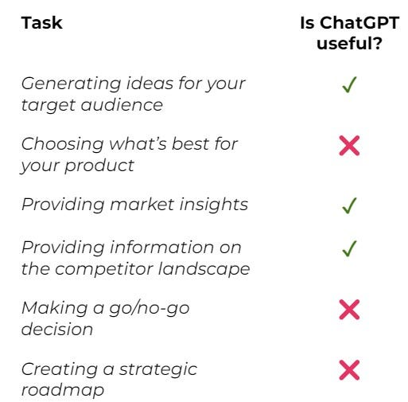](https://substackcdn.com/image/fetch/$s_!xnt0!,f_auto,q_auto:good,fl_progressive:steep/https%3A%2F%2Fsubstack-post-media.s3.amazonaws.com%2Fpublic%2Fimages%2F3c843f10-0499-4a50-8bf0-fb9fa67d82e7_513x505.jpeg)

### 1. ChatGPT can help you come up with ideas

A new product’s whole purpose is to solve a real-world pain point for a particular persona. ChatGPT can help you by generating ideas based on your input. For example, **you can ask ChatGPT to generate ideas** for a new product or service in a specific industry, or for a specific target audience. A lot of these ideas will be wild and a bit unusual, so this process requires iteration. Don’t expect miracles right out of the gate. However, ChatGPT can help you think about a space in different ways and spark new ideas. Think of it as a brainstorm buddy in a box. Ninety percent of the output may be useless, but there will still be some nuggets you can mine.

[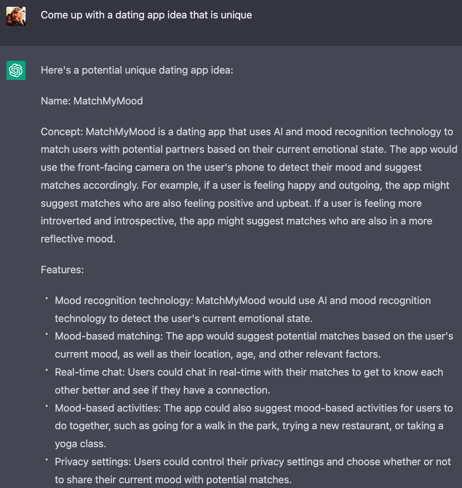](https://substackcdn.com/image/fetch/$s_!3WAu!,f_auto,q_auto:good,fl_progressive:steep/https%3A%2F%2Fsubstack-post-media.s3.amazonaws.com%2Fpublic%2Fimages%2F1d01b85e-e8c9-499a-bec1-93ec05d13299_1156x1220.png)

### 2. ChatGPT can help you validate your ideas

ChatGPT can quickly analyze market trends and customer behaviors while also providing a data point for you on whether a particular user segment would be interested in your product at this point in time. This is a quick and dirty way to get some interesting insights before spending a lot to do user research. It also gives you some direction for your thinking.

[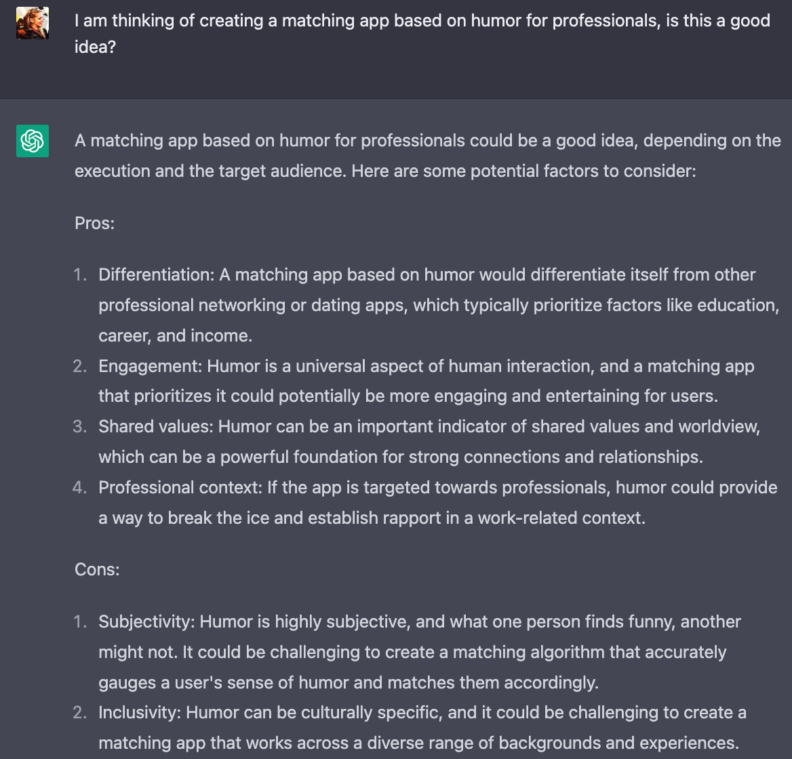](https://substackcdn.com/image/fetch/$s_!kBUN!,f_auto,q_auto:good,fl_progressive:steep/https%3A%2F%2Fsubstack-post-media.s3.amazonaws.com%2Fpublic%2Fimages%2F5bfee570-836a-4c1d-9993-5c2eb2b78030_1168x1120.png)

### 3. ChatGPT can do basic research for you

Market research is essential to identifying and understanding who you are building for: their needs, their preferences, and their characteristics. ChatGPT can help you conduct market research by instantly analyzing data from various sources, such as social media, online reviews, and surveys. This data can help you identify the gaps in the market that you want to fill—or, in other words, opportunities for innovation. It will pull in public market sizing information along with trends, but keep in mind that this will all be fairly general. That said, it’s a good jumping-off point for you to go deeper and invest in true user or market research.

[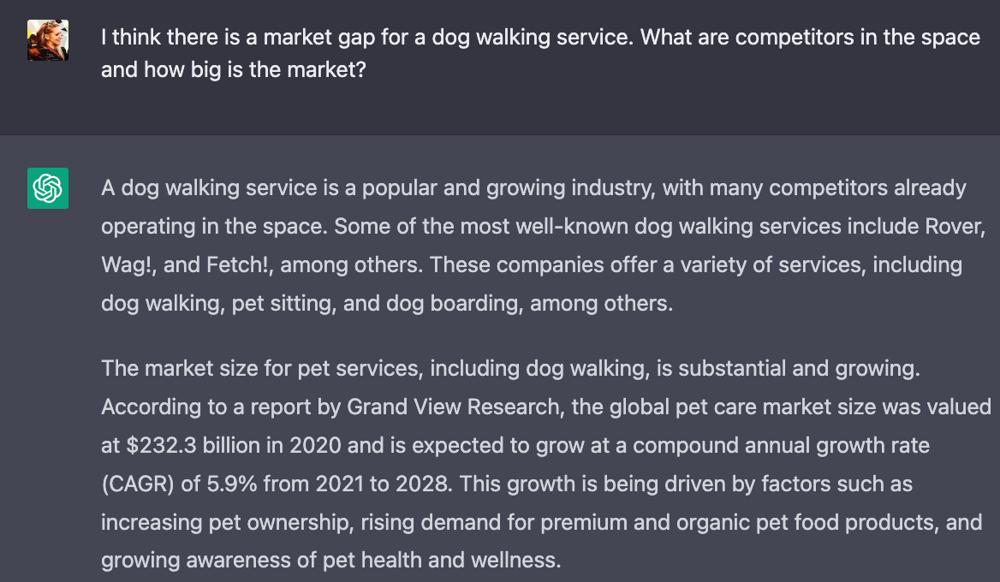](https://substackcdn.com/image/fetch/$s_!v8Fr!,f_auto,q_auto:good,fl_progressive:steep/https%3A%2F%2Fsubstack-post-media.s3.amazonaws.com%2Fpublic%2Fimages%2F429e5b30-a510-441d-8f42-96eb08e05954_1168x680.png)

### 4. ChatGPT can help you identify the user segments you should target

One of the most important parts of coming up with ideas for new products and features is knowing *who* you are solving for. Product Managers should not be designing for the generic user, and this is why creating personas and identifying the right user segments for your products is so crucial. Typically, dedicated teams—or even entire departments of User Researchers—are needed to pinpoint the exact target group(s) that are most likely to find value in your product. ChatGPT can most likely give you an early read on certain things you may not have thought about in regards to the actual user segments: their key behaviors, goals, use cases, and pain points.

---

## **Implementation**

[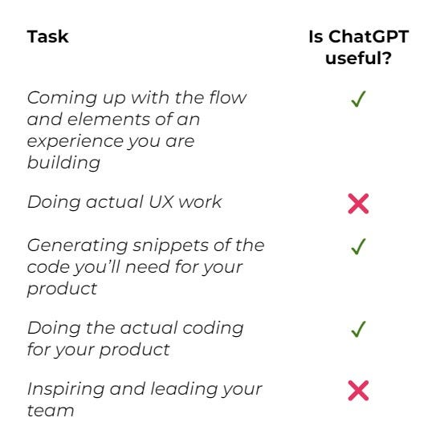](https://substackcdn.com/image/fetch/$s_!MsAY!,f_auto,q_auto:good,fl_progressive:steep/https%3A%2F%2Fsubstack-post-media.s3.amazonaws.com%2Fpublic%2Fimages%2Ff4e8e591-e39e-4a4a-b4e9-6a3b3e0e3419_538x556.jpeg)

### 1. ChatGPT can help design a basic prototype for you.

During the implementation phase, ChatGPT can help you by generating product designs based on your specifications. No, this is not a joke! For example, you can ask ChatGPT to create the screens needed for your app. You can then paste these in your Product Requirements Document as a starting point for your designer. This does *not* replace the need for design, but it does give you a general sense of what other companies have done in their apps and websites.

[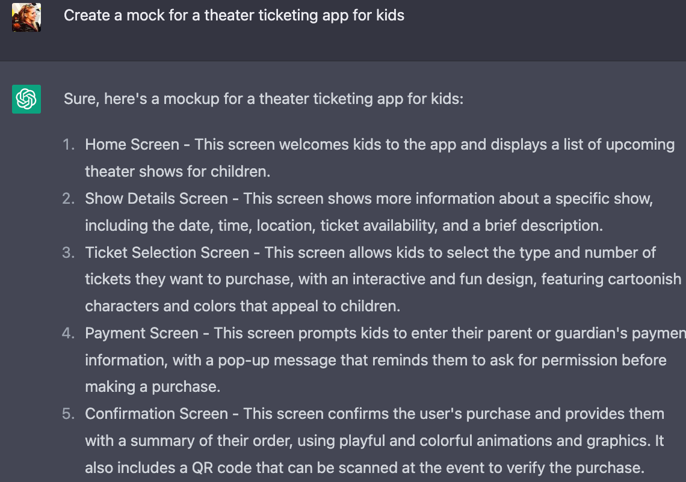](https://substackcdn.com/image/fetch/$s_!pZMU!,f_auto,q_auto:good,fl_progressive:steep/https%3A%2F%2Fsubstack-post-media.s3.amazonaws.com%2Fpublic%2Fimages%2Fad6dd1f9-a983-403c-a5ea-fd9a57a89912_1140x802.png)

### 2. ChatGPT can help you develop your prototype.

You may or may not be technical. Regardless of your skill, you may not want to hire or get a headcount for engineering at such an early stage. ChatGPT can code for you—or, more accurately, it can show you how to code so that you can create a prototype. An MVP is a preliminary model of your product that you can use to test its functionality and gather feedback from potential customers. This can save you time and money on hiring a developer if you want to test out your product first.

[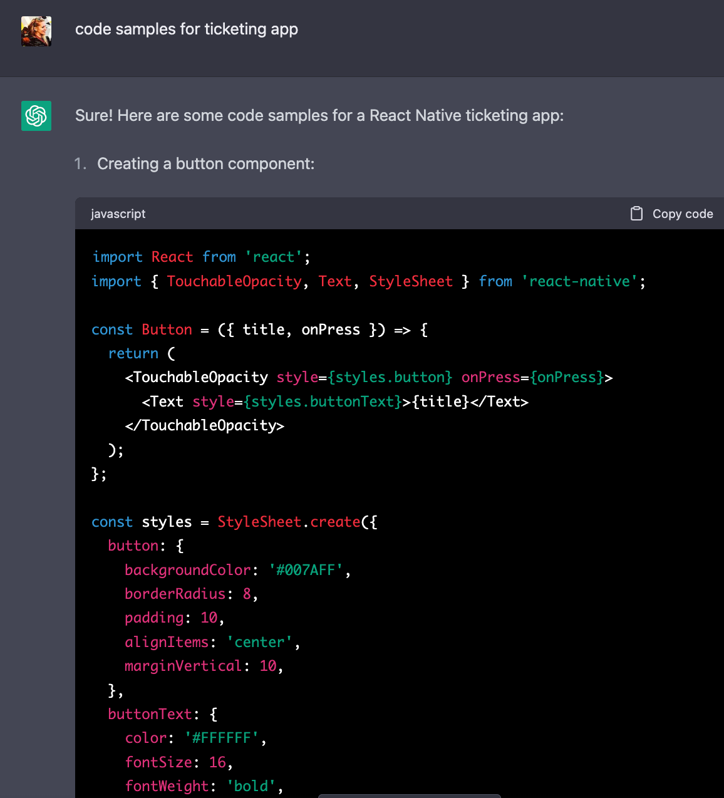](https://substackcdn.com/image/fetch/$s_!LEfq!,f_auto,q_auto:good,fl_progressive:steep/https%3A%2F%2Fsubstack-post-media.s3.amazonaws.com%2Fpublic%2Fimages%2F8d38ed3a-1dcb-4099-b794-06b858fa5462_1156x1274.png)

### 3. ChatGPT can help you test your product.

Product testing is the process of evaluating your product’s performance and functionality before launching it in the market. ChatGPT can help you test your product by generating automated tests and analyzing user feedback. This can help you identify and fix any issues before launching your product. While this has not been perfected yet, you can use this function to reduce the costs of testing your prototype.

---

## **Pre-Launch**

[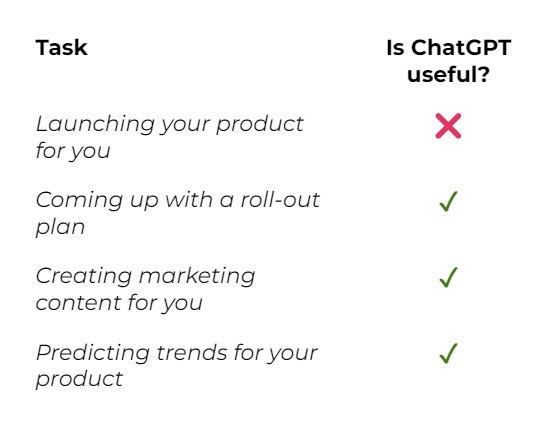](https://substackcdn.com/image/fetch/$s_!F3U7!,f_auto,q_auto:good,fl_progressive:steep/https%3A%2F%2Fsubstack-post-media.s3.amazonaws.com%2Fpublic%2Fimages%2Fb78bbbdf-6ea6-4416-8163-42d0fabab57e_544x421.jpeg)

### 1. ChatGPT can create content for you.

Content marketing is an effective way to promote your product and attract potential customers. ChatGPT can help you create high-quality content, such as blog posts, social media posts, and product descriptions. Although you will still need human eyes to finalize and edit your content, you can save time and money by letting ChatGPT come up with a rough draft. To avoid generic-sounding copy, you will want to make sure the writing is “in your voice”. Remember, although ChatGPT will give you a good baseline, you still need to make it your own.

[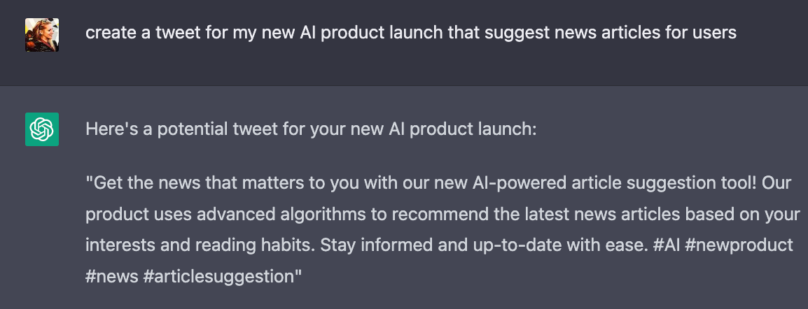](https://substackcdn.com/image/fetch/$s_!Mxjs!,f_auto,q_auto:good,fl_progressive:steep/https%3A%2F%2Fsubstack-post-media.s3.amazonaws.com%2Fpublic%2Fimages%2F32716a23-94c2-4f22-a906-6be1a4255676_1154x442.png)

### 2. ChatGPT can come up with marketing tactics.

Marketing is essential for promoting your product and attracting potential customers. ChatGPT can help you develop a marketing strategy by analyzing market trends and suggesting effective marketing channels for your target audience. This can save you time and money compared to hiring a marketing agency. Again, this will be a rough draft, but it is a simple way to test out various channels before committing significant money to your marketing.

[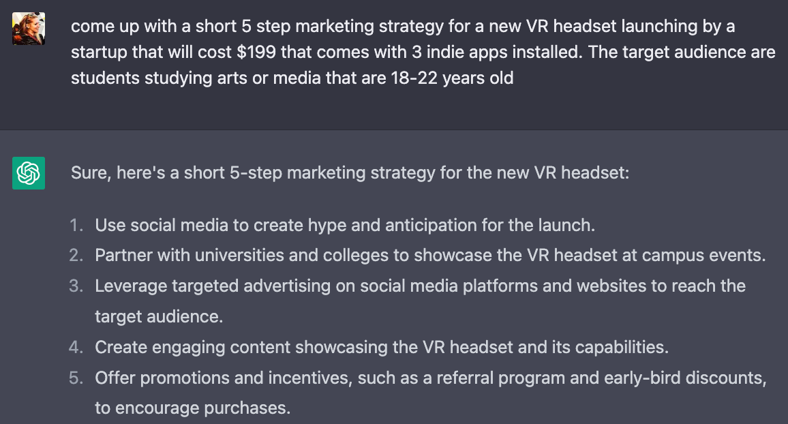](https://substackcdn.com/image/fetch/$s_!aF45!,f_auto,q_auto:good,fl_progressive:steep/https%3A%2F%2Fsubstack-post-media.s3.amazonaws.com%2Fpublic%2Fimages%2F085cfb13-0a6a-4a57-b596-3e0459b8bbdb_1156x622.png)

### 3. ChatGPT can optimize your sales.

Sales optimization is the process of improving your sales funnel to increase conversion rates and revenue. ChatGPT can help you optimize your sales funnel by suggesting effective sales strategies and providing personalized recommendations. Again, it will not do all the work for you; rather, it can give you ideas and offer perspectives you may not have considered.

[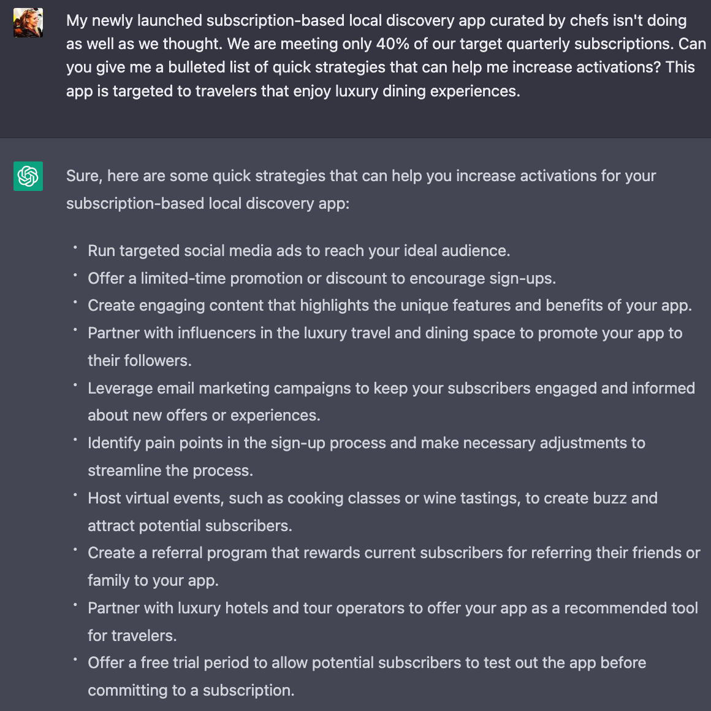](https://substackcdn.com/image/fetch/$s_!NIP-!,f_auto,q_auto:good,fl_progressive:steep/https%3A%2F%2Fsubstack-post-media.s3.amazonaws.com%2Fpublic%2Fimages%2Fdeececfb-a5eb-42ae-9061-83c8f41d555b_1160x1158.png)

# **Final thoughts**

ChatGPT can be an extremely valuable tool during product development. Its ability to generate ideas, provide insights, and create frameworks can provide tremendous value to product teams while saving you time and resources.

However, it's important to keep in mind that ChatGPT **cannot replace the human factor, strategic thinking, or product sense**. While it can provide valuable information and ideas, ChatGPT does not fully understand the nuances of human behavior, emotions, and motivations. Because ChatGPT is only as good as the data it is trained on, it is also vulnerable to biases that can be inadvertently introduced into the system.

So, what’s the best way of implementing ChatGPT in product development?

PMs and entrepreneurs who are bringing products to life should use ChatGPT as a **complementary tool** in their product development process, **alongside other tools such as user research and—you guessed it—human expertise.** 0 to 1 products usually require multiple revisions and pivots before finding product-market fit. By leveraging the strengths of ChatGPT—specifically, its efficiency and wide range of knowledge—while also being aware of its limitations, you can make the most of this tool as a means of creating truly impactful products.

Perspectives is a reader-supported publication. To receive new posts and support my work, consider becoming a free or paid subscriber.