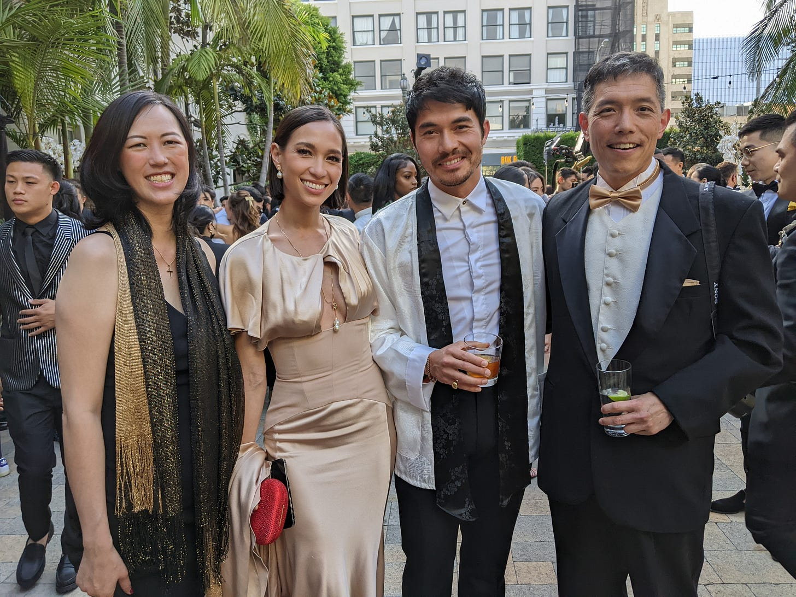

# Make Your Own Luck 

*It’s better to be lucky than to be good, so if you’re good, get yourself some luck *

Photo by [Yan Ming](https://unsplash.com/@xiaomingyo?utm_content=creditCopyText&utm_medium=referral&utm_source=unsplash) on [Unsplash](https://unsplash.com/photos/closeup-photo-of-green-plant-w1MrSC_JMs8?utm_content=creditCopyText&utm_medium=referral&utm_source=unsplash)

Someone once asked me in a Q&A lightning round, “Would you rather be good or lucky?” I replied, “Lucky.” Many people can be good, but luck is like magic. In fact, many people who are lucky outpace those who are good.

Have you ever met somebody whose life seemed charmed? Somebody who always comes up roses, no matter their blunders or missteps? I remember someone on my team once saying, “I wish I had the luck of X. That guy can do no wrong, even when he’s actually wrong. I have never seen someone fail up like that.” I laughed, but they were right: Some people just seem immune to misfortune.

**So what if I told you that you could make your own luck?**

[Subscribe now](https://debliu.substack.com/subscribe?)

## **Take stock of your assets**

If you are reading this right now, you probably have more luck than the average person. At the very least, you have been blessed with curiosity and good taste (kidding!).

I used to be frustrated that my parents decided to move us from New York City to a small town in the Deep South when I was six. Growing up, I struggled with belonging and alienation, and it affected me deeply for a long time.  My kids once asked me whether or not I regretted growing up as I did. I had to think hard about it. Part of me held a lot of resentment toward my parents for making that decision. And yet now, looking back, it turned out to be a huge blessing. It was hard to be one of the very few Asian families where we lived, but that was how I learned perseverance and grit. It was through being different that I figured out who I was and who I wanted to be. The adversity I faced from the bullying and racism gave me the drive and motivation that stays with me even to this day. My upbringing was the making of me, and while it may have seemed like a disadvantage, it turned out to be one of the luckiest things that ever happened to me.

I treasure what I’ve learned from my experiences, and I hope to pay it forward to those who feel that same sense of alienation. I watched the comedian Henry Cho speak at RootsTech about growing up as the only Asian kid in his Tennessee town, and I remembered feeling a lot of the same things he did. And yet, his comedy is deeply rooted in his history and upbringing. He is funny precisely because he was able to turn his life story into his comedy, and his comedy into his pathway to success.  His background is what made him what he is today.

You are probably luckier than you might think, so I encourage you to take stock of that. What have you been blessed with that might not seem like a blessing at first glance? How have you used that to your advantage? What have you done to pay it forward?

[Share](https://debliu.substack.com/p/make-your-own-luck?utm_source=substack&utm_medium=email&utm_content=share&action=share)

## **Creating opportunities for luck**

An acquaintance of mine asked me about the best way to find new job opportunities. I encouraged them to look through all the messages they had received on LinkedIn about job openings and start calling people back. They seemed taken aback and told me that they rarely had people reach out to them. This was someone with skills that were in extremely high demand, so I was confused. Then I went to their LinkedIn and saw why: Their resume was extremely thin. They included next to no information about their roles other than the titles, and they invested very little time in making it look like they were interested in outreach.

Recruiters have a job to do. They have a job requisition, and they need to match it with a possible candidate. But if they look at your resume and find nothing there, they're likely to pass. I encouraged my acquaintance to take the time to make themselves look interesting to others.

By opening the door and welcoming people in, you are more likely to get interest. You probably think this advice is pretty simplistic, but you would be surprised by how many people reach out to me for advice whose resumes are thin or practically incoherent. Help people help you. Open the door to luck.

I always used to think I was lucky to be invited to interview for Intuit’s board based on a recommendation from Sheryl. But she later told me that years before, I had told her I wanted to join a board; why else would she have suggested it? I was taken aback when I heard this, but then I realized something: I was lucky, yes, but by expressing my interest, I also invited the opportunity for her to put my name in.

Are you planting the seeds for luck to find you? If not, think of ways you can change that. Here are a few ways to start:

* **Tell people what you are looking for.** Don’t be afraid to communicate your goals, hopes, and needs clearly to others. Whether you’re seeking connections, a job, advice, or a simple favor, letting people know what you’re after can turn your network into a source of opportunity.
* **Open yourself up to possibilities.** Embrace new experiences. Take risks. Be willing to step out of your comfort zone. As intimidating as this can be at first, being open to the unexpected can put you on new paths to success and growth.
* **Notice what signals you are sending.** Be mindful of the impression you’re making on others. Do you seem open or closed off? Negative signals can drive away potential connections and opportunities, so take care to project confidence and curiosity.
* **Be inquisitive and exploratory.** In the same vein, make curiosity a daily practice. Get into the habit of asking questions, seeking new experiences, and looking for ways to meet new people. This can help you learn, grow, and identify opportunities you wouldn’t have otherwise.
* **Don’t let yourself fall into a rut.** In a 2014 study, creative professionals were asked how they raised their odds of having a serendipitous meeting. ([ref](https://www.popsci.com/luck-real/#:~:text=Many%20of%20these%20studies%20have,in%20random%20acts%20of%20chance)) Their responses revolved around changing up their routines, environments, and the people they surrounded themselves with. The common theme? Putting themselves out there and avoiding getting stuck in old habits.

As easy as it can be to chalk things up to pure chance, our behaviors and perceptions play a major role in how lucky we are. In another study, people who self-identified as either lucky or unlucky were instructed to read a newspaper. Those who considered themselves lucky were more likely to see a message in the paper: “Tell the experimenter you have seen this and win $250.” Why? Because the self-identified “unlucky” participants tended to be more tense and anxious, which made it harder for them to spot unexpected opportunities. ([ref](https://www.popsci.com/luck-real/#:~:text=Many%20of%20these%20studies%20have,in%20random%20acts%20of%20chance)) So much of luck revolves around what we tell ourselves and others, and around being open to what life sends our way.

[Leave a comment](https://debliu.substack.com/p/make-your-own-luck/comments)

## **Make luck for others**

A friend of mine was recently laid off. She saw a job that she was excited about and reached out to me. I gladly made the introduction directly to the hiring leader, and I am hopeful she gets the job because it is perfect for her. She had helped me in the past, and I was more than happy to pay it forward.

Often, putting a little good out into the world comes back as luck later. I have been going to an event with [Gold House](https://goldhouse.org/) each year, and I love that Bing, the founder, does what’s called a “give and get.” Everyone around a table offers a “give” (something they can help others with) and a “get” (something they request help with from others). These could be things as small as an introduction, or as large as help with a round of fundraising. One person even asked for a hug from the inimitable actor Henry Golding, and she got it!

We all have something to give, and we all have things we’re looking for. Create a little luck for everybody by being a part of a community where you can both give and receive. You have more to share than you think, so ask yourself: What are your “gives” and what are your “gets”? Your gives create a bit of luck for others, and your gets create a bit of luck for you. Take a moment to consider what you can offer to others, and what you want to ask for from the universe. Remember, putting something positive into the world is not about a transactional relationship. Rather, it is a chance to make a bit of magic happen.

---

It can be easy to write ourselves off as lucky or unlucky, but there’s so much more to luck than pure chance. By making your desires known, staying open to the unexpected, and reflecting on the ways you’ve been lucky in your own life, you can set the stage for serendipity. Luck is about the connections you make, your openness to new opportunities, and your willingness to help and be helped.

That’s why today, I encourage you to consider how you can generate a little luck for yourself and for others. You may just find that you’re luckier than you think.

[Share](https://debliu.substack.com/p/make-your-own-luck?utm_source=substack&utm_medium=email&utm_content=share&action=share)