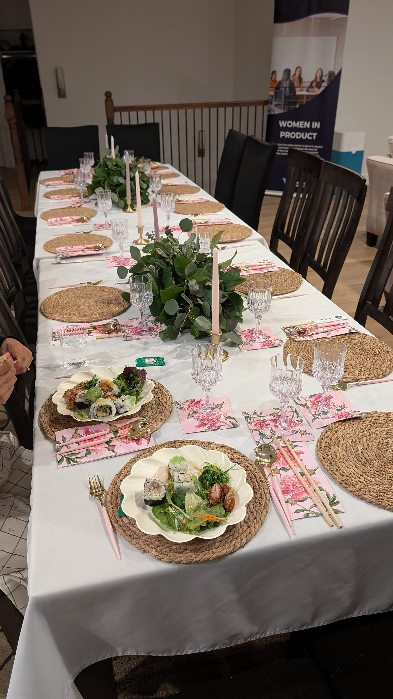

# Create Your Own Table

*How the Gift of Hospitality Can Pay Dividends*

My friends Al Ko and Ann Munira-Ko have a tradition of opening their home and dinner table to people in their community, no matter how busy they are. They are both successful executives - one is the CEO of Auctane, and the other is the founder of Floodgate Capital. Their lives are hectic, both at work and at home, yet I was astonished to learn that they make it a priority to host dinners and welcome others into their home twice a week.

Recently, while speaking in Professor Jeffrey Pfeffer’s class, *Paths to Power*, at the GSB, we discussed how to build and maintain networks. A student asked how to get connected in the community. I replied, “If they don’t give you a seat at the table, why not create your own?” - as the Kos have done.

[Share](https://debliu.substack.com/p/create-your-own-table?utm_source=substack&utm_medium=email&utm_content=share&action=share)

### **Building Community in Small Spaces**

David and I once did this, but somewhere along the way, we lost that spirit of creating our own table and welcoming others. When we first got together, he told me he wanted our home to be a place of connection, where we would host dinner parties and have our kids’ friends gather. And for a time, we did just that.

When we first got married, we lived in a 460-square-foot graduate student apartment on Stanford’s campus. The mini-kitchen was so small that if two people entered at the same time, they had to stand side by side. We moved two households from Atlanta, where we had lived before getting married, into that tiny space in just one week. It was stuffed to the gills with wedding presents and furniture.

Yet, somehow, we managed to host dinner parties every couple of weeks. We squeezed eight to ten people into our tiny apartment, welcoming guests for dumpling and sushi-making parties, potlucks, and lasagna nights. We played board games, got to know our fellow students, and built deep friendships within our church community.

When we bought our first home in 2002, we extended this tradition by hosting a weekly Bible study for several years. We shared meals, conversations, and prayers. However, life changed when we had children. With just Jonathan, inviting people over was manageable, but with two kids, it became more complicated. Our careers in tech kept us busy, and those lively dinner parties became fewer and farther between.

Life moved faster, and hosting became harder to manage. Still, we occasionally gathered with friends to stay connected.

[Share Perspectives](https://debliu.substack.com/?utm_source=substack&utm_medium=email&utm_content=share&action=share)

### **Life’s Unexpected Turns**

The real turning point came when I was unexpectedly pregnant with our third child, Danielle, at the same time my father was diagnosed with stage 4 lung cancer. Balancing a difficult pregnancy while caring for him was incredibly challenging. He passed away when Danielle was five months old. My mom, who had been strong throughout his illness, fell into a deep depression, so we moved her from Georgia to live with us in California. Our home, designed for four, now held six people. Hosting was put on hold.

Life got busy in the sandwich generation. We no longer had the energy to tidy the house or host dinners.

Each year, our friends Terry and Genevieve hosted a must-attend event. Even in a smaller home, they made it work, and we were always in awe of their ability to bring people together consistently, no matter what. David often talked about how we would do the same—someday. But when we moved into a bigger home in 2016, my mom was almost immediately diagnosed with cancer, and again, our plans were set aside.

### **Stop Waiting for the Perfect Moment**

There’s always a belief that *someday* will come—the perfect moment when everything will align to create our own table. But life doesn’t work that way.

As we built Women in Product, we realized the importance of creating these spaces. When Facebook had fewer than 10% women in product, we hosted quarterly dinners to meet and connect with others in the industry. Over four years, friendships blossomed, and networks grew. Eventually, we started a conference, and this year marks our 10th annual event. We made a table and welcomed people in.

Coming out of COVID, we realized how much we had lost—the casual conversations, the in-person gatherings, the connections. So, we started hosting dinners again, this time in our home rather than at restaurants. In just six months, new friendships have formed, and opportunities have been shared.

[Leave a comment](https://debliu.substack.com/p/create-your-own-table/comments)

### **The Power of Gathering Makes History**

Throughout history, communities have gathered to exchange ideas and build relationships. From 16th-century Ottoman coffeehouses to 17th-century French salons to the gentlemen’s clubs of Victorian England, gathering spaces have shaped culture, politics, and communities. These were places where movements were born, ideas were exchanged, and connections were forged.

Women won the right to vote in community halls, homes, and churches. They weren’t invited to the table, so they created their own space and gathered to petition for their rights. Gathering isn’t just about connection; it’s about building momentum and carrying ideas forward.

Likewise, some of the most meaningful opportunities in life don’t arise from formal processes, but from people gathering, brainstorming, and building together.

### **Start Now**

Why wait for an invitation to the table? Create one. Open your home and your life to hosting. Welcome others in.

[Subscribe now](https://debliu.substack.com/subscribe?)